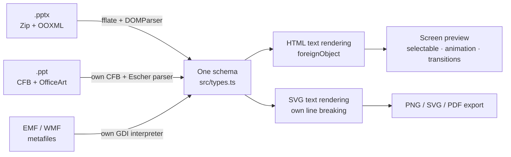

# Web-PPT

[](https://github.com/unStone/web-ppt/actions/workflows/ci.yml)
[](https://www.npmjs.com/package/@web-ppt/core)
[](https://github.com/unStone/web-ppt/blob/master/LICENSE)

**English** · [简体中文](https://github.com/unStone/web-ppt/blob/master/README.md)

A PowerPoint rendering engine that runs entirely in the browser: `.pptx` / `.ppt` → one JSON schema → SVG.

No server, no framework, no Office install, no upload. Files never leave the tab. The only runtime dependency is [fflate](https://github.com/101arrowz/fflate).

**[▶ Live demo](https://unstone.github.io/web-ppt/)** — drop in one of your own decks; parsing and rendering happen on your machine.


*Recorded by `npm run demo-gif` from `fixtures/showcase.pptx` in this repo — change the engine, re-run it, and the GIF is current again.*

### Why this exists

Every other browser-side option makes you give something up:

| Approach | What it costs you |
|---|---|
| Office Online `iframe` | Microsoft's viewer requires the file to be **publicly reachable by URL** — unusable for anything confidential |
| Server-side conversion (LibreOffice / headless Office) | A conversion box to run and scale; animations and build steps are flattened away |
| Convert to PDF or images up front | Same flattening, plus you lose text selection and search |
| Existing front-end libraries | Legacy `.ppt` unsupported; the most-used one ships a free npm package but [charges for source access](https://github.com/501351981/pptx-preview) |

Web-PPT keeps the file on the client, keeps the animations, and stays MIT all the way down — **including the 1997–2003 binary `.ppt` format**, which nothing else on the front end parses.

| Package | Role | Depends on | Size (gzip) |
|---|---|---|---|
| [`@web-ppt/core`](https://github.com/unStone/web-ppt/tree/master/packages/core) | Parse / render / export. No framework, no DOM. | fflate | 88 KB |
| [`@web-ppt/edit-core`](https://github.com/unStone/web-ppt/tree/master/packages/edit-core) | Stable identity, edit overrides, and high-fidelity render projection. No framework, no DOM. | `@web-ppt/core` | 2.9 KB |
| [`@web-ppt/editor`](https://github.com/unStone/web-ppt/tree/master/packages/editor) | Editing session, native SVG selection, coordinate/handle overlay, and incremental three-layer DOM. No UI framework. | `core` + `edit-core` + `viewer-core` | 5.9 KB |
| [`@web-ppt/viewer-core`](https://github.com/unStone/web-ppt/tree/master/packages/viewer-core) | Navigation / zoom / search / animation batching | `@web-ppt/core` | 7.4 KB |
| [`@web-ppt/fonts`](https://github.com/unStone/web-ppt/tree/master/packages/fonts) | Font substitution and on-demand loading (optional; zero font bytes in the package) | `@web-ppt/core` | 2.8 KB |

## Quick start

```bash
npm i @web-ppt/core @web-ppt/viewer-core
```

```ts
import { parse, slideToSvgFile, presentationToPrintableHtml } from '@web-ppt/core';
import { Viewer } from '@web-ppt/viewer-core';

const pres = await parse(file);                       // File | Blob | ArrayBuffer | Uint8Array
const viewer = new Viewer(container, pres, { animate: true, autoAdvance: true });

viewer.next();                                        // plays the next animation batch, or advances the slide
viewer.playNextAnimation();                           // advance one batch only
viewer.finishAnimations();                            // jump to this slide's end state
viewer.setZoom(1.5);
viewer.search('keyword');                             // → array of matching slide indices
await viewer.exportPng(2);                            // → Blob

// Make video / audio actually playable (pulls in foreignObject; screen preview only)
const v2 = new Viewer(container, pres, { media: 'player' });

const svg = await slideToSvgFile(pres, pres.slides[0]);
const html = await presentationToPrintableHtml(pres); // print from the browser to get a PDF
// Animated slides expand into one page per click batch, so progressive reveals aren't flattened
const stepped = await presentationToPrintableHtml(pres, { animationSteps: true });
```

For a visual editor, `@web-ppt/editor` owns parsed resources, the headless Editor, and every mounted view:

```ts
import { openEditor } from '@web-ppt/editor';

const session = await openEditor(file);
const slideView = session.mount(container, { mode: 'edit', zoom: 1 });
const slideId = session.editor.doc.slideOrder[0];
const elementId = session.editor.doc.slides[slideId].children[0];
session.editor.exec({ type: 'SetXfrm', id: elementId, x: 120 });
slideView.setMode('view'); // keeps the static preview DOM and hides interaction layers
session.dispose();         // releases every view, source package, and blob URL
```

In edit mode, the interaction SVG draws an exact OBB, eight resize handles, and a rotation handle for plain,
rotated/flipped, and nested-group elements. Handle size stays constant in screen pixels. Pure functions for
element-local, slide, and screen coordinates are exported so framework adapters never duplicate group math.

When building a custom adapter or needing byte-stable markup, render with an explicit namespace:

```ts
import { renderSlideToSvg } from '@web-ppt/core';

const svg = renderSlideToSvg(pres, pres.slides[0], { idPrefix: 'editor-slide-1-' });
// Same slide + same prefix is deterministic. Use a different prefix for every concurrently mounted SVG.
```

Opt into edit metadata and hand the result to the framework-agnostic `EditDoc` only when an editor needs write-back anchors; normal previews pay neither object nor package-retention cost:

```ts
import { layoutText, parse, renderElementToSvg, renderSlideToSvg, renderTextBodyToHtml } from '@web-ppt/core';
import { createDoc, disposeDoc, effectiveElement, invalidateElement, toSlide } from '@web-ppt/edit-core';

const source = await parse(file, { edit: true, keepPackage: true, lazy: false });
const doc = createDoc(source);
const slideId = doc.slideOrder[0];
const elementId = doc.slides[slideId].children[0];

doc.elements[elementId].ovr.x = 120;                 // src stays intact; ovr stores user changes only
invalidateElement(doc, elementId);                  // invalidate this element, group ancestors, and its slide
const svg = renderSlideToSvg(source, toSlide(doc, slideId), { idPrefix: `${slideId}-` });

// During interaction, render only the dirty element. Every concurrently mounted element needs a stable unique prefix.
const part = renderElementToSvg(effectiveElement(doc, elementId), {
  idPrefix: `${slideId}-${elementId}-`,
});
// Replace this element's markup and defs DOM partitions together.

// Keep text editing outside SVG while sharing the exact HTML/CSS used by the foreignObject preview.
const element = effectiveElement(doc, elementId);
if (element.kind === 'shape' && element.text) {
  const textLayer = document.querySelector<HTMLElement>('[data-text-layer]')!;
  textLayer.innerHTML = renderTextBodyToHtml(element.text, element.w, element.h);
  const editor = textLayer.firstElementChild as HTMLElement;
  editor.contentEditable = 'true';
  editor.spellcheck = false;

  // Switch hit testing to engine mode when the runtime probe finds Safari's foreignObject scaling bug.
  const engineLayout = layoutText(element.text, element.w, element.h);
  // engineLayout.lines[*].segments[*].carets use UTF-16 offsets into TextRun.text.
}

disposeDoc(doc);                                     // also releases the retained source package
```

`renderTextBodyToHtml` emits paragraph/run identities, empty-run and bullet boundaries, and the effective
autofit scale by default. Those markers support DOM decoding and selection restoration after IME composition.
The function is DOM-free and leaves focus ownership to the caller. It escapes text, attributes, and CSS
boundaries; unsafe schemes such as `javascript:` and `file:` are retained only as non-clickable data.

`layoutText` shares line breaking, CJK punctuation squeezing, columns, spacing, and autofit with native SVG
`<text>` output. It returns paragraph/run identities, line boxes, and UTF-16 caret stops. Vertical text maps
logical coordinates through the returned `transform`; math runs are atomic with endpoint carets only. Pass
`{ includeCarets: false }` when geometry alone is enough to skip per-character measurement.

When a preset shape is resized, projection recomputes its path from the retained `preset + adj`.
`doc.meta.readonly` explicitly reports missing safe save context before the user starts editing.
The save path can lazy-load `@web-ppt/edit-core/xml`. Its preserving tree round-trips untouched parts byte
for byte and retains declarations, comments, PIs, namespace prefixes, attribute order, self-closing form,
and `AlternateContent` around point edits. New nodes share one OOXML sequence table. The optional
`@web-ppt/edit-core/opc` entry then merges dirty parts into the source archive while copying clean local headers,
extra fields, and compressed streams byte-for-byte. Identity saves reuse the original bytes; unusual ZIP features
return an explainable fallback reason. Neither save-only entry enters the default 2.95 KB gzip editing-model entry.

### Bring your own UI

`Viewer` is 24 lines of DOM binding on top of `PresentationState`. For React / Vue / Svelte, drive the state machine directly:

```ts
import { PresentationState, playGroup, playTransition } from '@web-ppt/viewer-core';

const st = new PresentationState(pres, { animate: true, skipHidden: true });
st.subscribe((c) => {
  if (c.type === 'slide') setIndex(c.index);          // play c.transition when it's non-null
  if (c.type === 'animation' && c.group) playGroup(el, c.group);
});
st.next();                     // plays a pending animation batch, otherwise advances
st.hiddenElementIds;           // element ids that should be hidden at the current batch
st.search('keyword');          // → array of matching slide indices
```

The metafile decoder (~15 KB gzip) is wired in by default. To drop it, remove the `setMetafileDecoder` call in `src/index.ts`.

## Capability matrix

| Capability | .pptx | .ppt |
|---|---|---|
| Preset geometry | ✅ 187 presets (the full ECMA-376 set) | ✅ complete MSOSPT mapping |
| Custom geometry | ✅ custGeom + gdLst formula evaluation + arcTo | ✅ pVertices / pSegmentInfo |
| Fills | ✅ solid / linear + radial gradient / picture / tile / pattern / theme color transforms | ✅ solid / gradient / picture |
| Strokes | ✅ dash / arrowheads / caps / joins | ✅ dash / arrowheads |
| Effects | ✅ outer + inner shadow / glow / soft edge / reflection | ⚠️ ignored |
| 3D | ✅ extrusion / bevel / contour / material / camera | ⚠️ ignored |
| Theme style references | ✅ fillRef / lnRef / effectRef + phClr | — |
| Text | ✅ complete (see below) + WordArt warps | ✅ size / color / bold-italic-underline / alignment / bullets |
| Style inheritance | ✅ master → layout → placeholder → paragraph → run | ✅ master TxMasterStyle → shape |
| Images | ✅ cropping (incl. shape fills) / crop-to-shape / opacity / grayscale | ✅ Pictures stream + DEFLATE |
| EMF / WMF / PICT | ✅ decoded to SVG | ✅ decoded to SVG (PICT comes from the Mac build) |
| Tables | ✅ tableStyles / banding / merges / borders / vertical alignment | ✅ table properties + grid reconstruction heuristics |
| Charts | ✅ column/bar/stacked/line/area/pie/doughnut/scatter/radar/bubble/stock/pie-of-pie/surface · secondary axis · 3D | ✅ via the embedded EMF preview |
| Media · ink · comments · sections | ✅ poster frame + play badge / InkML strokes / structured comments / sections | ❌ |
| SmartArt | ✅ cached drawing part; falls back to laying out the data model directly (6 layout families) | ❌ |
| Groups | ✅ nested + child coordinate-system scaling | ✅ flattened + coordinate mapping |
| Slide transitions | ✅ 20 (fade / push / wipe / cover / split / zoom …) | ✅ via SSSlideInfoAtom; 6 verified against real files |
| Element animations | ✅ entrance / exit / emphasis / motion path, batched by click | ✅ entrance / exit / emphasis; 5 steps verified |
| Speaker notes · hyperlinks | ✅ | ✅ |
| OLE embedded objects | ✅ embedded `p:pic` preview / legacy VML snapshot (incl. PICT) | ❌ |
| Encrypted documents | ✅ standard (AES-ECB) / agile (AES-CBC, segmented) | ✅ RC4 CryptoAPI (40 / 56 / 128-bit) |
| OMML math | ✅ fraction / radical / sub-superscript / n-ary / matrix / delimiter / accent / limit | ❌ |
| Hidden slides | ✅ `sld@show="0"` | ✅ `SSSlideInfoAtom` F_HIDDEN |

Text details (pptx): size / face / bold / italic / underline / strikethrough / super- and subscript / letter spacing / caps / outline / gradient fill / highlight / vertical writing / columns / autofit / character and picture bullets / auto-numbering / hyperlinks / slide-number and footer fields / RTL / 15 WordArt warp presets.

## Architecture



| Decision | Why |
|---|---|
| Parsing and rendering are fully decoupled | The render layer depends only on `src/types.ts`, so adding an input format doesn't touch a line of it. Format is detected by magic number (`PK` → pptx, `D0CF11E0` → ppt), never by extension |
| Two text rendering paths | `foreignObject` + HTML layout for screen preview and PNG export (selectable text, column support); native `<text>` + own measurement and line breaking for standalone SVG and printable HTML — only browsers understand `foreignObject`, so Inkscape / librsvg / design tools would drop every glyph. A file you hand someone has to stand on its own |
| Safari detected at runtime | A [15-year-old WebKit bug](https://bugs.webkit.org/show_bug.cgi?id=23113) doesn't apply the outer SVG scale to HTML inside `foreignObject`. When detected, the whole slide switches to the `<text>` path |
| Chart / metafile decoders injected via hooks | Tree-shakeable on demand. Note that `chart/` **is a fourth parsing pipeline, not a render plugin** — it reads `ppt/charts/chart1.xml` (itself OOXML/DrawingML) and emits `SlideElement[]`; the hook exists only to break the `pptx/parser → chart → pptx/color` module cycle |

## Performance

Measured in-browser, 210 slides / 11,280 elements:

| Metric | Value |
|---|---|
| **Lazy first paint** (parse + slide 1 + render) | **42 ms** |
| Full parse | 376 ms (1.8 ms/slide) |
| Single slide render | 0.09 ms |
| Cache hit (revisiting a slide) | 0 ms |
| JS heap | 40 MB (0.19 MB/slide) |

| Optimization | Effect |
|---|---|
| **Lazy parsing** (on by default) | Each slide is parsed on first visit; first paint 376 ms → 42 ms (**9×**) |
| **Worker parsing** | Zero main-thread blocking; 573 ms concurrent with a main-thread busy loop vs 942 ms serial |
| **Thumbnail virtualization** | 210 slides render 7 thumbnails initially, filling in on scroll |

Where the time goes (browser): XML parsing 30% (native `DOMParser`), schema construction 63%, decompression 7%, rendering <1%.
**WebAssembly does not help on this path** — XML parsing is already native C++, and schema construction is DOM walking, string work, and object allocation, all of which WASM is bad at; the marshalling cost across the boundary would eat any gain.

### Worker usage

```ts
import { parseInWorker } from '@web-ppt/core';

const worker = new Worker(new URL('@web-ppt/core/worker', import.meta.url), { type: 'module' });
const pres = await parseInWorker(worker, bytes);   // zero main-thread blocking
```

Workers have no `DOMParser` (it's Window-only), so `parseXml` falls back to the bundled `xml-lite` — pure JS, measured at ~1.8× native, structurally equivalent (tests compare every slide's XML node by node). Images can't cross the thread boundary as blob URLs, so the worker emits `asset:N` tokens plus raw bytes and the main thread redeems them into real URLs.

## Fidelity benchmark

Rendering fidelity isn't judged by "looks about right" — it's compared step by step against **LibreOffice's actual output as ground truth**. Theme color `shade` / `tint`, for example:

| Step | LibreOffice | Naive sRGB multiply (old) | Linear RGB (current) |
|---|---|---|---|
| shade 20% | rgb(33,56,97) | rgb(14,23,39) Δ69 | rgb(28,51,93) Δ8 |
| tint 60% | rgb(176,187,222) | rgb(143,170,220) Δ37 | rgb(176,188,222) Δ1 |

`npm run compare <file>` generates a side-by-side and difference overlay for any file.

## Known limitations

| Item | Notes |
|---|---|
| `.ppt` glow / soft edge / reflection | **The format has no such properties** — they're DrawingML (2007+) concepts with no representation in the OfficeArt binary (outer shadow is supported) |
| `.ppt` 3D | OfficeArt has extrusion properties (`c3DExtrude*` / `c3DBooleans`), but no trustworthy samples: LibreOffice conversion bakes 3D into cube preset geometry *and* keeps the 3D properties, so implementing against it would double up |
| `.ppt` SmartArt | Not implemented (auto-numbering and nested groups are) |
| OMML math | Linear text only; no MathML typesetting |
| WordArt envelope warps | `textPath` can only bend the baseline; `textInflate` and friends don't scale glyphs positionally |
| 3D | Isometric approximation, not true projection; steep camera angles don't switch to a top-down view |
| EMF+ | Not handled. Every metafile examined so far is **dual-mode** — the GDI records already carry the full drawing (16,125 GDI records vs 3 EMF+ comments in `sample-metafile.pptx`), so the GDI path suffices. Only pure EMF+ files would need it, and no sample has turned up |
| Raster operation codes | SVG/CSS has no XOR/AND bitwise blending; `mix-blend-mode` is not equivalent |
| chartex chart types | Treemap / sunburst / histogram / box-and-whisker / waterfall / funnel / map (Office 2016+ `cx:chartSpace`) — the whole pipeline is unimplemented. All 16 classic chart types are supported |
| Region OR / XOR / DIFF | Needs region boolean operations, which SVG clipping can't express; COPY and AND work |
| MTX-compressed embedded fonts | PowerPoint's `fntdata` is an EOT container, usually with MTX compression on. Uncompressed containers are unwrapped by core itself (including the XOR obfuscation); compressed ones need an injected decoder: `setFontDecoder(eotToTtf)` from [`mtx-decompressor`](https://www.npmjs.com/package/mtx-decompressor). Without it those fonts are skipped in favour of a substitute, rather than handing the browser bytes it's guaranteed to reject |
| Line breaking when fonts are missing | Line breaks are decided by **the actual font's metrics**. If the deck's font isn't installed locally, something else is substituted, advance widths differ, and breaks land differently than in PowerPoint. This isn't a parsing problem — installing the original font, using the file's own embedded fonts, or wiring up [`@web-ppt/fonts`](https://github.com/unStone/web-ppt/tree/master/packages/fonts) for metric-compatible free substitutes (Calibri→Carlito and friends, where every advance width matches) all fix it |
| CJK punctuation squeezing | Only the "squeeze when it wouldn't otherwise fit" rule is implemented. PowerPoint's full rule set (consecutive punctuation, line-start and line-end handled differently) is finer, but those differences only affect the gaps around punctuation, not where the line breaks |
| Line breaking before web fonts arrive | The native `<text>` path measures with canvas, and fonts load asynchronously, so the first frame breaks against the fallback. The `foreignObject` path is laid out by the browser and is unaffected |
| Password-protected files | Files with an open password can't be parsed; the error explicitly says the file is encrypted |
| OLE embedded objects | Renders the preview image PowerPoint stored (parsed out of the VML part), not the inner document; falls back to a placeholder box when the preview is in an undecodable format such as PICT |

## Development

| Command | What it does |
|---|---|
| `npm run dev` | Start the viewer (`?file=/showcase.pptx` to pick a file) |
| `npm run dev:site` | Start the site (includes the in-browser live demo) |
| `npm test` | Everything (core + edit model/all-fixture equivalence + metafiles) |
| `npm run test:core` | Core parsing / rendering — 1,987 assertions + 162 render snapshots |
| `npm run test:edit` | 244 edit-core assertions + 11 M1 save assertions + 212 process-isolated SVG fingerprint pairs across 28 fixtures |
| `npm run test:editor` | 30 session/incremental DOM/native selection/coordinate-and-handle/resource assertions + real-Chrome hit-testing, matrix, and performance gates |
| `npm run test:edit:libreoffice` | Open a patched save in LibreOffice and export it to PDF |
| `npm run test:edit:equivalence` | Run only the byte-equivalence gate for read-only vs editable projection |
| `npm run test:metafile` | EMF / WMF / PICT decoders — 130 assertions + fuzzing |
| `npm run fixtures` | Regenerate every test file (deterministic output) |
| `npm run check` | TypeScript type check |
| `npm run build` | Build all five publishable packages (core / edit-core / editor / viewer-core / fonts) |
| `npm run build:site` | Build the site's static output |
| `npm run compare public/showcase.pptx` | Generate a LibreOffice reference and produce a side-by-side / overlay comparison |
| `npm run ppt-samples` | Convert the pptx fixtures to `.ppt` via LibreOffice (re-run after changing a pptx fixture) |
| `npm run bench` | Large-file read-only benchmark; append `-- --edit` for editing projection |
| `npm run bench:edit` | 210-page process-isolated budget gate for zero read-only state, edit memory, and commit rendering |
| `npm run demo-gif` | Record the README demo GIF (needs Chrome and ffmpeg) |

Conventions, architectural constraints, and known traps live in **[AGENTS.md](https://github.com/unStone/web-ppt/blob/master/AGENTS.md)** (they apply to coding agents too).

### Repository layout

```
web-ppt/                     npm workspaces monorepo
├── packages/
│   ├── core/                @web-ppt/core — parse / render / export, no framework, no DOM
│   ├── edit-core/           @web-ppt/edit-core — editing document model + render projection, no framework, no DOM
│   ├── editor/              @web-ppt/editor — editing session + incremental three-layer DOM
│   ├── viewer-core/         @web-ppt/viewer-core — headless state machine + playback
│   ├── fonts/               @web-ppt/fonts — font substitution and on-demand loading
│   ├── viewer/              @web-ppt/viewer — batteries-included viewer, plain TS
│   └── site/                @web-ppt/site — the website, with the in-browser live demo
├── fixtures/                pptx / ppt test samples (script-generated, deterministic)
├── tooling/                 test framework / fixture generation / LibreOffice comparison / benchmarks
└── test/snapshots/          162 render snapshot baselines
```

`packages/viewer` and `packages/site` both consume upstream **by package name**, the same path an external user takes — break the boundary and they stop compiling immediately. `edit-core` stays a pure-data model; `editor` owns browser DOM and resource lifecycles; React / Vue adapters wrap that public seam without pushing framework runtimes into any base package.

**Why `viewer-core` is its own package**: only ~24 lines of `Viewer` actually touch the DOM (inject SVG, set visibility, kick off playback); the other 200-odd are pure state advancement. Split apart, React / Vue / Svelte can drive `PresentationState` directly instead of waiting for an official wrapper; the state logic tests in Node without jsdom; and `@web-ppt/core` never touches `document`, so it runs whole inside a Worker.

> The split surfaced a real bug on day one that 939 assertions had never hit: under `skipHidden`, if every remaining slide is hidden, `next()` lands on the last **hidden** slide. It survived that long because none of the 9 fixtures at the time contained a hidden slide — snapshot tests catch "this changed", never "this was never covered". `sample-hidden.pptx` / `.ppt` now exist.

### Testing strategy

Tests run in Node with jsdom supplying the DOM; esbuild bundles `src/` to ESM and the real parsing and rendering run against it. No parsing logic is ever mocked.

| Layer | Coverage |
|---|---|
| **Structural assertions** | Geometry (54 shapes × 5 adjust-value sets + 648 fuzzed inputs), color, text inheritance chains, animation/transition, playback engine, table reconstruction, charts, text extraction |
| **Invariants** | Every element's bounding box is finite, no `NaN` in paths, schema required fields present, SVG structurally valid, no dangling `url(#id)`, no duplicate ids, no `foreignObject` on export paths |
| **Render snapshots** | 17 test files × every slide × both text paths = 162 normalized SVG baselines, compared byte for byte |
| **Regression anchors** | Hard assertions for real bugs already fixed: `.ppt` font-size offset, animation duration read from the wrong node, fly-in direction mapped backwards, undecompressed BLIP |
| **Robustness** | 70 malformed inputs — truncation (5%–95%), random byte corruption, empty files, fake magic numbers, all zeros. Each must either parse cleanly or throw a readable `Error`; crashing or emitting half-built output is a failure. A single shape that fails to parse degrades to a placeholder without taking the slide down |
| **Viewer interaction** | Hyperlink routing (internal jumps vs external callback), index clamping, destroy cleanup |

Snapshots normalize blob URLs, data URIs (hashed) and defs ids, so they're stable across machines. When a rendering change is intentional:

```bash
UPDATE_SNAPSHOTS=1 npm run test:core
```

Then review `git diff test/snapshots/` line by line before committing.

The suite itself is **mutation-verified** — fixed bugs are reintroduced one at a time to confirm they get caught:

| Mutation | Caught by |
|---|---|
| Fill rule `nonzero` → `evenodd` | 40 assertions |
| Misaligned field in the `.ppt` paragraph field table | 33 assertions |
| Geometry safety net disabled | 47 fuzzed inputs going out of bounds |
| Cell border tag spelled back to `lnLeft` | 2 assertions |
| `shade` reverted to sRGB space | 3 assertions |
| `cs` font left out of the font stack | 1 assertion |

> Snapshots find "this changed", never "this was wrong from the start" — the cell-border bug was caught by **external ground-truth comparison**, not by the suite. The two are complementary; neither is sufficient alone.

### Test files

Generated by `npm run fixtures`, byte-deterministic:

| File | Covers |
|---|---|
| `showcase.pptx` | 120 shapes / effects / fills / line arrows / text features / tables / images / custGeom / nested groups / 3D / animations / 7 transitions |
| `sample-chart.pptx` | 14 charts: column / bar / stacked / line / area / pie / doughnut / scatter / secondary-axis combo / 3D column / 3D pie |
| `sample-effects.pptx` | Inner + outer shadow / glow / soft edge / reflection / 15 WordArt warps / RTL |
| `sample-media.pptx` | Video and audio posters / ink / comments / sections / bubble · stock · pie-of-pie · surface charts |
| `sample-metafile.pptx` | Embedded EMF and WMF |
| `sample.pptx` · `sample.ppt` | Master inheritance / minimal valid CFB |
| `sample-hidden.pptx` · `.ppt` | Hidden-slide navigation: visible · hidden · hidden · visible · hidden (pptx via `sld@show`, ppt via `F_HIDDEN`) |
| `sample-autofit.pptx` | Five autofit cases (overflow / fits × bare normAutofit, no autofit, explicit fontScale, clamped at the 25% floor), plus percentage vs absolute line spacing |
| `sample-placeholder.pptx` | Placeholder geometry inheritance: picture placeholder with empty spPr / picture with its own xfrm / shape placeholder |
| `sample-ole.pptx` | OLE previews: decodable formats render as images, unrecognized ones fall back to a placeholder box |
| `sample-embedfont.pptx` | Four embedded-font containers: uncompressed EOT / uncompressed + XOR / MTX-compressed flag / bare TTF |

`.ppt` samples can be produced from the pptx ones with LibreOffice: `npm run ppt-samples`, or `soffice --headless --convert-to ppt <file>`.

### Debug pages

| Page | Purpose |
|---|---|
| `/` | Viewer: thumbnails (virtualized) / zoom / search / notes / present mode / export |
| `/shapes.html` | Geometry debugging: every preset shape rendered live, with adjustable adjust values and aspect ratio |

Transitions and animations only play in present mode (the "Present" toolbar button, or `F`): `→` advances animation batches and then the slide; `Esc` exits.

## Community

| Channel | Where |
|---|---|
| Bugs / feature requests | [GitHub Issues](https://github.com/unStone/web-ppt/issues) |
| Discussion | [GitHub Discussions](https://github.com/unStone/web-ppt/discussions) |
| WeChat group (Chinese) | [QR code in the pinned issue](https://github.com/unStone/web-ppt/issues?q=is%3Aissue+label%3A%E4%BA%A4%E6%B5%81%E7%BE%A4) |

## License

[MIT](https://github.com/unStone/web-ppt/blob/master/LICENSE)
