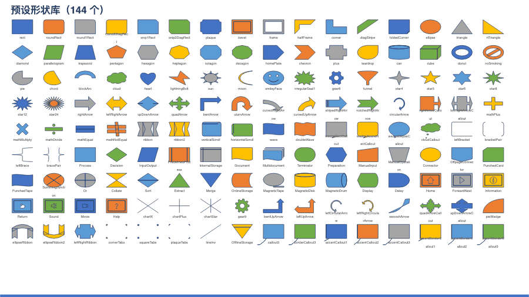
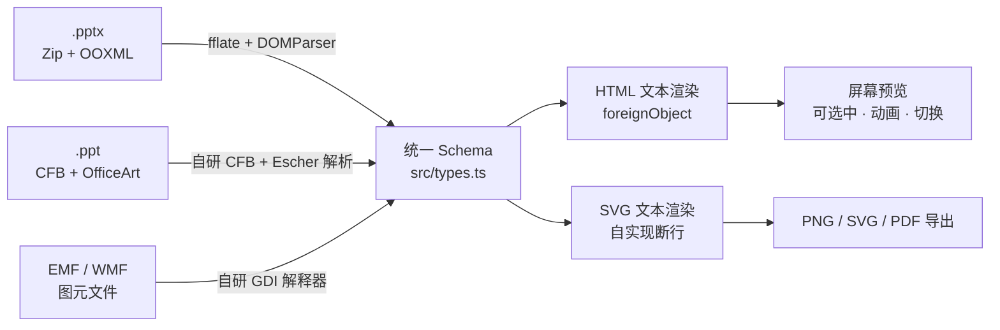

# Web-PPT

[](https://github.com/unStone/web-ppt/actions/workflows/ci.yml)
[](https://www.npmjs.com/package/@web-ppt/core)
[](LICENSE)

**简体中文** · [English](README.en.md)

纯浏览器端 PPT 渲染引擎：`.pptx` / `.ppt` → 统一 JSON Schema → SVG。
零服务端依赖；基础包零框架依赖，React / Vue 只存在于可选适配包，核心唯一运行时依赖是 fflate。

**[▶ 在线 Demo](https://unstone.github.io/web-ppt/)** · **[✎ 在线编辑器](https://unstone.github.io/web-ppt/editor.html)**
—— 拖一个自己的文件进去，解析、渲染与编辑全在本机，文件不出浏览器。



*上图是 `npm run demo-gif` 跑出来的——录的是仓库里的 `fixtures/showcase.pptx`，引擎改了重跑一遍就是新的。*

### 为什么做这个

浏览器里显示 PPT，现有的每条路都要你放弃点什么：

| 做法 | 代价 |
|---|---|
| Office Online `iframe` | 微软的预览要求**文件公网可达**——机密文件根本不能用 |
| 服务端转换（LibreOffice / 无头 Office） | 要养一台常驻转换机并为它扩容；动画和逐步揭示被压平 |
| 提前转 PDF / 图片 | 同样压平，还丢掉了文字选中与搜索 |
| 现有前端库 | 不支持老的 `.ppt`；用量最大的那个 npm 包免费，但[源码需付费索取](https://github.com/501351981/pptx-preview) |

Web-PPT 把文件留在客户端、把动画留住、从上到下都是 MIT——**包括 1997–2003 的二进制 `.ppt`**，这个格式前端目前没有第二家解析。

| 包 | 作用 | 依赖 | 体积 (gzip) |
|---|---|---|---|
| [`@web-ppt/core`](packages/core) | 解析 / 渲染 / 导出，无框架无 DOM 依赖 | fflate | 90.08KB |
| [`@web-ppt/edit-core`](packages/edit-core) | 稳定身份、命令历史、编辑覆盖、增量保存与高保真投影，无框架无 DOM | `@web-ppt/core` | 62.98KB |
| [`@web-ppt/editor`](packages/editor) | 编辑会话、原生 SVG 选择与变换、文字/富文本剪贴板、智能吸附与三层增量 DOM 视图，无 UI 框架依赖 | `core` + `edit-core` + `viewer-core` | 61.82KB |
| [`@web-ppt/collab`](packages/collab) | 可选的字段级 LWW 协同适配与 BroadcastChannel provider | `@web-ppt/edit-core` optional peer | 10.04KB |
| [`@web-ppt/react`](packages/react) | React 组件 + hook，复用 editor 会话与预览链路 | `editor` + React optional peer | 1.02KB |
| [`@web-ppt/vue`](packages/vue) | Vue 组件 + composable，复用 editor 会话与预览链路 | `editor` + Vue optional peer | 1.29KB |
| [`@web-ppt/viewer-core`](packages/viewer-core) | 导航 / 缩放 / 搜索 / 动画批次 | `@web-ppt/core` | 8.10KB |
| [`@web-ppt/fonts`](packages/fonts) | 字体替换与按需加载（可选，包里零字节字体） | `@web-ppt/core` | 2.69KB |

## 快速开始

```bash
npm i @web-ppt/core @web-ppt/viewer-core
```

```ts
import { parse, slideToSvgFile, presentationToPrintableHtml } from '@web-ppt/core';
import { Viewer } from '@web-ppt/viewer-core';

const pres = await parse(file);                       // File | Blob | ArrayBuffer | Uint8Array
const viewer = new Viewer(container, pres, { animate: true, autoAdvance: true });

viewer.next();                                        // 有待播动画时先播动画，否则翻页
viewer.playNextAnimation();                           // 单独推进一批动画
viewer.finishAnimations();                            // 跳到本页动画终态
viewer.setZoom(1.5);
viewer.search('关键词');                               // → 命中的页索引数组
await viewer.exportPng(2);                            // → Blob

// 想让视频 / 音频真的能播（会引入 foreignObject，仅屏幕预览可用）
const v2 = new Viewer(container, pres, { media: 'player' });

const svg = await slideToSvgFile(pres, pres.slides[0]);
const html = await presentationToPrintableHtml(pres); // 浏览器打印即得 PDF
// 有动画的页按点击批次展开成多页，逐步揭示的结构不会被压平
const stepped = await presentationToPrintableHtml(pres, { animationSteps: true });
```

需要可视编辑时，`@web-ppt/editor` 会统一管理解析资源、headless Editor 与全部挂载视图：

编辑能力当前在 beta 线，整套依赖必须使用相同的 `next` 版本，避免与稳定查看包混装：

```bash
npm i @web-ppt/core@next @web-ppt/edit-core@next @web-ppt/viewer-core@next @web-ppt/editor@next
# React / Vue 项目再安装 @web-ppt/react@next react 或 @web-ppt/vue@next vue
```

```ts
import { openEditor } from '@web-ppt/editor';

const session = await openEditor(file);
const slideView = session.mount(container, { mode: 'edit', zoom: 1 });
const selectionPane = session.mountSelectionPane(paneContainer, { mode: 'edit' });
const slideId = session.editor.doc.slideOrder[0];
const elementId = session.editor.doc.slides[slideId].children[0];
session.editor.exec({ type: 'SetXfrm', id: elementId, x: 120 });
session.editor.exec({ type: 'SetZ', id: elementId, to: 'front' });
slideView.setMode('view'); // 静态预览不重建，只隐藏交互层
selectionPane.setMode('view');
session.dispose();         // 释放全部视图、原包与 blob URL
```

React / Vue 不必自己翻译生命周期，可直接安装官方薄适配包；`mode`、`slideId`、`zoom` 都是受控属性，
`source` 由组件拥有并释放，注入共享会话时必须显式写 `sessionOwnership="external"`：

```tsx
import { WebPptEditor } from '@web-ppt/react';

<WebPptEditor source={file} mode="edit" zoom={1} onError={console.error} />
```

需要选择窗格时，React/Vue 的 `WebPptSelectionPane` 直接复用 `useWebPptAdapter()` 返回的 adapter；
无框架宿主使用 `session.mountSelectionPane()`。对象树支持键盘导航、重命名、锁定、隐藏和组合继承，
文字/几何编辑不会重建目录 DOM。

单选形状/图片/组或文字范围后，`slideView.startFormatPainter()` 启用单次格式刷，
`{ continuous: true }` 可跨页、跨视图连续使用。`Escape`、切换 view、删除来源或释放会话会立即退出；
不兼容目标通过统一错误 seam 报告且不丢来源。React/Vue 直接用共享 adapter 的
`startFormatPainter/cancelFormatPainter` 和 `snapshot.formatPainter`，不复制状态机；Chrome 60 元素完整反馈 p95 为 0.4ms。

`Ctrl/Cmd+F` 与 `Ctrl/Cmd+H` 打开会话级查找/替换，`Enter` / `Shift+Enter` 循环导航，`Escape`
关闭。view 模式可跨页查找与高亮，edit 模式才允许替换当前或全部；命中字段、公式、锁定对象时保持
原子边界。React/Vue 使用 `adapter.openTextSearch()` 等动作和 `snapshot.textSearch` 渲染自己的搜索栏，
不会复制索引或状态机。Chrome 契约实测 200 页首次索引 / 冷查询 p95 为 2.0 / 0.5ms，60 元素页导航 /
替换完整反馈 p95 为 0.1 / 0.9ms。

页面切换工具栏直接使用 `queryTransition` / `setTransition` / `previewTransition`：view/edit 均可即时
预览当前值或尚未提交的值，只有 edit 能写入；连续预览会取消旧动画，默认挂载不自动播放。
React/Vue 复用同一 adapter，支持 40 种效果、显式关闭、来源恢复、精确时长、自动换片与 morph 粒度。
Chrome 实测 40 种效果与 60 元素复杂页启动 p95 0.1ms，200 页批量提交 / 单页反馈 p95 2.4 / 0.3ms。

元素动画工具栏使用 `queryAnimations` / `setAnimations` / `previewAnimations`：时间线以稳定元素身份表达，
`null` 恢复来源，`[]` 显式清空；view/edit 都能预览当前值或尚未提交的合法值，预览不改模型、选区或历史。
首版安全目录覆盖 appear/fade/fly/wipe/zoom/dissolve、spin/grow 与 2–256 顶点运动路径；复杂来源会返回
`sourceReadonly`，产品应提示用户明确整条替换；公开 `MAX_ANIMATION_STEPS=128` 供工具栏提前约束。
Chrome 实测 60 元素启动 / 200 页批量提交 / 单页反馈 p95 为 0.8 / 3.5 / 0.4ms。

Vue 使用同名 `WebPptEditor`（来自 `@web-ppt/vue`）和 kebab-case 属性。两包都支持 SSR 导入、文件替换、
view/edit 切换、撤销、保存、多视图与卸载清理；Svelte、Web Component 等可直接复用 editor 的同一 adapter contract。

编辑模式的 interaction SVG 会为普通、旋转/翻转及嵌套组元素绘制精确 OBB、8 个缩放柄和旋转柄；
手柄始终保持屏幕像素尺寸。`@web-ppt/editor` 同时公开元素本地坐标、幻灯片坐标与屏幕坐标的纯函数，
框架适配器无需复制组变换数学。元素和多选可直接移动；8 个缩放柄支持 Shift 等比、Alt 中心缩放与
过锚翻面。旋转柄支持连续跨越 ±180°、动态 Shift 15° 约束、嵌套翻转组与共同中心多选；变换帧只改
幽灵 DOM，松手才形成一个可撤销、可保存的事务。移动以屏幕 6px 为阈值吸附画布与同组兄弟的边缘、
中线和等距位置，`Ctrl` 可临时关闭；参考线与等距箭头只进入 interaction SVG。空白画布拖过屏幕
3px 后进入 PowerPoint 语义框选：只命中世界 OBB 四角完全落入的当前组直属元素，预览不改模型或静态 SVG。
视图聚焦后，方向键以幻灯片空间微移 1px，`Shift`+方向键微移 10px；多选与嵌套组保持相同世界位移，
一次物理长按只占一个可撤销、可保存的历史单元。`Tab` / `Shift+Tab` 按当前页或已进入组的直属绘制
顺序循环选取可编辑元素；跨页共享选区从当前视图首项/末项重新开始。表单、Shadow DOM 与文本编辑焦点
不会被画布劫持。

`Ctrl/Cmd+Z` 撤销，`Ctrl/Cmd+Shift+Z` 或 `Ctrl/Cmd+Y` 重做；恢复的选区属于其它页面时，仅收到
快捷键的视图自动切到结果页，其它共享视图不跳页。活动 pointer 预览和文本控件继续拥有自己的快捷键，
单元素撤销重做仍只更新目标 DOM 分区。

`Ctrl/Cmd+C/X/V` 通过浏览器同步 `ClipboardEvent` 复制、剪切、粘贴元素树，图片资源按 SHA-256 去重，
超链接与 OOXML 关系在目标页重建；`Ctrl/Cmd+D` 不触碰系统剪贴板，直接偏移 10px 再制。粘贴、剪切和
再制各自只形成一个撤销单元，view 模式、表单/contenteditable、文本选区及活动手势保留浏览器所有权。

进入文字编辑后，同一组快捷键改为复制、剪切和粘贴文字：默认粘贴白名单内的字体、字号和粗斜下删格式，
`Ctrl/Cmd+Shift+V` 强制纯文本；块节点生成段落，`<br>` 保持硬换行。外部 HTML 只解析为纯 JSON 片段，
脚本、样式表、链接目标和图片源不会进入活动 DOM，清洗后文本与 `text/plain` 不一致时自动降级为纯文本。

`Delete` / `Backspace` 把当前元素选区作为一个事务删除；组合会递归删除，图表、SmartArt、OLE 等
框架对象只删除外框，不清理可能共享的关系或媒体。含内容占位符第一次只清空文字并保留框，第二次才删框。
删除与撤销按稳定 z 序增量移除/插回 DOM，未触碰兄弟保持节点身份；表单、Shadow DOM、文本编辑焦点和
活动 pointer 手势仍保留浏览器所有权。

`Ctrl/Cmd+]` 上移一层，`Ctrl/Cmd+Shift+]` 置顶，`Ctrl/Cmd+[` 下移一层，`Ctrl/Cmd+Shift+[` 置底。
多选保持内部相对顺序并只形成一个撤销单元；组内元素、超链接与 frame 对象沿用相同语义。DOM 只移动
现有元素分区，不重建 markup/defs，边界操作也不会制造空历史。

`Shift`、`Ctrl` 或 macOS `Cmd` 点击按当前页/组的绘制顺序加入或移除元素；与 `Alt` 组合时可继续穿透
重叠对象。带修饰键框选会预览并提交既有选区与框中对象的对称差，空白修饰点击保留选区。所有这些操作
只改 interaction SVG，不写历史或重建静态预览。

直接开发编辑适配器、做增量更新或字符串比较时，可显式指定稳定的 SVG 命名空间：

```ts
import { renderSlideToSvg } from '@web-ppt/core';

const svg = renderSlideToSvg(pres, pres.slides[0], { idPrefix: 'editor-slide-1-' });
// 同一页 + 同一前缀的结果确定；同时挂载的每份 SVG 必须使用不同前缀。
```

编辑器需要回写锚点时，再显式开启编辑解析并交给无框架的 `EditDoc`；普通预览不会承担这些对象与原包的内存：

```ts
import { layoutText, parse, renderElementToSvg, renderSlideToSvg, renderTextBodyToHtml } from '@web-ppt/core';
import { createDoc, disposeDoc, effectiveElement, invalidateElement, toSlide } from '@web-ppt/edit-core';

const source = await parse(file, { edit: true, keepPackage: true, lazy: false });
const doc = createDoc(source);
const slideId = doc.slideOrder[0];
const elementId = doc.slides[slideId].children[0];

doc.elements[elementId].ovr.x = 120;                 // src 不变，ovr 只记用户改动
invalidateElement(doc, elementId);                  // 只失效该元素、组祖先和所属页
const svg = renderSlideToSvg(source, toSlide(doc, slideId), { idPrefix: `${slideId}-` });

// 交互时只渲染脏元素；同一 SVG 中每个元素必须使用独立、稳定的前缀。
const part = renderElementToSvg(effectiveElement(doc, elementId), {
  idPrefix: `${slideId}-${elementId}-`,
});
// part.markup 与 part.defs 应作为该元素自己的两个 DOM 分区一起替换。

// 文本编辑层放在 SVG 外；正常浏览器与 foreignObject 预览复用完全相同的 HTML/CSS。
const element = effectiveElement(doc, elementId);
if (element.kind === 'shape' && element.text) {
  const textLayer = document.querySelector<HTMLElement>('[data-text-layer]')!;
  textLayer.innerHTML = renderTextBodyToHtml(element.text, element.w, element.h);
  const editor = textLayer.firstElementChild as HTMLElement;
  editor.contentEditable = 'true';
  editor.spellcheck = false;

  // Safari 安全路径不再让浏览器断行，而是直接序列化原生 SVG 共用的绝对行盒。
  textLayer.innerHTML = renderTextBodyToHtml(element.text, element.w, element.h, {
    layout: 'engine',
  });
  const engineLayout = layoutText(element.text, element.w, element.h);
  // engineLayout.lines[*].segments[*].carets 是 TextRun.text 的 UTF-16 偏移。
}

disposeDoc(doc);                                     // 同时释放被接管的原包
```

`renderTextBodyToHtml` 默认输出 `data-p` / `data-r`、空 run、项目符号和有效 autofit 比例标记，
供 IME 结束后的 DOM 反解与选区还原；它不访问 DOM，也不会替调用方管理焦点。
文本、属性和 CSS 边界会转义，`javascript:` / `file:` 等危险链接只保留为不可点击数据。
`{ layout: 'engine' }` 会把 `layoutText()` 的软换行拆成带源 UTF-16 半开区间的绝对定位分段，
同时以不可见锚点保留硬换行、空 run/段和公式原子；`white-space: pre` 确保浏览器不会二次断行。

`layoutText` 与原生 SVG `<text>` 共用断行、CJK 标点挤压、分栏、行距与 autofit 算法。
它返回段落/run 身份、行盒和 UTF-16 光标停靠点；竖排坐标通过返回的 `transform` 映射到元素局部坐标，
公式作为只允许首尾停靠的原子段。只要行盒、不做字符命中时传 `{ includeCarets: false }` 可跳过逐字测量。

缩放预设形状时，投影会从保留的 `preset + adj` 自动重算路径。`doc.meta.readonly`
会明确指出输入是否缺少可靠的保存上下文，避免用户编辑完才发现不能保存。
保存链路可按需导入 `@web-ppt/edit-core/xml`：保留型树对未修改 part 逐字节回环，定点改属性时
保留声明、注释、PI、命名空间前缀、属性顺序、自闭合形态和 `AlternateContent`，新增节点统一走
OOXML sequence 顺序表。`@web-ppt/edit-core/opc` 再把脏 part 合回原包：净条目连本地头、extra field
和压缩流一起逐字直通；无修改保存直接复用原始字节，特殊 ZIP 特性会返回可展示的降级原因。
编辑模型主入口连静态共享 chunk 为 62.98KB gzip，首次调用保存再按需增加 8.30KB。

### 接自己的 UI

`Viewer` 只是 `PresentationState` 之上 24 行 DOM 绑定。要接 React / Vue，直接驱动状态机：

```ts
import { PresentationState, playGroup, playTransition } from '@web-ppt/viewer-core';

const st = new PresentationState(pres, { animate: true, skipHidden: true });
st.subscribe((c) => {
  if (c.type === 'slide') setIndex(c.index);          // c.transition 非空时该播切换
  if (c.type === 'animation' && c.group) playGroup(el, c.group);
});
st.next();                     // 有待播动画先播动画，否则翻页
st.hiddenElementIds;           // 当前批次下应隐藏的元素 id
st.search('关键词');            // → 命中的页索引数组
```

图元文件解码器（约 15KB gzip）默认已接入；若要裁剪体积，可移除 `src/index.ts` 里的 `setMetafileDecoder` 调用。

## 能力矩阵

| 能力 | .pptx | .ppt |
|---|---|---|
| 预设几何 | ✅ 187 个预设（ECMA-376 全集） | ✅ MSOSPT 全表映射 |
| 自定义几何 | ✅ custGeom + gdLst 公式求值 + arcTo | ✅ pVertices / pSegmentInfo |
| 填充 | ✅ 纯色 / 线性 / 径向渐变 / 图片 / 平铺 / 图案 / 主题色变换 | ✅ 纯色 / 渐变 / 图片 |
| 描边 | ✅ 虚线 / 线端箭头 / 端点 / 连接样式 | ✅ 虚线 / 箭头 |
| 效果 | ✅ 外阴影 / 内阴影 / 发光 / 柔化边缘 / 倒影 | ⚠️ 忽略 |
| 立体（3D） | ✅ 挤出 / 斜角 / 轮廓 / 材质 / 视角 | ⚠️ 忽略 |
| 主题样式引用 | ✅ fillRef / lnRef / effectRef + phClr | — |
| 文本 | ✅ 完整（见下）+ 艺术字变形 | ✅ 字号 / 颜色 / 粗斜下划线 / 对齐 / 项目符号 |
| 样式继承 | ✅ 母版 → 版式 → 占位符 → 段落 → run | ✅ 母版 TxMasterStyle → 形状 |
| 图片 | ✅ 裁剪（含形状填充）/ 裁进形状 / 透明度 / 灰度 | ✅ Pictures 流 + DEFLATE 解压 |
| EMF / WMF / PICT | ✅ 解码为 SVG | ✅ 解码为 SVG（PICT 为 Mac 版所存） |
| 表格 | ✅ tableStyles / 条纹 / 合并 / 边框 / 垂直对齐 | ✅ 表格属性 + 网格启发式还原 |
| 图表 | ✅ 柱/条/堆叠/折线/面积/饼/环/散点/雷达/气泡/股价/复合饼/曲面 · 次坐标轴 · 3D | ✅ 经内嵌 EMF 预览渲染 |
| 媒体 · 墨迹 · 评论 · 节 | ✅ 封面帧+播放标识 / InkML 笔迹 / 结构化评论 / 分节 | ❌ |
| SmartArt | ✅ 缓存 drawing part，无缓存时按数据模型自行排布（6 种布局族） | ❌ |
| 组合 | ✅ 嵌套 + 子坐标系缩放 | ✅ 展平 + 坐标映射 |
| 切换效果 | ✅ 20 种（淡入/推进/擦除/覆盖/分割/缩放…） | ✅ 经 SSSlideInfoAtom，实测 6 种 |
| 元素动画 | ✅ 入场 / 退场 / 强调 / 运动路径，按点击分批 | ✅ 入场 / 退场 / 强调，实测 5 步 |
| 演讲者备注 · 超链接 | ✅ | ✅ |
| OLE 嵌入对象 | ✅ 内嵌 p:pic 预览 / 旧式 VML 快照（含 PICT） | ❌ |
| 加密文档 | ✅ 标准（AES-ECB）/ 敏捷（AES-CBC 分段） | ✅ RC4 CryptoAPI（40/56/128 位） |
| 数学公式 OMML | ✅ 分式 / 根式 / 上下标 / 大算符 / 矩阵 / 定界符 / 重音 / 极限 | ❌ |
| 隐藏页 | ✅ `sld@show="0"` | ✅ `SSSlideInfoAtom` F_HIDDEN |

文本细项（pptx）：字号 / 字体 / 粗斜体 / 下划线 / 删除线 / 上下标 / 字间距 / 大小写 / 描边 / 渐变填充 / 高亮 / 竖排 / 分栏 / 自动缩放 / 字符与图片项目符号 / 自动编号 / 超链接 / 页码页脚域 / RTL / 15 种艺术字变形预设。

## 架构



| 设计 | 理由 |
|---|---|
| 解析层与渲染层完全解耦 | 渲染层只依赖 `src/types.ts`，加新输入格式不动它一行；格式按魔数识别（`PK` → pptx，`D0CF11E0` → ppt），不看扩展名 |
| 两条文本渲染路径 | `foreignObject` + HTML 排版给屏幕预览与 PNG 导出（文本可选中、支持分栏）；原生 `<text>` + 自实现测量断行给独立 SVG 与打印 HTML——`foreignObject` 只有浏览器认，Inkscape / librsvg / 设计工具打开会整块丢失文本，交出去的文件必须自包含 |
| Safari 运行时探测 | WebKit [15 年未修的老 bug](https://bugs.webkit.org/show_bug.cgi?id=23113) 不给 `foreignObject` 里的 HTML 应用外层 SVG 缩放；中招就整页切到 `<text>` 路径 |
| 图表 / 图元解码器经 hook 注入 | 可按需 tree-shake。注意 `chart/` **是第四条解析链路而非渲染插件**——它读 `ppt/charts/chart1.xml`（本身即 OOXML/DrawingML）并产出 `SlideElement[]`；hook 只为打破 `pptx/parser → chart → pptx/color` 的模块环 |

## 性能

浏览器实测，210 页 / 11280 元素：

| 指标 | 数值 |
|---|---|
| **惰性首屏**（解析 + 第 1 页 + 渲染） | **42ms** |
| 全量解析 | 376ms（1.8ms/页） |
| 单页渲染 | 0.09ms |
| 缓存命中（重复访问同页） | 0ms |
| JS 堆 | 40 MB（0.19 MB/页） |

| 优化 | 效果 |
|---|---|
| **惰性解析**（默认开启） | 每页首次访问时才解析，首屏 376ms → 42ms（**9×**） |
| **Worker 解析** | 主线程零阻塞；实测与主线程忙循环并发 573ms vs 串行 942ms |
| **缩略图虚拟化** | 210 页初始只渲染 7 个，滚动时按需补 |

耗时分布（浏览器）：XML 解析 30%（原生 `DOMParser`）、Schema 构建 63%、解压 7%、渲染 <1%。
**WebAssembly 在这条路径上帮不上**——XML 解析已是原生 C++，Schema 构建是 DOM 遍历 + 字符串 + 建对象，全是 WASM 的弱项，且跨边界封送成本会吃掉收益。

### Worker 用法

```ts
import { parseInWorker } from '@web-ppt/core';

const worker = new Worker(new URL('@web-ppt/core/worker', import.meta.url), { type: 'module' });
const pres = await parseInWorker(worker, bytes);   // 主线程零阻塞
```

Worker 里没有 `DOMParser`（Window-only API），因此 `parseXml` 会自动回退到自带的 `xml-lite`
——纯 JS，实测约为原生的 1.8×，与原生结构等价（测试逐节点比对了全部 slide XML）。
图片不能跨线程传 blob URL，Worker 输出 `asset:N` 令牌 + 原始字节，主线程兑现成真实 URL。

## 保真度基准

渲染保真度不靠"看着差不多"判断，而是拿 **LibreOffice 的实际渲染做 ground truth 逐档比对**。例如主题色的 `shade`/`tint`：

| 档位 | LibreOffice | sRGB 直乘（旧） | 线性 RGB（现） |
|---|---|---|---|
| shade 20% | rgb(33,56,97) | rgb(14,23,39) Δ69 | rgb(28,51,93) Δ8 |
| tint 60% | rgb(176,187,222) | rgb(143,170,220) Δ37 | rgb(176,188,222) Δ1 |

`npm run compare <file>` 可对任意文件生成并排/叠加对照页。

## 已知限制

| 项 | 说明 |
|---|---|
| .ppt 的发光 / 柔化 / 倒影 | **格式本身没有这些属性**——它们是 DrawingML(2007+) 的概念，OfficeArt 二进制里无从表达（外阴影已支持） |
| .ppt 的 3D | OfficeArt 有挤出属性（`c3DExtrude*`/`c3DBooleans`），但缺可信样本：LibreOffice 转换会把 3D 烘进 cube 预设几何又保留 3D 属性，照此实现会双重叠加 |
| .ppt SmartArt | 未实现（自动编号与嵌套组均已支持） |
| OMML 公式 | 只取线性文本，不做 MathML 排版 |
| 艺术字包络型预设 | `textPath` 只能弯曲基线，`textInflate` 等不会按位置缩放字形 |
| 3D | 等轴测近似，非真实投影；大角度视角不切换俯视 |
| EMF+ | 不处理。实测手上全部图元文件都是**双模式**——GDI 记录已承载完整绘制（`sample-metafile.pptx` 里 16125 条 GDI 记录 vs 3 条 EMF+ 注释），走 GDI 路径即可。只有纯 EMF+ 文件才需要，尚无样本 |
| 光栅操作码 | SVG/CSS 没有 XOR/AND 位运算混合，`mix-blend-mode` 不等价 |
| chartex 新图表 | 树状图 / 旭日 / 直方图 / 箱线 / 瀑布 / 漏斗 / 地图（Office 2016+ 的 `cx:chartSpace`）整条链路未实现。经典 16 种图表已全支持 |
| Region 的 OR / XOR / DIFF 组合 | 需要区域布尔运算，SVG 裁剪表达不了；COPY 与 AND 已支持 |
| MTX 压缩的嵌入字体 | PowerPoint 的 `fntdata` 是 EOT 容器，绝大多数还开着 MTX 压缩。未压缩的容器 core 自己剥（含异或混淆），压缩的需要注入解码器：`setFontDecoder(eotToTtf)`（来自 [`mtx-decompressor`](https://www.npmjs.com/package/mtx-decompressor)）。不注入就跳过这些字体，回退到替换字体，而不是塞一份浏览器注定拒绝的字节 |
| 字体缺失导致的断行差异 | 断行由**实际字体的度量**决定：PPT 指定的字体本机没有时回退到别的字体，字宽不同，换行位置就会与 PowerPoint 不一致。这不是解析问题——装原字体、用文件自带的嵌入字体，或接 [`@web-ppt/fonts`](packages/fonts) 换成度量兼容的免费替代字体（Calibri→Carlito 这类，前进宽度逐字相等）都能对齐 |
| CJK 标点挤压 | 只做了「放不下才挤」这一条：一行按全角放不下、挤掉 `，` `。` 的空半格就放得下时才挤。PowerPoint 完整的挤压规则（连续标点、行首行尾各有不同处理）更细，但那些差异只影响标点周围的空隙，不改断行位置 |
| 网络字体到达前的断行 | 原生 `<text>` 路径用 canvas 量字宽，而字体是异步加载的：首帧会按回退字体断行。`foreignObject` 路径由浏览器排版，不受影响 |
| 加密文件 | 设了打开密码的文件无法解析，会明确报「该文件已加密」 |
| OLE 嵌入对象 | 渲染 PowerPoint 存的预览图（经 VML 部件解析），不解析内部文档；预览为 PICT 等无法解码的格式时退回占位框 |

## 开发

| 命令 | 说明 |
|---|---|
| `npm run dev` | 启动 viewer（`?file=/showcase.pptx` 指定文件） |
| `npm run dev:site` | 启动官网（含浏览器内实时 Demo） |
| `npm test` | 全部测试（核心 + 编辑模型/全固件等价 + 图元文件） |
| `npm run test:core` | 核心解析 / 渲染，2168 项断言 + 178 个渲染快照 |
| `npm run test:edit` | 编辑模型 942 项 + 保存 433 项 + PowerPoint 证据 9 项 + 71 份固件、490 对独立进程 SVG 指纹 |
| `npm run test:editor` | 389 项会话 / adapter / 三层 DOM / 选择变换 / 文字与 engine 行盒断言 + 真实 Chrome 框架生命周期、可信输入、系统剪贴板、pointer capture 与性能门禁 |
| `npm run test:edit:m1` | M1 最小写回验收 + LibreOffice 真实打开测试 |
| `npm run test:edit:libreoffice` | 用 LibreOffice 打开补丁保存产物并导出 PDF |
| `npm run test:edit:powerpoint` | Windows + PowerPoint：禁用修复后用 COM 打开 M1 产物 |
| `npm run test:edit:equivalence` | 单独运行全固件只读 / 编辑投影逐字节等价门禁 |
| `npm run test:metafile` | EMF / WMF / PICT 解码器，130 项断言 + 模糊测试 |
| `npm run fixtures` | 重新生成全部测试文件（确定性输出） |
| `npm run check` | TypeScript 类型检查 |
| `npm run verify` | 跨产物一致性：许可证 / 版本 / 链接 / 文档数字与实测比对（`-- --net` 另查外链可达） |
| `npm run test:adapters` | React / Vue 的 9 项 SSR、依赖边界、公开入口与排除 peer 后 5KB 体积门禁 |
| `npm run build` | 构建八个发布包（core / edit-core / viewer-core / editor / react / vue / fonts / collab） |
| `npm run build:site` | 构建官网静态产物 |
| `npm run compare public/showcase.pptx` | 用 LibreOffice 生成参考图做并排/叠加对比 |
| `npm run diff:pptx -- before.pptx after.pptx` | 报告两个 PPTX 新增、删除与变化的 part |
| `npm run ppt-samples` | 用 LibreOffice 把 pptx 测试文件转成 `.ppt` 样本（pptx fixture 变更后需重跑） |
| `npm run bench` | 大文件只读性能基准；追加 `-- --edit` 测编辑投影 |
| `npm run bench:edit` | 210 页独立进程对照，强制检查只读零状态、编辑内存与提交重渲预算 |
| `npm run demo-gif` | 录 README 用的演示 GIF（需要 Chrome 与 ffmpeg） |

PowerPoint 真机门禁只在装有桌面版 PowerPoint 的 Windows 环境运行：脚本通过
[`Presentations.Open2007`](https://learn.microsoft.com/en-us/office/vba/api/powerpoint.presentations.open2007)
显式传入 `OpenAndRepair = false`，同时开启全部警告，让需要修复的文件以自动化错误失败；文件不会上传。

约定、架构约束与已知陷阱见 **[AGENTS.md](AGENTS.md)**（对编码代理同样适用）。

### 仓库结构

```
web-ppt/                     npm workspaces monorepo
├── packages/
│   ├── core/                @web-ppt/core —— 解析 / 渲染 / 导出，无框架无 DOM 依赖
│   ├── edit-core/           @web-ppt/edit-core —— 编辑文档模型 + 渲染投影，无框架无 DOM 依赖
│   ├── editor/              @web-ppt/editor —— 编辑会话 + 三层增量 DOM 视图
│   ├── react/               @web-ppt/react —— React 组件 + hook 薄适配
│   ├── vue/                 @web-ppt/vue —— Vue 组件 + composable 薄适配
│   ├── viewer-core/         @web-ppt/viewer-core —— headless 状态机 + 播放层
│   ├── fonts/               @web-ppt/fonts —— 字体替换与按需加载
│   ├── viewer/              @web-ppt/viewer —— 开箱即用查看器，纯原生 TS
│   └── site/                @web-ppt/site —— 官网，含浏览器内查看 Demo 与独立编辑器
├── fixtures/                测试用 pptx / ppt 样本（脚本生成，确定性）
├── tooling/                 测试框架 / fixture 生成 / LibreOffice 对照 / 性能基准
└── test/snapshots/          178 个渲染快照基线
```

`packages/viewer` 与 `packages/site` 都通过**包名**消费上游，与外部用户走同一条路径——
边界一旦被破坏，它们立刻编译失败。`edit-core` 只提供纯数据模型；`editor` 集中管理浏览器 DOM
与资源生命周期，React / Vue 等适配只包它的公开 seam，框架运行时不下沉到任何基础包。

**为什么 viewer-core 是独立包**：`Viewer` 里真正耦合 DOM 的只有约 24 行（塞 SVG、设可见性、调播放），其余 200 多行是纯状态推进。拆开后 React / Vue / Svelte 可直接驱动 `PresentationState` 不必等官方封装；状态逻辑不再需要 jsdom 就能在 Node 里测；`@web-ppt/core` 完全不碰 `document`，Worker 里可整包运行。

> 抽出来的当天就测出一个 939 项断言从没碰到的真 bug：`skipHidden` 下若后续全是隐藏页，`next()` 会落在最后一张**隐藏**页上。它能活那么久，是因为当时 9 个 fixture 里**没有一张隐藏页**——快照测试挡得住「变了」，挡不住「一开始就没测过」。现已补上 `sample-hidden.pptx` / `.ppt`。

### 测试策略

在 Node 里用 jsdom 提供 DOM，esbuild 把 `src/` 打成 ESM 后跑真实解析与渲染——不 mock 任何解析逻辑。

| 层次 | 覆盖 |
|---|---|
| **结构断言** | 几何（54 形状 × 5 组调节值 + 648 例模糊输入）、颜色、文本继承链、动画/切换、播放引擎、表格还原、图表、文本提取 |
| **不变量** | 每个元素包围盒有限、路径无 `NaN`、Schema 必填字段齐全、SVG 结构合法、无悬空 `url(#id)`、无重复 id、导出路径无 `foreignObject` |
| **渲染快照** | 22 个测试文件 × 全部页 × 两条文本路径 = 178 个归一化 SVG 基线，逐字节比对 |
| **回归锚点** | 针对已修复的真实 bug 写死断言：`.ppt` 字号错位、动画时长取错节点、飞入方向映射反、BLIP 未解压 |
| **健壮性** | 70 例畸形输入——截断（5%~95%）、随机字节破坏、空文件、假魔数、全零；要求要么正常解析、要么抛可读 Error，不得崩溃或吐半成品。单个形状解析失败只降级为占位，不连累整页 |
| **查看器交互** | 超链接分流（内部跳页 vs 外链回调）、索引夹紧、destroy 清理 |

快照会归一化 blob URL、data URI（转摘要）与 defs id，因此跨机器稳定。渲染有意改动时：

```bash
UPDATE_SNAPSHOTS=1 npm run test:core
```

然后 `git diff test/snapshots/` 逐行确认改动符合预期再提交。

测试套件本身经过**变异验证**：把已修复的 bug 逐个改回去，确认能被抓到。

| 变异 | 捕获 |
|---|---|
| 填充规则 `nonzero` → `evenodd` | 40 项 |
| `.ppt` 段落字段表插入错位字段 | 33 项 |
| 关闭几何安全网 | 47 例模糊输入越界 |
| 单元格边框标签拼回 `lnLeft` | 2 项 |
| `shade` 退回 sRGB 空间 | 3 项 |
| `cs` 字体不进字体栈 | 1 项 |

> 快照只能发现「变化」，发现不了「一开始就是错的」——单元格边框那个 bug 就是被**外部 ground truth 对照**抓出来的，而非测试套件。两者互补，缺一不可。

### 测试文件

`npm run fixtures` 生成，字节确定性：

| 文件 | 覆盖内容 |
|---|---|
| `showcase.pptx` | 120 形状 / 效果 / 填充 / 线条箭头 / 文字特性 / 表格 / 图片 / custGeom / 嵌套组合 / 3D / 动画 / 7 种切换 |
| `sample-chart.pptx` | 14 个图表：柱 / 条 / 堆叠 / 折线 / 面积 / 饼 / 环 / 散点 / 次坐标轴组合 / 3D 柱 / 3D 饼 |
| `sample-effects.pptx` | 内/外阴影 / 发光 / 柔化 / 倒影 / 15 种艺术字变形 / RTL |
| `sample-media.pptx` | 视频/音频封面 / 墨迹 / 评论 / 分节 / 气泡·股价·复合饼·曲面图 |
| `sample-metafile.pptx` | 内嵌 EMF 与 WMF |
| `sample.pptx` · `sample.ppt` | 母版继承 / 最小合法 CFB |
| `sample-hidden.pptx` · `.ppt` | 隐藏页导航：可见 · 隐 · 隐 · 可见 · 隐（pptx 走 `sld@show`，ppt 走 `F_HIDDEN`） |
| `sample-autofit.pptx` | 文本自动缩放五种情形（溢出/放得下 × 裸 normAutofit、无 autofit、显式 fontScale、缩到 25% 下限），外加百分比行距与绝对行距的对照 |
| `sample-placeholder.pptx` | 占位符几何继承：图片占位符空 spPr / 图片自带 xfrm / 形状占位符 |
| `sample-ole.pptx` | OLE 预览图：可解码格式渲染成图片 / 认不出的格式退回占位框 |
| `sample-embedfont.pptx` | 嵌入字体的四种容器：未压缩 EOT / 未压缩+异或 / 标记 MTX 压缩 / 裸 TTF |

`.ppt` 样本可用 LibreOffice 从 pptx 转换生成：`npm run ppt-samples`，或 `soffice --headless --convert-to ppt <file>`。

### 调试页

| 页面 | 用途 |
|---|---|
| `/` | 查看器：缩略图（虚拟化）/ 缩放 / 搜索 / 备注 / 演示模式 / 导出 |
| `/shapes.html` | 几何调试：全部预设形状实时渲染，可调调节值与宽高比 |

演示模式（工具栏「演示」或 `F`）下才播放切换与动画：`→` 依次推进动画批次，播完再翻页；`Esc` 退出。

## 交流

| 渠道 | 地址 |
|---|---|
| 问题反馈 / 需求 | [GitHub Issues](https://github.com/unStone/web-ppt/issues) |
| 讨论 | [GitHub Discussions](https://github.com/unStone/web-ppt/discussions) |
| 微信交流群 | [置顶 Issue 里的二维码](https://github.com/unStone/web-ppt/issues?q=is%3Aissue+label%3A%E4%BA%A4%E6%B5%81%E7%BE%A4) |

微信群二维码 7 天失效，所以放在 Issue 里而不是直接贴进 README——
换码只需编辑那条 Issue，README 和已发布的 npm 包都不用动。

## 许可

[MIT](LICENSE)
