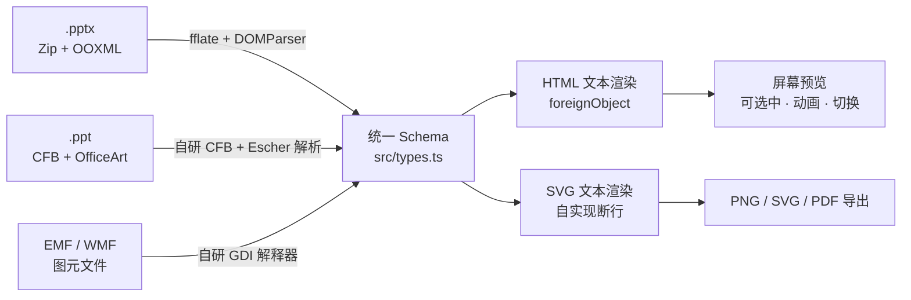

# Web-PPT

[](https://github.com/unStone/web-ppt/actions/workflows/ci.yml)
[](LICENSE)

纯浏览器端 PPT 渲染引擎：`.pptx` / `.ppt` → 统一 JSON Schema → SVG。零服务端依赖、零框架依赖（原生 TypeScript，可被 React / Vue 直接封装），唯一运行时依赖是 fflate。

## 仓库结构

```
web-ppt/                     npm workspaces monorepo
├── packages/
│   ├── core/                web-ppt —— 解析 / 渲染 / 导出，无框架无 DOM 依赖
│   ├── viewer-core/         @web-ppt/viewer-core —— headless 状态机 + 播放层
│   ├── viewer/              @web-ppt/viewer —— 开箱即用查看器，纯原生 TS
│   └── site/                @web-ppt/site —— 官网，含浏览器内实时 Demo
├── fixtures/                测试用 pptx / ppt 样本（脚本生成，确定性）
├── tooling/                 测试框架 / fixture 生成 / LibreOffice 对照 / 性能基准
└── test/snapshots/          142 个渲染快照基线
```

| 包 | 作用 | 依赖 | 体积 (gzip) |
|---|---|---|---|
| `web-ppt` | 解析 / 渲染 / 导出 | fflate | 67KB |
| `@web-ppt/viewer-core` | 导航 / 缩放 / 搜索 / 动画批次 | `web-ppt` | 5.2KB |

`packages/viewer` 与 `packages/site` 都通过**包名**消费上游，与外部用户走同一条路径——
边界一旦被破坏，它们立刻编译失败。将来的编辑器作为 `apps/editor` 加入，
Cordis 之类的应用框架只出现在那一层，不下沉到 core。

### 为什么 viewer-core 是独立包

`Viewer` 里真正耦合 DOM 的只有约 24 行（塞 SVG、设可见性、调播放），
其余 200 多行是纯状态推进。拆开后：

- **接任意 UI 框架**：React / Vue / Svelte 直接驱动 `PresentationState`，不必等官方封装
- **可在 Node 里测**：状态逻辑不再需要 jsdom，用一份手写的最小文稿就能覆盖边界
- **core 保持无 DOM**：`web-ppt` 现在完全不碰 `document`，Worker 里可整包运行

抽出来的当天就测出一个 939 项断言从没碰到的真 bug：`skipHidden` 下若后续全是隐藏页，
`next()` 会落在最后一张**隐藏**页上。它能活那么久，是因为当时 9 个 fixture 里
**没有一张隐藏页**——快照测试挡得住「变了」，挡不住「一开始就没测过」。
现已补上 `sample-hidden.pptx` / `.ppt`，两种格式的隐藏页导航都进了回归。

## 架构



解析层与渲染层完全解耦，渲染层只依赖 `src/types.ts`。格式按魔数识别：`PK` → pptx，`D0CF11E0` → ppt。

图表与图元文件解码器经 hook 注入，可按需 tree-shake。注意 `chart/` **是第四条解析链路而非渲染插件**：
它读 `ppt/charts/chart1.xml`（本身即 OOXML/DrawingML）并产出 `SlideElement[]`。
hook 的作用是打破 `pptx/parser → chart → pptx/color` 的模块环并支持裁剪，
不代表它与文件格式无关——`ChartEnv` 携带 `ColorCtx` / `ThemeFonts` 是正当复用。

**两条文本渲染路径**：`foreignObject` + HTML 排版（屏幕预览、PNG 导出）——排版交给浏览器，文本可选中、支持分栏；
原生 `<text>` + 自实现测量断行（独立 SVG 文件、打印 HTML）——因为 `foreignObject` 只有浏览器认，
Inkscape / librsvg / 设计工具打开会整块丢失文本，交出去的文件必须自包含。

Safari 系有个 [15 年未修的老 bug](https://bugs.webkit.org/show_bug.cgi?id=23113)：不给 `foreignObject` 里的 HTML 应用外层 SVG 的缩放。
查看器运行时探测，中招就整页切到 `<text>` 路径。

## 能力矩阵

| 能力 | .pptx | .ppt |
|---|---|---|
| 预设几何 | ✅ 163 个预设 | ✅ MSOSPT 全表映射 |
| 自定义几何 | ✅ custGeom + gdLst 公式求值 + arcTo | ✅ pVertices / pSegmentInfo |
| 填充 | ✅ 纯色 / 线性 / 径向渐变 / 图片 / 平铺 / 图案 / 主题色变换 | ✅ 纯色 / 渐变 / 图片 |
| 描边 | ✅ 虚线 / 线端箭头 / 端点 / 连接样式 | ✅ 虚线 / 箭头 |
| 效果 | ✅ 外阴影 / 内阴影 / 发光 / 柔化边缘 / 倒影 | ⚠️ 忽略 |
| 立体（3D） | ✅ 挤出 / 斜角 / 轮廓 / 材质 / 视角 | ⚠️ 忽略 |
| 主题样式引用 | ✅ fillRef / lnRef / effectRef + phClr | — |
| 文本 | ✅ 完整（见下）+ 艺术字变形 | ✅ 字号 / 颜色 / 粗斜下划线 / 对齐 / 项目符号 |
| 样式继承 | ✅ 母版 → 版式 → 占位符 → 段落 → run | ✅ 母版 TxMasterStyle → 形状 |
| 图片 | ✅ 裁剪（含形状填充）/ 裁进形状 / 透明度 / 灰度 | ✅ Pictures 流 + DEFLATE 解压 |
| EMF / WMF | ✅ 解码为 SVG | ✅ 解码为 SVG |
| 表格 | ✅ tableStyles / 条纹 / 合并 / 边框 / 垂直对齐 | ✅ 表格属性 + 网格启发式还原 |
| 图表 | ✅ 柱/条/堆叠/折线/面积/饼/环/散点/雷达/气泡/股价/复合饼/曲面 · 次坐标轴 · 3D | ✅ 经内嵌 EMF 预览渲染 |
| 媒体 · 墨迹 · 评论 · 节 | ✅ 封面帧+播放标识 / InkML 笔迹 / 结构化评论 / 分节 | ❌ |
| SmartArt | ✅ 经 diagram drawing part | ❌ |
| 组合 | ✅ 嵌套 + 子坐标系缩放 | ✅ 展平 + 坐标映射 |
| 切换效果 | ✅ 20 种（淡入/推进/擦除/覆盖/分割/缩放…） | ✅ 经 SSSlideInfoAtom，实测 6 种 |
| 元素动画 | ✅ 入场 / 退场 / 强调，按点击分批 | ✅ 同上，实测 5 步 |
| 演讲者备注 · 超链接 | ✅ | ✅ |
| 数学公式 OMML | ⚠️ 转为线性文本 | ❌ |
| 隐藏页 | ✅ `sld@show="0"` | ✅ `SSSlideInfoAtom` F_HIDDEN |

文本细项（pptx）：字号 / 字体 / 粗斜体 / 下划线 / 删除线 / 上下标 / 字间距 / 大小写 / 描边 / 渐变填充 / 高亮 / 竖排 / 分栏 / 自动缩放 / 字符与图片项目符号 / 自动编号 / 超链接 / 页码页脚域 / RTL / 15 种艺术字变形预设。

## 安装

```bash
npm i @web-ppt/core
```

## 使用

```ts
import { parse, slideToPng, slideToSvgFile, presentationToPrintableHtml } from '@web-ppt/core';
import { Viewer } from '@web-ppt/viewer-core';

const pres = await parse(file);                       // File | Blob | ArrayBuffer | Uint8Array
const viewer = new Viewer(container, pres, { animate: true, autoAdvance: true });

viewer.next();                                        // 有待播动画时先播动画，否则翻页
viewer.playNextAnimation();                           // 单独推进一批动画
viewer.finishAnimations();                            // 跳到本页动画终态
viewer.setZoom(1.5);
viewer.search('关键词');                               // → 命中的页索引数组
await viewer.exportPng(2);                            // → Blob

// 想让视频 / 音频真的能播（会引入 foreignObject，仅屏幕预览可用）
const v2 = new Viewer(container, pres, { media: 'player' });

const svg = await slideToSvgFile(pres, pres.slides[0]);
const html = await presentationToPrintableHtml(pres); // 浏览器打印即得 PDF
```

### 接自己的 UI

`Viewer` 只是 `PresentationState` 之上 24 行 DOM 绑定。要接 React / Vue，直接驱动状态机：

```ts
import { PresentationState, playGroup, playTransition } from '@web-ppt/viewer-core';

const st = new PresentationState(pres, { animate: true, skipHidden: true });
st.subscribe((c) => {
  if (c.type === 'slide') setIndex(c.index);          // c.transition 非空时该播切换
  if (c.type === 'animation' && c.group) playGroup(el, c.group);
});
st.next();                     // 有待播动画先播动画，否则翻页
st.hiddenElementIds;           // 当前批次下应隐藏的元素 id
st.search('关键词');            // → 命中的页索引数组
```

图元文件解码器（约 15KB gzip）默认已接入；若要裁剪体积，可移除 `src/index.ts` 里的 `setMetafileDecoder` 调用。

## 开发

| 命令 | 说明 |
|---|---|
| `npm run dev` | 启动 viewer（`?file=/showcase.pptx` 指定文件） |
| `npm run dev:site` | 启动官网（含浏览器内实时 Demo） |
| `npm test` | 全部测试（核心 + 图元文件） |
| `npm run test:core` | 核心解析 / 渲染，1169 项断言 + 142 个渲染快照 |
| `npm run test:metafile` | EMF / WMF 解码器，109 项断言 + 模糊测试 |
| `npm run fixtures` | 重新生成全部测试文件（确定性输出） |
| `npm run check` | TypeScript 类型检查 |
| `npm run build` | 构建 `web-ppt` + `@web-ppt/viewer-core` |
| `npm run build:site` | 构建官网静态产物 |
| `npm run compare public/showcase.pptx` | 用 LibreOffice 生成参考图做并排/叠加对比 |
| `npm run ppt-samples` | 用 LibreOffice 把 pptx 测试文件转成 `.ppt` 样本（pptx fixture 变更后需重跑） |
| `npm run bench` | 大文件性能基准 |

### 保真度基准

渲染保真度不靠"看着差不多"判断，而是拿 **LibreOffice 的实际渲染做 ground truth 逐档比对**。例如主题色的 `shade`/`tint`：

| 档位 | LibreOffice | sRGB 直乘（旧） | 线性 RGB（现） |
|---|---|---|---|
| shade 20% | rgb(33,56,97) | rgb(14,23,39) Δ69 | rgb(28,51,93) Δ8 |
| tint 60% | rgb(176,187,222) | rgb(143,170,220) Δ37 | rgb(176,188,222) Δ1 |

`npm run compare <file>` 可对任意文件生成并排/叠加对照页。

### 性能

浏览器实测，210 页 / 11280 元素：

| 指标 | 数值 |
|---|---|
| **惰性首屏**（解析 + 第 1 页 + 渲染） | **42ms** |
| 全量解析 | 376ms（1.8ms/页） |
| 单页渲染 | 0.09ms |
| 缓存命中（重复访问同页） | 0ms |
| JS 堆 | 40 MB（0.19 MB/页） |

三项优化：

| 优化 | 效果 |
|---|---|
| **惰性解析**（默认开启） | 每页首次访问时才解析，首屏 376ms → 42ms（**9×**） |
| **Worker 解析** | 主线程零阻塞；实测与主线程忙循环并发 573ms vs 串行 942ms |
| **缩略图虚拟化** | 210 页初始只渲染 7 个，滚动时按需补 |

耗时分布（浏览器）：XML 解析 30%（原生 `DOMParser`）、Schema 构建 63%、解压 7%、渲染 <1%。
**WebAssembly 在这条路径上帮不上**——XML 解析已是原生 C++，Schema 构建是 DOM 遍历 + 字符串 + 建对象，全是 WASM 的弱项，且跨边界封送成本会吃掉收益。

#### Worker 用法

```ts
import { parseInWorker } from '@web-ppt/core';

const worker = new Worker(new URL('@web-ppt/core/worker', import.meta.url), { type: 'module' });
const pres = await parseInWorker(worker, bytes);   // 主线程零阻塞
```

Worker 里没有 `DOMParser`（Window-only API），因此 `parseXml` 会自动回退到自带的 `xml-lite`
——纯 JS，实测约为原生的 1.8×，与原生结构等价（测试逐节点比对了全部 slide XML）。
图片不能跨线程传 blob URL，Worker 输出 `asset:N` 令牌 + 原始字节，主线程兑现成真实 URL。

### 测试策略

在 Node 里用 jsdom 提供 DOM，esbuild 把 `src/` 打成 ESM 后跑真实解析与渲染——不 mock 任何解析逻辑。

| 层次 | 覆盖 |
|---|---|
| **结构断言** | 几何（54 形状 × 5 组调节值 + 648 例模糊输入）、颜色、文本继承链、动画/切换、播放引擎、表格还原、图表、文本提取 |
| **不变量** | 每个元素包围盒有限、路径无 `NaN`、Schema 必填字段齐全、SVG 结构合法、无悬空 `url(#id)`、无重复 id、导出路径无 `foreignObject` |
| **渲染快照** | 9 个测试文件 × 全部页 × 两条文本路径 = 102 个归一化 SVG 基线，逐字节比对 |
| **回归锚点** | 针对已修复的真实 bug 写死断言：`.ppt` 字号错位、动画时长取错节点、飞入方向映射反、BLIP 未解压 |
| **健壮性** | 70 例畸形输入——截断（5%~95%）、随机字节破坏、空文件、假魔数、全零；要求要么正常解析、要么抛可读 Error，不得崩溃或吐半成品。单个形状解析失败只降级为占位，不连累整页 |
| **查看器交互** | 超链接分流（内部跳页 vs 外链回调）、索引夹紧、destroy 清理 |

快照会归一化 blob URL、data URI（转摘要）与 defs id，因此跨机器稳定。渲染有意改动时：

```bash
UPDATE_SNAPSHOTS=1 npm run test:core
```

然后 `git diff test/snapshots/` 逐行确认改动符合预期再提交。

测试套件本身经过**变异验证**：把已修复的 bug 逐个改回去，确认能被抓到。

| 变异 | 捕获 |
|---|---|
| 填充规则 `nonzero` → `evenodd` | 40 项 |
| `.ppt` 段落字段表插入错位字段 | 33 项 |
| 关闭几何安全网 | 47 例模糊输入越界 |
| 单元格边框标签拼回 `lnLeft` | 2 项 |
| `shade` 退回 sRGB 空间 | 3 项 |
| `cs` 字体不进字体栈 | 1 项 |

> 快照只能发现「变化」，发现不了「一开始就是错的」——单元格边框那个 bug 就是被**外部 ground truth 对照**抓出来的，而非测试套件。两者互补，缺一不可。

**调试页**

| 页面 | 用途 |
|---|---|
| `/` | 查看器：缩略图（虚拟化）/ 缩放 / 搜索 / 备注 / 演示模式 / 导出 |
| `/shapes.html` | 几何调试：全部预设形状实时渲染，可调调节值与宽高比 |

演示模式（工具栏「演示」或 `F`）下才播放切换与动画：`→` 依次推进动画批次，播完再翻页；`Esc` 退出。

**测试文件**（`npm run fixtures` 生成）

| 文件 | 覆盖内容 |
|---|---|
| `showcase.pptx` | 120 形状 / 效果 / 填充 / 线条箭头 / 文字特性 / 表格 / 图片 / custGeom / 嵌套组合 / 3D / 动画 / 7 种切换 |
| `sample-chart.pptx` | 14 个图表：柱 / 条 / 堆叠 / 折线 / 面积 / 饼 / 环 / 散点 / 次坐标轴组合 / 3D 柱 / 3D 饼 |
| `sample-effects.pptx` | 内/外阴影 / 发光 / 柔化 / 倒影 / 15 种艺术字变形 / RTL |
| `sample-media.pptx` | 视频/音频封面 / 墨迹 / 评论 / 分节 / 气泡·股价·复合饼·曲面图 |
| `sample-metafile.pptx` | 内嵌 EMF 与 WMF |
| `sample.pptx` · `sample.ppt` | 母版继承 / 最小合法 CFB |
| `sample-hidden.pptx` · `.ppt` | 隐藏页导航：可见 · 隐 · 隐 · 可见 · 隐（pptx 走 `sld@show`，ppt 走 `F_HIDDEN`） |
| `sample-autofit.pptx` | 文本自动缩放五种情形：溢出/放得下 × 裸 normAutofit、无 autofit、显式 fontScale、缩到 25% 下限 |
| `sample-placeholder.pptx` | 占位符几何继承：图片占位符空 spPr / 图片自带 xfrm / 形状占位符 |
| `sample-ole.pptx` | OLE 预览图：可解码格式渲染成图片 / 认不出的格式退回占位框 |

`.ppt` 样本可用 LibreOffice 从 pptx 转换生成：`npm run compare` 同款命令，或 `soffice --headless --convert-to ppt <file>`。

## 已知限制

| 项 | 说明 |
|---|---|
| .ppt 的发光 / 柔化 / 倒影 | **格式本身没有这些属性**——它们是 DrawingML(2007+) 的概念，OfficeArt 二进制里无从表达（外阴影已支持） |
| .ppt 的 3D | OfficeArt 有挤出属性（`c3DExtrude*`/`c3DBooleans`），但缺可信样本：LibreOffice 转换会把 3D 烘进 cube 预设几何又保留 3D 属性，照此实现会双重叠加 |
| .ppt SmartArt | 未实现（自动编号与嵌套组均已支持） |
| OMML 公式 | 只取线性文本，不做 MathML 排版 |
| 艺术字包络型预设 | `textPath` 只能弯曲基线，`textInflate` 等不会按位置缩放字形 |
| 3D | 等轴测近似，非真实投影；大角度视角不切换俯视 |
| EMF+ | 不处理。实测手上全部图元文件都是**双模式**——GDI 记录已承载完整绘制（`sample-metafile.pptx` 里 16125 条 GDI 记录 vs 3 条 EMF+ 注释），走 GDI 路径即可。只有纯 EMF+ 文件才需要，尚无样本 |
| 光栅操作码 | SVG/CSS 没有 XOR/AND 位运算混合，`mix-blend-mode` 不等价 |
| chartex 新图表 | 树状图 / 旭日 / 直方图 / 箱线 / 瀑布 / 漏斗 / 地图（Office 2016+ 的 `cx:chartSpace`）整条链路未实现。经典 16 种图表已全支持 |
| Region 的 OR / XOR / DIFF 组合 | 需要区域布尔运算，SVG 裁剪表达不了；COPY 与 AND 已支持 |
| 嵌入字体 | 注入 `@font-face`，但部分文件的字体数据浏览器不接受 |
| 加密文件 | 设了打开密码的文件无法解析，会明确报「该文件已加密」 |
| OLE 嵌入对象 | 渲染 PowerPoint 存的预览图（经 VML 部件解析），不解析内部文档；预览为 PICT 等无法解码的格式时退回占位框 |

## 给编码代理

约定、命令、架构约束与已知陷阱见 [AGENTS.md](AGENTS.md)。

## 交流

| 渠道 | 地址 |
|---|---|
| 问题反馈 / 需求 | [GitHub Issues](https://github.com/unStone/web-ppt/issues) |
| 微信交流群 | [置顶 Issue 里的二维码](https://github.com/unStone/web-ppt/issues?q=is%3Aissue+label%3A%E4%BA%A4%E6%B5%81%E7%BE%A4) |

微信群二维码 7 天失效，所以放在 Issue 里而不是直接贴进 README——
换码只需编辑那条 Issue，README 和已发布的 npm 包都不用动。
