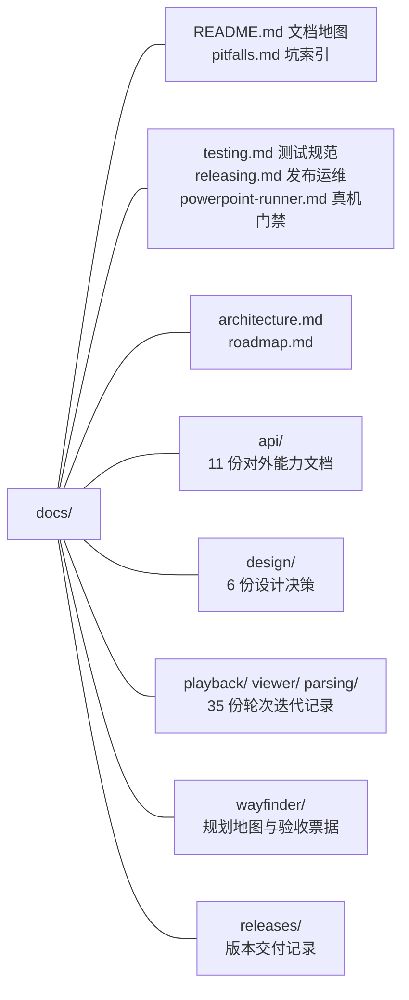

# 文档地图

按「先看什么」组织：理解仓库 → 查 API 与能力边界 → 溯源某个功能的设计依据 → 查坑。

## 阅读入口

| 顺序 | 文档 | 内容 | 读者 · 性质 |
|---|---|---|---|
| 1 | [AGENTS.md](../AGENTS.md) | 仓库约束、已知陷阱、命令与发布流程 | Agent + 维护者 · how-to |
| 2 | [architecture.md](architecture.md) | 包依赖、四条解析链路、编辑闭环的全局架构 | Agent + 维护者 · reference |
| 3 | [architecture-rules.md](architecture-rules.md) | 分层与依赖规范：依赖方向、落位决策、内聚耦合判定、反模式 | Agent + 维护者 · reference |
| 3 | [CONTEXT.md](../CONTEXT.md) | 领域语言：源值 / 覆盖 / 有效投影 / 补丁与生成保存 | Agent + 维护者 · reference |
| 4 | [roadmap.md](roadmap.md) | 能力盘点、版本演进与缺口取舍 | 维护者 · reference |
| 5 | [pitfalls.md](pitfalls.md) | 坑索引：实现陷阱在 AGENTS，交付与交互层面的坑收拢于此 | Agent + 维护者 · reference |
| 6 | [testing.md](testing.md) | 测试贡献规范：门禁关系、固件、快照、断言计数登记 | 贡献者 + Agent · how-to |
| 7 | [releasing.md](releasing.md) | 发布与 CI 运维：流水线行为、发版 checklist、OIDC 坑 | 维护者 · how-to |

性质词汇沿用 [Diátaxis](https://diataxis.fr/)：**reference**（持续查阅的事实）、**how-to**（面向任务的步骤）、**explanation**（理解背景的历史决策）。

## 目录结构

| 目录 | 内容 | 读者 · 性质 |
|---|---|---|
| `api/` | 各按需扩展入口的能力矩阵、API 契约与验收边界 | 外部宿主开发者 · reference |
| `design/` | 编辑技术总纲、Cordis 产品层、编辑器 UI 与官网设计决策 | 维护者 · explanation |
| `playback/` | 放映、黑白屏、跳页、备注、滑动翻页等 16 轮迭代记录 | 维护者 · explanation |
| `viewer/` | 打开链路、深链、密码、查找等 16 轮迭代记录 | 维护者 · explanation |
| `parsing/` | 惰性解析三步曲（钩子 → 媒体 → 后页部件） | 维护者 · explanation |
| `wayfinder/` | 五张研发地图（map + tickets），`verify-v06/v07-readiness` 直接消费其内容做断言 | 维护者 · explanation + 验收工件，**勿移动、勿改结构** |
| `releases/` | 版本交付说明，CHANGELOG 以绝对 URL 指向此处 | 外部 · explanation |

## api/（11 份）

| 文档 | 主题 |
|---|---|
| [expanded-capabilities.md](api/expanded-capabilities.md) | 全部按需扩展入口的能力矩阵（索引层） |
| [api-stability.md](api/api-stability.md) | 1.0 API 契约边界与宿主迁移动作 |
| [appearance-editing.md](api/appearance-editing.md) | 图片效果与立体效果编辑 |
| [browser-editing.md](api/browser-editing.md) | 画布读屏、EditContext、现代图表自动加载 |
| [chart-hierarchical-categories.md](api/chart-hierarchical-categories.md) | 经典图表多级类别编辑 |
| [chartex-native.md](api/chartex-native.md) | ChartEx 原生按需解析与验收边界 |
| [comments.md](api/comments.md) | 只读批注面板与导出开关 |
| [font-glyphs.md](api/font-glyphs.md) | 字体字形 Provider、Worker、HarfBuzz 接线 |
| [local-file-save.md](api/local-file-save.md) | FSA + 下载双路径保存与交付语义 |
| [media-insertion.md](api/media-insertion.md) | 音视频插入、海报替换、恢复与协同 |
| [portable-rich-text.md](api/portable-rich-text.md) | 生成保存与跨文稿复制（公式 / 艺术字） |

## design/（6 份）

| 文档 | 主题 |
|---|---|
| [editing-design.md](design/editing-design.md) | 编辑能力技术总纲：EditDoc / src-ovr / 补丁保存 / 三层视图（D1–D14 决策） |
| [cordis-editor.md](design/cordis-editor.md) | 编辑器产品层 Cordis 插件分层、生命周期与红绿证据 |
| [editor-interaction-redesign.md](design/editor-interaction-redesign.md) | 编辑页缩略图、任务型功能区、形状 / 表格选择器 |
| [editor-desktop-layout.md](design/editor-desktop-layout.md) | 对象列表、分区拖动、属性页签桌面排版 |
| [site-home-layout.md](design/site-home-layout.md) | 官网首页排版与窄屏导航 |
| [site-i18n.md](design/site-i18n.md) | 官网三页中英文验收矩阵（契约文件清单） |

## 轮次迭代记录（35 份）

同主题多轮文档成组，后续轮次建立在早期轮次之上，按组阅读：

| 组 | 文档（按轮次序） |
|---|---|
| 放映基础 | [present-mode](playback/present-mode.md) → [present-bar](playback/present-bar.md) → [present-vertical](playback/present-vertical.md) |
| 后退三连 | [present-rewind](playback/present-rewind.md) → [present-backspace](playback/present-backspace.md) → [present-prev-letter](playback/present-prev-letter.md) |
| 黑白屏三连 | [blank-screen](playback/blank-screen.md) → [blank-period](playback/blank-period.md) → [white-screen](playback/white-screen.md) |
| 跳页与网格 | [slide-number](playback/slide-number.md)、[slide-ends](playback/slide-ends.md)、[slide-grid](playback/slide-grid.md) |
| 演讲者辅助 | [speaker-aids](playback/speaker-aids.md)、[notes-key](playback/notes-key.md) |
| 滑动翻页 | [swipe-nav](playback/swipe-nav.md)（官网）→ [viewer-swipe-nav](playback/viewer-swipe-nav.md)（查看器） |
| 打开世代 | [open-session](viewer/open-session.md) 为全部打开类轮次的根 |
| 认文件两连 | [open-kind](viewer/open-kind.md) → [editor-open-kind](viewer/editor-open-kind.md) |
| 深链三连 | [viewer-open-page](viewer/viewer-open-page.md) → [sample-open-page](viewer/sample-open-page.md) → [open-start-page](viewer/open-start-page.md) |
| 打开收口 | [viewer-open-lazy](viewer/viewer-open-lazy.md)、[viewer-clear-file](viewer/viewer-clear-file.md)、[viewer-file-progress](viewer/viewer-file-progress.md)、[viewer-password](viewer/viewer-password.md)、[viewer-small-viewport](viewer/viewer-small-viewport.md)、[viewer-notes-clear](viewer/viewer-notes-clear.md) |
| 查找四连 | [viewer-search-lazy](viewer/viewer-search-lazy.md) → [viewer-search-highlight](viewer/viewer-search-highlight.md) → [viewer-search-occurrence](viewer/viewer-search-occurrence.md) → [viewer-search-again](viewer/viewer-search-again.md) |
| 惰性解析三步曲 | [advanced-prepare](parsing/advanced-prepare.md) → [parse-preview-parts](parsing/parse-preview-parts.md) → [parse-preview-slides](parsing/parse-preview-slides.md) |
