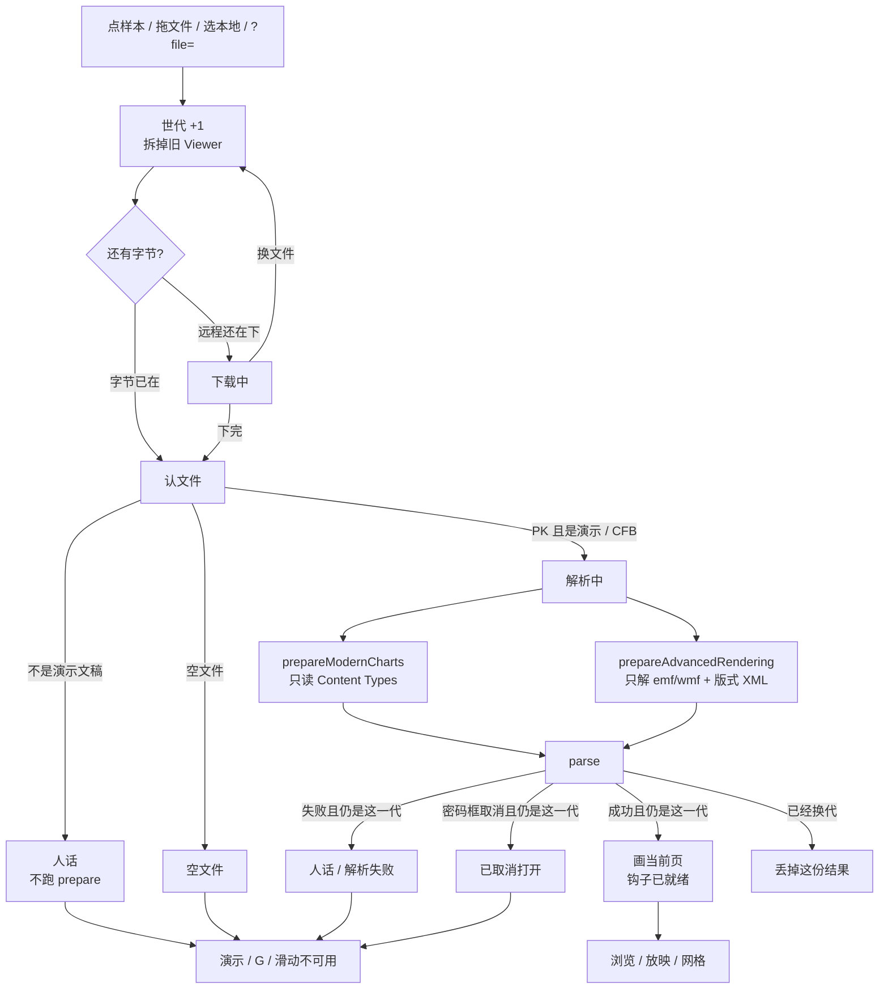
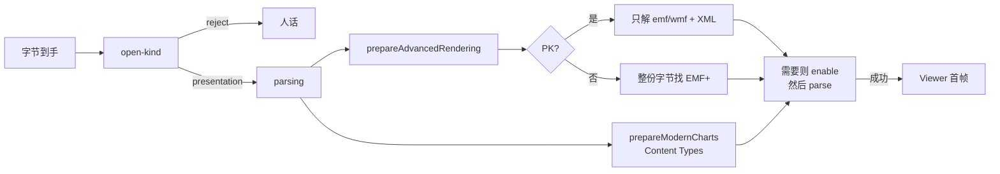

# 钩子准备不再整包解媒体

> 第十六轮持续性迭代。只做这一件事：`prepareAdvancedRendering` 在打开真 `.pptx` 时**只解图元和版式 XML**，不再把 `ppt/media` 里的照片/视频再 inflate 一遍。ChartEx / EMF+ / 3D 仍在 `parse` 前启用，首帧不闪错。FSA 恢复、W 白屏、假进度条本轮不做。

---

## 1. 目标与用户

| 项 | 内容 |
|---|---|
| 用户 | 在浏览器里「先看一眼再演示」的人：拖一份几十 MB 的真 `.pptx`（照片、视频多），等首屏。不装 Office，文件不出设备。 |
| 要解决的问题 | 惰性解析已经让首屏只解一页 XML。打开前 `prepareAdvancedRendering` 仍把全部 `ppt/media` 再解一遍，只为找 `EMF+\x01\x40`。照片稿的主等待是这段二次 inflate，人以为打开卡死。 |
| 成功标准 | 真稿仍先认文件、再准备、再解析；有 EMF+ 或三维的稿**第一帧就对**；普通照片稿不再为钩子扫描 inflate 媒体；ChartEx 仍只走 `prepareModernCharts`；公开函数签名不变。 |

不为谁做：不接受「先画错再刷新」、不做打开进度条、不改 `parse()` 整包解压、不恢复本地稿、不做 W。

---

## 2. 用户场景与流程

主路径：拖一份带很多照片的 `.pptx` → 认文件通过 → 钩子只扫图元和 XML → 解析当前页 → **立刻看见当前页**（不是占位再跳）→ 点「演示」仍按第一轮。

| 分支 | 行为 |
|---|---|
| 空状态 | 未打开、认错、解析失败、已取消：没有 Viewer。页码 `— / —`。G / B / 滑动不做事。 |
| 失败 | 认文件失败、下载失败、解析失败：只写当前世代。钩子扫描自己失败时**不挡** `parse`（钩子是可选增强）。 |
| 取消 | 文件选择器没选出文件：不 `begin`。密码框取消：只属于加密稿那一代。 |
| 换文件 | 第一下拆旧稿。后一次打开赢。 |
| 首帧正确 | 含 ChartEx / EMF+ Only / 三维的页，第一次画出来就是启用后的结果，不准先画 Office 回退或扁 2D 再换。 |
| 返回 | Esc 仍是网格 → 放映 → 关预览。 |
| 恢复 | 不申请文件系统权限。远程 `?file=` 失败仍按第十三轮保留地址。 |

---

## 3. 范围

| 必须做 | 不做 |
|---|---|
| 收窄 `@web-ppt/core/advanced-rendering` 的 Zip filter | 改 `parse()` 整包 `unzipSync` |
| PK：只 inflate `.emf` / `.wmf` 与 slides/layouts/masters/theme XML | 跳过 prepare、parse 后再 enable（首帧会错） |
| 仍在 `parse` 前 `enableEmfPlus` / `enableThreeD` | 假进度条、「正在打开」阶段文案 |
| ChartEx 继续只由 `prepareModernCharts` 读 Content Types | 把 ChartEx 并进本入口 |
| 公开签名 `prepareAdvancedRendering(input): Promise<void>` 不变 | 新增 parse 预解压参数 |
| 首页 Demo、样本预览、独立查看器、编辑器继续调用现入口 | FSA / W / 数字+Enter |
| 固件覆盖：普通稿不解媒体、EMF+ / 3D 仍启用、坏照片不挡三维 | 改 `render/`、让 core 碰 `document` |

---

## 4. 调研与缺口

本轮打开并读完的原始页面（不是搜索摘要）：

| 来源 | 用户实际怎么用 | 对本仓库的含义 |
|---|---|---|
| [Files you can store](https://support.google.com/drive/answer/37603?hl=en) | 原文：**「The Google Drive preview is a scaled-down version of the complete file and may, when opened, appear slightly different.」** 可预览类型把 **PowerPoint (.PPT and .PPTX)** 单列。另写 **Presentations Up to 100 MB for presentations converted to Google Slides**；Drive 本身 **Up to 5 TB**。 | Web 预览按「文件可能很大」设计，且明确是缩略完整稿，不是再解一遍全部媒体。本仓库首屏不该为找钩子把照片再 inflate 一次。 |
| [View & open files](https://support.google.com/drive/answer/2423485?hl=en) | Drive 网页：**「you can view things like videos, PDFs, Microsoft Office files, audio files, and photos」**。双击 Office 在 Drive 里打开/预览。 | 「打开就能看见」是预览主路径。卡在打开前的二次解压，就是这条路径断了。 |
| [Work with Office files](https://support.google.com/docs/answer/6055139?hl=en) | 原文：**「You can edit, download, and convert Microsoft® Office files in Google Docs, Sheets, and Slides。」** 密码稿先到密码框，再选 **Preview**（只读）或 **Edit**。兼容表把演示限制为 **.ppt / .pptx** 同族。 | 预览/演示承诺的是演示文稿，不是「先把 Zip 里所有媒体解完」。加密稿仍走密码框，本轮不改。 |
| [File types supported for previewing files in OneDrive, SharePoint, and Teams](https://support.microsoft.com/en-us/office/file-types-supported-for-previewing-files-in-onedrive-sharepoint-and-teams-e054cd0f-8ef2-4ccb-937e-26e37419c5e4) | 原文：**「You can preview hundreds of file types … without installing the application used to create the file.」** Office Online Server 文档预览含 **PowerPoint (POTM, POTX, PPSM, PPSX, PPT, PPTM, PPTX)**。图片预览另有上限：**「if the image size is less than 100 MB」**。 | 微软网页预览把「能预览的种类」和「单张图多大才解」分开。本仓库不该为了扫描 EMF+ 把所有图都 inflate。上一轮同名短链曾 404；本轮此 URL 可读。 |
| [File API](https://developer.mozilla.org/en-US/docs/Web/API/File_API)（MDN） | 原文：**「The File API enables web applications to access files and their contents. Web applications can access files when the user makes them available, either using a file `<input>` element or via drag and drop。」** `File` 提供 name / size / type；内容要另读。**Note: This feature is available in Web Workers.** | 字节已经在内存里。再解一遍媒体是 CPU，不是磁盘。Worker 能读文件，但不能替代「parse 前必须启用的同步 hook」。 |
| [Optimize long tasks](https://web.dev/articles/optimize-long-tasks) | 原文：任务超过 **50 milliseconds** 的部分是 **blocking period**；**「The browser blocks interactions from occurring while a task of any length is running」**。建议把工作切到 50ms 以内再让出主线程。 | 整包 media inflate 是典型长任务。本轮能删掉的是**不必做的那一遍**，不是加进度条假装没堵住。 |
| [Download a file](https://support.google.com/drive/answer/2423534?hl=en) | 下载失败写清 Cookie、扩展、限流。 | 失败必须停在当前这一次。钩子扫描失败不能冒充文件坏了。 |
| Microsoft `open-files-in-office-for-the-web` | 本轮 HTTP **404**。 | 不能把 404 页当成 Office 网页打开规则。 |
| Microsoft Learn `office-online-server-file-size-limits` | 本轮 HTTP **404**。 | 不用已失效的体积上限页。 |

对照本仓库：

| 表面 | 已有 | 缺口 |
|---|---|---|
| 认文件 | 第十四 / 十五轮：错文件不进 prepare | 真 `.pptx` 仍整包解 media |
| 惰性解析 | 默认只解析当前页 XML，首屏约快 11 倍 | `Pkg` 仍对整包 `unzipSync`；那是下一层 |
| `prepareModernCharts` | 只解 `[Content_Types].xml` | 不需要动 |
| `prepareAdvancedRendering` | PK：filter 匹配全部 `/media/` + 版式 XML，总预算 128MB | 照片/视频占满预算，还可能让后面的 XML 扫不到三维 |
| 图元解码 | `parse` 只对 `.emf` / `.wmf` / PICT 走 `mediaUrl` | 扫描 PNG 里是否碰巧有 `EMF+` 字节，parse 用不到 |
| ChartEx | 打开前 `prepareModernCharts`，否则 Office 回退 | 本入口若推迟 enable，首帧会闪错 |
| FSA / W | 候选 | 覆盖面未变，不解决大文件首屏 |

更高价值检查：来试「拖一份稿看一眼 / 演示」的人，主路径就是打开真 `.pptx`。Drive / OneDrive 都按大文件预览来写。钩子二次解压是当前工作树里还能在不闪错前提下砍掉的等待。`parse` 整包解压是下一刀，公开面更大。进度条砍不掉 inflate。

---

## 5. 是否值得做

| 判定 | 结论 |
|---|---|
| 使用者成本 | 改的是已有按需入口。函数签名不变。普通稿少一次 media inflate；有 EMF+ / 三维的稿只多解那些小部件。运行时依赖仍是 fflate。 |
| 可行路径 | fflate `filter` 在解压前就能看 `name` / `originalSize`（类型定义写明 *Whether or not to extract*）。`parse` 的图元入口只认 `METAFILE_EXT`。 |
| 动发布包？ | 必须。入口已在 `@web-ppt/core/advanced-rendering`，四个产品调用点共用。体积：只改 filter，不打进 `emf-plus` / `three-d` / `chart-ex`。契约：仍在 parse 前启用，首帧不错。 |
| 换候选？ | 进度条：等待还在。跳过 prepare：ChartEx / EMF+ Only 首帧错。FSA / W：原文覆盖面未变。 |
| 判定 | **做钩子准备收窄解压。** |

---

## 6. 产品方案

| 元素 | 规则 |
|---|---|
| 何时准备 | 认文件判定为演示文稿之后、`parse` 之前。与前十五轮同一时机。 |
| 解什么 | 版式 XML（slides / layouts / masters / theme）找 `scene3d` / `sp3d`；`ppt/media` 里扩展名为 `.emf` / `.wmf` 的部件找 EMF+ 标记。 |
| 不解什么 | PNG / JPEG / GIF / 视频及其它媒体。它们即使含有 `EMF+` 字节，解析也不会当图元解码。 |
| ChartEx | 仍只看 Content Types。本入口不准 `setChartExParser`。 |
| 首帧 | 启用发生在第一次 `renderSlideToSvg` / Viewer 挂载之前。 |
| 空 / 错文件 | 认文件挡在前面。SDK 若把坏 Zip 直接丢进本函数：扫描失败则返回，不抛，不挡调用方去 `parse`。 |
| 加密 CFB | 非 PK 仍按整份字节找 EMF+ 标记（与现在相同）。密码框仍在 parse。 |
| 放映 / 网格 | 不改。打开成功后的演示、G、B、滑动、Esc 仍按前十五轮。 |
| 换文件 | 世代与拆旧稿不改。 |

---

## 7. 技术方案

| 决策 | 选择 | 原因 |
|---|---|---|
| 为什么动发布包 | 四个产品面都走这一入口；把 filter 抄到 site/viewer 会再解一次 | 体积几乎不增；签名不变 |
| 为什么不解全部 media | `Pkg.mediaUrl` 只对 `emf/wmf/pict` 调图元 decoder | 解照片找不到会被 parse 用到的 EMF+ |
| 为什么仍解全部版式 XML | 三维数据在 XML 里；惰性翻到后页也要第一下就是立体 | 只扫首页会让后页永远扁 |
| 为什么不把 unzip 结果交给 parse | 要改 `parse()` 公开面，且 prepare 不再持有全包 | 本轮只砍钩子多出来的那一遍 |
| 为什么扫描失败不抛 | 钩子是可选增强；坏媒体不该让整份稿打不开 | 现行为如此，收窄后坏 PNG 更不该挡住三维 |
| 为什么 ChartEx 不动 | 它已经只读 Content Types；并进来只会把现代图表和 GDI+ 绑死 | 首帧正确靠打开路径继续 `Promise.all` |
| 128MB 预算 | 继续限制**被选出的**部件合计 | 不再被照片占满而漏扫 XML |
| 非 PK | 仍扫整份字节 | 加密 `.pptx` 与 `.ppt` 同魔数；本轮不把 CFB 当 Word 拒 |

落点：

| 文件 | 职责 |
|---|---|
| `packages/core/src/advanced-rendering.ts` | filter 只认图元与版式 XML |
| `tooling/test-advanced-rendering.mjs` | 坏照片不挡三维/EMF+；普通稿不启用；ChartEx 不从本入口启用；`--dist` 走发布入口 |
| `package.json` `test:expanded` / `test:expanded:dist` | 纳入扩展门禁 |
| `docs/expanded-capabilities.md` | 按需加载说明与本决策一致（若措辞需要） |

不变量：`render/` 只认 `types.ts`；core 不碰 `document`；`prepareAdvancedRendering` 签名不变。

体积对照（构建后实测）：

| 产物 | 实测 |
|---|---|
| `dist/advanced-rendering.js` | 1.22 kB / gzip 0.67 kB；仍只依赖 fflate + 动态 `emf-plus` / `three-d` |
| 主 `dist/core.js` | 222.66 kB / gzip 79.86 kB，本轮未改解析入口 |
| 官网首次打开闭包 | gzip 543413（预算 543400 + 13）。多出来的是 filter 正则，换掉整包 media 二次解压 |

---

## 8. 验收

| # | 标准 | 证据 |
|---|---|---|
| A1 | 含 `scene3d` 的稿 + 损坏的 PNG media：三维仍启用，首帧有投影 | 新增契约 |
| A2 | 含 EMF+ 的 `.emf` + 损坏 PNG：EMF+ 仍启用 | 新增契约 |
| A3 | 只有照片、无图元/三维的稿：不 `enableEmfPlus` / `enableThreeD` | 新增契约 |
| A4 | ChartEx 稿走本入口后，`setChartExParser` 仍是调用方原来的值 | 新增契约 |
| A5 | 真 `.pptx` / 加密稿 / 认错 / 换文件 / 放映仍按前十五轮 | 旧契约仍跑 |
| A6 | 四项门禁绿；`advanced-rendering` 体积对照构建产物 | check / test / build / verify |
| A7 | browser-use：5174 首页打开 + 5173 打开三维 / EMF+ / 普通稿，首帧可见且不错位 | `out/advanced-prepare-browser/`：showcase / 图表 / 换回、PDF 人话、默认样本、EMF+ 中文与渐变、三维网格（含 `d3tile`）、404、失败后再开三维 |

---

## 9. 方案自评

| 对照 | 结论 |
|---|---|
| 目标 | 解决「真稿首屏被钩子二次解压拖住」，没有偷换成做进度条、FSA 或 W |
| 流程 | 主路径、空、失败、取消、换文件、首帧正确都有出口 |
| 范围 | 只收窄准备扫描；不改 parse 公开面 |
| 与前十五轮 | 不回退放映、备注、滑动、黑屏、网格、打开世代、密码、深链、认文件 |
| AGENTS.md | 不改 `render/`；core 不碰 `document`；动发布包已评估签名/体积/首帧 |
| 风险 | 非标准扩展名的 EMF 若写成 `.bin`，parse 本来也不会走图元 decoder，不比现在差。后页三维仍靠解全部版式 XML——XML 远小于媒体。`parse` 整包解压还在，本轮不假装已经消失。 |

确认后再开发：用户是「打开一份大真稿看一眼/演示的人」；范围只有钩子扫描；验收即上表。
