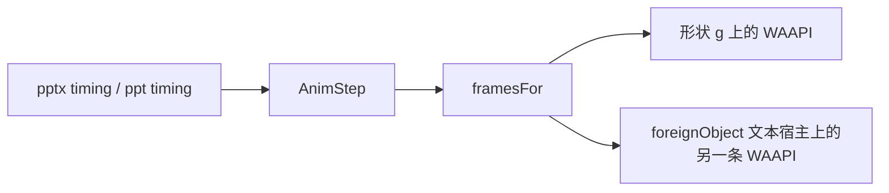

# 对象动画播放

对象动画从 OOXML / 二进制时序收成 `AnimStep`，再由 `viewer-core` 用 Web Animations API 播。`render/` 不认识动画。页切换走 `transitionFrames`，不走这篇。

加一种效果、改一种已有效果，按下面的链路和验收做。几何不要凭名称猜：先拿一份带该 filter 的文件，在放映里对起点、中点和结束帧。

## 链路

| 步骤 | 位置 | 只做这件事 |
|---|---|---|
| 读 filter、preset、方向、段落区间 | `packages/core/src/anim-filter.ts`，pptx 与 ppt 共用 | 产出 `AnimStep`。不碰 DOM |
| 裁剪几何 | `packages/viewer-core/src/animation/clips.ts` | 纯函数，只在 `ClipRegion` 里产出环或洞 |
| 入场 / 退场 / 强调 | `packages/viewer-core/src/animation/frames.ts` | 退场是入场关键帧对调。`playback.ts` 只留页切换 |
| 文本补播 | `packages/viewer-core/src/animation/play.ts` | `<g>` 的 clip / mask 盖不住 `foreignObject`，文本再播一条 |

编辑器保存仍走 `animation-catalog.ts` 和 `pptx/animation-timing.ts`。播放名和保存用的 preset 可以不同，见下一节的 `zoom`。

## 解析

filter 字符串优先于 `presetID`。有 filter 时效果和方向从 filter 来。完整参数已经给出方向时，不再用 subtype 填。

| filter | `AnimStep.effect` | `dir` | 播放 |
|---|---|---|---|
| `blinds(horizontal)` | `blinds` | `horz` | 6 条横条，从每条中线向两侧打开 |
| `blinds(vertical)` | `blinds` | `vert` | 6 条竖条，同样从中线打开 |
| `box(in)` | `zoom` | `in` | 矩形洞收到中心。字形不缩放 |
| `box(out)` | `zoom` | `out` | `inset` 从中心扩到边框。字形不缩放 |
| `circle` / `diamond` / `plus` 的 `(in)` / `(out)` | 同名 | `in` 或 `out`。缺参当 `in` | 向外张多边形，向内收洞。不占盒状的 `zoom` |
| 无方向的 `zoom` | `zoom` | 无 | `scale(0.1)` |

`box` 继续记成 `zoom`。编辑目录里「缩放」是 preset 23，保存 filter 就是 `box(in)` / `box(out)`。另起一个 effect 名会把这条往返拆开。

`PRESET_EFFECT[4]` 目前是 `wipe`。盒状文件靠 filter `box(in)` 盖过 preset 4。没有 filter 的样本之前，不要改这张表。

`p:txEl/p:pRg` 的 `st` / `end` 都含端点，且 `end >= start`，才写入 `paragraphRange`。缺一端、顺序颠倒、或根本没有这个节点，步骤上不出现该字段，动画打在整个形状上。二进制 `.ppt` 时序不读段落区间。

时长用文件里的毫秒，再夹到 60–10000。不要为了「看起来慢」改时长。缓动是 `cubic-bezier(0.25, 0.46, 0.45, 0.94)`。`currentTime` 不是线性进度。出现用 `steps`，路径用线性。

## 播放

关键帧只通过 `element.animate`。不往页面注入 CSS `@keyframes`。

入场开始前，`hiddenBefore` 按形状 id 整只隐藏。`paragraphRange` 不会把同形状里的其他段落继续藏住。

| 表面 | 裁剪坐标系 | 文本 |
|---|---|---|
| `data-el` 的 `<g>` | 百分比加 `fill-box`，相对形状 | `foreignObject` 里的 HTML 不继承这里的 `clip-path` / `mask` |
| 文本宿主 | 去掉 ` fill-box`。蒙版改 `border-box` | 只复制 clip 和 mask。不把 transform 关键帧抄到文本上 |
| 段落 | 查看器没有 `data-p`，用文本根下的直接子 `div`。编辑器优先 `[data-p]` | 揭开类再量这段字的墨迹框 |

查看器 HTML 不写 `data-p`（`includeEditMarkers` 为假）。量墨迹用 `getBoundingClientRect` 和 `createRange().selectNodeContents`。量不到或不足 1px 时，段落改播形状那一套关键帧。盒状向内这时是整框四条蒙版。

`playGroup` 在形状动画之外，若关键帧带 clip 或 mask，再给文本宿主播一条。有 `paragraphRange` 且找得到段落时，宿主是这些段落，揭开类改用墨迹框。找不到段落时，宿主是 `foreignObject > :first-child`。向内的圆形、菱形、十字在形状组上改播蒙版，文字仍播 `shape(evenodd)`。

因此擦除类效果的第一组点击，编辑预览的 WAAPI 次数比「只有形状」多一条。`tooling/lib/animation-editor-contract.mjs` 数的是这条。`textMode: 'svg'` 没有 `foreignObject`，浏览器契约保持原来的次数，不要跟着加。

## 已验收的裁剪

百叶窗：固定 6 条。`horz` 条带沿 Y 分，可以串成一条 `polygon`。`vert` 沿 X 分，每条单独成环，否则上下条之间的连线会斜着切开窗口。关闭时每条收成自己的中线，打开时铺满自己的槽。

盒状向内，分两处，不要合成一种：

| 目标 | 做法 | 原因 |
|---|---|---|
| 整段文字（有墨迹框） | `shape(evenodd)` 矩形洞。关闭时洞等于墨迹框，打开时洞收到墨迹中心点 | 四条 `linear-gradient` 用 `left` / `top` 百分比对不齐，窗口不是长方形；上下各 50% 结束时中间留一条缝。单条 `polygon` 会在中心打成蝴蝶结。`shape() fill-box` 挂在 `<g>` 上会把整组藏掉 |
| 形状 `<g>`，以及量不到墨迹时 | 四条蒙版 `boxInMask` | 只影响形状填充。文本不走这条 |
| `box(out)` | `inset`，从区域中心扩到区域边 | 与向内的洞是两种窗口 |

向内的洞在打开帧必须收成一个点，面积为 0。结束时中心、左缘、右缘都该点到字。占位框很高、字只有一行时，洞围墨迹，不围整块占位框。

## 加一种动画

1. filter 只改 `core/src/anim-filter.ts`。pptx 和 ppt 都调它。完整参数先匹配，匹配不到再走边、横竖、in/out。
2. 新效果名才改 `types.ts` 的 `AnimEffect`。能用现有 effect 加 `dir` 表达的，不新起名字。`box` 仍是 `zoom`。
3. 几何放进 `viewer-core/src/animation/clips.ts`，坐标用 `ClipRegion`。`frames.ts` 只负责选用。退场继续对调，不要另写一套。
4. 关键帧若含 `clipPath` 或 `maskSize`，`play.ts` 会再播 `foreignObject` 文本宿主。百分比在 `<g>` 上带 `fill-box`，抄到 HTML 时去掉。向内光圈的 `shape()` 不要挂到组上，组上用蒙版。
5. 段落有墨迹时，把 region 传进 `revealSequence`。不要只裁形状。
6. `tooling/test-core.mjs` 断言 filter、方向、起止关键帧。段落用例不写 `data-p`，用子 `div` 和桩出来的墨迹框。
7. 多了一条文本 WAAPI 时，只改编辑预览契约的次数。SVG 文本契约不动。
8. `viewer-core` 体积变了，用 `moduleClosure` 量 gzip，再改 README 和官网。官网首次打开预算用同一次构建的实测值。先跑 `npm run verify`，不要抄旧数字。
9. 放映里验收。浏览模式是终态。探针只认舞台上宽度足够的 `[data-el]`，缩略图会先被选中。看中点的裁剪形状和结束帧是否留缝，不要只看一张终态截图。

页切换的 `blinds` / `checker` 仍是整页一条擦除。改对象揭开时不要改 `transitionFrames`。

## 揭开类窗口

| filter | effect / dir | 窗口 |
|---|---|---|
| `blinds` | `blinds` / `horz` `vert` | 6 条，从各自中线向两侧打开 |
| `checkerboard(across\|down)` | `checker` / `horz` `vert` | 6×6，每格单独成环。中点只放开偶数格，结束帧铺满 |
| `randombar(horizontal\|vertical)` | `randomBar` / `horz` `vert` | 8 条，宽度 `6,18,9,14,22,7,15,9` |
| `strips(downLeft\|upLeft\|downRight\|upRight)` | `strips` / `ld` `lu` `rd` `ru` | 6 条平行四边形 |
| `circle` / `diamond` / `plus` | 同名 / `in` `out` | 向外是多边形。向内文字用洞，形状组用蒙版。圆形蒙版格按宽高比折成像素正方形，否则扁矩形上的洞是椭圆 |
| `wipe` | `wipe` / `l` `r` `u` `d` | 单边 `inset` |
| `barn(inVertical\|outVertical\|inHorizontal\|outHorizontal)` | `split` / `vert-in` `vert-out` `horz-in` `horz-out` | 两条边带 |
| `wheel(1\|2\|3\|4\|8)`、`wedge` | `wheel` / 辐条数，`wedge` 为 `1` | 每片从 12 点顺时针扫开。四辐打开帧仍是一个三角形；播放按小角度分帧，避免外点沿弦滑动把扇形提前铺满 |
| `box(in\|out)` | `zoom` / `in` `out` | 矩形洞或四边蒙版，不缩放 |

`hiddenBefore` 仍按整只形状隐藏。同一形状里未点名的段落会跟着出现。二进制时序仍没有 `paragraphRange`。形状填充上的向内盒状仍用四条蒙版，结束时填充中心可能留一条缝；文字已经改走矩形洞。
