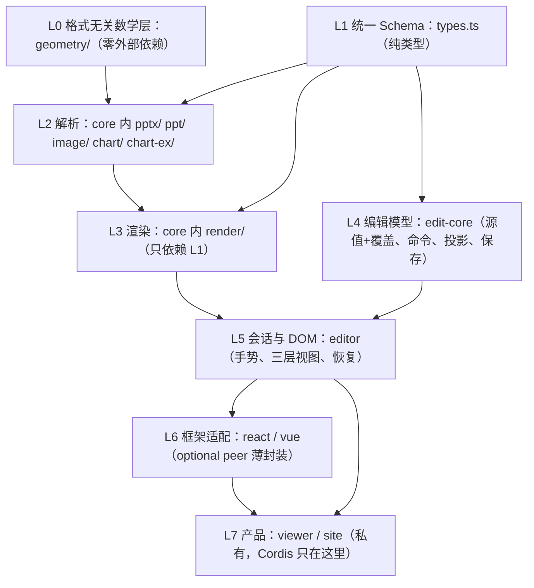

# 分层与依赖规范

架构现状见 [architecture.md](architecture.md)；本文是**规则**：分层怎么定、依赖往哪走、新代码放哪里、什么算高内聚低耦合。机械可判定的四条由 `tooling/check-architecture-boundary.mjs` 在 `npm run build` 与 `npm run verify` 时强制，其余靠评审与 [AGENTS.md](../AGENTS.md) 约束。

## 1. 分层模型

横切（peer 挂靠，不在主链上）：`viewer-core`（状态机 + 播放，peer core）、`fonts`（peer core）、`collab`（peer edit-core）。

**依赖铁律：单向向下。** 上层可以依赖下层，下层永远不知道上层的存在；同层模块之间不互相 import（例外见 §4）。

## 2. 依赖方向规则

| # | 规则 | 判定 | 强制方式 |
|---|---|---|---|
| R1 | `render/` 只 import `../types` 与同目录文件 | import 说明符白名单 | check-architecture-boundary（build + verify） |
| R2 | `geometry/` 零外部依赖，相对引用不出本目录 | import 解析后路径仍在 geometry 内 | 同上 |
| R3 | core 的浏览器 DOM API 只允许在五个白名单文件：`browser-export.ts`、`pdf/vector-browser.ts`、`pdf/vector-image-browser.ts`（按需导出入口，无条件使用）与 `xml.ts`、`render/text-measure.ts`（`typeof` 探测 + null 回退，Worker 安全） | DOM API 正则扫描 + 白名单 | 同上 |
| R4 | 发布包只 import 自己 package.json 声明的 deps/peer（含自身）；私有包 viewer/site 不被任何包反向依赖 | 源码 `@web-ppt/*` 引用与 manifest 比对 | 同上 |
| R5 | 框架运行时（React/Vue/Cordis）不进入 L0–L5 任何一层的源码 | 评审；react/vue 只包 editor 公开 seam，Cordis 只在 site | 类型检查天然兜底（发布包未声明框架依赖） |
| R6 | 图表解码器、图元解码器、解密器、3D、字体解压经 hook 注入（`setChartParser` 等），不进主入口闭包 | 评审 + 现有 check-*-boundary 产物审计 | 各专项 boundary 审计 |

## 3. 抽象的标准

「极度的抽象能力」在本仓库的可判定表达是**三个无关**，每条都有既成事实作基准：

| 维度 | 基准 | 验收问题 |
|---|---|---|
| 格式无关 | 渲染层只认识 `SlideElement`，不认识 pptx/ppt/EMF | 新增一种输入格式，`render/` 要改吗？（答案必须是零） |
| 环境无关 | core 解析 + 渲染路径可在 Worker 整包运行 | 换一个无 DOM 环境，主链路崩吗？ |
| 框架无关 | 发布包到 editor 为止无任何 UI 框架 | 换一个宿主框架，要动 SDK 吗？ |

重能力（图表原生渲染、WASM 字形、3D、解密）默认不进主链路：hook 注入，宿主不注入就不付出体积与运行时成本。

## 4. 内聚与耦合的判定

| 判定 | 方法 | 本仓库的基准事实 |
|---|---|---|
| 高内聚 | 一个模块只有一个变更理由 | `geometry/` 的变更理由只有 ECMA-376 规范本身；`render/` 的变更理由只有视觉输出 |
| 低耦合 | 变更传播测试：一类变更不该波及无关层 | 改 `.ppt` 解析不动 `render/`；改 React 适配不动 `editor/`；换主题色不动解析层 |
| 允许的例外 | 必须写明理由 | `chart/` 复用 `pptx/color`：chart XML 本身就是 OOXML，AGENTS.md 已记录，不许再复制一份颜色解析 |

## 5. 新代码落位决策

| 要加什么 | 落位 | 依据 |
|---|---|---|
| 新输入格式 | `core/src/<format>/` 解析目录 + 必要时 `types.ts` 扩展 | 只动 L2，L1 已有类型则零改动 |
| 新导出格式 | `core/src/` 顶层模块，DOM 依赖则按需子入口 | R3 的白名单模式 |
| 新预设形状求值 | `geometry/`（生成脚本产物） | R2 |
| 新编辑命令 | `edit-core/src/commands/` + 命令产出逆 patch | L4 |
| 新手势 / 键盘交互 | `editor/src/` | L5 |
| 新 UI 组件 | `react/` `vue/` 各一份薄适配 + 站点自己实现 | R5 |
| 新重能力（解码器/编码器） | hook 注入 + 独立入口 | R6 |
| 新测试套件 / 固件 | `tooling/test-*.mjs` / `make-*-fixture.mjs` | [testing.md](testing.md) |

## 6. 反模式（出现即打回）

| 反模式 | 违反 |
|---|---|
| `render/` 里出现文件格式名、zip、CFB 等概念 | R1 |
| `geometry/` import 任何非目录内模块 | R2 |
| core 新文件直接用 `document` / `window` / `DOMParser` | R3（先问：能不能探测回退？是否该走按需入口？） |
| 包源码里 import 未声明的 `@web-ppt/*` 或 import viewer/site | R4 |
| 适配层（react/vue）或 site 里出现编辑语义、命令逻辑 | R5：适配层只做绑定与生命周期 |
| 双向依赖、同层互依（除已记录例外） | §1 铁律 |
| 为绕开分层而复制一份已有实现 | §4：例外必须记录，不许复制 |
