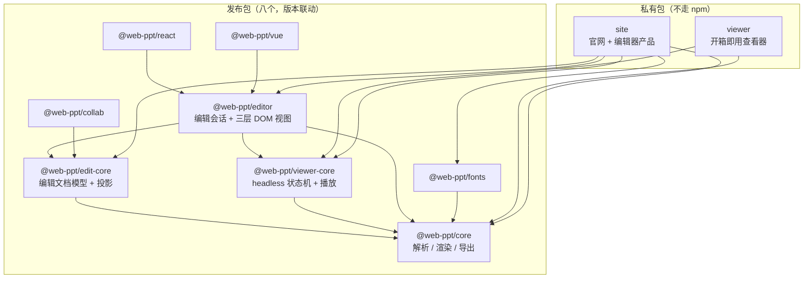
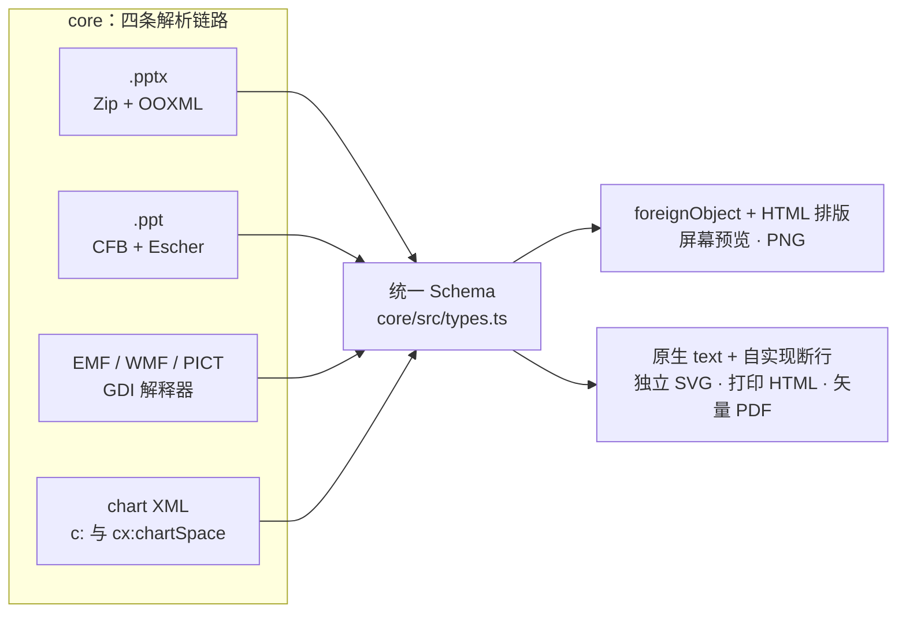
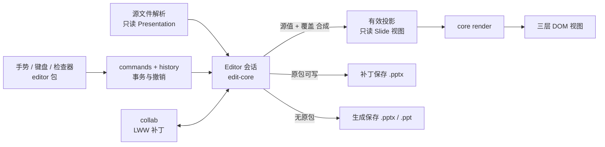

# 架构总览

纯浏览器端 PPT 引擎：`.pptx` / `.ppt` → 统一 JSON Schema → SVG。零服务端，基础包零框架，`@web-ppt/core` 唯一运行时依赖是 fflate。编辑器产品层（`site`）使用 Cordis，但不进入任何发布包。

## 1. 包与依赖

| 包 | 职责 | 依赖方式 | 运行时依赖 |
|---|---|---|---|
| `core` | 四条链路解析 → 统一 Schema → SVG / PNG / PDF 导出；无 DOM 依赖，可整包进 Worker | — | fflate |
| `edit-core` | 编辑文档（源值 + 覆盖）、命令与历史、有效投影、补丁/生成保存；无 DOM 依赖 | peer `core` | fflate |
| `viewer-core` | 纯状态机 `PresentationState` + 播放（动画/切换/墨迹/视频），DOM 耦合仅 Viewer 一处 | peer `core` | — |
| `editor` | 编辑会话、三层增量 DOM 视图、手势/键盘/吸附、文本编辑面、IndexedDB 恢复存储 | peer `core` + `edit-core` + `viewer-core` | — |
| `react` / `vue` | 组件 + hook 薄适配，只包 `editor` 公开 seam | peer `editor` + 对应框架 | — |
| `fonts` | 字体替换表、按需加载、字形子集 | peer `core` | — |
| `collab` | 字段级 LWW 协同：原子补丁、BroadcastChannel 传输、冲突解决与检查点 | peer `edit-core` | — |
| `viewer`（私有） | 工具栏 / 缩略图虚拟化 / 批注面板 / 导出的完整查看器页面 | 直接依赖 | — |
| `site`（私有） | 官网、浏览器内 Demo、Cordis 编辑器应用 | 直接依赖（按包名消费） | cordis、harfbuzzjs、mtx-decompressor 等 |

`viewer` 与 `site` 通过**包名**消费上游，与外部用户走同一条路径，边界被破坏会立刻编译失败。发布顺序：`core` → `edit-core` → `viewer-core` → `editor` → `react` → `vue` → `fonts` → `collab`。

## 2. 数据流：从文件到画面

格式按魔数识别（`PK` → pptx，`D0CF11E0` → ppt），不看扩展名。两条文本渲染路径**不可合并**：`foreignObject` 只有浏览器认，交出去的文件必须自包含；WebKit 十五年未修的缩放 bug 由 `viewer-core` 运行时探测降级。图表 / 图元解码 / 解密 / 3D / MTX 字体解压经 hook 注入，可 tree-shake。

### core 内部模块

| 模块 | 职责 |
|---|---|
| `pptx/` | OOXML 解析：包读取、主题、母版/版式继承、动画、表格样式、批注、SmartArt、OMML |
| `ppt/` | 二进制格式：自研 CFB、Escher 记录流、主题、timing |
| `image/` | EMF / WMF / PICT 图元文件解码 |
| `chart/` | 经典图表 XML → `SlideElement[]`（是解析链路，不是渲染插件；hook 为打破模块环） |
| `chart-ex/` | Office 2016+ `cx:chartSpace` 扩展图表 |
| `geometry/` | 格式无关的 ECMA-376 全部 187 个预设形状求值，零 import |
| `render/` | SVG 渲染：只依赖 `types.ts`；填充、效果、CJK 标点挤压、文本测量与断行 |
| `pdf/` | 矢量 PDF 导出：路径、渐变、图案、字体资源 |
| `crypto/` | 加密文档解密（hook 注入） |
| `font/` | 嵌入字体 EOT 容器剥离（MTX 解压走 `setFontDecoder` hook） |
| `ink/` `three-d/` | 墨迹、3D 效果 |
| 顶层 | `types.ts`（Schema）、`xml.ts` / `xml-lite.ts`（Worker 里无 DOMParser 的回退）、`browser-export.ts`、`worker.ts`、`anim-steps.ts`、`transition.ts` |

## 3. 数据流：编辑闭环

领域概念（源值 / 覆盖 / 有效投影 / 补丁保存 / 生成保存）定义见 [CONTEXT.md](../CONTEXT.md)。

三层 DOM 视图（定义见 [design/editing-design.md](design/editing-design.md#10-渲染层改造与三层视图)）：

| 层 | 内容 | 更新粒度 |
|---|---|---|
| ① 静态 | `renderSlideToSvg` 产物 | 事务提交后脏元素级 patch |
| ② 交互 | 选框、手柄、参考线 | 每帧直接改属性 |
| ③ 文本编辑面 | `contenteditable` | 段落级 |

### edit-core 内部分域

| 域 | 代表模块 |
|---|---|
| 文档模型 | `document.ts`、`document-extensions.ts`、`identities.ts`、`element-*` |
| 命令与历史 | `commands/`、`history.ts`、`transaction-validation.ts` |
| 投影 | `projection.ts`、`dynamic-projection.ts`、`layout-projection.ts`、`theme-projection.ts`、`design.ts` |
| 保存 | `save/`（补丁 + 生成）、`ppt/`、`opc/` |
| 设计系统 | `theme.ts`、`master.ts`、`layout.ts`、`templates/`、`design-*` |
| 文本模型 | `text-model.ts`、`text-position.ts`、`text-search.ts`、`paragraph-*` / `run-*` |
| 剪贴板 | `clipboard*.ts`（含富文本可移植包） |
| 恢复 | `recovery*.ts`、`recovery-migrations.ts` |
| 对象域 | `chart/`、`chart-shared/`、`smartart/`、`ole/`、`ink/`、`media/`、表格系列 |
| 协同支撑 | `collaboration-identity.ts`、`change-classification.ts`、`patch-events.ts` |

## 4. 字体体系

嵌入字体是 EOT 容器且普遍开 MTX 压缩，`core/font/eot.ts` 剥容器，MTX 解压经 hook 注入（官网接 `mtx-decompressor`）。`fonts` 包提供替换表与按需加载，`site` 按文稿作用域持有 Provider / Worker / FontFace。SVG 作为 `` 加载时是隔离上下文，非系统字体必须把 `@font-face` 与 base64 字节内联进 SVG。

## 5. 产品层

| 包 | 结构 |
|---|---|
| `viewer` | 单页查看器：缩略图虚拟化、搜索、批注面板、导出 |
| `site` | Vite 多页面：官网（中英双语 + 实时 Demo）+ 编辑器应用。编辑器按 Cordis 插件分层：页面 / 打开 / 恢复 / 文件 / 业务工具为应用级插件，视图 / 字体 / 工具为文稿作用域插件，分层与生命周期约定见 [design/cordis-editor.md](design/cordis-editor.md) |

## 6. 测试与质量体系

| 组成 | 说明 |
|---|---|
| `fixtures/`（173 个文件） | 全部由 `tooling/make-*.mjs` 确定性生成，重跑字节必须一致 |
| `test/snapshots/`（186 个 SVG） | 两条文本路径的归一化快照基线；只发现「变了」，保真度另靠 ground truth |
| LibreOffice 对照 | `npm run compare` 产出 SSIM / MAE / 热力图，用于横向比较与定位整片偏色 |
| 边界审计 | `tooling/check-*-boundary.mjs`：模板、图表数据、媒体、chartex、i18n、字体等模块边界 |
| dist 复验 | 多数测试以 `--dist` 再跑一遍（`npm run verify`），验证发布产物而非仅源码 |
| 交叉进程指纹 | 渲染结果含跨解析累加的 defs id，同进程不可重复比对，见 `tooling/lib/ppt-fingerprint.mjs` |
| 编辑等价 | 1114 对编辑等价指纹 + PowerPoint / LibreOffice 真实打开验证 |

断言与体积的最新实测数字见 [AGENTS.md](../AGENTS.md) 与 [README.md](../README.md)，由 `npm run verify` 强制比对，不在此重复。

## 7. 不可破坏的约束

| 约束 | 原因 |
|---|---|
| `render/` 只依赖 `types.ts` | 渲染层不认识任何文件格式，加新格式不动它一行 |
| 魔数识别格式 | 扩展名不可信 |
| 两条文本渲染路径不合并 | 可移植性：交出去的 SVG 必须在 Inkscape / librsvg 里不丢文本 |
| `core` 不碰 `document` | 必须能整包进 Worker（`xml-lite.ts` 为此存在） |
| 发布包不引入框架 | React / Vue / Cordis 全部停留在适配层与私有包 |
| 新能力必须同时加固件 | 隐藏页零覆盖曾让真 bug 在近千项断言下存活 |

## 8. 发布

八个发布包版本号必须一致（当前 0.5.0-beta.5），打 tag 触发 `release.yml` 走 npm Trusted Publishing（OIDC），Secrets 不存凭据。新包首次发布走不了 OIDC，需先本地 `npm publish` 再配置 trusted publisher。详细流程与陷阱见 [AGENTS.md](../AGENTS.md#发布)。
