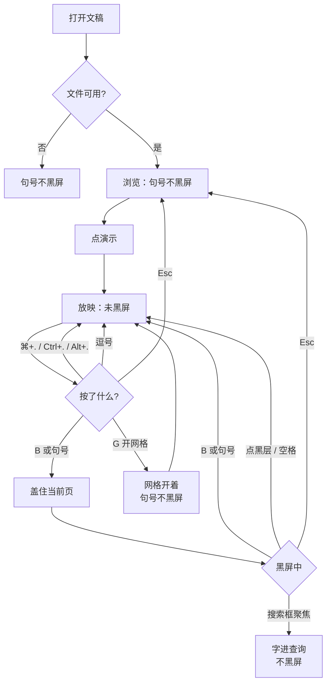
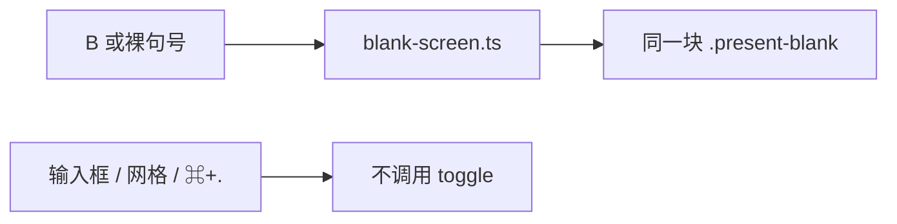

# 放映黑屏的句号别名

> 第二十七轮持续性迭代。只做这一件事：官网首页 Demo、样本预览、独立查看器在**放映中**，不带修饰键的 `.` 与 B 开关同一块黑屏。浏览态的句号不黑屏。不另做白屏、激光笔。

---

## 1. 目标与用户

| 项 | 内容 |
|---|---|
| 用户 | 在浏览器里打开 `.pptx` / `.ppt` 后点「演示」的人：停讲时按自己已经习惯的黑屏键。不装 Office，文件不出设备。 |
| 要解决的问题 | 第五轮已经能按 B 把当前页盖黑。PowerPoint 桌面放映表把 **Period (.)** 和 B 写在同一行，是同一条「黑屏 / 再看见当前页」。现在只有 B，句号什么都不做。 |
| 成功标准 | 只在放映中、没有 Ctrl / ⌘ / Alt 时：`.` 与 B 开关同一层，页码不变。浏览态、搜索框、网格开着、⌘+. 都不黑屏。点黑层、空格、Esc 仍按第五轮。 |

不为谁做：不在这一轮做 W / 逗号白屏、激光笔、数字+Enter、浏览态黑屏、改 `render/` 或 core。

---

## 2. 用户场景与流程

主路径：打开文稿 → 点「演示」→ 按 `.` → 观众只看到黑 → 再按 `.` 或 B → 还是这一页。浏览时按句号，画面不动。

| 分支 | 行为 |
|---|---|
| 空状态 | 未打开或打开失败：没有放映，句号不黑屏。 |
| 失败 | 全屏被拒：仍在放映，句号照常。输入框里的句号留给输入，不黑屏。 |
| 取消 | 浏览态句号、网格开着、带 Ctrl / ⌘ / Alt 的句号：都不进入黑屏，也不翻页。 |
| 返回 | 再按句号、再按 B、点黑层、空格：恢复当前页，不翻页。 |
| 恢复 | Esc / 退出清掉黑层。退出后再按句号不黑。换文件仍先清黑层。 |

---

## 3. 范围

| 必须做 | 不做 |
|---|---|
| 首页 Demo、样本预览、独立查看器共用现有黑屏 | W 白屏、逗号别名 |
| 放映中不带修饰键的 `.` 与 B 同一开关 | 浏览态按句号黑屏 |
| 搜索框、网格、⌘+. 不抢这条键 | 激光笔 `l` / Ctrl+L |
| 点黑层、空格、Esc 保持第五轮 | 数字+Enter、改 `render/`、推进发布包 |
| 按钮提示写上 B 与句号；按钮字仍是 B | 把 ⌘+. 做成结束放映 |

---

## 4. 调研与缺口

本轮打开并读完的原始页面（不是搜索摘要）。日期 2026-09-22。

| 来源 | 用户实际怎么用 | 对本仓库的含义 |
|---|---|---|
| [Present slides · Computer](https://support.google.com/docs/answer/1696787?hl=en&co=GENIE.Platform%3DDesktop) · 折叠节 `Present mode keyboard shortcuts`（`#presentingshortcuts`） | PC、Mac、Chrome 三张表同一行：**Show a blank black slide → `b`**。回来是 **Press any key**。激光笔是单独一行 **Toggle laser pointer → `l`**。白屏是 **`w`**。三张表的黑屏单元格原文都是 `b`，没有句号。 | 候选里的「Google 写 `b or .`」和当前原文不一致。Google 现在只把 `b` 当作黑屏。`l` 是另一件工具，不是黑屏别名。 |
| [Use keyboard shortcuts to deliver PowerPoint presentations](https://support.microsoft.com/en-us/accessibility/powerpoint/use-keyboard-shortcuts-to-deliver-powerpoint-presentations) · Windows `tabpanel_1_windows` | **Display a blank black slide, or return to the presentation from a blank black slide. B Period (.)** 白屏下一行是 **W Comma (,)**。激光笔是 **Ctrl+L**。结束是 **Esc**。 | 句号和 B 是同一条，既能盖上也能回来。这是别名，不是新画面。 |
| 同上 · macOS `tabpanel_1_macos` | 黑屏：**B、Shift+B、Period (.)**。结束：**Esc、Hyphen (-)、⌘+Period (.)**。激光笔是 **⌘+L**。 | 单独的句号仍是黑屏。**⌘+.** 是结束放映，不能拿来黑屏。Shift+B 按下后键值已是 `B`，现有 B 已经接住。 |
| 同上 · Web `tabpanel_1_web` | 这一栏只写结束：**Esc**。没有 B，也没有句号。 | Web 官方表没写句号，不推翻桌面表。本仓库的 B 来自手机栏和演讲者视图，句号补的是桌面同一动作。 |
| 旧链 `…/1524ffce-bd2d-45f4-a424-29175c84d3b0` | 打开后是 **Sorry, page not found**。现行文章在上面的 accessibility 路径。 | 不以失效链接为准。 |

对照本仓库：

| 表面 | 已有 | 缺口 |
|---|---|---|
| 官网首页 / 样本 | 放映中 B、点黑层、空格只恢复、Esc 清层 | 句号不开关这块黑屏 |
| 独立查看器 | 同一套 `blank-screen.ts`，另有搜索框 | 同上；搜索框里的句号必须留给查询 |
| 激光笔 / 白屏 | 没有 | 不是这条别名。激光笔官方键还互相打架（Google 是 `l`，PowerPoint 是 Ctrl+L / ⌘+L） |

---

## 5. 是否值得做

| 判定 | 结论 |
|---|---|
| 句号别名 | **做。** Windows 与 macOS 放映表把 Period (.) 和 B 写在同一行。官网和查看器都已有 B，别名必须两边一致。只改已有开关。 |
| 激光笔 | **不做。** 新的指针工具。Google 是裸 `l`，PowerPoint 是带修饰键的 L。覆盖面窄，和句号不是同一件事。 |
| 白屏 W / 逗号 | **不做。** 同一张表的下一行，但是另一层画面，不是已有黑屏的别名。 |
| Google 现行 `b` | 不阻止。它没把句号写成黑屏，也没把句号写成别的动作。桌面 PowerPoint 表是句号的依据。 |
| 使用者成本 | 不进八个发布包。不增依赖。浏览态和输入框零变化。 |
| 可行路径 | `blank-screen.ts` 已是三处表面的同一开关。 |

---

## 6. 产品方案

| 元素 | 规则 |
|---|---|
| 何时生效 | 仅放映中，且键盘没有被输入框或网格拿走。 |
| 开 / 关 | 不带 Ctrl、⌘、Alt 的 `.`，与 B / b 同一 `toggle`。页码不变。 |
| 修饰键 | ⌘+.、Ctrl+.、Alt+. 不黑屏、不结束放映、不翻页。macOS 的 ⌘+. 是结束，这一轮不新接结束。 |
| 浏览态 | 句号不黑屏、不翻页。 |
| 搜索框 | 焦点在输入框时，句号是查询里的字符。放映中焦点不在搜索框时，句号黑屏，不查找、不改查询。 |
| 网格 | 网格开着时句号不黑屏、不关网格、不翻页。Esc 仍先关网格。 |
| 已有退出 | 点黑层、空格、滑黑层只恢复；Esc / 退出清层。句号不改变这些。 |
| 逗号 | 不黑屏。逗号属于没做的白屏。 |
| 按钮 | 字仍是 B。提示改成带「B 或 .」，中英文都写。 |
| 查看器提示条 | `B 或 . 黑屏`，和按钮提示同一句话。 |

---

## 7. 技术方案

| 决策 | 选择 | 原因 |
|---|---|---|
| 认哪个键 | `event.key === '.'`，且没有 ctrl / meta / alt | 官方写的是 Period 这个字符。数字键盘小数点的 key 也是 `.`。⌘+. 的 key 仍是 `.`，必须用修饰键排除 |
| 为什么不认 `code === 'Period'` | 其它键盘布局上句号不一定在那个物理键 | 表里写的是字符 |
| 为什么与 B 同一 `toggle` | 官方写的是 display **or return** | 再按一次回来，和 B 相同 |
| 为什么不把「任意键」都变成恢复 | Google 写 Press any key；N / T / G 已有别的用途 | 句号只加入 B 那一条，不改恢复键表 |
| 模块 | 只改 `blank-screen.ts` | 三处表面已经共用；不进发布包 |
| 提示文案 | 仍在 `chromeCopy`，不进共享词库 | 编辑器首包会把首页词表打进去 |

落点：

| 文件 | 职责 |
|---|---|
| `packages/site/src/blank-screen.ts` | 裸句号与 B 同一开关；提示写上句号 |
| `packages/viewer/index.html` | 提示条与按钮 title 写上句号 |
| `tooling/lib/blank-period-browser-contract.mjs` | 浏览、放映、修饰键、网格、搜索、点层、空格、Esc |
| 首页 / 样本 / 查看器契约入口 | 接上同一条 |

不变量：`render/` 只认 `types.ts`；core 不碰 `document`；不进发布包。

---

## 8. 验收

| # | 标准 | 证据 |
|---|---|---|
| A1 | 浏览态句号不出现黑层、不翻页 | 契约 |
| A2 | 放映中句号黑屏且页码不变；再按句号恢复 | 契约 |
| A3 | B 与句号可以互相关掉对方打开的黑屏 | 契约 |
| A4 | 点黑层、空格只恢复不翻页；Esc 离开并清层 | 契约 |
| A5 | 网格开着、搜索框聚焦、⌘+.、逗号、打开失败：都不黑屏 | 契约 |
| A6 | 第五轮 B 契约仍绿 | 旧契约 |
| A7 | 四项门禁绿 | check / test / build / verify |
| A8 | browser-use：5173 与 5174 放映中按句号，浏览态不黑 | `out/blank-period-browser/` |

---

## 9. 方案自评

| 对照 | 结论 |
|---|---|
| 目标 | 补的是已有黑屏的桌面别名。没有改成白屏、激光笔或查找 |
| 流程 | 主路径、空、失败、浏览、输入、网格、修饰键、点层、空格、Esc 都有出口 |
| 范围 | 三处预览表面同一件事 |
| 与前二十六轮 | 不回退 B、点层、空格、Esc、网格、搜索、放映条 |
| 证据 | 以打开的 Microsoft 现行表为准。Google 现行表没有句号，写进第 4 节，不把记忆里的 `b or .` 当成原文 |
| AGENTS.md | 不改 `render/` 与 core |
| 风险 | 若句号在捕获阶段 `preventDefault`，搜索框就打不出点。输入框必须先返回，且不拦截 |

确认后的决定：用户是「放映时想按句号黑屏的人」；范围只有这条别名；验收即上表。
