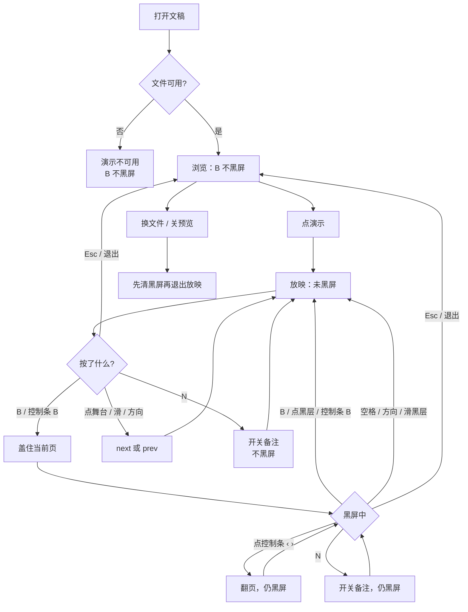
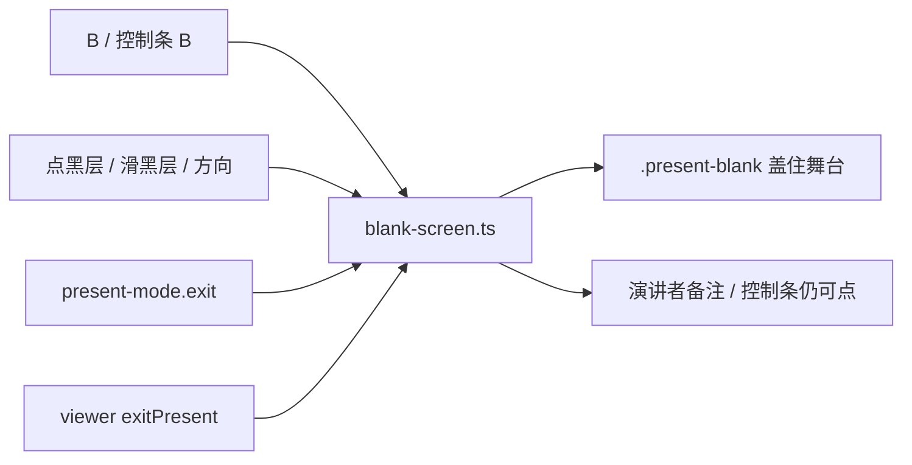

# 放映黑屏：B 键遮住当前页

> 第五轮持续性迭代。只做这一件事：官网首页 Demo、样本预览、独立查看器在**放映中**按 B 把当前页盖成黑屏；再按 B 或点黑层恢复。浏览态、双屏、白屏（W）本轮不做。

---

## 1. 目标与用户

| 项 | 内容 |
|---|---|
| 用户 | 在浏览器里打开 `.pptx` / `.ppt` 的人：投屏讲到一半要停一下、问答时不想让观众盯着这一页、手机外接键盘或本机按 B。不装 Office，文件不出设备。 |
| 要解决的问题 | Microsoft 手机官方放映写明 B 键黑屏、再按 B 恢复；演讲者视图也有「Black or unblack slide show」。官网和独立查看器放映都能点、键能翻、能滑，唯独不能把画面藏起来。没有这条，停讲只能 Esc 退出或翻到空白页。 |
| 成功标准 | 只在放映中：B 盖住当前页；再按 B 或点黑层恢复同一页。Esc / 退出离开时黑层一起清掉，不能卡在黑屏。点按前进、滑动、备注层、全屏失败放映仍按前四轮。 |

不为谁做：不在这一轮做 W 白屏、句号别名、激光笔、画笔、双屏、查看器小视口缩略图、编辑器「放映」页、改 `render/` 或 core。

---

## 2. 用户场景与流程

主路径：打开文稿 → 点「演示」（全屏失败也留在放映）→ 讲到要停 → 按 B → 观众只看到黑 → 再按 B 或点黑层 → 还是这一页 → 继续点/滑/方向键 → Esc 离开。

| 分支 | 行为 |
|---|---|
| 空状态 | 文稿未打开或打开失败：没有放映，B 不做事。 |
| 失败 | 全屏被拒：仍按第一轮留在放映，B 照常。输入框里的 B 不黑屏。 |
| 取消 | 浏览态按 B、位移不足的滑、点备注层：都不进入黑屏。 |
| 返回 | 再按 B、点黑层、控制条 B：恢复当前页，不翻页。Esc / 退出 / 退出全屏：离开放映并清掉黑层。 |
| 恢复 | 退出后再进放映从当前页开始，默认不黑。换文件不能把上一份的黑层留在屏幕上。 |

---

## 3. 范围

| 必须做 | 不做 |
|---|---|
| 首页 Demo、样本预览、独立查看器共用同一套黑屏 | W 白屏、句号 / 逗号别名 |
| 只在放映中：B 开关键；点黑层恢复 | 浏览态黑屏、整页（含备注）涂黑 |
| 黑层盖住当前页；控制条、备注、语言入口仍可点 | 双屏 / `getScreenDetails` |
| 黑屏中空格 / 方向 / 滑黑层：只恢复，不翻页 | 激光笔、画笔、编辑器放映 |
| Esc / 退出 / 换文件必须清掉黑层 | 查看器小视口缩略图栏 |
| 控制条给一个 B，没有键盘也能开关 | 改 `render/`、改 core、推进发布包 |

---

## 4. 调研与缺口

读过的原始页面（打开后读了全文或隐藏栏，不是搜索摘要）：

| 来源 | 用户实际怎么用 | 对本仓库的含义 |
|---|---|---|
| [Present your slide show](https://support.microsoft.com/en-us/powerpoint/present-your-slide-show) · Windows Mobile 栏（`#tabpanel_1_windows-mobile`） | 前进：空格或**点屏幕**。上一页：P。结束：Esc。**「To make the screen go black, press B. Press B again to make the current slide visible again.」** | 黑屏是官方手机放映快捷键，和点屏幕、Esc 同一张表。恢复的是**当前页**，不是下一页。 |
| 同上 · Web 栏 | From Beginning；控制条会隐去，`T` 再唤出。没有 B。 | Web 官方没写 B，不代表不该做：Mobile 和演讲者视图都有。本轮不做 T。 |
| 同上 · Newer Windows / Mac 栏 | Windows 栏只列了 N/P。Mac：点右箭头、**点幻灯片**或按 N 前进；Esc 结束。 | 点舞台与 Esc 前几轮已做。N 在本仓库是备注开关键，不改。 |
| [Start the presentation and see your notes in Presenter view](https://support.microsoft.com/en-us/powerpoint/training/start-the-presentation-and-see-your-notes-in-presenter-view) | 控制条有 **Black or unblack slide show**。备注在演讲者自己的屏幕；观众只看到幻灯片。 | 黑的是**观众那一页**，不是把备注一起抹掉。单窗口里黑层只盖舞台。没有键盘时要有按钮。 |
| [Present slides · Computer](https://support.google.com/docs/answer/1696787?hl=en&co=GENIE.Platform%3DDesktop) | Slideshow 全屏；方向键或底栏箭头；Esc 退出。Presenter view 看备注。双屏要 Chrome + 外接屏。文末有「Present mode keyboard shortcuts」折叠，点开后正文没有再列出 B。 | Google 桌面主文没有 B。双屏条件没变，仍不做。 |
| [Present slides · Android](https://support.google.com/docs/answer/1696787?hl=en&co=GENIE.Platform%3DAndroid) | 本机放映左右滑；返回键退出。 | 滑动前两轮已做。没有黑屏。 |
| [Present slides · iPhone](https://support.google.com/docs/answer/1696787?hl=en&co=GENIE.Platform%3DiOS) | 左右滑；双击再 Close。画笔模式改到备注区滑。 | 同上。没有 B。 |

对照本仓库：

| 表面 | 已有 | 缺口 |
|---|---|---|
| 官网首页 / 样本 | 放映、点舞台、滑动、备注、Esc、全屏失败仍放映 | 没有黑屏 |
| `packages/viewer` | 同上 + 演讲者侧栏 | 没有黑屏 |
| 查看器 172px 缩略图 | 虚拟化已有；官网 620px 已藏栏 | 小视口舞台被挤。这是浏览布局，不是放映快捷键 |

更高价值检查：没有新的渲染性能证据要求本轮改 `render/`。双屏仍是 Chrome + 外接屏。W 白屏桌面常见，Microsoft 手机官方这一栏只写了 B。

---

## 5. 是否值得做

| 判定 | 结论 |
|---|---|
| 使用者成本 | 只动两个私有应用。不进八个发布包，不增运行时依赖。黑层按需挂上，默认放映零开销。 |
| 可行路径 | 放映态、点舞台排除表、滑动、备注层都已在。一层盖住舞台即可。 |
| 换候选？ | 查看器小视口也真实，但官网已经藏缩略图；滑动补完后手机浏览能翻页。B 是官方放映快捷键，两边都缺，和「轻量快捷预览/演示」对齐。 |
| 判定 | **做放映黑屏。** 不值得做的是本轮顺手做 W、句号别名或缩略图栏改排。 |

---

## 6. 产品方案

| 元素 | 规则 |
|---|---|
| 何时生效 | 仅 `presenting()`。浏览态、输入框、语言按钮的 B 不黑屏。 |
| 开 | B / b、控制条 B。盖住**当前页舞台**，页码不变。 |
| 关（恢复当前页） | 再按 B、再点控制条 B、**点黑层**、黑层上滑、空格 / Enter / 方向 / PageUp / PageDown。这些在黑屏中**不翻页**——官方写的是让当前页再看见。 |
| 仍翻页 | 点控制条 ‹ ›：演讲者明确要跳页；观众继续看黑，松手后看到的是新的当前页。 |
| 备注 | N 与备注层照常。黑层不盖备注、不盖控制条、不盖语言入口。点备注不恢复、不翻页。 |
| 离开 | Esc / 退出 / 退出全屏 / 换文件 / 关预览：清黑层。不能留下一块挡着浏览的黑罩。 |
| 全屏失败 | 仍在放映，B 照常。 |
| 首尾页 | 黑屏与翻页无关；首尾页也能黑。 |

---

## 7. 技术方案

| 决策 | 选择 | 原因 |
|---|---|---|
| 黑哪一块 | 舞台节点内部一层，不是整窗 | 官方黑的是幻灯片；备注和退出必须仍在 |
| 模块放哪 | 官网 `blank-screen.ts`，查看器相对导入 | 与滑动同一模式；禁止复制两套开关；不进发布包 |
| 点黑层为什么不 `next` | `pointerup` 恢复后吞掉随后 50ms 的 click；排除表含 `.present-blank` | 层一关，浏览器会把同一次手势的 click 打到幻灯片上 |
| 层还盖着时点它 | 必须恢复；滑动尾巴的 ignore 不能挡 | 尾巴标记只服务「层已关」之后的误触翻页 |
| 黑屏中的方向键 | 只恢复 | 与「点一下退出、不能卡死」一致；避免看不见的时候悄悄翻页 |
| 控制条 ‹ › | 仍翻页 | 按钮不在黑层上，是明确的跳页 |
| Esc 优先 | 离开放映并清黑层，不把 Esc 当成「只恢复」 | 前四轮 Esc 已经是离开 |
| 为何不做 W | 手机官方栏只写 B；一件事 | 白屏下一轮再说 |

落点：

| 文件 | 职责 |
|---|---|
| `packages/site/src/blank-screen.ts` | 开/关、B 键、点/滑黑层、方向键只恢复 |
| `packages/site/src/present-mode.ts` | 排除 `.present-blank`；退出时清黑层 |
| `packages/site/src/main.ts` / `samples.ts` | 接上按钮与 `keysActive` |
| `packages/site/index.html` / 样本控制条 | B 按钮 |
| `packages/site/src/style.css` | 黑层盖住舞台 |
| `packages/viewer/src/main.ts` / `index.html` / `style.css` | 同一模块；舞台跟着进演讲者布局 |
| 契约 | 官网与独立查看器各一条。按钮文案不进共享词库，避免编辑器首包涨体积 |

不变量：`render/` 只认 `types.ts`；core 不碰 `document`；词条不进发布包。

---

## 8. 验收

| # | 标准 | 证据 |
|---|---|---|
| A1 | 放映中 B 出现黑层，页码不变；再 B 黑层消失 | 新增契约 |
| A2 | 点黑层恢复；同一次点击不 `next` | 同上 |
| A3 | 黑屏中空格 / 方向 / 滑黑层只恢复；点控制条下一页会翻页且可仍黑 | 同上 |
| A4 | Esc / 退出后无黑层、无放映类 | 同上 |
| A5 | 浏览态或打开失败时 B 不制造黑层 | 同上 |
| A6 | N / 点备注 / 全屏失败放映与前几轮一致 | 旧契约仍跑 |
| A7 | 四项门禁绿；browser-use 走官网 5174 与查看器 5173 | 本轮验证 |

---

## 9. 方案自评

| 对照 | 结论 |
|---|---|
| 目标 | 解决「官方放映能黑、我们不能黑」，没有偷换成改文案或改缩略图栏 |
| 流程 | 主路径、空、失败、取消、返回、恢复都有出口；黑屏两条退出（B、点） |
| 范围 | 三处预览表面同一件事；W 和小视口明确不做 |
| 与前四轮 | 不回退放映、备注、滑动；Esc 仍是离开 |
| AGENTS.md | 不改 `render/` 与 core；不进发布包 |
| 风险 | 黑层若盖住控制条，没有键盘时只能靠点黑层，退出按钮会消失——所以黑层只盖舞台 |
