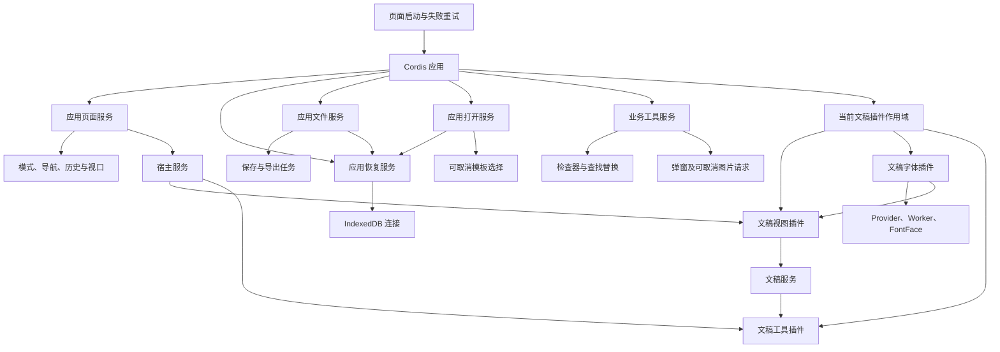

# 编辑器产品层的 Cordis 接入

原约定见[编辑技术方案](editing-design.md#3-总体架构)。产品实现位于 `packages/site`，无需另建一份 `apps/editor`。

| 层 | 职责 | 当前实现 |
|---|---|---|
| 产品启动入口 | 按需加载应用；初始化失败时提供重试入口，成功接管后移除启动监听 | `editor-page.ts` |
| 产品应用 | 同一 Cordis Context 注册页面和应用服务；按打开顺序替换文稿；协调退出与文件交付 | `editor-application.ts` |
| 应用页面插件 | 持有页面展示状态、宿主画布和对象列表、模式、导航、历史按钮、缩放及视口观察器；停止时冻结编辑，最终卸载归还 DOM | `editor-page-plugin.ts` / `editor-viewport.ts` |
| 应用打开插件 | 持有本地文件、拖放、新建及示例加载入口；统一取消过期解析、恢复和模板选择；卸载等待已进入宿主的任务 | `editor-open-plugin.ts` |
| 应用恢复插件 | 持有恢复偏好、待答选择、DOM 监听及 IndexedDB 连接；卸载时取消选择并关闭连接 | `editor-recovery-plugin.ts` / `editor-recovery.ts` |
| 应用文件插件 | 持有保存目标、保存/导出任务、按钮及快捷键监听；切换和退出等待已提交交付，退出关闭未提交导出选择 | `editor-files-plugin.ts` / `editor-file-actions.ts` |
| 应用业务工具插件 | 持有查找替换、格式刷、插入、对象/页面/图表检查器、批注、媒体和尺寸窗口；切换取消旧请求，卸载归还监听与 DOM | `editor-tools-plugin.ts` |
| 文稿视图插件 | 提供当前文稿服务，挂载编辑画布及对象列表 | `editor-document-plugins.ts` 的 `documentView` |
| 文稿字体插件 | 视图挂载前检查嵌入字体的编辑许可并应用；文稿独占按需 Provider、Worker、FontFace 和导出字体 URL；无嵌入字体时不启动字体模块 | `editor-fonts-plugin.ts` / `editor-document-fonts.ts` |
| 文稿工具插件 | 注入宿主与文稿服务，注册调节柄、多语言标签、无障碍、文字输入增强及编辑订阅 | 同文件的 `documentTools` |
| 文稿作用域 | 工具、视图、字体资源依次卸载，会话最后释放；部分初始化 / 挂载失败也清理 | 同文件的 `documentWorkspace` |
| 打开准备 | 解析、恢复、按需加载扩展；失败或过期时释放尚未接管的会话 | `editor-open.ts` |
| 发布包 | 解析、编辑语义、DOM 手势与框架薄适配 | 不引入 Cordis |

| 约束 | 验证方式 |
|---|---|
| 失败不留下半挂载的文稿 | 浏览器在对象列表 DOM 挂载处抛错，检查画布清空、编辑按钮禁用，随后重新打开 |
| 替换不重复触发命令 | 反复打开文稿后新增一页、撤销，观察页数与唯一画布/对象列表 |
| 过期打开不能覆盖后来的文稿 | 同一浏览器连续派发两次文件打开，检查最后文稿名称及页数 |
| 挂载中的取消也能清理 | 在旧对象列表挂载时派发新打开；检查旧画布卸载、工具观察器先释放，新文稿一次新增与撤销 |
| 恢复插件可独立卸载和重建 | Cordis 真实注册/卸载，检查悬挂选择取消、语言入口归还、旧回调失效、偏好保留和监听不重复；此项 DOM 测试不执行存储 IO |
| 恢复记录不随文稿切换丢失 | 真实 Chrome / IndexedDB 新增页、切换文稿、恢复及丢弃，检查记录与语言入口归还 |
| 关闭下次打开偏好不影响当前待写帧 | 在公开存储适配器边界延迟真实追加，分别切换/退出；新应用新连接恢复最后编辑，旧条件下已实测失败 |
| 文件任务结束前不释放旧会话 | 延迟真实 OPFS 写入，分别切换/退出；检查旧会话仍存活，释放后重开文件保留编辑 |
| 卸载不会取消已提交导出 | 延迟真实 Canvas 输出，退出时等待 PDF/ZIP 编码和一次下载；尚未点击导出的窗口则关闭并归还语言入口 |
| 卸载归还文件入口与句柄 | 重建应用后单次保存仅调用一次选择器；旧服务不再接收任务，快捷键不再拦截，保存目标不再保留 |
| 打开与新建共享取消语义 | 真实浏览器中新文件取代待选模板、归还语言入口；应用退出取消模板及待执行解析，重建后单次新建/文件打开只有一个会话 |
| 编辑行为保留 | 既有官网中英文、共享图表、复制、保存重开与工具栏回归 |
| 工具可卸载和重建 | 真实 Cordis 应用注册中途失败、重新创建两次，验证新增页与对象格式只执行一次，外观按钮不重复，查找及生成 DOM 全部归还 |
| 文稿切换取消未完成图片操作 | 在真实 Chrome 延迟图片读取，保留旧会话并重置/卸载工具；插入和替换均无命令提交，无取消错误提示；取消文件选择器并验证无 Bitmap API 的解码路径 |
| 迟到加载不能重新打开工具 | 点击媒体入口后立即退出，验证异步加载不会重新打开窗口；尺寸、外观与批注窗口随作用域关闭，语言入口立即归还 |
| 页面资源随应用释放 | 视口监听注册中抛错后观察器断开；真实应用连续重建，模式、翻页、缩放、撤销各执行一次，旧页面回调和动画不能污染新应用 |
| 导航重绘废弃旧拖放意图 | 保存真实 DataTransfer 后重绘列表；旧节点点击及旧拖放数据均不提交，新列表的合法拖放仍正常执行 |
| 文件交付期间停止编辑 | 延迟真实 OPFS 写入并退出；画布撤销/重做、面板删除和页面按钮均不能修改仍存活的会话；完成交付后文件可独立重开 |
| 保存期间视口继续同步 | 真实 SDK 触摸缩放及 ResizeObserver 在文件忙碌时更新外框与百分比，应用停止后不再更新 |
| 体积预算不放宽 | 沿用官网首屏依赖闭包预算，另检查首屏与首次激活应用的总闭包，防止模块位置变化掩盖增长 |
| 字体初始化可取消 | 源字体读取暂停时退出，终止等待且没有迟到视图；Provider、FontFace 与 Worker 均释放 |
| 字体工具随文稿释放 | 实际工具栏中英文缺字 / 许可原因、本机替换、重复检查保留替换选择，以及关闭与迟到模块不遗留弹窗 |

依赖固定为 npm 官方源的候选版本 `cordis@4.0.0-rc.9`；固定版本避免未来 API 变化随安装进入项目。仅私有 `site` 依赖它，核心包仍保持原依赖约束。

文稿、打开、新建、恢复、保存、导出、业务工具与页面服务已注册到同一 Cordis 应用。页面入口仅保留启动和失败重试，接管后立即释放启动监听。视口、导航、历史按钮及页面展示状态由页面插件持有，ResizeObserver、动画帧和动态导航监听随应用释放。

退出分为停止输入和释放资源：先关闭页面及 SDK 编辑入口、取消工具请求，再等待已提交文件任务和恢复队列，最后释放会话与应用。恢复开关只影响下次打开，不能越过当前待写帧。保存忙碌只限制新命令，当前画布的触摸缩放和尺寸变化仍须同步。

| 证据 | 状态 |
|---|---|
| `out/chart-shared/cordis-browser-v3.log` | 共享图表、复制、混合图及保存重开通过 |
| `out/chart-shared/cordis-lifecycle-during-mount.log` | 失败、重试、挂载中取消、工具先卸载、单次命令通过 |
| `out/chart-shared/cordis-full-gates.log` | 首轮四项仓库门禁通过；晚于该轮开始补充的用例与兼容写法由最终一轮复验 |
| `out/chart-shared/cordis-final-gates.log` | 文稿服务与生命周期接入的最终四项门禁全部通过 |
| 文稿生命周期双轴审查 | Standards 0 项；Spec 的挂载中取消验收缺口已补用例并复审关闭，剩余 0 项 |
| `out/chart-shared/cordis-recovery-shutdown-red.log` | 关闭偏好后切换越过待写帧，新增回归在修复前失败 |
| `out/chart-shared/cordis-recovery-shutdown-green.log` | 原生 IndexedDB 常规恢复，以及关闭偏好后的切换/退出排空与关闭重开通过 |
| `out/chart-shared/cordis-recovery-final-gates.log` | 恢复服务迁移后的 `check`、全量 `test`、`build`、`verify` 按顺序全部通过 |
| 恢复服务双轴审查 | 两轴共同发现的关闭偏好跳过当前写入问题已修复，红/绿回归及复审完成；剩余 0 项 |
| `out/chart-shared/cordis-files-lifecycle-v3.log` | 文稿生命周期回归，以及文件服务的 OPFS 交付、卸载监听、关闭未提交导出与等待已提交 PDF/ZIP 通过 |
| `out/chart-shared/cordis-files-final-gates.log` | 文件服务最终生产代码的 `check`、全量 `test`、`build` 按顺序通过；首次 `verify` 被旧审计的工厂位置假设阻止 |
| `out/chart-shared/cordis-files-final-verify.log` | 审计改为验证页面 → 应用 → 文件插件的实际接线，保留原按需与投影约束；完整 `verify` 重跑通过，此后未修改生产代码 |
| 文件服务双轴审查 | Standards 0 项；Spec 的挂载锁误拦新打开、退出取消已提交导出两项均修复，并经真实浏览器与复审关闭；剩余 0 项 |
| `out/chart-shared/cordis-open-red.log` / `cordis-open-green.log` | 新文件无法取消旧模板窗口的回归先失败、接入打开插件后通过 |
| `out/chart-shared/cordis-open-shutdown.log` | 真实 Cordis 应用退出取消模板、等待打开任务、归还语言入口，重建后新建与文件打开各触发一次 |
| `out/chart-shared/cordis-open-and-merge-final-gates.log` / `cordis-open-and-merge-final-verify.log` | 最终生产代码的 check、全量 test、build 通过；旧审计的模板入口位置检查改为验证页面 → 应用 → 打开插件接线后，完整 verify 通过 |
| 打开服务双轴审查 | 打开、新建、示例取消、卸载及启动重试未见遗留 P1/P2；当时尚未迁移的业务工具已由后续阶段补齐 |
| `out/chart-shared/cordis-tools-red.log` | 真实浏览器复现查找工具销毁后按钮仍执行命令 |
| `out/chart-shared/cordis-tools-lifecycle-v5.log` | 工具工厂失败回滚、应用重建、单次命令、弹窗释放及延迟图片取消通过；随后集中 SDK 提交边界及无 Bitmap 解码路径由完整门禁复验 |
| 业务工具双轴审查 | 原图片迟到写入问题已关闭；独立验证读取/解码后取消、选择器监听释放、旧任务不干扰新选择器及正常替换对照，未发现剩余 P1/P2 |
| `out/chart-shared/cordis-tools-first-gates.log` / `cordis-tools-objects.log` | 完整门禁发现 OLE 图片框架未触发检查器加载，修复后对象内部编辑专项通过 |
| `out/chart-shared/cordis-tools-final-gates.log` | 最终代码的 check、全量 test、build 按顺序通过；首次 verify 仅被旧审计要求页面保留未使用 opening 变量阻止 |
| `out/chart-shared/cordis-tools-final-verify.log` | 审计改为检查页面实际调用 Cordis 打开服务后，完整 verify 通过；其后生产中英文回归发现的图表选择校验由下一轮门禁复验 |
| `out/chart-shared/cordis-tools-production-i18n-v3.log` | 生产回归发现改选对象后旧图表模块加载失败覆盖状态；已补回当前选择身份校验 |
| `out/chart-shared/cordis-tools-bootstrap-red.log` / `cordis-tools-bootstrap-green.log` | 旧用例向已取消网络请求返回响应，被 CDP 拒绝；现验证本地打开和模板新建真实取消旧请求，保留新画布、状态及单次撤销，专项通过 |
| 生产回归补充审查 | 图表选择校验、保存分块定位、模板 DOM 释放及原生网络取消断言均完成只读复审，剩余 0 项 P1/P2 |
| `out/chart-shared/cordis-tools-production-static.log` / `cordis-tools-production-i18n-v6.log` | 生产静态页面检查及三张生产页面完整中英文工作流通过，包含图片取消、图表失败、模板释放、冷启动和文件交付 |
| `out/chart-shared/cordis-tools-production-final-gates.log` | 生产回归修复后的最终代码按顺序完成 check、全量 test、build、verify，四项全部通过 |
| `out/chart-shared/cordis-page-red.log` / `cordis-page-review-red.log` | 旧导航节点仍执行命令、真实拖放数据跨重绘继续提交的回归在修复前失败 |
| `out/chart-shared/cordis-page-review-green.log` | 类型检查与完整生命周期专项通过，包含页面工厂失败回滚、真实应用重建、保存期间触摸/尺寸同步、退出期间 SDK 编辑冻结及文件重开 |
| 页面服务双轴审查 | 保存期间视口失步、旧拖放数据和退出期间 SDK 编辑三个 P2 均经独立复测关闭；剩余 0 项 P1/P2 |
| `out/chart-shared/cordis-page-production-v2.log` | 页面迁移及三项修复后的生产静态页面与三张页面完整中英文工作流全部通过 |
| `out/chart-shared/cordis-page-final-gates.log` | check 与官网功能回归通过；全量 test 在浏览器 200 页复制性能 19.2ms 超过 16ms 预算处停止，固定计算环境自检同时超标 |
| `out/chart-shared/cordis-page-isolated-performance.log` | 生产代码和门限未变，独立运行全部浏览器性能契约通过；环境自检仍偏慢，保留该限制，不能据此抹去首次失败 |
| `out/chart-shared/cordis-page-final-gates-v2.log` | 最终代码按原预算重新顺序完成 check、全量 test、build、verify，四项全部通过；首次性能失败和隔离复测记录保留于上两行 |
| `out/chart-shared/legacy-expanded-final-gates.log` / `legacy-expanded-final-verify.log` | 打开服务在挂载前迁移旧图表覆盖；全量测试与构建通过，修正旧样本数字后完整 verify 通过；生产页面的层级缓存/横向散点真实 IndexedDB 恢复、中英文实改及保存重开通过 |
| `out/chart-shared/joint-final-gates.log` / `joint-final-verify.log` | 类别/XY 共同记录、部分范围与空保存重建接入既有 Cordis 产品流程；四项仓库门禁、三张生产页面完整中英文工作流通过，预算不变 |

共享图表依赖索引优化后的四项仓库门禁、既有 Cordis 生命周期和中英文操作回归均通过，记录为 `out/chart-shared/browser-cache-final-gates.log`；未恢复状态增量的四项门禁也已通过，见 `out/chart-shared/unresolved-final-gates-v2.log`。混合图实际绘制修复后的四项门禁也通过，见 `mixed-render-final-gates.log` 与 `mixed-render-final-verify.log`；当前激活体积来自 `out/chart-shared/mixed-render-cordis-size.json`。

| 当前依赖闭包 | 原始字节 | gzip 字节 | 预算（原始 / gzip） |
|---|---:|---:|---|
| 页面启动 | 16,253 | 5,255 | 2,254,902 / 509,849 |
| 首次激活额外加载的应用（含 Cordis） | 2,272,668 | 530,954 | 纳入下行总量 |
| 页面启动与首次激活合计 | 2,288,921 | 536,209 | 2,397,467 / 543,288 |

测量来自官网浏览器门禁的 `out/site-editor-browser/cordis-size.json`。页面状态及上游依赖移入应用，首屏减少不等于首次打开总成本消失。合计预算由原首屏预算加迁移前应用实测 142,565 / 33,439 B 得出，保留原有余量；不能只检查变小后的入口。
