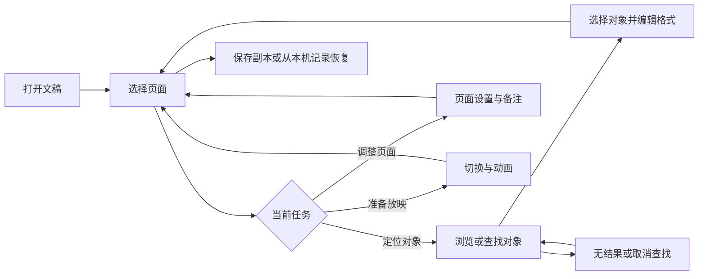

# 编辑器桌面排版优化

## 目标与验收

面向在桌面浏览器中编辑复杂幻灯片的用户。对象列表应能辨认和定位目标，属性设置应按当前任务直接找到；编辑、保存、恢复行为保持原有语义。

| 范围 | 行为与验收 |
|---|---|
| 对象列表 | 为通用来源名显示文字摘要或类型加序号，改名时仍编辑真实名称；支持查找、前后跳转、无结果提示及清空；折叠组合中的命中对象可以展开定位；页面切换后重新计算结果。 |
| 区域高度 | 对象列表和属性区的分界可拖动、可用键盘调整；两区均保留至少可操作的高度；窗口尺寸变化后仍可见。 |
| 属性导航 | 对象、页面、放映三个任务页签；选择对象后展示对象设置，无选择时页面设置可用；查找与替换仍可打开、关闭和返回原任务；恢复设置归入页面任务。 |
| 色彩 | 保存副本按钮在常态与悬停态的文字对比度达到 WCAG AA 的 4.5:1。 |
| 验证 | 在 1280×720、1440×900、1920×1080 实际页面检查布局；完成对象查找、重命名、分界调整、任务切换、页面切换、保存入口的浏览器验证；执行仓库规定的四项检查。 |

取消查找只清除查找状态，不更改对象选择。打开其他页面后查找词保留并对新页面重新查询；关闭文稿时清空查找。无文稿和空页面显示明确空状态。加载或写入失败沿用现有错误提示与恢复机制。
