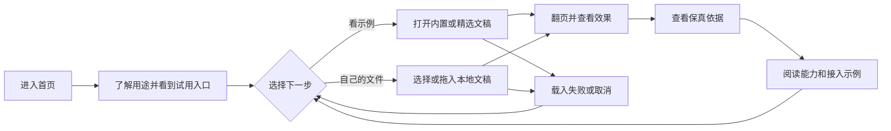

# 官网首页排版优化

## 目标与验收

面向初次了解 Web-PPT 的访问者：快速理解用途，打开内置或本地文稿验证效果，再查看保真依据和接入方式。官网覆盖桌面与手机；编辑器仍按桌面使用场景设计。

| 范围 | 行为与验收 |
|---|---|
| 首屏与内容顺序 | 桌面首屏显露试用区入口；保真与性能数据紧随实时 Demo，访客不必先经过能力矩阵和代码示例。 |
| 手机导航 | 390px 宽度可直接打开试用和编辑器，可通过目录访问其他章节；打开章节后目录收起，键盘可关闭；样本库同样保留关键入口。 |
| 内容宽度 | 320px、390px 与桌面宽度下没有整页横向滚动；代码和宽表只在自身区域横向滚动。 |
| 示例选择 | 内置文件仍可直接打开；首页仅展示两份不同风格的远程精选，其余从样本库进入；清单为空或加载失败时内置示例仍可用。 |
| 返回与恢复 | 章节锚点、浏览器返回和文件深链保持可用；取消、失败与重新选择文件沿用查看器现有反馈。 |
| 验证 | 检查中英文页面、窄屏导航和实际文稿渲染，执行类型检查、测试、构建和产物校验。 |

布局修改不改变文稿解析、默认打开页、下载或隐私行为。
