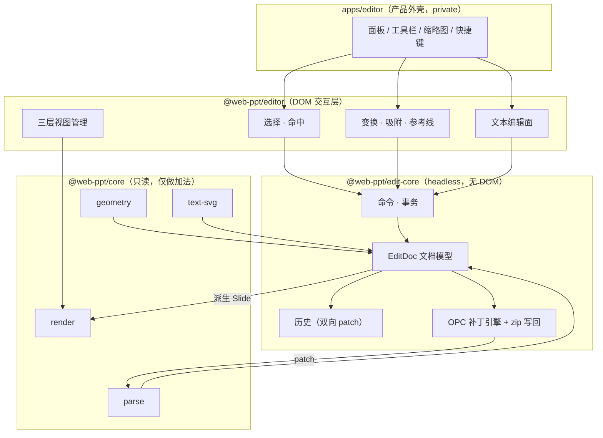
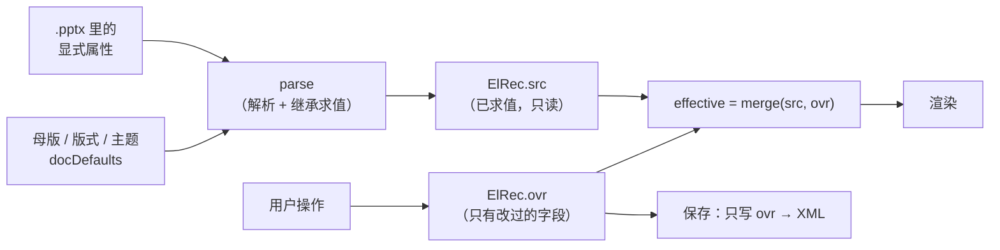
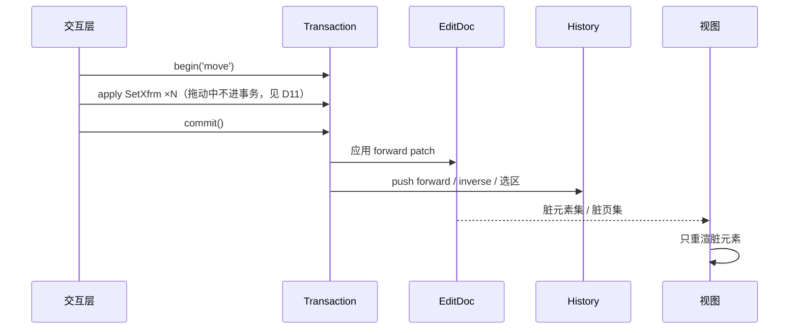
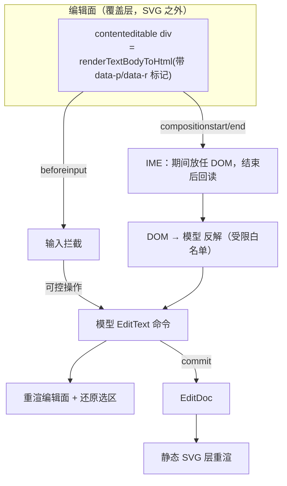
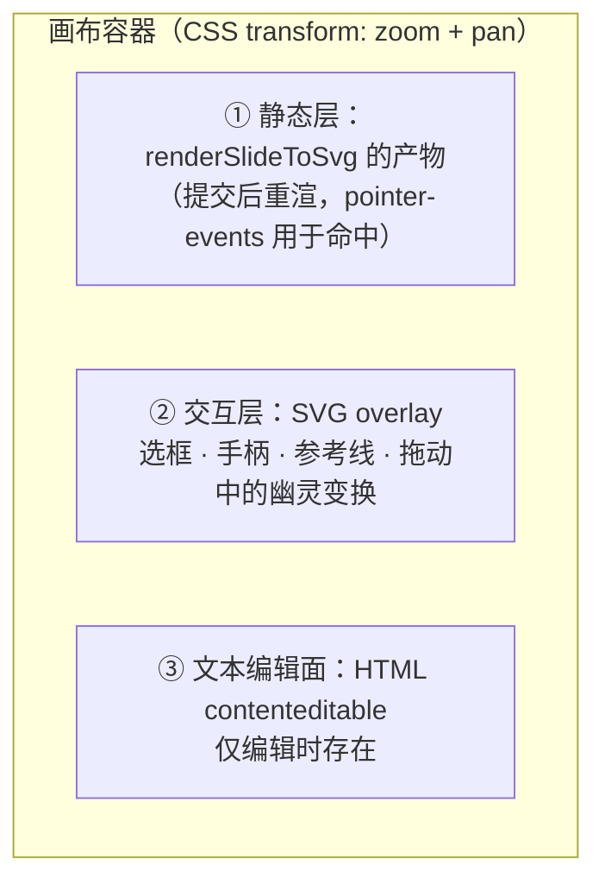
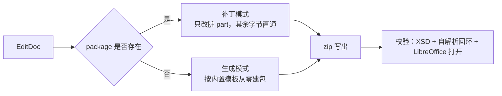

# 编辑能力技术方案

> 状态：设计稿，未开工。目标版本 v0.5 → v0.9。
> 前置阅读：[AGENTS.md](../AGENTS.md)（约束与陷阱）、[README.md](../README.md#架构)（分层）。

把只读渲染引擎变成编辑器，真正的难点不是"加个拖拽框"，而是三件事：

| 难点 | 一句话 |
|---|---|
| **模型是解析结果，不是文档** | 现在的 Schema 把几何烘成路径、把继承摊平成具体值——改宽高形状不会变，回写会把继承固化 |
| **保真的写回** | 用户改了一个标题，不能让 SmartArt / 图表 / OLE / 动画 / 母版跟着一起丢 |
| **文本编辑** | 光标、IME、断行、自动缩放，且必须与两条渲染路径的排版结果一致 |

本方案对这三件事分别给出解法，其余（选择、变换、吸附、历史、协同）按依赖顺序展开。

---

## 0. 决策摘要

| # | 决策 | 依据 | 代价 |
|---|---|---|---|
| D1 | 编辑模型 **另建 `EditDoc`**，不直接改 `Presentation` | `Presentation.slides` 惰性项是 `defineProperty` getter（[parser.ts:1485](../packages/core/src/pptx/parser.ts)），不能 clone；且 Schema 无身份、无 z 序、无"哪些是用户改的" | 多一层投影与缓存 |
| D2 | 每个元素分 **`src`（文件解析值）/ `ovr`（用户覆盖值）** 两层 | 只回写 `ovr` ⇒ 继承不被摊平、主题换色仍生效；这是 python-pptx「只动碰过的节点」在内存模型里的等价物 | 渲染前要 merge，多一次浅合并 |
| D3 | 保存走 **原包补丁（patch）**，不是重新生成 | 重新生成必然丢 Schema 未建模的一切（SmartArt / chartex / OLE / 宏 / 自定义 XML）。python-pptx / POI / docx4j 全是补丁模型 | 要自带一套保序、保注释的 XML 树 |
| D4 | 未改动的 zip 条目 **原始压缩流直通复制** | 一份 50MB 的稿子里 95% 是图片，重新 deflate 是纯浪费，且改变字节 = 无法验证"没碰过的部分真没碰" | 要自己读 zip 中央目录 |
| D5 | 几何 **不再烘死**：Schema 增补 `geom: { preset, adj }`，缩放时重算路径 | [parser.ts:587](../packages/core/src/pptx/parser.ts) 在解析期用 `xf.w/xf.h` 求值，[svg.ts:465](../packages/core/src/render/svg.ts) 原样使用 ⇒ 现在改 `w` 形状不会变 | 编辑模式下多存 preset 名 + adj 表（约 50B/形状），只读用户不付费 |
| D6 | 文本编辑走 **覆盖层 HTML contenteditable**，不在 `foreignObject` 里编辑 | WebKit bug 23113 不给 foreignObject 应用 SVG 缩放（AGENTS 已记录），在里面放光标必然错位 | 覆盖层要自己贴变换矩阵 |
| D7 | 覆盖层与预览 **共用同一份 HTML 生成代码** | 排版差一点点，提交瞬间文字就会跳 | core 要导出 `renderTextBodyToHtml` |
| D8 | 行盒来源可切换：`browser`（默认）/ `engine`（Safari、需与导出对齐时） | Safari 上静态层走 `<text>` 自实现断行，浏览器断行与它不一致 | 两套行盒实现，共用同一套光标映射 |
| D9 | 历史用 **双向 patch 栈**，不是全量快照 | 一页 11280 元素级别的文件快照太贵；patch 天然可序列化，将来直接喂协同层 | 每个命令必须能产出逆 patch，测试要守住 |
| D10 | 命中测试 **交给 SVG 原生 hit-test** | 浏览器免费给出"描边算不算命中""无填充不算内部命中"，与 PowerPoint 语义天然接近 | 框选另走几何计算 |
| D11 | 拖动期间 **不重渲染**，只改交互层的 CSS 变换，松手才提交 | 全局 `uid` 计数器让同页两次渲染产物不同（AGENTS 陷阱），拖动中重渲会不停重建 defs | 拖动中的视觉由交互层负责，需保证两者一致 |
| D12 | `.ppt` **只读**，编辑即"另存为 .pptx" | OfficeArt 二进制没有 DrawingML 的效果/3D 概念（README 已知限制），往回写只会更失真 | 用户可见的一次格式转换提示 |
| D13 | 协同做成 **可选适配包**，单机不引入任何 CRDT 依赖 | 取舍标准：能做成按需注入就等于零成本 | 模型要提前满足"扁平记录 + 字段级 LWW + 分数序" |
| D14 | 不可编辑对象（图表 / SmartArt / OLE / 墨迹）**只放开位置、尺寸、层级、删除** | 这些改动只落在 `p:graphicFrame/p:xfrm`，不触碰内部数据，零风险 | 双击不进入内部编辑，需明确提示 |

### 0.1 整体路线为什么是"在现有 SVG 引擎上长出编辑"

| 路线 | 代表 | 优势 | 为什么不选 |
|---|---|---|---|
| **A. 声明式静态层 + DOM 交互层**（本方案用 SVG） | PPTist（同思路，静态层是 DOM 元素） | 复用现成的 187 预设几何、两条文本路径、快照测试；文本天然可选中、可无障碍；命中测试白送 | — |
| B. Canvas 自绘全部内容 | OnlyOffice、Google Slides | 排版完全可控，跨浏览器一致 | 等于把已经写完并有 162 个快照护着的渲染层推倒重来；文本选中、无障碍、导出 SVG 全要重做。**收益只在"排版一致性"一项，而那一项可以用 §9.5 的 `engine` 行盒局部解决** |
| C. 服务端转换 | Collabora / LibreOffice Online | 保真度最高 | 与本项目的立身之本（零服务端、文件不出浏览器）直接冲突 |

---

## 1. 现状盘点

### 1.1 资产（编辑器可以直接吃到的）

| 资产 | 编辑器怎么用 |
|---|---|
| 统一 Schema + 187 个预设几何求值器（`src/geometry/`，零 import） | 形状库、调节手柄、缩放重算全部复用，不需要第二套几何 |
| 两条文本路径 + 自实现测量断行（`render/text-svg.ts`） | `engine` 行盒模式与自动缩放直接复用 `layout()` / `autoFitScale()` |
| `PresentationState` 是 headless 状态机 | 编辑器的"预览/演示"模式零成本复用 |
| `tooling/lib/ooxml.mjs` 已有最小 zip 写入器 + PNG 编码器 | 保存链路的 zip 写入部分是现成的，搬进包里即可 |
| 162 个渲染快照 + LibreOffice ground truth 对照 | 编辑后重渲的回归直接挂上去 |
| 固件全部脚本生成、字节确定性 | 编辑用例的输入可以精确构造，不靠手工样本 |

### 1.2 负债（必须先改的）

| # | 负债 | 证据 | 影响 | 解法 |
|---|---|---|---|---|
| L1 | 几何在解析期被烘成路径 | [parser.ts:587](../packages/core/src/pptx/parser.ts) `presetGeom(prst, xf.w, xf.h, adj)`；[svg.ts:465](../packages/core/src/render/svg.ts) `<path d="${el.path}">` 原样用 | 改 `w/h` 形状不变形，圆角矩形无法正确缩放 | D5：补 `geom` 字段 + `resolveGeomPath()` |
| L2 | 继承链被摊平 | `parseSp` 把 docDefaults → master → layout → 占位符 → 段落 → run 合成具体值 | 原样回写 = 把继承值固化，母版换字体不再生效 | D2：`src` / `ovr` 双层 |
| L3 | 身份与关系丢失 | 只留 `id`（`cNvPr@id`）与 `name`；`ph type/idx`、`r:embed`、`style` 引用全丢 | 无法定位回写节点，无法判断"这是标题占位符" | 编辑模式下补 `origin` 溯源信息 |
| L4 | 渲染是整页字符串 + 全局自增 `uid` | [svg.ts:11](../packages/core/src/render/svg.ts) `let uid = 0` | 同页两次渲染产物不同 ⇒ 不能 diff、不能增量 patch、快照无法比对编辑结果 | 加 `RenderOptions.idPrefix` + 每次渲染局部计数 |
| L5 | `dispose()` 清空原包 | [parser.ts:133](../packages/core/src/pptx/parser.ts) `this.files = {}` | 保存时原字节已经没了 | `parse(bytes, { keepPackage: true })` 保留句柄，由编辑器管生命周期 |
| L6 | 惰性 `slides` 是 getter 数组 | [parser.ts:1485](../packages/core/src/pptx/parser.ts) `Object.defineProperty` | `structuredClone` / 序列化不友好 | 建 `EditDoc` 时强制 `lazy: false` 或逐页取值固化 |
| L7 | Safari 不给 foreignObject 应用 SVG 缩放 | WebKit bug 23113（AGENTS 陷阱表） | 文本编辑面若放在 foreignObject 里，光标必然错位 | D6：覆盖层放在 SVG 之外 |
| L8 | `xml-lite` 丢注释与 PI | [xml-lite.ts:102](../packages/core/src/xml-lite.ts) 直接跳过 `<!--`，[:115](../packages/core/src/xml-lite.ts) 跳过 `<?`/`<!` | 拿它做写回会静默删掉 `mc:Ignorable` 之外的东西 | 写回自带保留型 XML 树（见 §11.2） |
| L9 | `.ppt` 无写路径 | `ppt/parser.ts` 单向 | 无法保存回 `.ppt` | D12：转存 `.pptx` |
| L10 | 文本行盒与字偏移未导出 | `layout()` / `wrap()` 是 `text-svg.ts` 内部函数 | `engine` 行盒模式与光标命中拿不到数据 | 导出 `layoutText()`，返回行盒 + 每字 x 偏移 |

---

## 2. 范围

| | 内容 |
|---|---|
| **目标** | 打开真实 `.pptx` → 编辑 → 保存回 `.pptx`，未编辑的部分字节级不变；纯前端、无服务端；单机优先，协同留接口 |
| **非目标（本方案内）** | `.ppt` 写回、图表数据编辑、SmartArt 内部编辑、宏、审阅批注工作流、真实三维、模板市场、AI 生成 |
| **明确后置** | 动画/切换编辑（M5）、顶点编辑（M6）、协同（M6）、表样式库（M6） |

---

## 3. 总体架构



| 包 | 名称 | 依赖 | 能否发布 | 约束 |
|---|---|---|---|---|
| `packages/edit-core` | `@web-ppt/edit-core` | `core` + fflate | ✅ | **不碰 `document`**（与 core 同规格，可在 Worker 里跑保存） |
| `packages/editor` | `@web-ppt/editor` | `core` + `edit-core` + `viewer-core` | ✅ | 只做 DOM 绑定与手势，不做业务决策 |
| `apps/editor` | private | 上面全部 | ❌ | 应用框架（Cordis 之类）只出现在这层 |

**对 core 的改动一律是加法**，四条不可破坏的约束原样成立：

| 约束 | 本方案是否仍成立 | 说明 |
|---|---|---|
| `render/` 只依赖 `types.ts` | ✅ | 新增字段仍在 `types.ts`；`resolveGeomPath` 放 `geometry/`（零 import） |
| 格式按魔数识别 | ✅ | 不动 |
| 两条文本路径不合并 | ✅ | 编辑覆盖层是第三条"输入面"，不参与出片 |
| core 不碰 `document` | ✅ | 新增导出全是纯函数；`edit-core` 同样不碰 |

---

## 4. 文档模型 `EditDoc`

### 4.1 为什么不复用 `Presentation`

| 需求 | `Presentation` 现状 |
|---|---|
| 稳定身份（撤销、协同、选区都要认人） | `id` 是 `cNvPr@id`，同 part 内唯一，组内子元素也有，跨页会重复 |
| z 序可插入 | 靠数组下标，插入是 O(n) 且协同下会打架 |
| 区分"文件给的"与"用户改的" | 无 |
| 回写定位 | 无 part 路径、无节点句柄 |
| 可克隆 | 惰性页是 getter（L6） |

### 4.2 结构

```ts
type ElId = string;      // 稳定唯一（会话内自增 + 会话前缀，协同下用 ULID）
type SlideId = string;
type FracIdx = string;   // 分数序字符串，见 §4.4

interface EditDoc {
  meta: { width: number; height: number; source: 'pptx' | 'ppt'; readonly: boolean };
  slides: Record<SlideId, SlideRec>;
  slideOrder: SlideId[];                 // 顺序即页序；协同模式下改用 FracIdx
  elements: Record<ElId, ElRec>;         // 扁平存放，含组内子元素
  package: OpcPackage | null;            // 原包句柄，null = 从零新建
}

interface SlideRec {
  id: SlideId;
  src: { background: Fill | null; notes?: string; hidden?: boolean; layoutName?: string;
         transition?: Transition; animations?: AnimStep[]; comments?: SlideComment[] };
  ovr: Partial<SlideRec['src']>;
  children: ElId[];                      // 直接子元素，按 z 序
  origin: { part: string } | null;       // 'ppt/slides/slide3.xml'
}

interface ElRec {
  id: ElId;
  parent: SlideId | ElId;                // 组内元素 parent 指向组
  z: FracIdx;
  /** 解析得到的原始值，来自文件；除"重新求值的派生字段"外只读 */
  src: SlideElement;
  /** 用户覆盖值，深度按字段路径展开；**保存时只写这里** */
  ovr: Overrides;
  /** 编辑元数据，仅 parse({ edit: true }) 时产出 */
  meta: {
    geom?: GeomSpec;                     // D5：preset + adj，或 custGeom 源
    ph?: { type: string; idx?: string };  // 占位符身份
    origin?: { part: string; spid: number };  // 回写锚点
    locked?: boolean; hiddenByUser?: boolean;
    editable: 'full' | 'frame' | 'none'; // frame = 只能动位置/尺寸（图表、SmartArt…）
  };
}

/** 只存"用户改过的字段"，保存时它就是要写进 XML 的全部内容 */
type Overrides =
  & Partial<ElementBase>                                                    // x/y/w/h/rot/flip/effects/link/name…
  & Partial<Pick<ShapeElement, 'fill' | 'stroke' | 'openGeom'>>
  & Partial<Pick<ImageElement, 'src' | 'crop' | 'alpha' | 'filter'>>
  & { text?: TextOverrides };                                               // 文本单独建模，见 §9.3
```

### 4.3 `src` / `ovr` 双层：为什么值得



| 好处 | 说明 |
|---|---|
| 不摊平继承 | 用户没改的字体、颜色、字号在文件里仍然是"继承"，换母版依旧生效 |
| 保存补丁天然最小 | `ovr` 就是要写的 diff，不需要和文件做结构比对 |
| "重置为默认"是删除操作 | `delete ovr.fill` 即可回到继承态，不需要反查母版 |
| 脏页判定免费 | `ovr` 非空 ⇒ 该 part 脏 |

**注意**：`src` 里有一部分是**派生字段**（`path` 由 `geom + w/h` 求得，文本 `fontScale` 由 autofit 求得）。这些字段不参与 merge，而是在 `effective()` 里按当前几何/文本重算：

```ts
function effective(el: ElRec): SlideElement {
  const base = { ...el.src, ...el.ovr } as SlideElement;
  if (base.kind === 'shape' && el.meta.geom) {
    const g = resolveGeomPath(el.meta.geom, base.w, base.h);  // core 新增导出
    base.path = g.d; base.openGeom = g.open || undefined;
  }
  return base;
}
```

### 4.4 z 序：分数序字符串

页内 z 序与页序都用**分数索引**（Excalidraw 2024 起用同一套做法解决多人协同下的顺序冲突）。

| 操作 | 复杂度 | 说明 |
|---|---|---|
| 置于顶层 / 底层 | O(1) | 取 max/min 相邻生成 |
| 上移 / 下移一层 | O(1) | 在相邻两项之间生成 |
| 拖到任意位置 | O(1) | 同上 |
| 并发插入同一位置 | 无冲突 | 两个客户端生成不同串，排序稳定 |

单机模式下也用它——成本只是"数组下标换成字符串比较"，换来协同时零改造。

### 4.5 渲染投影与缓存

```
EditDoc --toSlide(slideId)--> Slide（现有 Schema） --renderSlideToSvg--> SVG
```

| 缓存层 | 失效条件 |
|---|---|
| `effective(el)` | 该元素 `ovr` 变化 |
| `toSlide(slideId)` | 该页任一子元素、页属性、children 顺序变化 |
| SVG 字符串 | 同上；缩略图额外按 zoom 档位缓存 |

失效由命令层广播的 patch 路径驱动（`elements.<id>.ovr.fill` → 脏元素集 + 脏页集），不做全量比对。

---

## 5. 能力清单与命令层

### 5.1 命令模型



规则：

| 规则 | 内容 |
|---|---|
| 命令是纯数据 | `{ type, ...args }`，可 JSON 序列化（协同、录制回放、崩溃恢复都要） |
| 命令产出 patch | `apply(doc, cmd) → { forward: Patch[], inverse: Patch[] }`；**逆 patch 由命令自己给**，不靠通用 diff |
| 事务原子 | 校验失败整体回滚；一次用户操作 = 一个事务 = 一个撤销单元 |
| 校验在事务边界 | 不变量（§14.2）在 commit 前跑，失败抛出并回滚 |
| 拖动不进事务 | 见 D11，拖动中只改交互层；`commit` 时才产出一个 `SetXfrm` |

### 5.2 能力矩阵

优先级：**P0** = 首个可用版本；**P1** = 完整版；**P2** = 后置。
"落点"列给的是 `.pptx` 的写回位置，详见 §11.3。

#### 幻灯片级

| 能力 | 命令 | 落点 | 参考 | P |
|---|---|---|---|---|
| 新建页 | `AddSlide{ layoutId, at }` | 新建 `ppt/slides/slideN.xml` + rels + Content_Types Override + `p:sldIdLst` | python-pptx `slides.add_slide` | P0 |
| 删除页 | `RemoveSlide{ id }` | 删 `p:sldId` + presentation rels + part + notesSlide + 修 `p14:sectionLst` | python-pptx 长期缺此能力，注意别照抄它的坑 | P0 |
| 复制页 | `DuplicateSlide{ id }` | 深拷贝 part + 重建 rels（媒体 rel 指向同一资源，不复制字节） | — | P1 |
| 重排页 | `MoveSlide{ id, at }` | 重排 `p:sldId` 顺序，`r:id` 不动 | — | P0 |
| 换版式 | `SetLayout{ id, layoutId }` | 换 slide rels 里的 slideLayout 关系目标 | — | P1 |
| 背景 | `SetBackground{ id, fill }` | `p:cSld/p:bg/p:bgPr` | — | P1 |
| 备注 | `SetNotes{ id, text }` | notesSlide part 的 body 占位符 `a:txBody`；无 part 则新建 | — | P1 |
| 隐藏页 | `SetHidden{ id, v }` | `p:sld@show="0"` | 已有解析 | P1 |
| 节 | `AddSection` / `RenameSection` / `MoveSection` | `p:extLst/p14:sectionLst` | 已有解析 | P2 |
| 页面尺寸 | `SetSlideSize{ w, h }` | `p:sldSz`；**不做元素等比重排**（PowerPoint 会问"最大化/确保适合"，v1 只做前者） | — | P2 |

#### 元素通用

| 能力 | 命令 | 落点 | 交互要点 | P |
|---|---|---|---|---|
| 移动 | `SetXfrm{ id, x, y }` | `a:xfrm/a:off` | 方向键 1px、Shift+方向键 10px；吸附见 §8.3 | P0 |
| 缩放 | `SetXfrm{ id, x,y,w,h }` | `a:off` + `a:ext` | 8 手柄；Shift 等比；Alt 从中心；旋转下的数学见 §8.2 | P0 |
| 旋转 | `SetXfrm{ id, rot }` | `a:xfrm@rot`（1/60000 度） | Shift 吸附 15°；手柄在上方 | P0 |
| 翻转 | `SetFlip{ id, h, v }` | `@flipH` / `@flipV` | — | P1 |
| 删除 | `RemoveElement{ id }` | 删对应 `p:sp` / `p:pic` / `p:graphicFrame`；**不删媒体字节**（可能被复用） | 占位符删除应只清内容不删节点（PowerPoint 语义） | P0 |
| 复制/粘贴 | `PasteElements{ payload, at }` | 新建节点 + 新 spid + 媒体去重 | 剪贴板载荷用自有 JSON + `text/plain` 双写；跨实例可用 | P0 |
| 层级 | `SetZ{ id, to }` | 重排 `p:spTree` 子节点顺序 | 置顶/置底/上移/下移 | P0 |
| 组合/解组 | `Group{ ids }` / `Ungroup{ id }` | 新建 `p:grpSp` + 计算 `a:chOff/a:chExt` | 见 §8.5 | P1 |
| 进组编辑 | — | 无 | 双击进组，Esc 退一层 | P1 |
| 对齐 | `AlignElements{ ids, edge }` | 批量 `a:off` | 6 种；单选时对齐到画布 | P0 |
| 分布 | `DistributeElements{ ids, axis }` | 批量 `a:off` | 需 ≥3 个 | P1 |
| 锁定 | `SetLocked{ id, v }` | `p:cNvSpPr/a:spLocks`（或仅编辑器态，见注） | 锁定后不可选中变换 | P1 |
| 命名 | `SetName{ id, name }` | `p:cNvPr@name` | 选择窗格用 | P2 |
| 替代文字 | `SetAltText{ id, title, descr }` | `p:cNvPr@descr` / `@title` | 无障碍 | P2 |
| 超链接 | `SetLink{ id, target }` | `a:hlinkClick` + rels（外链 `TargetMode="External"`） | 内链写 `action="ppaction://hlinksldjump"` | P1 |
| 格式刷 | `ApplyFormat{ from, to, mask }` | 按掩码复制 `ovr` 子集 | 双击可连续刷 | P2 |

> **锁定的落点**：`a:spLocks` 语义是"锁定某类操作"而非 PowerPoint UI 里的"锁定对象"（后者是 2021+ 的 `p:cNvSpPr` 扩展）。v1 只做编辑器内状态，不写文件，避免造出别的软件读不懂的锁。

#### 形状

| 能力 | 命令 | 落点 | 依据 | P |
|---|---|---|---|---|
| 插入预设形状 | `AddShape{ preset, rect }` | 新 `p:sp` + `a:prstGeom` | 187 个预设已全量支持，形状库直接由 `geometry/` 驱动 | P0 |
| 改形状类型 | `SetPreset{ id, preset }` | `a:prstGeom@prst` + 重置 `avLst` | 保留填充/描边/文本 | P1 |
| 调节手柄 | `SetAdj{ id, name, v }` | `a:avLst/a:gd@fmla="val N"` | 预设求值器本就吃 `Adj`，手柄位置可从 `gd` 反推 | P1 |
| 填充 | `SetFill{ id, fill }` | `a:solidFill` / `a:gradFill` / `a:blipFill` / `a:pattFill` / `a:noFill` | 写时必须**先删同组其它 fill 元素**，且插在 geometry 之后（§11.4） | P0 |
| 描边 | `SetStroke{ id, stroke }` | `a:ln`（`w` = 1/12700 磅，`a:prstDash`、`a:headEnd/a:tailEnd`） | — | P0 |
| 效果 | `SetEffects{ id, effects }` | `a:effectLst`（`a:outerShdw` / `a:innerShdw` / `a:glow` / `a:softEdge` / `a:reflection`） | 解析侧已全支持 | P1 |
| 3D | `SetScene3D` | `a:scene3d` + `a:sp3d` | 渲染是等轴测近似，编辑面板只暴露挤出/斜角 | P2 |
| 顶点编辑 | `SetCustGeom{ id, geom }` | 生成 `a:custGeom/a:pathLst` | 需要贝塞尔手柄 UI，工作量独立成模块 | P2 |

#### 文本（详见 §9）

| 能力 | 命令 | 落点 | P |
|---|---|---|---|
| 输入 / 删除 / 分段 | `EditText{ id, ops[] }` | `a:txBody` 的 `a:p` / `a:r` 列表 | P0 |
| 字体 / 字号 / 粗斜下删 | `SetRunProps{ id, range, props }` | `a:rPr@sz/@b/@i/@u/@strike` + `a:latin/a:ea/a:cs` | P0 |
| 颜色 / 高亮 / 字距 / 大小写 | 同上 | `a:solidFill`、`a:highlight`、`@spc`、`@cap` | P1 |
| 上下标 | 同上 | `a:rPr@baseline` | P1 |
| 段落对齐 / 行距 / 段前后 / 缩进 | `SetParaProps{ id, range, props }` | `a:pPr@algn/@marL/@indent` + `a:lnSpc/a:spcBef/a:spcAft` | P0 |
| 项目符号（字符 / 编号 / 图片 / 无） | 同上 | `a:buChar` / `a:buAutoNum` / `a:buBlip` / `a:buNone` + `a:buFont/a:buClr/a:buSzPct` | P1 |
| 竖排 / 分栏 / 自动缩放 / 内边距 / 锚点 | `SetBodyProps{ id, props }` | `a:bodyPr@vert/@numCol/@spcCol/@anchor/@lIns…` + `a:normAutofit` | P1 |
| run 级超链接 | `SetRunProps` | `a:rPr/a:hlinkClick` + rels | P1 |
| 清除格式 | `ClearFormat{ id, range }` | 删 `a:rPr` 上的对应属性（回到继承） | P1 |
| 查找替换 | `ReplaceText{ scope, from, to }` | 批量 `EditText` | P2 |

#### 图片 / 表格 / 其它

| 能力 | 命令 | 落点 | 说明 | P |
|---|---|---|---|---|
| 插入图片 | `AddImage{ bytes, mime, rect }` | 新 `ppt/media/imageN.ext` + rel + Content_Types Default + `p:pic` | 按内容哈希去重 | P0 |
| 裁剪 | `SetCrop{ id, l,t,r,b }` | `a:srcRect`（1/1000 %） | 裁剪手势 = 双矩形拖拽 | P1 |
| 裁进形状 | `SetPictureGeom{ id, preset }` | `p:pic/p:spPr/a:prstGeom` | 解析侧已支持 `clipPath` | P1 |
| 替换图片 | `ReplaceImage{ id, bytes }` | 换 `a:blip@r:embed` 指向的 rel | 保留裁剪比例 | P1 |
| 透明度 / 滤镜 | `SetPictureFx` | `a:alphaModFix`、`a:grayscl`、`a:duotone` | — | P2 |
| 插入表格 | `AddTable{ rows, cols, rect }` | `p:graphicFrame` + `a:tbl` | — | P1 |
| 行列增删 | `InsertRow/Col`、`RemoveRow/Col` | `a:tr` / `a:gridCol` | 需同步 `rowSpan/gridSpan` | P1 |
| 合并 / 拆分 | `MergeCells` / `SplitCell` | `a:tc@gridSpan/@rowSpan` + `@hMerge/@vMerge` | 解析侧已有合并语义 | P1 |
| 单元格样式 | `SetCellProps` | `a:tcPr`（填充、边框 `a:lnL/R/T/B`、`@anchor`、`@marL…`） | 注意 AGENTS 记过的边框标签坑 | P1 |
| 列宽行高拖拽 | `SetColWidth` / `SetRowHeight` | `a:gridCol@w` / `a:tr@h` | — | P1 |
| 图表 / SmartArt / OLE / 墨迹 / 媒体 | 仅 `SetXfrm` / `SetZ` / `RemoveElement` | `p:graphicFrame/p:xfrm` | `editable: 'frame'`，双击提示不可编辑 | P0 |
| 切换效果 | `SetTransition{ slideId, t }` | `p:transition` / `p14:` / `p159:morph` | 解析侧已全支持 40 种 | P2 |
| 元素动画 | `SetAnimations{ slideId, steps }` | `p:timing` 时间树 | 时间树写回复杂度高，独立里程碑 | P2 |

### 5.3 占位符语义（最容易做错的一类元素）

占位符（`p:ph`）不是普通形状：它的几何、样式、提示文字全部来自版式与母版，PowerPoint 对它有一套特殊行为。编辑器必须照抄，否则用户会觉得"这个框有鬼"。

| 行为 | PowerPoint 语义 | 我们的做法 |
|---|---|---|
| 空占位符的显示 | 显示提示文字（"单击此处添加标题"），演示与导出时不显示 | 只在编辑器交互层画提示，不进 Schema、不进静态层 |
| 删除内容 | `Delete` 清空文字后，框仍在（回到提示态） | `EditText` 清空，不删节点 |
| 删除框 | 再按一次 `Delete` 才删掉 `p:sp` | 两段式，与 PowerPoint 一致 |
| 移动/缩放 | 允许；一旦改过就在 `p:spPr` 里写出显式 `a:xfrm`，不再继承版式 | 写 `ovr.x/y/w/h` ⇒ 保存时自然生成 `a:xfrm`（解析侧已支持"占位符空 spPr 继承几何"，见 `sample-placeholder.pptx`） |
| 重设 | "重设幻灯片"= 丢弃全部显式覆盖 | `delete ovr` 即可，这正是 §4.3 双层模型的免费红利 |
| 新建页 | 从版式克隆占位符（保留 `type`/`idx`，**不复制版式里的示例文字**） | `AddSlide` 按版式的 `p:spTree` 生成占位符骨架：`p:nvSpPr`（含 `p:ph`）+ 空 `p:spPr` + 空 `a:txBody` |
| 编号与页脚域 | `slidenum`/`datetime`/`ftr` 是域，不是普通文字 | 不可编辑内容，只可改格式与显隐 |

---

## 6. 历史（撤销 / 重做）

### 6.1 选型

| 方案 | 内存 | 实现成本 | 协同友好 | 结论 |
|---|---|---|---|---|
| 全量快照 | 高（PPTist 因此把快照放进 IndexedDB） | 最低 | 差 | ❌ 210 页文件不可接受 |
| 逆命令栈 | 低 | 中（每个命令写逆命令） | 中 | ⭕ |
| **双向 patch 栈** | 低 | 中 | **好**（patch 可直接映射到协同操作） | ✅ 选它 |

每条历史记录：

```ts
interface HistoryEntry {
  forward: Patch[];    // { path, op: 'set' | 'del' | 'insert' | 'remove', value }
  inverse: Patch[];
  selBefore: Selection; selAfter: Selection;   // 撤销要还原选区，否则用户找不到自己改了啥
  label: string; time: number;
}
```

### 6.2 分组规则

| 规则 | 值 | 依据 |
|---|---|---|
| 时间间隔超过阈值另起一组 | **500ms** | ProseMirror `history` 的 `newGroupDelay` 默认 500ms；Yjs `UndoManager` 的 `captureTimeout` 同样默认 500ms——两个成熟实现独立收敛到同一个数 |
| 不相邻的改动一律另起一组 | — | 同 ProseMirror：改动区间不相邻就不合并 |
| 连续输入合并 | 同段落、同方向、无格式变化 | 与编辑器通行做法一致 |
| 拖动 / 缩放 / 旋转 | 一次手势 = 一组 | 由 `pointerup` 关帧 |
| 面板改属性 | 一次改动 = 一组，同属性 500ms 内合并（如颜色拾取器拖动） | — |
| 跨页操作 | 不与其它组合并，撤销时自动跳回该页 | 否则用户看不到撤销结果 |

### 6.3 边界

| 项 | 决策 |
|---|---|
| 栈深度 | 默认 200 组，超出丢最旧；patch 体积超过 8MB 时提前丢 |
| 不可撤销操作 | 保存、导出、切换页（选区变更单独记录，不占撤销位） |
| 崩溃恢复 | 每次事务把 `forward` 追加进 IndexedDB 的会话日志；重开时回放（PPTist 用 IndexedDB 存快照，我们存 patch，量小得多） |
| 协同下的撤销 | 只撤自己的操作：patch 带 `origin`，撤销栈只收本地 origin（Yjs `trackedOrigins` 的同款做法） |

---

## 7. 选择与命中

### 7.1 命中策略

| 场景 | 做法 | 依据 |
|---|---|---|
| 点选 | 直接用浏览器对已渲染 SVG 的命中（`pointerdown.target` 向上找 `[data-el]`） | 描边命中、`fill="none"` 不算内部命中，浏览器免费给出，且与 PowerPoint 语义接近（无填充形状只能点边框或文字） |
| 文本框空白区 | 给无填充但**有文本**的形状铺一层 `fill="transparent"` 的命中矩形 | PowerPoint 里文本框整个区域可选 |
| 框选 | 几何计算：元素 OBB 与框**完全包含**才命中 | PowerPoint 的橡皮筋要求完全框住；Figma 是相交，二者不同，按 PowerPoint 走 |
| 组 | 默认命中最外层组；双击进组，Esc 逐层退出 | PowerPoint / Figma 一致 |
| 被遮挡元素 | Alt+点击穿透到下一层 | Figma 的 `Cmd+点击`、PowerPoint 的选择窗格；用 Alt 避开系统占用 |
| 锁定 / 隐藏 | 命中直接跳过 | — |

**为什么不自己做点在路径内判定**：`Path2D.isPointInPath` 需要 2D 上下文，而 AGENTS 已记录"Node / jsdom / 反指纹浏览器里 `getContext('2d')` 恒为 null"。让浏览器 hit-test 兜住主路径，纯几何只用于框选（矩形 ∩ OBB，纯数学，可在 Node 里测）。

### 7.2 坐标系

三套坐标，换算必须集中在一处（`editor/src/space.ts`）：

```
屏幕 px --(1/zoom, 减画布原点)--> 幻灯片 px --(组链逆变换)--> 元素本地 px
```

组内元素的世界变换（与 [svg.ts:570](../packages/core/src/render/svg.ts) 的渲染变换严格对偶）：

```
W(child) = T(gx,gy) · R(grot) · F(gflipH,gflipV) · S(sx,sy) · T(-chX,-chY) · L(child)
其中 sx = g.w / g.chW，sy = g.h / g.chH
```

> **一个好消息**：Schema 里组内子元素的坐标就是 OOXML `a:off` 的原值（÷9525），[parser.ts](../packages/core/src/pptx/parser.ts) 的 `parseGroup` 只把 `chOff/chExt` 存成 `childX/childY/scaleX/scaleY`，没有把子坐标搬到世界系。所以**组内移动的写回不需要反算**，直接写子空间坐标即可。

### 7.3 选区模型

```ts
type Selection =
  | { kind: 'none' }
  | { kind: 'elements'; ids: ElId[]; enteredGroup: ElId | null }
  | { kind: 'text'; id: ElId; anchor: TextPos; focus: TextPos }   // TextPos = { p, r, off }
  | { kind: 'table'; id: ElId; cells: { r: number; c: number }[] };
```

多选包围盒：取各元素 OBB 的世界系 AABB 并集；多选时**不显示旋转手柄的角度值**，旋转以包围盒中心为轴（PowerPoint 同）。

---

## 8. 变换

### 8.1 手柄

| 手柄 | 行为 | 修饰键 |
|---|---|---|
| 4 角 | 双向缩放 | Shift 等比、Alt 从中心、Shift+Alt 两者 |
| 4 边中点 | 单向缩放 | Alt 从中心 |
| 顶部旋转柄 | 旋转 | Shift 吸附 15°；显示实时角度 |
| 黄色调节柄 | 改 `adj` | 沿预设定义的方向约束 |
| 裁剪柄（图片） | 改 `srcRect` | 双击图片进入 |
| 线端点 | 改两端坐标 | 连接线专用（P2） |

手柄尺寸恒定为屏幕 px（不随 zoom 变），命中范围比视觉大 4px。

### 8.2 旋转下的缩放

朴素做法（直接改 x/y/w/h）在有旋转时会让形状"滑走"，因为旋转中心随尺寸变。正确做法是在**本地未旋转系**里算，再修正中心：

```
1. 世界指针 p → 本地系：q = R(-rot) · (p - c)，c 为当前中心
2. 取对角锚点在本地系的位置 a（不动点）
3. 由 q、a 求新的 w'、h'（Shift 时按原宽高比夹取；Alt 时 a = 原中心）
4. 本地新中心 c'_local = (a + q) / 2
5. 世界新中心 c' = c + R(rot) · (c'_local - c_local)
6. 由 c'、w'、h' 反解 x = c'.x - w'/2，y = c'.y - h'/2
```

负宽高（拖过头翻面）转成 `flipH/flipV` + 正尺寸，与 PowerPoint 行为一致。

### 8.3 吸附与智能参考线

| 项 | 取值 | 说明 |
|---|---|---|
| 吸附阈值 | 屏幕 **6px**，换算成幻灯片单位需 `/zoom` | 阈值必须定义在屏幕空间，否则缩放后手感突变 |
| 候选目标 | 同页其它元素的 6 条线（左/中/右/上/中/下）+ 画布 4 边与两条中线 + 页边距 | — |
| 等距分布提示 | 相邻间距相等时画双向箭头 | Figma / Excalidraw 都有，用户预期已被养成 |
| 优先级 | 画布中线 > 元素边 > 元素中线 > 等距 | 冲突时只吸一条轴上的一个目标 |
| 关闭 | 按住 **Ctrl** 临时关闭；设置里可全局关 | — |
| 性能 | 线性扫描同页元素（实测语料 ≈ 54 元素/页），不建空间索引 | 210 页 11280 元素来自 README 性能基准 |
| 组内 | 只与同组兄弟吸附 | 与 PowerPoint 一致 |

参考线绘制在**交互层**，不进 SVG 静态层。

### 8.4 调节手柄（adj）

`geometry/index.ts` 的每个预设都用命名 guide（`adj`、`adj1`…）驱动。手柄方案：

| 步骤 | 做法 |
|---|---|
| 手柄位置 | 预设表额外声明每个 `adj` 的**取值域与几何映射**（如 `roundRect.adj` → 左上角沿上边的偏移 = `min(w,h)*adj/100000`）。这张表随预设表一起维护，零运行时代价 |
| 拖动 | 逆映射：指针本地坐标 → adj 值 → 夹到取值域 |
| 未声明映射的预设 | 不给手柄，只在属性面板给数值输入框（保证 187 个预设全部可调） |

### 8.5 组合 / 解组

| 操作 | 数学 |
|---|---|
| 组合 | 新组 `off/ext` = 成员世界 AABB；`chOff = off`、`chExt = ext`（缩放 1:1）；成员坐标由世界系换算进子空间 |
| 解组 | 成员坐标 × 组缩放 + 组偏移，回到父空间；组自身的 `rot/flip` 需要**烘进成员**（成员各自加上组旋转；有非等比缩放 + 旋转时无法精确表达，退化为按视觉包围盒近似并给出提示） |
| 组内缩放 | 只改组的 `ext`（子空间不动）⇒ 子元素跟着缩放，这正是 OOXML 的语义 |

---

## 9. 文本编辑

### 9.1 方案对比

| 方案 | IME | 排版一致性 | 跨浏览器 | 成本 | 结论 |
|---|---|---|---|---|---|
| A. `foreignObject` 内 `contenteditable` | ✅ 免费 | ✅ 与预览同源 | ❌ **Safari 光标必错位**（WebKit 23113，AGENTS 已记录） | 低 | ❌ |
| B. **SVG 之外的覆盖层 `contenteditable`**（与预览共用同一份 HTML/CSS，用 CSS 变换贴到形状上） | ✅ 免费 | ✅ 同源代码 | ✅ CSS 变换 Safari 正常 | 中 | ✅ **选它** |
| C. 自绘光标 + 隐藏输入框 | ⚠️ 要自己处理组词（Monaco / CodeMirror 走的这条路） | ✅ 完全可控 | ✅ | 高 | 作为 B 的行盒模式复用其排版，不单独实现输入 |
| D. `EditContext` API | ✅ 官方为此设计 | ✅ | ❌ **仅 Chromium**，Firefox/Safari 均未实现 | 中 | 渐进增强：能力探测到就用，拿它替掉 B 的 `beforeinput` 分支 |

### 9.2 架构



| 组件 | 职责 |
|---|---|
| 编辑面 | 唯一的可见文本（编辑期间原元素的文本在静态层被隐藏），带 `data-p="段"`、`data-r="段.run"` 标记 |
| 输入拦截 | `beforeinput` 覆盖常见操作，`preventDefault` 后走模型；覆盖不到的（拖放、拼写更正）放行后走反解 |
| IME | `compositionstart` → 冻结模型更新；`compositionend` → 回读该段 DOM 反解成 runs。**组词期间绝不重渲**，否则组词被打断（Word Online 就因此在组词期间不更新视图） |
| 反解 | 白名单：`<span data-r>`、`<br>`、`<div data-p>`、`<a>`；未知节点按纯文本吃掉，格式从最近的 `data-r` 继承 |

### 9.3 模型侧的文本表示

`Paragraph[] / TextRun[]` 直接编辑会很痛（每次输入都要切分/合并 run）。编辑期改用**扁平文本 + 格式区间**：

```ts
interface TextOverrides {
  paras: { text: string; pPr: Partial<ParaProps>; marks: Mark[] }[];
}
interface Mark { from: number; to: number; props: Partial<RunProps> }   // 半开区间
```

| 好处 | 说明 |
|---|---|
| 插入删除只动字符串与区间端点 | 不需要 run 分裂/合并的特判 |
| 格式套用 = 区间运算 | 与 Quill Delta / ProseMirror mark 同构 |
| 光标位置就是字符下标 | 映射简单，撤销时定位准 |
| 写回时才归一成 run | 相邻同格式合并，输出干净的 `a:r` 序列 |

`math` 非空的 run 是**不可分原子**：在扁平串里占一个 ``（对象替换符），光标只能停在它两侧，删除即整体删除。`warp`（艺术字变形）与 `vert270` 同理降级——可改文字内容，不可在变形态下精确定位光标（编辑时临时按未变形排版，提交后恢复）。

### 9.4 `beforeinput` 处理表

| `inputType` | 处理 |
|---|---|
| `insertText` | 拦截 → `EditText{ insert }` |
| `insertParagraph` | 拦截 → 分段（继承当前段 `pPr`，项目符号自动延续） |
| `insertLineBreak` (Shift+Enter) | 拦截 → 插 `\n`（OOXML 的 `a:br`） |
| `deleteContentBackward/Forward` | 拦截 → 删；退格在项目符号行首先降级/去符号（PowerPoint 语义） |
| `deleteWordBackward/Forward` | 拦截 → 按 `Intl.Segmenter` 词界删（CJK 无空格，必须用分词器而非空格切） |
| `insertFromPaste` | 拦截 → 读 `clipboardData`，白名单清洗 → runs |
| `insertCompositionText` | **放行**，等 `compositionend` |
| `formatBold/Italic/Underline` | 拦截 → `SetRunProps` |
| `historyUndo/Redo` | 拦截 → 交给我们自己的历史（否则浏览器会撤销 DOM 而模型不知道） |
| 其它 | 放行 → `input` 后整段反解 |

### 9.5 行盒来源（Safari 分叉）

| 模式 | 何时用 | 行盒从哪来 |
|---|---|---|
| `browser`（默认） | 静态层用 `html` 文本路径（Chromium / Firefox） | 浏览器排版，编辑面与预览逐像素同源 |
| `engine` | 静态层用 `svg` 文本路径（Safari 探测中招、或用户开了"与导出一致"） | 复用 `text-svg.ts` 的 `layout()`，把每一行渲成 `white-space:pre` 的绝对定位行盒，**禁用浏览器换行** |

两种模式共用同一套 `TextPos ↔ DOM Range` 映射接口，差别只在行盒生产者。这样才不会出现"编辑时是一种断行，提交后变另一种"。

> 需要 core 导出 `layoutText(t, w, scale) → { lines: { y, height, segs: { runIdx, from, to, x, width }[] }[] }`——现在 `layout()` 是 `text-svg.ts` 的内部函数（[:263](../packages/core/src/render/text-svg.ts)），且不返回字符偏移。

### 9.6 自动缩放

| 情形 | 行为 |
|---|---|
| `normAutofit`（文字缩小以适应） | 每次提交后调 `autoFitScale()` 重算；**输入过程中按 100ms 节流重算**，否则每个字都在跳字号 |
| `spAutoFit`（形状随文字增高） | 提交后按 `layoutText` 量出的高度改 `h`，并按 `anchor` 决定往哪个方向长 |
| 手动改过 `fontScale` | 用户显式设过就不再自动算（`ovr.text.fontScale` 存在即优先） |

### 9.7 其它细节

| 项 | 决策 |
|---|---|
| 光标进入 | 双击形状、或选中后按 Enter/F2；空文本框单击即进入（PowerPoint 语义） |
| 退出 | Esc（回到元素选中）、点击外部、Tab（切下一个元素） |
| 全选 | Ctrl+A 先全选本文本框，再按一次选全页元素 |
| 粘贴 | 默认带格式（白名单）；Ctrl+Shift+V 纯文本；粘贴图片 → 直接插入 `AddImage` |
| 拼写检查 | 关闭（`spellcheck="false"`），避免浏览器改 DOM |
| 无障碍 | 编辑面是真实 DOM 文本，屏幕阅读器可读；静态层保留 `<desc>` |
| 竖排 | 覆盖层用 `writing-mode`，与 [svg.ts:761](../packages/core/src/render/svg.ts) 的 `VERT_CSS` 同一张表 |
| 表格单元格 | 同一套编辑面，容器换成单元格矩形；Tab 移动到下一格，末格 Tab 新增一行 |

---

## 10. 渲染层改造与三层视图

### 10.1 三层



| 层 | 更新时机 | 更新粒度 |
|---|---|---|
| ① 静态 | 事务提交 | 脏元素级 patch；脏页 > 30% 元素时整页重渲 |
| ② 交互 | 每帧（`requestAnimationFrame`） | 直接改属性，不重建 |
| ③ 文本 | 每次输入 / 组词结束 | 段落级 |

拖动中的做法（D11）：静态层里被拖的 `<g data-el>` 打上 `style="transform: translate(dx,dy)"`，松手时移除并重渲。**不重新生成 SVG 字符串**——全局 `uid`（[svg.ts:11](../packages/core/src/render/svg.ts)）会让每帧的 defs id 都变，等于每帧重建渐变/滤镜。

### 10.2 core 需要新增的导出

全部是加法，只读用户 tree-shake 后零成本。

| 新增 | 签名 | 为什么 | 代价 |
|---|---|---|---|
| `RenderOptions.idPrefix` | `idPrefix?: string` | 让同一页两次渲染产物一致，才能 diff / 快照编辑结果 | 无（默认仍用全局计数器，行为不变） |
| `renderElementToSvg` | `(el, opts) → { markup, defs }` | 元素级增量重渲 | 从 `renderEl` 提取，无新逻辑 |
| `renderTextBodyToHtml` | `(t, w, h, opts) → string` | D7：编辑面与预览共用一份 HTML/CSS | 从 `renderText` 的 html 分支提取 |
| `layoutText` | 见 §9.5 | `engine` 行盒 + 光标命中 | 从 `layout()` 提取并补字符偏移 |
| `resolveGeomPath` | `(geom, w, h) → Geom` | D5：缩放重算几何 | 薄封装 `presetGeom` / `custGeomPath` |
| `ParseOptions.edit` | `edit?: boolean` | 产出 `geom` / `ph` / `origin` 编辑元数据 | 关闭时一个字节不多 |
| `ParseOptions.keepPackage` | `keepPackage?: boolean` | L5：保留原包字节供补丁 | 关闭时 `dispose()` 行为不变 |
| `Presentation.package` | `OpcPackage | undefined` | 同上 | — |

### 10.3 性能预算

| 场景 | 预算 | 测法 |
|---|---|---|
| 拖动 / 缩放每帧 | ≤ **8ms** | 交互层只改属性；`tooling/bench.mjs` 加编辑基准 |
| 单元素提交 → 重绘 | ≤ **16ms** | 元素级 patch |
| 整页重渲（60 元素） | ≤ **30ms** | 已知单页渲染字符串 0.09ms，瓶颈在 DOM 解析 |
| 按键 → 上屏 | ≤ **30ms** | 含 autofit 节流 |
| 撤销 / 重做 | ≤ **50ms** | patch 应用 + 脏页重渲 |
| 保存（200 页 / 50MB，改 3 页） | ≤ **500ms** | 靠 D4 直通复制；否则全量 deflate 是数秒级 |
| 内存增量（相对只读） | ≤ **+40%** | 编辑元数据 + 历史栈；`bench.mjs` 已有堆测量 |

---

## 11. 写回：OPC 补丁引擎

### 11.1 两种模式



| 模式 | 触发 | 保真度 |
|---|---|---|
| 补丁 | 打开已有 `.pptx` | 未碰过的 part **字节相同**；碰过的 part 只有目标节点变化 |
| 生成 | 新建 / 由 `.ppt` 转存 | 只包含 Schema 能表达的内容，明确告知用户 |

### 11.2 保留型 XML 树

`xml-lite` 不能用于写回（L8）。`edit-core` 自带 `xml/tree.ts`：

| 必须保留 | 原因 |
|---|---|
| XML 声明、编码 | PowerPoint 对 `standalone="yes"` 敏感的历史案例不少 |
| 注释、处理指令 | 某些生成器把信息塞在这里 |
| 命名空间前缀原样 | AGENTS 已强调"前缀不稳定"，写回时**保持文件原有前缀**而不是强行改成 `p:`/`a:` |
| `mc:AlternateContent` / `mc:Ignorable` | 里面常有 PowerPoint 2010+ 的扩展内容，动了会丢效果 |
| `xml:space="preserve"` | 文本前后空格会被吃掉 |
| 属性顺序 | 不是规范要求，但保持顺序让 diff 可读、回归可比 |
| 自闭合形态 | 同上 |

序列化只对**碰过的 part** 执行，其它 part 走 §11.7 的直通复制。

### 11.3 命令 → XML 落点

| 命令 | 节点 | 单位换算 |
|---|---|---|
| `SetXfrm{x,y}` | `a:xfrm/a:off@x,@y` | px × 9525，取整 |
| `SetXfrm{w,h}` | `a:xfrm/a:ext@cx,@cy` | 同上 |
| `SetXfrm{rot}` | `a:xfrm@rot` | 度 × 60000，正为顺时针 |
| `SetFlip` | `a:xfrm@flipH/@flipV` | `"1"` / 省略 |
| `SetFill(solid)` | `a:solidFill/a:srgbClr@val` | `RRGGBB`（无 `#`）；带透明加 `a:alpha@val`（1/1000 %） |
| `SetFill(gradient)` | `a:gradFill/a:gsLst/a:gs@pos` + `a:lin@ang` | pos × 1000（1/1000 %）；ang × 60000 |
| `SetStroke{width}` | `a:ln@w` | px → EMU（1pt = 12700 EMU，px = pt × 96/72） |
| `SetStroke{dash}` | `a:ln/a:prstDash@val` | 映射回 `dash/sysDot/…` 预设名 |
| `SetAdj` | `a:prstGeom/a:avLst/a:gd@name,@fmla="val N"` | 原值，不换算 |
| `SetRunProps{size}` | `a:rPr@sz` | px → 百分之一磅：`round(px × 72/96 × 100)` |
| `SetRunProps{b,i,u,strike}` | `a:rPr@b/@i/@u/@strike` | `"1"` / `"0"`；`u` 是枚举（`sng`/`dbl`/`none`） |
| `SetRunProps{font}` | `a:rPr/a:latin@typeface` + `a:ea` + `a:cs` | **三个都要写**，AGENTS 记过 `cs` 不进字体栈的坑 |
| `SetRunProps{spacing}` | `a:rPr@spc` | 百分之一磅 |
| `SetParaProps{align}` | `a:pPr@algn` | `l/ctr/r/just` |
| `SetParaProps{lineHeight}` | `a:pPr/a:lnSpc/a:spcPct@val` | **倍数 × 100000**；注意它是"字体行高的百分比"不是字号的（AGENTS 陷阱），写回时按同一基准反算 |
| `SetParaProps{spaceBefore/After}` | `a:spcBef/a:spcAft/a:spcPts@val` | 百分之一磅 |
| `SetParaProps{bullet}` | `a:buChar@char` / `a:buAutoNum@type` / `a:buBlip` / `a:buNone` | 四选一，写前删其余 |
| `SetBodyProps{anchor,insets,wrap}` | `a:bodyPr@anchor/@lIns…/@wrap` | 内边距 px × 9525 |
| `EditText` | `a:txBody` 的 `a:p` 列表（保留原 `a:bodyPr`、`a:lstStyle`） | 空段落写成 `<a:p><a:endParaRPr/></a:p>` |
| `SetZ` | `p:spTree` 子节点顺序 | 文档序即 z 序，靠后在上 |
| `AddImage` | `p:pic` + `ppt/media/imageN.ext` + rels + `[Content_Types].xml` | — |
| `SetLink` | `a:hlinkClick@r:id` + rels（`TargetMode="External"`）；内链 `@action="ppaction://hlinksldjump"` | — |
| `AddSlide` | part + rels（必含 slideLayout 关系）+ Override + `p:sldIdLst/p:sldId` | `@id` ≥ 256 且全局唯一（ST_SlideId 下界）；`r:id` 在 presentation rels 内唯一 |

### 11.4 子元素顺序：最容易翻车的地方

OOXML 的复杂类型是 **sequence**，顺序错了 PowerPoint 会报"需要修复"。写回必须按 schema 顺序插入（python-pptx 专门为此提供 `insert_element_before`）。

| 容器 | 子元素顺序 |
|---|---|
| `a:spPr` | `a:xfrm` → 几何(`a:custGeom`\|`a:prstGeom`) → 填充(`a:noFill`\|`a:solidFill`\|`a:gradFill`\|`a:blipFill`\|`a:pattFill`\|`a:grpFill`) → `a:ln` → 效果(`a:effectLst`\|`a:effectDag`) → `a:scene3d` → `a:sp3d` → `a:extLst` |
| `a:ln` | 填充组 → `a:prstDash`\|`a:custDash` → `a:round`\|`a:bevel`\|`a:miter` → `a:headEnd` → `a:tailEnd` |
| `a:rPr` | `a:ln` → 填充组 → 效果组 → `a:highlight` → `a:uLnTx`\|`a:uLn` → `a:uFillTx`\|`a:uFill` → `a:latin` → `a:ea` → `a:cs` → `a:sym` → `a:hlinkClick` → `a:hlinkMouseOver` → `a:rtl` → `a:extLst` |
| `a:pPr` | `a:lnSpc` → `a:spcBef` → `a:spcAft` → 符号颜色 → 符号大小 → 符号字体 → 符号(`a:buNone`\|`a:buAutoNum`\|`a:buChar`\|`a:buBlip`) → `a:tabLst` → `a:defRPr` → `a:extLst` |
| `a:txBody` | `a:bodyPr`（必需）→ `a:lstStyle`? → `a:p`+（**至少一个**） |
| `p:sp` | `p:nvSpPr` → `p:spPr` → `p:style`? → `p:txBody`? |
| `p:cSld` | `p:bg`? → `p:spTree`（必需）→ `p:custDataLst`? → `p:controls`? → `p:extLst`? |
| `p:sld` | `p:cSld` → `p:clrMapOvr`? → `p:transition`? → `p:timing`? → `p:extLst`? |

实现方式：一张 `ORDER: Record<string, string[]>` 表 + `insertInOrder(parent, child)`，所有写节点的路径统一走它，不允许直接 `appendChild`。

### 11.5 id 与关系的分配

| 对象 | 规则 |
|---|---|
| `p:cNvPr@id` | 同一 part 内唯一。新元素取该 part 现有最大值 + 1（不复用被删的） |
| `p:cNvPr@name` | 形状类型 + 序号（`矩形 7`），与 PowerPoint 习惯一致 |
| `r:id` | 同一 part 的 rels 内唯一，取 `rId{max+1}` |
| `p:sldId@id` | 全局唯一且 ≥ 256 |
| 媒体文件名 | `image{n}.{ext}`，n 取现有最大 + 1；**内容 SHA-256 相同则复用已有 part 与 rel** |
| Content Types | 图片扩展名走 `<Default>`；slide / notesSlide / chart 等走 `<Override>` |

### 11.6 只写 `ovr`：一个具体例子

用户把一个标题的字号从（继承自母版的）44pt 改成 32pt：

| 做法 | 写出的 XML | 后果 |
|---|---|---|
| 摊平回写（错） | 把颜色、字体、粗细、字号全写进 `a:rPr` | 换母版后这个标题不跟着变，用户认为"母版坏了" |
| **只写 ovr（对）** | 只加 `a:rPr@sz="3200"` | 其余仍继承 |

删除一个覆盖（"恢复默认"）= 删掉对应属性/子节点，若 `a:rPr` 因此变空则整个删掉。

### 11.7 zip 直通复制

| 步骤 | 说明 |
|---|---|
| 打开时 | 除 `unzipSync` 外，另扫一遍**中央目录**，记下每个条目的 `{ 压缩方法, 压缩后字节区间, CRC32, 原始大小, 压缩大小 }` |
| 保存时 | 脏 part：序列化 → deflate → 新条目；净 part：**原始压缩字节直接搬运**，CRC 与大小照抄 |
| 收益 | 50MB 稿子改 3 页时，只压缩 3 个 XML；且未改动条目字节完全相同，可直接被测试断言 |
| 现成代码 | `tooling/lib/ooxml.mjs` 已有最小 zip 写入器与 CRC32，搬进 `edit-core/src/opc/zip.ts` 补上直通分支 |
| 注意 | 保存后必须把新包的字节回写给 `OpcPackage`，否则"保存两次"时第二次的直通区间会失效 |

"不编辑保存 = 逐字节相同"（§14.2）成立需要额外三条，缺一条就只能降级到 part 级相等：

| 前提 | 做法 | 降级 |
|---|---|---|
| 本地文件头一并原样搬运 | 连同 extra field、文件名字节一起复制，不重新编码 | 重建头 ⇒ extra field 丢失 |
| 条目顺序不变 | 按原中央目录顺序输出 | — |
| 不支持的 zip 特性 | zip64、数据描述符（bit 3）、存档注释、加密条目 | 命中任一条就整包重压，测试改为断言"每个 part 解压后内容相等" |


### 11.8 不可编辑对象的保全

| 对象 | 允许 | 禁止 | 理由 |
|---|---|---|---|
| 图表 | 位置 / 尺寸 / 层级 / 删除 | 数据、样式 | 改 `p:graphicFrame/p:xfrm` 不触碰 `chart1.xml` |
| SmartArt | 同上 | 内部节点 | 缩放后 PowerPoint 会自己重排缓存 drawing；我们不动 `dgm` 四件套 |
| OLE / 墨迹 / 媒体 | 同上 | 内部 | 同上 |
| 加密文档 | 只读 | 全部编辑 | 保存需要重新加密，v1 不做，明确提示"另存为未加密副本" |
| 宏文件 `.pptm` | 编辑 + 保存 | — | 补丁模式天然保留 `vbaProject.bin` |

### 11.9 `.ppt`

打开 → 只读；点"编辑"→ 提示"将转换为 .pptx"→ 走生成模式。**不做二进制回写**：OfficeArt 里没有发光/柔化/倒影/3D 概念（README 已知限制），往回写等于主动降级。

### 11.10 校验

| 关卡 | 手段 | 何时跑 |
|---|---|---|
| 结构 | 自己的 `parse()` 回环：保存产物重新解析，与 `EditDoc` 的期望投影比对 | 每次测试 |
| Schema | `xmllint --schema` 对 ECMA-376 Transitional XSD 校验脏 part | CI（可选依赖，缺失则跳过） |
| 渲染 | 保存前后各渲一次，除预期改动外应逐字节相同（用 `idPrefix` 固定 defs id） | 每次测试 |
| 真实软件 | LibreOffice 打开产物并转 PDF/PNG，与 `npm run compare` 同一套对照 | CI |
| 字节保全 | 未碰过的 zip 条目字节严格相等 | 每次测试 |

---

## 12. 资源与内存

| 项 | 决策 |
|---|---|
| 原包字节 | 编辑模式常驻（保存需要）；文档关闭时释放。50MB 文件即 50MB 常驻，在提示里说明 |
| 图片 blob URL | 沿用 core 的 `dispose()` 语义；新插入的图片同样进 `objectUrls` 表 |
| 撤销栈里的图片 | patch 只存 `assetId`，字节存在包级资源表，删除元素不立刻删字节（撤销要能回来），保存时才做可达性清理 |
| 大图 | 插入时若单边 > 4096px 或体积 > 8MB，提示可选压缩（`createImageBitmap` + canvas 重编码），默认不改原图 |
| 自动保存 | patch 日志写 IndexedDB（§6.3），不写整包 |

---

## 13. 协同（可选层）

单机版**不引入任何 CRDT 依赖**；模型提前满足协同要求，代价为零。

| 已满足的前提 | 对应设计 |
|---|---|
| 扁平记录 | §4.2 `elements: Record<ElId, ElRec>` |
| 字段级最后写入胜出 | `ovr` 就是字段表 |
| 顺序无冲突 | §4.4 分数序 |
| 操作可序列化 | §5.1 命令是纯数据；§6.1 patch 可序列化 |
| 本地撤销 | §6.3 patch 带 `origin` |

选型（真要做时）：

| 库 | 富文本 | 体积 | 撤销 | 备注 |
|---|---|---|---|---|
| **Yjs** | `Y.Text` 原生带格式属性 | 小 | `UndoManager` + `trackedOrigins` 成熟 | 生态最大，首选 |
| Loro | 有富文本支持 | 中 | 有 | Rust/WASM，性能好，生态较新 |
| Automerge | 有 | 大（WASM） | 有 | 文档语义强，包体积对纯前端不友好 |

富文本并发的正确性参考 **Peritext** 的模型（并发格式化与并发插入的交互）；我们的 §9.3「扁平文本 + 区间」与它同构，迁移成本低。

---

## 14. 测试与验收

### 14.1 分层

| 层 | 跑在哪 | 覆盖 |
|---|---|---|
| 命令单元测试 | Node（`edit-core` 无 DOM） | 每条命令的正向/逆向 patch、边界参数、非法输入 |
| 模型不变量 | Node | 见 14.2 |
| 写回回环 | Node | 打开 → 命令 → 保存 → 重新解析 → 断言 |
| 字节保全 | Node | 未碰 part 字节相等 |
| 渲染快照 | Node + jsdom（沿用现有框架） | 编辑后重渲的归一化 SVG 基线 |
| 交互 | 浏览器（Browser 工具驱动 `site`/`apps/editor`） | 拖拽、吸附、文本输入、IME（可脚本化的部分） |
| 外部 ground truth | LibreOffice | 保存产物能被别的软件正确打开 |

### 14.2 属性测试（最值钱的部分）

| 性质 | 断言 |
|---|---|
| **撤销全等** | 随机 200 条命令 → 全部撤销 → `EditDoc` 与初始状态深度相等 |
| **重做全等** | 全撤销后全重做 → 与撤销前相等 |
| **逆 patch 正确** | 对每条命令：`apply(inverse(apply(doc, cmd)))` == `doc` |
| **保存幂等** | 不做任何编辑就保存，产物应与原文件**逐字节相同**（前提见 §11.7；命中降级条件时改为断言每个 part 解压后内容相等） |
| **解析回环** | `parse(save(doc))` 的投影 == `doc` 的投影（几何/文本/样式逐字段） |
| **不变量** | 无孤儿元素（parent 存在）、z 序无重复、组的 `chExt` 非零、文本至少一段、spid 同 part 内唯一 |
| **命令模糊** | 随机命令序列（含非法参数）下不崩溃、不产生非法文档；参照现有 70 例畸形输入的健壮性套路 |
| **变异验证** | 把顺序表 `ORDER` 打乱一项、把 `ovr` 改成摊平写回——必须被测试抓到（现有测试套件已用变异验证过，沿用同一方法） |

### 14.3 新增固件（`npm run fixtures` 生成，字节确定性）

| 固件 | 覆盖 |
|---|---|
| `sample-edit-basic.pptx` | 各类元素各一个，用于变换/删除/层级 |
| `sample-edit-inherit.pptx` | 母版/版式/占位符三级继承，验证"只写 ovr" |
| `sample-edit-text.pptx` | 多段多 run、项目符号、自动编号、竖排、autofit、CJK 断行 |
| `sample-edit-group.pptx` | 嵌套组 + 组带旋转与非等比缩放 |
| `sample-edit-preserve.pptx` | 图表 + SmartArt + OLE + 宏 + 自定义 XML，验证保全 |
| `sample-edit-order.pptx` | `a:spPr` 各子元素齐全，验证插入顺序 |

### 14.4 新增 tooling

| 脚本 | 作用 |
|---|---|
| `tooling/test-edit.mjs` | 命令 / 模型 / 写回回环 / 属性测试 |
| `tooling/validate-ooxml.mjs` | XSD 校验（依赖 `xmllint`，缺失则跳过并打印提示） |
| `tooling/diff-package.mjs` | 两个 `.pptx` 的 part 级差异报告（哪些 part 变了、变了几行） |
| `tooling/bench-edit.mjs` | §10.3 的各项预算实测 |

---

## 15. 里程碑

每个里程碑的"完成定义"都是**可自动验证的**，不是"看起来能用"。

| M | 名称 | 交付 | 完成定义 |
|---|---|---|---|
| **M0** | 地基 | core 的 8 项加法（§10.2）+ `edit-core` 骨架 + `EditDoc` + 投影渲染 | 打开任意固件建 `EditDoc` → 投影渲染的 SVG 与直接 `parse` 渲染**逐字节相同** |
| **M1** | 保存链路 | XML 保留树 + 顺序表 + zip 直通 + 补丁引擎（先只支持 `SetXfrm`） | 不编辑保存 = 逐字节相同；只移动一个形状 = 只有一个 part 的一个 `a:off` 变化；LibreOffice 能打开 |
| **M2** | 选择与变换 | `editor` 包、三层视图、命中、8 手柄、旋转、吸附、层级、对齐、删除、复制粘贴、历史 | 属性测试全绿；拖动帧 ≤ 8ms；PowerPoint 打开无修复提示 |
| **M3** | 文本编辑 | 覆盖层编辑面、beforeinput、IME、扁平文本模型、段落/run 属性、autofit | 中英日文输入回环无损；Safari 与 Chrome 的断行差异有测试守住；保存后重新解析文本逐字符相等 |
| **M4** | 内容能力 | 插入形状/图片/表格、填充描边效果面板、图片裁剪、超链接、页管理（增删改序）、备注 | 新建一份 20 页文稿并被 PowerPoint 正常打开；六类固件全部通过回环 |
| **M5** | 打磨 | 格式刷、查找替换、选择窗格、锁定、自动保存与崩溃恢复、切换效果编辑 | 崩溃恢复用例通过；性能预算全部达标 |
| **M6** | 扩展 | 动画编辑、顶点编辑、表样式、协同适配包 | 各自独立验收 |

依赖：M0 → M1 → M2 → M3 → M4 →（M5 ∥ M6）。**M1 必须早于 M2**——先证明"能原样存回去"，再往里加改动，否则编辑做完了才发现保真度不达标是重做量最大的一种翻车。

---

## 16. 风险登记

| 风险 | 影响 | 缓解 |
|---|---|---|
| PowerPoint 对产物提示"需要修复" | 致命，用户不敢用 | §11.4 顺序表 + XSD 校验 + 真机抽检；补丁模式天然把改动面压到最小 |
| Safari 上编辑排版与提交后不一致 | 体验割裂 | §9.5 `engine` 行盒；并把两条文本路径的断行差异做成显式测试 |
| IME 与受控模型冲突（组词被打断） | 中文用户不可用 | 组词期间绝不重渲；`compositionend` 后整段反解；覆盖中/日/韩三种输入法的手动验收清单 |
| 原包常驻内存 | 大文件占用高 | 明确文档化；提供"释放原包（转生成模式）"的显式操作 |
| 编辑元数据拖慢只读路径 | 违反"用户无成本"原则 | 全部挂在 `parse({ edit: true })` 之后；CI 加体积与基准回归 |
| 组带旋转 + 非等比缩放时解组不可逆 | 少数文件视觉漂移 | 检测到该组合时禁止解组并说明原因，而不是默默近似 |
| 范围膨胀（动画/图表/SmartArt 编辑） | 永远发不出来 | 明确列为非目标；`editable: 'frame'` 在模型层就把口子焊死 |

---

## 附录 A：单位换算速查

| 概念 | OOXML 单位 | 换算 |
|---|---|---|
| 长度 | EMU | `px = EMU / 9525`（96dpi）；`EMU = inch × 914400` |
| 字号 / 字距 / 段距 | 百分之一磅 | `px = v / 100 × 96 / 72` |
| 线宽 | EMU | `pt = EMU / 12700` |
| 角度 | 1/60000 度 | `deg = v / 60000`，正 = 顺时针 |
| 百分比（透明度、渐变位置、行距、缩放） | 1/1000 % | `ratio = v / 100000` |
| 调节值 `a:gd` | 预设自定义 | 原值不换算 |
| 行距 `a:spcPct` | 1/1000 % | 基准是**字体行高（1.2em）**，不是字号 |

## 附录 B：快捷键（对齐 PowerPoint，冲突处让位浏览器）

| 分类 | 键 |
|---|---|
| 通用 | `Ctrl/Cmd+Z` 撤销、`Ctrl+Shift+Z` / `Ctrl+Y` 重做、`Ctrl+C/X/V` 复制剪切粘贴、`Ctrl+Shift+V` 纯文本粘贴、`Ctrl+D` 原位再制、`Delete/Backspace` 删除、`Ctrl+A` 全选、`Ctrl+S` 保存 |
| 选择 | `Tab` 下一个元素、`Shift+Tab` 上一个、`Esc` 退出/退组、双击进组或进文本 |
| 变换 | 方向键 1px、`Shift+方向键` 10px、拖动时 `Shift` 等比 / `Alt` 从中心 / `Ctrl` 关吸附、旋转时 `Shift` 吸 15° |
| 层级 | `Ctrl+Shift+]` 置顶、`Ctrl+]` 上移、`Ctrl+[` 下移、`Ctrl+Shift+[` 置底 |
| 组合 | `Ctrl+G` 组合、`Ctrl+Shift+G` 解组 |
| 文本 | `Ctrl+B/I/U`、`Ctrl+Shift+>` / `<` 增减字号、`Ctrl+E/L/R/J` 对齐、`Shift+Enter` 软换行、`Tab` / `Shift+Tab` 升降级（编辑态） |
| 页 | `Ctrl+M` 新建页、`PageUp/Down` 翻页、`F5` 演示 |

## 附录 C：API 草案

```ts
// @web-ppt/edit-core
export function createDoc(pres: Presentation): EditDoc;              // 要求 parse({ edit: true, keepPackage: true })
export function createEmptyDoc(opts: { width: number; height: number }): EditDoc;

export class Editor {
  readonly doc: EditDoc;
  readonly history: History;
  select(sel: Selection): void;
  exec(...cmds: Command[]): void;                                    // 一次调用 = 一个事务
  transaction(fn: (t: Tx) => void, label: string): void;
  subscribe(fn: (e: { dirtyElements: Set<ElId>; dirtySlides: Set<SlideId>; sel: Selection }) => void): () => void;
  toSlide(id: SlideId): Slide;                                       // 给 renderSlideToSvg
  save(): Promise<Uint8Array>;                                       // 补丁或生成
  isDirty(): boolean;
}

// @web-ppt/editor
export class SlideEditor {                                           // 三层视图 + 手势，DOM 绑定层
  constructor(container: HTMLElement, editor: Editor, opts?: SlideEditorOptions);
  setSlide(id: SlideId): void;
  setZoom(z: number): void;
  enterText(id: ElId, at?: TextPos): void;
  destroy(): void;
}
```

## 附录 D：参考的开源方案

| 项目 | 借鉴点 | 不照抄的地方 |
|---|---|---|
| [python-pptx](https://python-pptx.readthedocs.io/) | 补丁式写回：在原包的 XML 树上动刀，未碰的 part 原样保留；`insert_element_before` 处理 schema 顺序 | 它没有渲染与交互；删页等能力长期缺失 |
| [PPTist](https://github.com/pipipi-pikachu/PPTist) | 最接近的完整 Web 幻灯片编辑器：store 分工（slides/main/snapshot/keyboard）、IndexedDB 承载历史 | 它用**全量快照**做撤销、用 PptxGenJS **重新生成**导出（自述"不是一比一还原"）——这正是我们要避开的两条路 |
| [PptxGenJS](https://github.com/gitbrent/PptxGenJS) | 生成模式的 XML 模板可参考 | 只能生成、不能改已有文件 |
| [Excalidraw](https://github.com/excalidraw/excalidraw) | 分数序索引解决协同下的 z 序冲突；元素扁平记录 | 场景模型比 OOXML 简单得多 |
| [tldraw](https://github.com/tldraw/tldraw) | 扁平记录 store + 响应式失效 + 历史标记/回滚 API | — |
| [ProseMirror](https://prosemirror.net/) | 受控 contenteditable：拦 `beforeinput`、组词期放任 DOM 后回读；历史分组 `newGroupDelay` 500ms | 它的文档模型是 schema 化的树，我们的文本要落到 OOXML 段落/run |
| [Yjs](https://docs.yjs.dev/) | `UndoManager` 的 `captureTimeout`(500ms) 与 `trackedOrigins`（只撤自己的） | 单机不引依赖 |
| [Peritext](https://www.inkandswitch.com/peritext/) | 并发富文本格式化的正确性模型 | 只在做协同时用得上 |
| Monaco / CodeMirror | 隐藏输入承接 IME 与系统输入服务 | 我们默认用 contenteditable，只在 `engine` 行盒模式借鉴其排版-输入分离 |
| [EditContext API](https://developer.mozilla.org/en-US/docs/Web/API/EditContext_API) | 官方给"自绘文本 + 完整 IME"的解法 | **仅 Chromium 实现**，Firefox / Safari 均未落地，只能做渐进增强 |
| reveal.js `pdfSeparateFragments` | 已被本仓库借鉴（打印按动画批次展开） | — |
