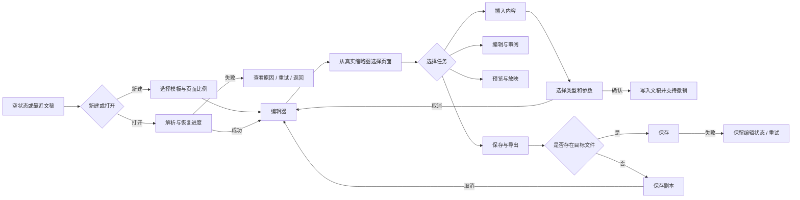

# 编辑页面交互重构

## 目标与验收

| 目标 | 验收标准 |
|---|---|
| 快速定位页面 | 左侧显示真实幻灯片缩略图，并覆盖加载、失败、选中和拖放状态 |
| 降低工具栏认知成本 | 功能按开始、插入、审阅、放映四类任务组织，低频能力进入菜单 |
| 避免隐含默认值 | 形状和表格先选择类型或尺寸，再写入文稿；取消不产生历史记录 |
| 形成操作闭环 | 打开、插入、预览、保存均有进行中、失败、取消和恢复路径 |
| 保持长文稿性能 | 缩略图按可视区域懒渲染，编辑后只失效受影响页面 |

## 用户流程

## 功能范围

| 优先级 | 范围 | 边界 |
|---|---|---|
| P0 | Lucide 图标、真实缩略图、任务型功能区、形状选择器、表格尺寸选择器、保存与导出菜单、完整状态反馈 | 复用现有编辑命令和 Cordis 服务，不新增文件格式能力 |
| P1 | 模板库、页面多选与批量操作 | 不进入本轮实现 |
| 暂不做 | 母版编辑、动画时间轴扩展、实时协作 | 属于新的引擎或产品能力 |

## 交互决策

| 场景 | 决策 | 原因 |
|---|---|---|
| 图标 | 使用 Lucide Vanilla 包并按图标导入 | 与无框架页面匹配，统一视觉且可 tree-shake |
| 页面导航 | 真实 SVG 缩略图通过 `IntersectionObserver` 懒渲染 | 长文稿不应在打开时渲染全部页面 |
| 形状 | 点击后打开常用形状面板，选择后才插入 | 消除默认插入圆角矩形的隐含行为 |
| 表格 | 用网格预选行列数，确认点击后插入 | 插入前让结果可预期，取消不修改文稿 |
| 文件操作 | 主按钮执行当前最合理的保存动作，下拉菜单承载另存和导出 | 高频动作直接，低频动作不占永久空间 |
| 格式 | 保留右侧上下文面板，工具栏只负责打开 | 避免同一属性在两个区域重复编辑 |
| 响应式 | 小屏隐藏文字、保留图标和 tooltip；属性面板变为底部抽屉 | 保持任务入口完整，不压缩中央画布 |
| 紧凑任务栏 | 标签保持内容宽度并允许横向滚动，工具从左侧开始排列 | 避免四个标签均分整行和工具悬在中间造成的空洞感 |
| 页面计数 | 总页数只在底部页码中呈现，左栏标题仅保留新增按钮 | 消除同一屏幕上的重复数字 |
| 对象操作 | 产品层统一用 Lucide 表达展开、显隐和锁定；SDK 文本回退保持零依赖 | 统一图标语义，同时不把图标库成本转嫁给 SDK 用户 |

## 状态与异常

| 状态 | 页面反馈 | 恢复路径 |
|---|---|---|
| 缩略图加载 | 骨架占位 | 进入可视区后自动渲染 |
| 缩略图失败 | 错误图标与重试按钮 | 单页重试，不影响编辑画布 |
| 文件解析失败 | 保留当前文稿并显示原因 | 重试或返回继续编辑 |
| 插入取消 | 关闭面板，不产生命令 | 回到原选择和画布焦点 |
| 保存失败 | 保留 dirty 状态 | 重试或选择其他位置 |
| 未保存时新建/打开 | 保存、放弃、取消三路决策 | 取消后保留完整现场 |
| 刷新或崩溃 | 本机恢复提示 | 恢复或明确放弃记录 |
