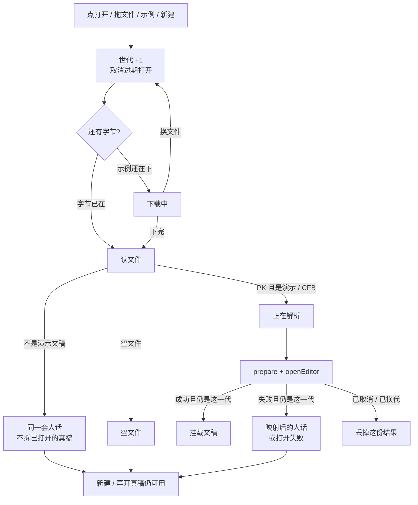

# 编辑器打开错文件走同一套人话

> 第十五轮持续性迭代。只做这一件事：官网编辑器在**字节到手之后、钩子扫描与解析之前**先认文件。不是演示文稿就说与预览同一套人话，不要等 `openEditor` 报 Zip / CFB，也不要对 PDF 扫一遍 EMF+。预览三处、FSA 恢复、W 白屏、真稿钩子二次解压本轮不做。

---

## 1. 目标与用户

| 项 | 内容 |
|---|---|
| 用户 | 在官网编辑器里「打开一份稿子改两下」的人：把 PDF、Word、图片或空文件拖进编辑画布。文件不出设备。 |
| 要解决的问题 | 第十四轮已挡住首页 Demo、样本预览、独立查看器。编辑器仍是官网产品主路径：先写「正在解析」，再跑 `prepare*`，最后报「打开失败：既不是 .pptx（Zip）也不是 .ppt（CFB）」。人以为编辑器坏了。 |
| 成功标准 | 字节到手先认；不是演示文稿立刻失败，文案与预览同一句；不跑 `prepare*` / `openEditor`；已打开的真稿不拆掉；真 `.pptx` / `.ppt`、新建、示例、恢复仍走既有 Cordis 打开。 |

不为谁做：不恢复本地稿、不做 W、不改发布包钩子、不在编辑器里开 PDF / Word、不给加密稿提前拒（CFB 仍放行）。

---

## 2. 用户场景与流程

主路径：编辑器已打开示例 → 拖一份 PDF → **不要**出现「解析中」→ 底栏写「这是 PDF，这里只打开 .pptx / .ppt」→ 画布仍是示例 → 再打开一份真 `.pptx` → 正在打开 → 看见当前页。

| 分支 | 行为 |
|---|---|
| 空状态 | 未打开、认错且当时没有文稿：画布写「演示文稿打开失败」+ 人话。页码 `— / —`。编辑按钮禁用。 |
| 已有文稿时认错 | 不拆画布、不换文件名、不写恢复记录。底栏人话。格式 / 撤销仍针对旧稿。 |
| 失败 | 认文件失败、示例下载失败、解析失败：只写当前世代。大 PDF / 大 docx **不准**先扫 EMF+。 |
| 取消 | 文件选择器没选出文件：不 `begin`。未保存确认点「取消」：不打开。 |
| 换文件 | 第一下取消旧打开。认错之后再开真稿：后一次赢。 |
| 新建 | 模板选出的字节是演示文稿，认文件放行。 |
| 恢复 | 认错不进入 `openEditor`，不弹恢复、不改 IndexedDB。真稿恢复仍按既有插件。 |
| 权限 | 本轮不申请文件系统权限。 |

---

## 3. 范围

| 必须做 | 不做 |
|---|---|
| 官网编辑器与预览共用 `open-kind.ts` | 再做一遍预览三处 |
| 魔数 +（Zip 用 fflate 只读 Content Types / `ppt/presentation.xml`） | 手写 Zip / CFB parser |
| PDF / 图片 / 网页 / 空文件 / Word / Excel / 普通压缩包 说同一套人话 | 打开 .odp / .key / PDF |
| 认错发生在 `prepareModernCharts` / `prepareAdvancedRendering` / `openEditor` 之前 | 改发布包里的钩子扫描 |
| 已打开真稿不拆；再开真稿、新建、示例、`.ppt` 转换仍按既有 | FSA / W / 数字+Enter |
| 旧 i18n 错误契约改为认文件人话，仍能切语言 | 改 `render/`、改 core |

---

## 4. 调研与缺口

本轮打开并读完的原始页面（不是搜索摘要）：

| 来源 | 用户实际怎么用 | 对本仓库的含义 |
|---|---|---|
| [Files you can store](https://support.google.com/drive/answer/37603?hl=en) | 原文：**「The Google Drive preview is a scaled-down version of the complete file」**。可预览类型把 **PowerPoint (.PPT and .PPTX)**、**Word**、**Excel**、**PDF**、图片、**Editor files (.key, .numbers)** 分列。另写 **Password-protected Microsoft Office files**。 | Web 打开按**文件种类**说话。编辑器不是「万能解压」。拖错必须说出种类。 |
| [View & open files](https://support.google.com/drive/answer/2423485?hl=en) | 摘要原文：**「you can view things like videos, PDFs, Microsoft Office files, audio files, and photos」**。正文另有 **Open PDFs in preview mode** 与 **Open Microsoft Office files in web editors**：Office 进微软网页编辑器，不是当 Zip 解析。 | 「打开就能编辑」假定文件是编辑器认的那一类。认不出要立刻停。 |
| [Work with Office files](https://support.google.com/docs/answer/6055139?hl=en) | 原文：**「You can edit, download, and convert Microsoft® Office files in Google Docs, Sheets, and Slides。」** 兼容表把演示限制为 **.ppt / .pptx**（及同族 pps/pot）；Word / Excel / PDF 走另一条转换。密码框只给 Office 加密稿。 | 编辑器只承诺演示文稿。PDF / Word 不是「解析失败」，是种类不对。 |
| [How to use Google Slides](https://support.google.com/docs/answer/2763168?hl=en) | 原文：**「Google Slides is an online presentation app that lets you create and format presentations and work with other people。」** | 编辑器入口的用户目标是演示文稿，不是任意文件。 |
| [Download a file](https://support.google.com/drive/answer/2423534?hl=en) | 下载失败写清 Cookie、扩展、**Too many users have viewed or downloaded this file recently**。 | 失败必须停在当前这一次。认错不能盖住下一份真稿。 |
| [File API](https://developer.mozilla.org/en-US/docs/Web/API/File_API) | 正文：**「Web applications can access files when the user makes them available, either using a file `<input>` element or via drag and drop。」** | 编辑器打开已经交出字节。认文件用魔数。不需要 FSA。 |
| [File](https://developer.mozilla.org/en-US/docs/Web/API/File) | **「File objects are generally retrieved from a FileList object returned as a result of a user selecting files using the `<input>` element, or from a drag and drop operation's DataTransfer object。」** `name` 只是元数据。 | `.pptx` 后缀里可能是 PDF。不看扩展名。 |
| [The File System Access API](https://developer.chrome.com/docs/capabilities/web-apis/file-system-access) | 原文：**「The File System Access API is supported on most Chromium browsers on Windows, macOS, ChromeOS, Linux, and Android. A notable exception is Brave」**。**「permissions are not always persisted between sessions」**。`showOpenFilePicker` 要用户手势。 | FSA 恢复覆盖面窄，本轮仍不做。 |
| [Present slides · Computer](https://support.google.com/docs/answer/1696787?hl=en&co=GENIE.Platform%3DDesktop) | 放映工具条：选页、演讲者视图、激光笔。W 仍在桌面快捷键表。 | 不解决拖错文件。 |
| Microsoft PowerPoint for the web / 预览类型表 / 支持的文件格式 | 本轮 HTTP **404**。 | 不能把 404 页当成编辑器打开规则。 |

对照本仓库：

| 表面 | 已有 | 缺口 |
|---|---|---|
| 预览三处 | 第十四轮：字节先认，人话，不进 prepare | 编辑器未接 |
| 编辑器打开 | Cordis 世代、取消过期、已有文稿失败不拆 | 认错也先写「正在解析」，再扫 EMF+，再套「打开失败：Zip/CFB」 |
| 钩子准备 | `prepareEditorDocument` 无条件 `prepare*` | 非 PK 会对**整份字节**扫 EMF+ |
| 真稿大文件二次解压 | `prepareAdvancedRendering` 对 PK 整包解 media/扫 EMF+ | 要动发布包或接受 ChartEx 首帧闪错，本轮不改 |
| FSA / W | 候选 | 覆盖面窄，不解决拖错 |

更高价值检查：来官网编辑器的人，主路径就是打开一份文件。预览已经认过种类，编辑器还报行话，产品不一致。钩子惰性要改 `@web-ppt/core` 契约；FSA 只覆盖 Chromium 且权限不一定跨会话保留。

---

## 5. 是否值得做

| 判定 | 结论 |
|---|---|
| 使用者成本 | 只动私有官网编辑器。复用已有 `open-kind.ts` 与 `fflate`，认完即停，零持续开销。 |
| 可行路径 | `prepareEditorDocument` 已是唯一打开准备入口；示例、新建、文件、拖放、测试都走它。 |
| 换候选？ | 钩子二次解压：证据仍在，但要改发布包或先画错再刷新。FSA / W：原文覆盖面未变。 |
| 判定 | **做编辑器打开前认文件。** |

---

## 6. 产品方案

| 元素 | 规则 |
|---|---|
| 何时认 | `arrayBuffer()` 回来的第一下，在 `prepare*` / `openEditor` 之前。 |
| 怎么认 | 与预览同一套：魔数优先；PK 用 fflate 只读 Content Types / `ppt/presentation.xml` / `mimetype`；CFB 放行。 |
| 文案 | 直接用 `OPEN_KIND`，不套「打开失败：」。引擎仍抛出的旧句映射成同一套。映射不了的才套「打开失败：」。 |
| 打开期间 | 画布写「正在打开 {name}」。**不要**在认完之前写「正在解析」。 |
| 已有文稿 | 认错：收起转圈，底栏人话，画布仍是旧稿。 |
| 没有文稿 | 认错：画布「演示文稿打开失败」+ 人话。 |
| 真演示 | 进入解析，之后与既有打开相同（含 `.ppt` 转换确认）。 |
| 新建 / 示例 | 生成或下载的是演示文稿，认文件放行。 |
| 恢复 | 认错不进恢复。真稿恢复不变。 |
| 地址 | 编辑器没有 `?file=`。 |

---

## 7. 技术方案

| 决策 | 选择 | 原因 |
|---|---|---|
| 认文件放哪 | `prepareEditorDocument` 入口 | 示例 / 新建 / 文件 / 拖放 / 浏览器测试共用；禁止只改页面层漏掉测试入口 |
| 为什么抛 `OpenKindError` | 让页面能区分「种类不对」和「挂载失败」 | 挂载失败仍要「打开失败：验收模拟挂载失败」 |
| 为什么页面只看 `error.name` | 静态导入认文件会把 Zip/`fflate` 打进首开闭包 | 首开 gzip 预算不能放宽 |
| 为什么不套「打开失败：」 | 与预览同一句；词条已在 `en-home`，编辑器词库共用 | i18n 契约改为认文件人话并仍能切语言 |
| 为什么 CFB 不提前拒 | 加密 `.pptx` 与 `.ppt` / `.doc` 同魔数 | 提前拒会把加密稿当成 Word |
| 为什么认错不跑 prepare | `prepareAdvancedRendering` 对非 PK 扫整份字节 | 50MB PDF 会先卡主线程 |
| 为什么字节未到不写解析中 | 人还没交出内容；认错也不该假装在解析 | 解析中只属于已经认过的演示文稿 |
| 不进发布包 | 与第十四轮同一模块 | 体积 / 契约评估后仍无必要 |

落点：

| 文件 | 职责 |
|---|---|
| `packages/site/src/open-kind-error.ts` | 人话、映射、`OpenKindError`；不碰 Zip，避免编辑器首开再打 fflate |
| `packages/site/src/open-kind.ts` | 共用认文件；编辑器按需加载 |
| `packages/site/src/editor-open.ts` | 字节到手先认，拒绝则不 prepare |
| `packages/site/src/editor-page-plugin.ts` | 打开中文案；认错人话；已有文稿不拆 |
| `site-i18n-errors-contract` | `File(['not a presentation'])` 改为认文件人话 |
| 编辑器浏览器契约 | PDF / Word / 空文件 / 再开真稿 / 空选择不 begin |

不变量：`render/` 只认 `types.ts`；core 不碰 `document`；不进发布包。

---

## 8. 验收

| # | 标准 | 证据 |
|---|---|---|
| A1 | 拖 PDF：立刻人话「这是 PDF」，旧画布还在，文件名仍是旧稿 | 新增契约 |
| A2 | 拖 Word 形 Zip：人话「这是 Word」，不是「压缩包」或 `presentation.xml` | 新增契约 |
| A3 | 空文件：人话空文件 | 新增契约 |
| A4 | `File(['not a presentation'])`：无法识别的人话，中英文可切，不拆现有文稿 | 改旧 i18n 契约 |
| A5 | 认错后再打开真稿：后一次赢 | 新增契约 |
| A6 | 文件选择器空选择：不 begin，文稿不动 | 新增契约 |
| A7 | 真 `.pptx` / `.ppt` 转换 / 新建 / 恢复 / 挂载失败清理仍按既有 | 旧契约仍跑 |
| A8 | 四项门禁绿；browser-use 走 5174 编辑器 | 本轮验证 |

---

## 9. 方案自评

| 对照 | 结论 |
|---|---|
| 目标 | 解决「编辑器拖错文件看到行话 / 空转」，没有偷换成做 FSA、W 或钩子惰性 |
| 流程 | 主路径、空、失败、取消、换文件、新建、恢复都有出口 |
| 范围 | 只接编辑器产品层；预览三处不重做 |
| 与前十四轮 | 不回退放映、备注、滑动、黑屏、网格、打开世代、密码、深链、预览认文件 |
| AGENTS.md | 不改 `render/` 与 core；Zip 用 fflate；不进发布包 |
| 风险 | CFB 提前拒会误伤加密稿——所以 CFB 放行。认错若仍走 prepare，大 PDF 继续卡死——所以认错必须在钩子前。`instanceof OpenKindError` 跨 bundle 会断——打开与页面同包，测试用导出类。 |

确认后再开发：用户是「把错文件拖进编辑器的人」；范围只有认文件与人话；验收即上表。
