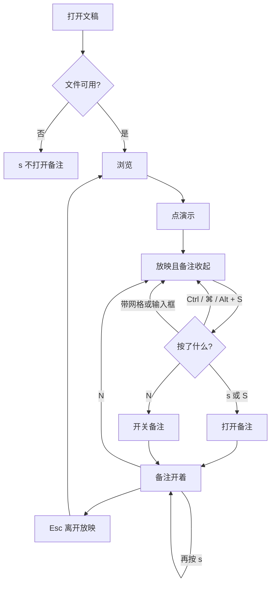
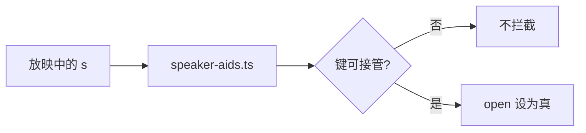

# 放映备注键：S 打开，N 仍是开关

> 第三十一轮持续性迭代。只做这一件事：官网首页 Demo 与样本预览在**放映中**，不带 Ctrl / ⌘ / Alt 的 `s` 打开演讲者备注。已经开着就保持开着。`N` 继续开关。浏览态不认 `s`。查看器放映侧栏本来就显示备注，键位仍是 `N`。

---

## 1. 目标与用户

| 项 | 内容 |
|---|---|
| 用户 | 在浏览器里放映 `.pptx` / `.ppt` 的人。习惯 Google 放映里按 `s` 看备注。不装 Office，文件不出设备。 |
| 要解决的问题 | 官网进入「演示」会收起备注。再打开只能按 `N` 或点按钮。Google 现行放映表写的是 `s`。 |
| 成功标准 | 只在放映中、没有输入框、网格和 Ctrl / ⌘ / Alt 时，`s` 打开备注。再按 `s` 不关上。`N` 仍能开关。浏览、查看器、修饰键、数字缓冲、黑屏、网格、Esc、换文件都不被这键改义。 |

不为谁做：不在这一轮做激光笔、下一张隐藏页、把 `N` 改成下一页、浏览态加 `s`、改 `render/` 或 core。

---

## 2. 用户场景与流程

主路径：打开文稿 → 点「演示」→ 备注收起 → 按 `s` → 看到本页备注和下一可见页。再按 `s` 仍开着。按 `N` 关上。浏览时按 `s` 不打开。

| 分支 | 行为 |
|---|---|
| 空状态 | 未打开或打开失败：没有放映，`s` 不造出备注。本页无备注：打开后仍是「本页无备注」。 |
| 失败 | 全屏被拒：仍在放映，`s` 照常打开。输入框里的 `s` 留给输入。 |
| 取消 | 浏览态不拦截。网格开着：不打开、不关网格。 |
| 返回 | 已经开着再按 `s`：保持开着。`N`、关闭按钮仍能关上。 |
| 恢复 | 退出放映回到进入前的浏览开关。放映中用 `s` 打开，不改写这个记忆。换文件先清空。 |

---

## 3. 范围

| 必须做 | 不做 |
|---|---|
| 首页 Demo、样本预览放映中的 `s` / `S` 打开备注 | 浏览态认 `s` |
| 已打开时再按不关上 | 用 `s` 替换 `N` |
| `N`、按钮、Esc、进入放映收起、退出恢复浏览开关 | 查看器改键；激光笔；下一张隐藏页 |
| 修饰键、输入框、网格、数字缓冲、黑屏不误伤 | 改 `render/`、推进发布包 |

---

## 4. 调研与缺口

本轮打开并读完的原始页面（不是搜索摘要）。日期 2026-09-22。

| 来源 | 用户实际怎么用 | 对本仓库的含义 |
|---|---|---|
| [Present slides](https://support.google.com/docs/answer/1696787?hl=en) · 展开 `Present mode keyboard shortcuts` | PC、Mac、Chrome 三张表同一行：**Open speaker notes → `s`**。激光笔是另一行 **Toggle laser pointer → `l`**。 | 动词是 Open，不是 Toggle。`s` 负责打开。激光笔不是这一行。 |
| [Use keyboard shortcuts to deliver PowerPoint presentations](https://support.microsoft.com/en-us/accessibility/powerpoint/use-keyboard-shortcuts-to-deliver-powerpoint-presentations) · Windows | 放映控制：**N** 是下一步。**H** 是「下一张如果是隐藏页」（Presenter View 不可用）。**Ctrl+S** 是全部幻灯片。备注在 Presenter View 里用方向键滚动，没有单独的 `s`。 | 裸 `s` 没有被 Microsoft 占成别的放映动作。`N` 在 Microsoft 是下一页，和本仓库已有的备注开关不是同一个键。 |
| 同上 · macOS | **H** 同样是下一张隐藏页。没有 `s` 打开备注。 | 隐藏页键两家桌面都有，但不是备注键。 |
| 同上 · Web | 只有开始、前进（含 **N**）、后退、Esc。没有 `s`，也没有 `H`。 | Web 栏不写备注键。不以这一栏否定 Google 的 `s`。 |

对照本仓库：

| 表面 | 已有 | 缺口 |
|---|---|---|
| 官网首页 / 样本 | 进入放映收起备注；`N` 和按钮能再打开，再按关上 | 放映中按 `s` 没反应 |
| 查看器 | 浏览态 `N` 开关备注。放映时侧栏一直显示本页备注 | 没有「关上再打开」的放映备注。`s` 不该去点被盖住的浏览面板 |
| 黑屏 / 页码 / 网格 | 各管各的键 | `s` 不能变成翻页、确认页码或关网格 |

---

## 5. 是否值得做

| 判定 | 结论 |
|---|---|
| 补 `s` 还是只留 `N` | **放映中补 `s`，并维持 `N`。** Google 三张表都写 Open → `s`。官网放映默认把备注收起，缺的就是这个打开动作。`N` 已是开关，按钮上也写着 N，不能改成只认 `s`，更不能改成 Microsoft 的下一页。 |
| 已打开再按 `s` | **保持开着。** 同一张表把激光笔写成 Toggle，把备注写成 Open。关上仍走 `N` 和关闭按钮。 |
| 浏览态 | **不认 `s`。** 这行字在 Present mode 表里。浏览继续只认 `N`。 |
| 查看器 | **不改键。** 放映侧栏已经打开备注。浏览开关仍是 `N`。 |
| 下一张隐藏页 `H` | **不做。** Windows / macOS 有，Web 和 Google 没有。留给下一轮。 |
| 激光笔 | **不做。** |
| 使用者成本 | 不进八个发布包。不增依赖。没有按下时没有额外行为。 |
| 可行路径 | `bindSpeakerAids` 已有打开和收起。`s` 只把 `open` 设为真，不改进入放映时记住的浏览开关。 |

---

## 6. 产品方案

| 元素 | 规则 |
|---|---|
| 何时生效 | 仅放映中，且键盘没有被输入框、网格或 Ctrl / ⌘ / Alt 拿走。大小写都认。 |
| `s` | 备注关着就打开。已经开着就保持，并吃掉这次按键。不翻页，不揭黑/白遮罩，不关网格。 |
| `N` | 仍是开关，浏览和放映都保留。 |
| 浏览记忆 | 进入放映时记下的开关不变。放映里用 `s` 打开，退出后仍回到进入前的浏览状态。 |
| 数字缓冲 | `s` 不是确认。未确认的页码被丢掉，停在当前页，再打开备注。 |
| 黑/白遮罩 | `s` 不是恢复键。遮罩留着，备注可以在旁边打开。 |
| 网格 | 开着时不打开备注、不关网格。 |
| 离开 | Esc 仍先关网格，再离开放映。 |

---

## 7. 技术方案

| 决策 | 选择 | 原因 |
|---|---|---|
| 认哪个键 | `event.key` 为 `s` 或 `S`，且没有 ctrl / meta / alt | 三张表写的是 `s`。Ctrl/⌘+S 是保存；Microsoft 桌面 Ctrl+S 是全部幻灯片，这里已有 `G` |
| 不切换 | 已打开则只 `preventDefault` | 原文是 Open。`N` 继续负责关上 |
| 不改浏览记忆 | 放映中不写 `browseWanted` | 退出要回到进入前，而不是回到「刚刚按过 s」 |
| 查看器 | 不加监听 | 放映备注已经可见。加 `s` 只会碰到盖住的浏览面板 |
| 模块 | 只改 `speaker-aids.ts` | 首页和样本预览共用。不进发布包 |

不变量：`render/` 只认 `types.ts`；core 不碰 `document`；不进发布包。

---

## 8. 验收

| # | 标准 | 证据 |
|---|---|---|
| A1 | 官网浏览态 `s` 不打开备注，且未 `preventDefault` | 契约 |
| A2 | 放映中 `s` 打开备注并看到本页正文；再按仍开着 | 契约 |
| A3 | `N` 仍能关上。Ctrl / ⌘ / Alt+S 不打开 | 契约 |
| A4 | 未确认的数字再按 `s`：芯片消失，停在当前页并打开备注 | 契约 |
| A5 | 黑屏上 `s` 打开备注且遮罩还在；网格开着不打开 | 契约 |
| A6 | 退出放映回到进入前的浏览开关，不被放映中的 `s` 改写 | 契约 |
| A7 | 查看器浏览 `N` 仍开关；放映中 `s` 不翻页、不藏侧栏备注、不打开被盖住的浏览面板 | 契约 |
| A8 | 四项门禁绿 | check / test / build / verify |
| A9 | browser-use：5174 放映中 `s` 打开备注，浏览态不打开 | `out/notes-key-browser/` |

---

## 9. 方案自评

| 对照 | 结论 |
|---|---|
| 目标 | 补的是 Google 放映表上的打开备注。没有改成激光笔，也没有把 `N` 改成下一页 |
| 流程 | 主路径、空、失败、浏览、输入、网格、修饰键、再按、数字缓冲、黑屏、退出恢复都有出口 |
| 范围 | 官网两处预览同一条规则。查看器维持 `N` |
| 与前三十轮 | 不回退 `N` 开关、进入放映收起、退出恢复、黑屏、页码、网格、Esc 分层 |
| 证据 | Google 展开后的三张表、Microsoft 三栏都读过。`s` 是 Open；`H` 是下一张隐藏页 |
| AGENTS.md | 不改 `render/` 与 core |
| 风险 | 若 `s` 顺手改写浏览记忆，退出后会留下放映里打开的备注。契约用「进入前关着、放映中按 `s`、退出后仍关着」卡住 |

确认后的决定：用户是「放映时按 `s` 要看到备注的人」；范围只有这个打开动作；`N` 保持开关；验收即上表。
