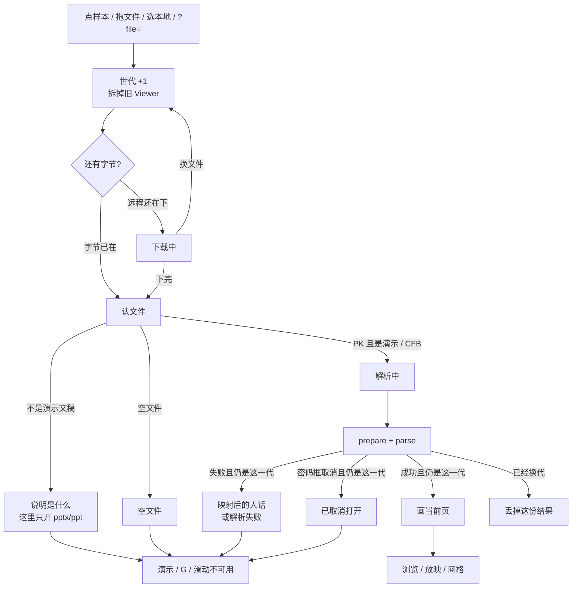
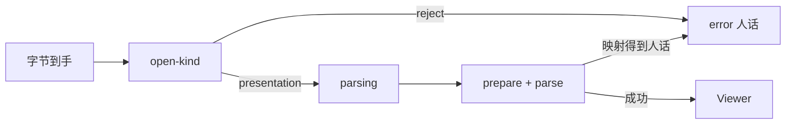

# 打开前先认文件：拖错文件立刻说明

> 第十四轮持续性迭代。只做这一件事：官网首页 Demo、样本预览、独立查看器在**字节到手之后、钩子扫描与解析之前**先认文件。不是演示文稿就说人话，不要等解析器报 Zip / CFB，也不要对 PDF 扫一遍 EMF+。FSA 恢复本地稿、W 白屏、数字+Enter 本轮不做。

---

## 1. 目标与用户

| 项 | 内容 |
|---|---|
| 用户 | 在浏览器里「先看一眼」的人：把 PDF、Word、图片、空文件或 Keynote 拖进演示位。不装 Office，文件不出设备。 |
| 要解决的问题 | 拖错文件先看到「解析中」，再看到「既不是 .pptx（Zip）也不是 .ppt（CFB）」或「找不到 ppt/presentation.xml」。大 PDF 还会在认失败前按字节扫 EMF+。人以为工具坏了。 |
| 成功标准 | 字节到手先认；不是演示文稿立刻失败，文案说出**这是什么**和**这里只开 .pptx / .ppt**；不跑 `prepare*` / `parse`；演示 / G / B / 滑动不可用；真演示文稿（含加密）仍走前十三轮。 |

不为谁做：不用 File System Access 刷新后恢复本地稿、不做 W 白屏、不做数字+Enter、不改 `render/` 或 core、不推进发布包、不把 `parseInWorker` 接进预览。

---

## 2. 用户场景与流程

主路径：拖一份 PDF → 旧页立刻消失 → **不要**出现「解析中」→ 舞台写「这是 PDF，这里只打开 .pptx / .ppt」→ 再拖一份真 `.pptx` → 解析中 → 看见当前页 → 点「演示」仍按第一轮。

| 分支 | 行为 |
|---|---|
| 空状态 | 未打开、认错、解析失败、已取消：没有 Viewer。页码是 `— / —` 或 `- / -`。G 不造网格，B 不黑屏，滑动不翻页。 |
| 失败 | 认文件失败、下载失败、解析失败：只写当前世代。大 PDF / 大 docx **不准**先扫 EMF+ 再报错。 |
| 取消 | 文件选择器没选出文件：不 `begin`，地址不动。密码框取消：只属于加密演示文稿那一代。 |
| 换文件 | 第一下拆旧稿。认错之后再拖真稿：世代加一，旧错误不能盖住新打开。 |
| 返回 | Esc 仍是网格 → 放映 → 关预览。认错不是一层 Esc。 |
| 恢复 | 远程 `?file=` 其实是 PDF：失败后**保留**人家写进来的 `file`（第十三轮：远程失败不删）。本地拖错：`file` 已在选本地时删掉。刷新按当前地址。 |
| 权限 | 本轮不申请文件系统权限。 |

---

## 3. 范围

| 必须做 | 不做 |
|---|---|
| 首页 Demo、样本预览、独立查看器同一套认文件 | FSA / IndexedDB 刷新后恢复本地稿 |
| 魔数 +（Zip 用 fflate 只读 Content Types / `ppt/presentation.xml`） | 手写 Zip / CFB parser |
| PDF / 图片 / 网页 / 空文件 / Word / Excel / 普通压缩包 说人话 | 打开 .odp / .key / PDF |
| 认错发生在 `prepareModernCharts` / `prepareAdvancedRendering` / `parse` 之前 | 改发布包里的钩子扫描 |
| 真 `.pptx` / `.ppt` / 加密稿仍走打开会话、密码、深链 | W 白屏、数字+Enter |
| 放映 / 网格 / 黑屏 / 滑动 / Esc / 清 `?file=` 不被这次破坏 | 编辑器打开、改 `render/`、改 core |

---

## 4. 调研与缺口

本轮打开并读完的原始页面（不是搜索摘要）：

| 来源 | 用户实际怎么用 | 对本仓库的含义 |
|---|---|---|
| [Files you can store](https://support.google.com/drive/answer/37603?hl=en) | 原文：**「The Google Drive preview is a scaled-down version of the complete file」**。可预览类型把 **PowerPoint (.PPT and .PPTX)**、**Word**、**Excel**、**PDF**、图片、**Apple Editor files (.key, .numbers)** 分列。另写 **Password-protected Microsoft Office files**。 | Web 预览按**文件种类**说话。PPT 和 PDF / Word 不是同一种预览。拖错必须说出种类，不能报 Zip/CFB。 |
| [View & open files](https://support.google.com/drive/answer/2423485?hl=en) | Drive 网页：**「you can view things like videos, PDFs, Microsoft Office files, audio files, and photos」**。双击：Office 在 Drive 里打开/预览。 | 「打开就能看见」假定文件是预览器认的那一类。认不出要立刻停，不要假装在解析演示文稿。 |
| [Download a file](https://support.google.com/drive/answer/2423534?hl=en) | 下载失败写清 Cookie、扩展、**Too many users have viewed or downloaded this file recently**。 | 失败必须停在当前这一次。远程 HTML 第八轮已挡在下载；本轮挡的是**字节已到、但不是演示文稿**。 |
| [File API](https://developer.mozilla.org/en-US/docs/Web/API/File_API)（2025-04-10） | 正文：**「Web applications can access files when the user makes them available, either using a file `<input>` element or via drag and drop。」** `File` 提供 name / size / type。另写 File System Access 是另一套、要用户同意才能读盘。 | 拖放已经交出字节。认文件用魔数，不看扩展名（本仓库约定）。不需要 FSA。 |
| [File System API](https://developer.mozilla.org/en-US/docs/Web/API/File_System_API) | 安全上下文。handle 可放进 IndexedDB。`showOpenFilePicker()` 才拿到用户盘上的 handle。 | 刷新恢复本地稿要 FSA，不是 File API。 |
| [The File System Access API](https://developer.chrome.com/docs/capabilities/web-apis/file-system-access) | **「The File System Access API is supported on most Chromium browsers… Browser Support 86 / 86 / x / x」。** **「permissions are not always persisted between sessions」**，刷新后要 `queryPermission` / `requestPermission`。`showOpenFilePicker` 必须安全上下文 + 用户手势。 | FSA 恢复：Firefox / Safari 原文兼容表为 x；每次会话可能再弹权限。覆盖面窄，本轮不做。 |
| MDN BCD `api.Window.showOpenFilePicker`（2026-09-21 拉取） | `firefox` / `safari` / `safari_ios`：`version_added: false`。Chrome 86、Edge 86。experimental。 | 与 Chrome 文档一致。不值得做只覆盖 Chromium 的桌面恢复。 |
| [Present slides · Computer](https://support.google.com/docs/answer/1696787?hl=en&co=GENIE.Platform%3DDesktop)（展开 `Present mode keyboard shortcuts`） | **Show a blank white slide / w**；**b** 黑屏；**Number followed by Enter**。 | W 仍在桌面放映表。不解决拖错文件。 |
| [Present slides · Android](https://support.google.com/docs/answer/1696787?hl=en&co=GENIE.Platform%3DAndroid) | Present on this device → **swipe left or right**。没有 W，没有数字跳页。 | 手机官方没有 W。 |
| [Present your slide show](https://support.microsoft.com/en-us/powerpoint/present-your-slide-show) · Web 栏 | 控制条：**See all slides** / 上一页 / 下一页 / End Show。没有 W。 | 网格第七轮已做。 |
| 同上 · Windows Mobile 栏 | 空格或点屏幕前进；P 上一页；Esc 结束；**B 黑屏，再按 B 恢复当前页**。没有 W。 | B 第五轮已做。 |
| Microsoft `file-types-supported-for-previewing-files-in-onedrive-sharepoint-and-teams` | 本轮 HTTP **404**。 | 不能把 404 页当成预览类型表。 |

对照本仓库：

| 表面 | 已有 | 缺口 |
|---|---|---|
| 远程下载 | HTML 回退停在下载，不交给解析 | 字节已到的 PDF / 图片仍进解析 |
| 打开会话 | 世代、拆旧稿、下载/解析两段 | 认错也先写「解析中」 |
| 解析错误 | `解析失败：` + 引擎原句 | Zip/CFB/`presentation.xml` 是给开发者看的 |
| 钩子准备 | 打开前 `prepareAdvancedRendering` | 非 PK 文件会对**整份字节**扫 EMF+ 魔数 |
| FSA / W | 候选 | 覆盖面窄，本轮不做 |

更高价值检查：每个来试「拖一份文件看一眼」的人，都可能拖错类型。这是全浏览器主路径。FSA 恢复只在 Chromium，刷新还要再授权，地址仍然不能命名本地稿。W 仍只有 Google 桌面表。惰性解析已经让真 `.pptx` 首屏只解一页；剩下的大文件等待主要是钩子二次解压——要动发布包或冒 ChartEx/EMF+ 首帧闪错，本轮不改。先把拖错文件的等待和行话清掉。

---

## 5. 是否值得做

| 判定 | 结论 |
|---|---|
| 使用者成本 | 只动两个私有应用。`fflate` 已是 core 运行时依赖，官网按需用来读一项 Zip；认完即停，零持续开销。 |
| 可行路径 | 魔数本仓库已有；Zip 用 fflate 过滤，与 `prepareModernCharts` 同一做法。 |
| 换候选？ | FSA：BCD 上 Firefox / Safari 为 false；Chrome 写明权限不一定跨会话保留。W：手机原文没有。真稿首屏再解压：要改发布包或先画错再刷新。 |
| 判定 | **做打开前认文件。** |

---

## 6. 产品方案

| 元素 | 规则 |
|---|---|
| 何时认 | 下载完成或 `File.arrayBuffer()` 回来的**第一下**，在 `prepare*` / `parse` 之前。 |
| 怎么认 | 魔数优先，不看扩展名。PK：fflate 只解 `[Content_Types].xml` / `ppt/presentation.xml` / `mimetype`。CFB：放行给解析（加密 `.pptx` 与 `.ppt` 同魔数）。 |
| 空文件 | 「空文件，没有内容可打开。」 |
| PDF / 图片 / 网页 | 说出种类 + 「这里只打开 .pptx / .ppt」。 |
| Word / Excel | 说出种类 + 同上。 |
| 其它 Zip | 「这是压缩包，但不是 PowerPoint 演示文稿。」 |
| 未知 | 「无法识别的文件。请拖入 .pptx 或 .ppt。」 |
| 真演示 | 进入「解析中」，之后与第八轮相同。 |
| 加密 | CFB 放行 → 密码框。取消仍写「已取消」。 |
| 引擎仍抛出的旧句 | 映射成同一套人话；映射不了的才套「解析失败：」。 |
| 打开期间（字节未到） | 拆旧稿。文案是「正在打开…」，**不是**「解析中」。 |
| 放映 / 网格 | 认错后没有 Viewer。换真稿先退出放映、关掉网格。 |
| 地址 | 不改第十三轮：远程失败保留 `file`；本地一开始就删。 |

---

## 7. 技术方案

| 决策 | 选择 | 原因 |
|---|---|---|
| 模块放哪 | 官网 `open-kind.ts`；查看器相对导入 | 与打开世代同一模式；禁止复制三套认文件；不进发布包 |
| 为什么不用扩展名 | 项目约定按魔数；`.pptx` 里可能是 PDF | File API 的 `type` 只是元数据 |
| 为什么 Zip 用 fflate | 禁止手写 Zip parser；读 Content Types 与 core 钩子准备同一库 | 大 docx 不必整包解压再报找不到 presentation.xml |
| 为什么 CFB 不提前拒 | 加密 `.pptx` 与 `.ppt` / `.doc` 同是 `D0CF` | 提前拒会把加密稿当成 Word |
| 为什么认错不跑 prepare | `prepareAdvancedRendering` 对非 PK 会扫整份字节找 EMF+ | 50MB PDF 会先卡主线程 |
| 为什么字节未到不写解析中 | 人还没交出内容；测试里也会故意挂起 `arrayBuffer` | 解析中只属于已经认过的演示文稿 |
| 文案进 `en-home` | 首页与样本共用 `message()` | 查看器无词库，硬编码同一句中文 |
| 旧 i18n 契约 | `File(['invalid'])` 改为认文件人话，并仍能切语言 | 不再套「解析失败：」 |

落点：

| 文件 | 职责 |
|---|---|
| `packages/site/src/open-kind.ts` | 认文件、映射引擎旧句 |
| `packages/site/src/viewer-status.ts` / `open-session` 调用点 | 打开中 / 解析中分开 |
| `packages/site/src/main.ts` / `samples.ts` | 字节到手先认 |
| `packages/viewer/src/main.ts` / `open-status.ts` | 同上 |
| `en-home.ts` | 人话词条 |
| 单测 + 官网/独立契约 | 魔数、Zip 种类、不进 prepare |

不变量：`render/` 只认 `types.ts`；core 不碰 `document`；不进发布包。

---

## 8. 验收

| # | 标准 | 证据 |
|---|---|---|
| A1 | 拖 PDF：立刻人话「这是 PDF」，没有 SVG，演示禁用，G 不造网格 | 新增契约 |
| A2 | 拖 Word 形 Zip：人话「这是 Word」，且测试探针证明未调用 prepare | 单测 + 契约 |
| A3 | 空文件：人话空文件 | 单测 + 契约 |
| A4 | `File(['invalid'])`：无法识别的人话，中英文可切 | 改旧 i18n 契约 |
| A5 | 真 `.pptx` / 加密稿 / `?file=` / 清本地 `file` 仍按前十三轮 | 旧契约仍跑 |
| A6 | 远程 `?file=` 下到 PDF：失败可见，地址仍有 `file` | 新增独立契约 |
| A7 | 认错后再打开真稿：后一次赢 | 旧打开会话 + 本轮 |
| A8 | 四项门禁绿；browser-use 走 5174 与 5173 | 本轮验证 |

---

## 9. 方案自评

| 对照 | 结论 |
|---|---|
| 目标 | 解决「拖错文件看到行话 / 空转」，没有偷换成做 FSA 或 W |
| 流程 | 主路径、空、失败、取消、换文件、返回、恢复、远程/本地地址都有出口 |
| 范围 | 三处预览同一件事；不打开 PDF、不恢复本地稿 |
| 与前十三轮 | 不回退放映、备注、滑动、黑屏、小视口、网格、打开世代、下载进度、密码、深链、清 `file` |
| AGENTS.md | 不改 `render/` 与 core；Zip 用 fflate；不进发布包 |
| 风险 | CFB 提前拒会误伤加密稿——所以 CFB 放行。认错若仍走 prepare，大 PDF 继续卡死——所以认错必须在钩子前。`arrayBuffer` 未完成时写「解析中」会撒谎——所以先「正在打开…」 |

确认后再开发：用户是「把错文件拖进预览位的人」；范围只有认文件与人话；验收即上表。
