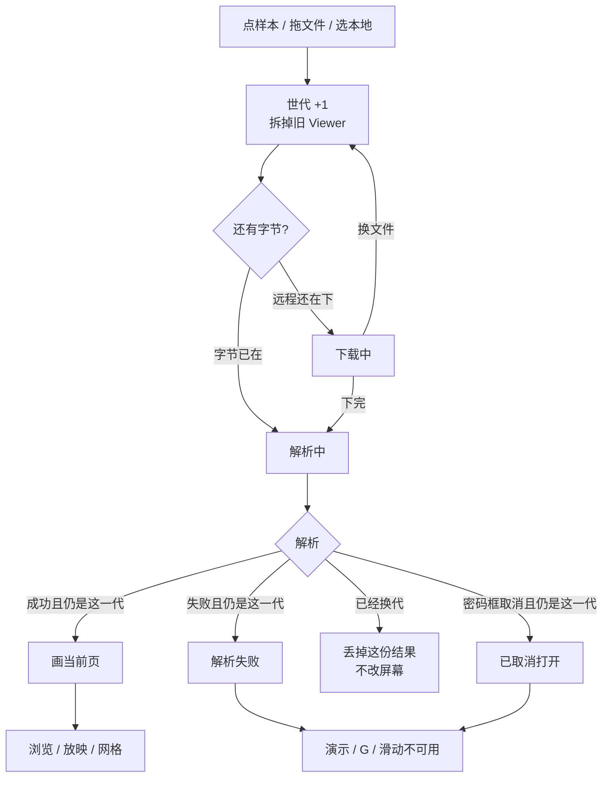
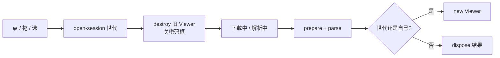

# 打开文稿：解析可见，后一次打开为准

> 第八轮持续性迭代。只做这一件事：官网首页 Demo、样本预览、独立查看器在**打开下一份文件时**立刻拆掉上一份，下载与解析分开可见，后一次打开覆盖前一次。W 白屏、数字+Enter 本轮不做。

---

## 1. 目标与用户

| 项 | 内容 |
|---|---|
| 用户 | 在浏览器里打开 `.pptx` / `.ppt` 的人：拖一份大文件、连点两个样本、看稿看到一半换文件。不装 Office，文件不出设备。 |
| 要解决的问题 | 下载有进度，解析只剩空白转圈；首页连点会竞态；解析期间旧 Viewer 还在，方向键 / G / 滑动仍作用在已被拆掉的舞台上；独立查看器换文件时旧页还留着，看起来像打开失败。 |
| 成功标准 | 一开始打开就拆掉旧稿；下载显示下载，解析显示解析；后一次打开赢；打开期间放映 / 网格 / 黑屏 / 滑动 / 键盘不作用到旧稿。Esc、网格、黑屏、滑动仍按前七轮。 |

不为谁做：不在这一轮做 W 白屏、数字+Enter、把 `parseInWorker` 接进预览、改 `render/` 或 core。

---

## 2. 用户场景与流程

主路径：打开文稿 A → 看见当前页 → 点另一份 / 拖新文件 → 旧页立刻消失 → 远程先「下载中」再「解析中」；本地直接「解析中」→ 看见新当前页 → 点「演示」仍按第一轮。

| 分支 | 行为 |
|---|---|
| 空状态 | 未打开或打开失败：没有 Viewer。G 不造网格，B 不黑屏，滑动不翻页。页码是 `— / —`。 |
| 失败 | 下载失败、解析失败：只在**当前这一代**写错误。全屏被拒仍按第一轮，与打开无关。 |
| 取消 | 密码框取消：只在当前这一代写「已取消」。换文件必须先关掉上一份密码框，且不能把「已取消」盖到新打开上。 |
| 返回 | 关样本预览、换文件：世代加一，旧解析回来也不能画画布。Esc 仍是网格 → 放映 → 关预览。 |
| 恢复 | 打开成功后停在目标页（深链页码只认一次）。再点「演示」从当前页进放映。 |

---

## 3. 范围

| 必须做 | 不做 |
|---|---|
| 首页 Demo、样本预览、独立查看器同一套打开世代 | W 白屏、数字+Enter |
| 一开始打开就 `destroy` 旧 Viewer，舞台换成打开态 | 把 `parseInWorker` 接进预览（Worker 全量解析且没有 ChartEx / EMF+ hook） |
| 下载与解析两段文案；解析先画出再跑 `parse` | 改 `prepareAdvancedRendering` 的解压范围 |
| 后一次打开覆盖前一次；过期结果要 `dispose` | 解析失败后偷偷恢复上一份 |
| 打开期间放映 / 网格 / 黑屏 / 滑动 / 方向键不作用到旧稿 | 双屏 / 激光笔 / 编辑器打开 |
| 换文件关掉未完成的密码框 | 改 `render/`、改 core、推进发布包 |

---

## 4. 调研与缺口

本轮打开并读完的原始页面（不是搜索摘要）：

| 来源 | 用户实际怎么用 | 对本仓库的含义 |
|---|---|---|
| [Present slides · Computer](https://support.google.com/docs/answer/1696787?hl=en&co=GENIE.Platform%3DDesktop)（展开 `Present mode keyboard shortcuts` zippy） | 桌面放映：Esc 结束；方向键翻页；**7 再 Enter 跳到第 7 页**；Home / End；**B 黑屏、W 白屏**，任意键从空白回来。 | W 和数字跳页都在**已经打开之后的放映表**里。打开文件本身不在这张表。 |
| [Present slides · Android](https://support.google.com/docs/answer/1696787?hl=en&co=GENIE.Platform%3DAndroid) | 本机放映：Present on this device → **左右滑** → 返回键退出。没有 W，没有数字跳页，没有打开进度说明。 | 手机官方主手势仍是滑。打开体验不靠桌面快捷键。 |
| [Present slides · iPhone](https://support.google.com/docs/answer/1696787?hl=en&co=GENIE.Platform%3DiOS) | 左右滑；退出双击再 Close。画笔模式改到备注区滑。没有 W / 数字跳页。 | 同上。 |
| [Download a file · Drive](https://support.google.com/drive/answer/2423534?hl=en) | 下载失败要说清原因（权限、Cookie、限流），不要让人以为文件坏了。 | 打开失败必须停在当前这一次，不能让上一份或下一份的状态串台。 |
| Microsoft `present-your-slide-show` / `keyboard-shortcuts-for-powerpoint` | 本轮打开均为 Office.com **Sorry, page not found**。 | 不能把 404 页当成快捷键表。前几轮读过的 Mobile 栏只写 B、没有 W，仍作对照，不在本轮复述为新证据。 |

对照本仓库：

| 表面 | 已有 | 缺口 |
|---|---|---|
| 官网首页 | 下载进度；解析前空转圈；`show()` **没有世代** | 连点两个 chip，先点的后解析完会盖住后点的。解析期间 `viewer` 仍是旧对象 |
| 样本预览 | `loadGeneration` 已有；下载后 `setStage('', 'spin')` | 解析阶段没有「解析中」。过期成功结果没有 `dispose` |
| 独立查看器 | 解析完才 `destroy` 旧 Viewer | 换文件时旧页还在；默认示例与用户打开会抢 |
| 放映快捷键 | B / G / 滑动 / Esc 分层已齐 | 打开期间旧对象仍能吃键 |
| core | 惰性解析默认开；`parseInWorker` 存在 | Worker 走 `lazy: false`，且 Worker 里没有 ChartEx / EMF+ / 3D hook。官网宣传了 Worker，预览没用，本轮也不接 |

更高价值检查：前七轮已经把放映走通。W 和「7 + Enter」只出现在 Google **桌面**放映表；Android / iOS 原文没有。每个用户打开文件都会碰到解析等待和换文件。首页竞态和「旧页留着」是看稿主路径的断点，不是冷门快捷键。

---

## 5. 是否值得做

| 判定 | 结论 |
|---|---|
| 使用者成本 | 只动两个私有应用。不进八个发布包，不增运行时依赖。打开态按需替换舞台，打开完零持续开销。 |
| 可行路径 | 样本页已有世代；`Viewer.destroy`、`Presentation.dispose`、下载进度、密码框都在。 |
| 换候选？ | W：Google 桌面表完整，手机原文没有。数字+Enter：网格（G）已经能跳页。`parseInWorker`：接上会丢掉 ChartEx / EMF+，首屏还更慢。 |
| 判定 | **做打开会话。** 不值得做的是本轮顺手做 W 或数字跳页。 |

---

## 6. 产品方案

| 元素 | 规则 |
|---|---|
| 何时拆旧稿 | 点新样本、拖新文件、选本地文件的**第一下**。不要等解析完。 |
| 下载 | 远程：沿用「下载中 · 体积」。舞台 `data-open-phase=download`。 |
| 解析 | 字节到手：`解析中 · 体积`（没有体积就「解析中…」）。先画出这一帧再 `parse`。`data-open-phase=parsing`。 |
| 成功 | 当前页 SVG。`data-open-phase=ready`。 |
| 失败 | 只写当前世代。`data-open-phase=error`。不把上一份幻灯片变回来。 |
| 密码 | 换文件先取消上一份密码框。取消文案只属于那一代。 |
| 打开期间 | `viewer === null`。演示禁用。G / B / 滑动 / 方向键不翻旧页、不造网格、不黑屏。 |
| Esc | 网格 → 放映 → 关预览，与前七轮相同。打开态不是一层 Esc。 |
| 默认示例 | 独立查看器：用户已经开始打开时，内置示例用 `tryIdleBegin`，不能再 `begin()` 把人刚选的文件拆掉。 |

---

## 7. 技术方案

| 决策 | 选择 | 原因 |
|---|---|---|
| 模块放哪 | 官网 `open-session.ts` + `viewer-status.parsing`，查看器相对导入世代与让帧 | 与滑动 / 黑屏同一模式；禁止复制三套世代；不进发布包 |
| 为什么一开头就 destroy | 舞台被 `replaceChildren` 之后，旧 Viewer 仍吃键盘会往错误 DOM 上画 | 空转圈盖不住对象 |
| 为什么不做 Worker | 现成 `parseInWorker` 全量解析，且 Worker 未跑 `prepareModernCharts` / `prepareAdvancedRendering` | 接上会慢、会丢图，不是预览修复 |
| 为什么失败不恢复旧稿 | 人已经选了下一份；样本页失败也是空舞台 | 两份稿来回切更难解释 |
| 过期成功为什么 dispose | 惰性页和 blob URL 会漏 | 不是吞异常，是丢掉不属于屏幕的那一份 |
| 文案为什么进 `en-home` | `createViewerStatus` 首页和样本共用 | 不把新词塞进编辑器专用表以外的重复表；编辑器首包本来就含 `en-home` |
| 查看器为什么硬编码中文 | 独立查看器没有词库 | 与现有中文界面一致 |
| 内置示例为什么用 tryIdleBegin | 先 `current()===0` 再 `begin()` 中间若用户已打开，再 begin 会拆掉用户文件 | 检查与占世代必须同一下 |

落点：

| 文件 | 职责 |
|---|---|
| `packages/site/src/open-session.ts` | 世代、让出一帧、丢掉过期 `Presentation` |
| `packages/site/src/viewer-status.ts` | 解析中文案与 `data-open-phase` |
| `packages/site/src/password-dialog.ts` | 换文件时取消未完成的密码框 |
| `packages/site/src/main.ts` / `samples.ts` | 入口处 begin，出口处认世代 |
| `packages/viewer/src/main.ts` / `style.css` | 同一套世代与解析中 |
| 契约 | 官网一条、独立查看器一条 |

不变量：`render/` 只认 `types.ts`；core 不碰 `document`；不进发布包。

---

## 8. 验收

| # | 标准 | 证据 |
|---|---|---|
| A1 | 远程下载中：`data-open-phase=download`，没有旧 SVG，演示禁用，G 不造网格 | 新增契约 |
| A2 | 字节到手后能观察到 `parsing`（或「解析中」），成功后 `ready` | 同上 |
| A3 | 先点 A 再点 B，只兑现 A：舞台不是 A | 同上 |
| A4 | 解析失败：错误可见，没有旧页，G / 演示不可用 | 旧失败契约 + 本轮补强 |
| A5 | 独立查看器：用户打开后，晚到的内置示例不能盖住 | 独立契约 |
| A6 | 放映 / 网格 / 黑屏 / 滑动 / Esc 仍按前七轮 | 旧契约仍跑 |
| A7 | 四项门禁绿；browser-use 走 5174 与 5173 | 本轮验证 |

---

## 9. 方案自评

| 对照 | 结论 |
|---|---|
| 目标 | 解决「打开时看不见、换文件会打架」，没有偷换成做 W |
| 流程 | 主路径、空、失败、取消、返回、恢复都有出口 |
| 范围 | 三处预览表面同一件事；Worker 和桌面快捷键明确不做 |
| 与前七轮 | 不回退放映、备注、滑动、黑屏、小视口、网格；Esc 仍分层 |
| AGENTS.md | 不改 `render/` 与 core；不进发布包 |
| 风险 | 密码框若只 `remove()` 不 resolve，上一次 `show()` 会挂死——所以必须走取消回调 |
