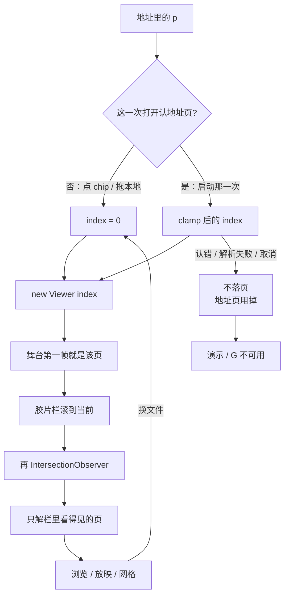
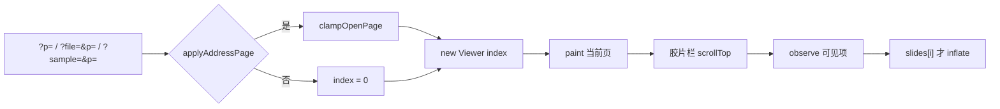

# 深链打开围着目标页，不再先解第 1 页

> 第十九轮持续性迭代。只做这一件事：打开到指定页时，**舞台第一帧就是那一页**，胶片栏也先滚到那一页再观察。Worker 解压、推迟钩子三维扫描、FSA / W、把后台标签网格当产品 bug，本轮不做。

---

## 1. 目标与用户

| 项 | 内容 |
|---|---|
| 用户 | 用一条地址打开 `.pptx` / `.ppt` 看某一页的人：`?file=&p=`、`?sample=&p=`、首页读一次的 `?p=`。不装 Office，文件不出设备。 |
| 要解决的问题 | 第十八轮默认 `parse()` 已经把后页 XML / 图推迟到第一次读到。独立查看器和样本预览构造 Viewer 时带 `index`。官网首页仍先 `new Viewer` 在第 1 页再 `goTo`；三处胶片栏都是先观察栏顶再滚到当前。深链打开仍会先 inflate 第 1 页及其附近。 |
| 成功标准 | 地址页落到夹紧后的页，第一帧就是那一页；胶片栏可见格围着当前页；非法 / 超范围 / 隐藏页与前十二轮相同；换 chip / 换本地 / 失败 / 取消不再套用地址页；首页仍读完就清 `p`，不回写。 |

不为谁做：不改 `parse()`、不收窄钩子三维扫描、不加 Worker 解压、不做假进度条、不把后台标签 rAF 停掉当成网格产品缺陷、不做 W。

---

## 2. 用户场景与流程

主路径：打开 `/?p=5` 或 `?file=/deck.pptx&p=50` → 认文件 / 解析 → **舞台直接画第 5 / 50 页** → 胶片栏先滚到该页再观察 → 看见当前页和它附近的格子。点另一份或拖本地，从第 1 页开。

| 分支 | 行为 |
|---|---|
| 空状态 | 未打开、认错、解析失败、已取消：没有 Viewer。页码 `— / —`。G / 演示不可用。 |
| 非法页码 | 空、`foo`、`0`、小数：当成第 1 页。首页仍立刻清掉 `p`。查看器 / 样本仍按前十二轮删撒谎的 `p`。 |
| 超出总页 | 夹到最后一页。 |
| 隐藏页 | 可以直接落到。`skipHidden` 只约束 ‹ › / 滑动。 |
| 失败 | 下载失败、认错、解析失败：不落页。下一次用户打开从第 1 页起，不继承这次的 `p`。 |
| 取消 | 密码框取消：不落页，不把 `p` 留给下一份。 |
| 换文件 | 点另一颗 chip、拖 / 选本地：从第 1 页开。上一份或地址里的页码不能跟着走。 |
| 首帧 | 构造 Viewer 时带 `index`。禁止先画第 1 页再 `goTo`。当前页 XML / 图仍在第一帧之前按名补解。 |
| 胶片栏 | 占位插完先滚到当前，再 `observe`。`rootMargin` 仍预取附近几张。 |
| 网格 | 已有 `markCurrent` 再 `resumePending`，不改。 |
| 返回 | 首页仍不回写地址。查看器 / 样本翻页回写不变。Esc 分层不改。 |

---

## 3. 范围

| 必须做 | 不做 |
|---|---|
| 官网首页 Demo：`new Viewer(..., { index })`，地址页只作用于启动那一次 | 首页回写 `?p=` |
| 失败 / 取消 / 换文件不再套用地址页 | 改 `parse()` / `ParseOptions` |
| 首页与独立查看器胶片栏：先滚到当前再观察 | 收窄 `prepareAdvancedRendering` 的 slide XML 扫描 |
| 独立查看器 / 样本已有的 `index` 保持 | Worker 解压、`parseInWorker` 改默认 |
| 非法 / 超范围走既有 `parseOpenPage` / `clampOpenPage` | 假进度条、FSA、W、数字+Enter |
|  | 为后台标签补 `visibilitychange`（见第 5 节） |

---

## 4. 调研与缺口

本轮打开并读完的原始页面（不是搜索摘要）：

| 来源 | 用户实际怎么用 | 对本仓库的含义 |
|---|---|---|
| [Optimize long tasks](https://web.dev/articles/optimize-long-tasks) | 原文：**「Any task that takes longer than 50 milliseconds is a long task。」** 结论第三条：**「Finally, do as little work as possible in your functions。」** Worker 是例外路径，不是先做的刀。 | 当前页 PNG inflate 实测约 18–22ms，不到 50ms。200 页肥 XML 钩子扫描约 6ms。都不构成「必须上 Worker / 必须推迟三维扫描」。深链却会**再做一遍第 1 页**，这是可以删掉的工作。 |
| [View & open files](https://support.google.com/drive/answer/2423485?hl=en) | 原文：双击后 **「If you open a video, Microsoft Office file, audio file, or photo, it will open in Google Drive。」** | Web 第一期待是「打开就能看见」。看见的应是链接指向的那一页，不是先闪第 1 页。 |
| [Share files from Google Drive](https://support.google.com/drive/answer/2494822?hl=en) | 原文：Anyone with the link → Copy link → **「Paste the link in an email or any place you want to share it。」** Viewer = 能打开。 | 分享物是一条打开链接。查看器 / 样本已经带 `p`。打开这条链接不该先为第 1 页付 inflate。 |
| [Intersection Observer API](https://developer.mozilla.org/en-US/docs/Web/API/Intersection_Observer_API) | 原文：回调在目标与 root 交叉时触发，并且 **「The first time the observer is initially asked to watch a target element。」** 典型用途是 **lazy-loading**。 | 先 `observe` 再滚，第一次回调看到的是栏顶。先滚再 `observe`，第一次就是当前页附近。 |
| [Page Visibility API](https://developer.mozilla.org/en-US/docs/Web/API/Page_Visibility_API) | 原文：切走标签会 `visibilitychange`。另：**多数浏览器会停止给后台标签发 `requestAnimationFrame()`。** | 第十八轮后台标签网格不刷，符合「隐藏页别做绘制」。回来后 rAF 恢复、IO 仍在。这是后台策略，不是「打开就能看见」断了。 |
| [requestAnimationFrame()](https://developer.mozilla.org/en-US/docs/Web/API/window/requestAnimationFrame) | 原文：**「`requestAnimationFrame()` calls are paused in most browsers when running in background tabs … in order to improve performance and battery life。」** | 自动化在隐藏标签里数格子会得到 0。用户切回来才会画。不当产品 bug 做。 |

对照本仓库：

| 表面 | 已有 | 缺口 |
|---|---|---|
| 默认 `parse()` | 第十八轮：后页 XML / embeddings / media 第一次读到再解 | 产品层仍会先读第 1 页 |
| 独立查看器 | `new Viewer({ index: start })` | 胶片栏先观察栏顶，`updateChrome` 才滚到当前 |
| 样本预览 | 已带 `index`；没有持久栏 | 网格已经 `markCurrent` 再观察 |
| 官网首页 | 读一次 `?p=` 再清掉 | `new Viewer` 默认 0，再 `goTo`；失败后 `pendingPage` 还会留给下一份 |
| 钩子三维扫描 | 仍扫全部版式 XML，后页第一下不是扁的 | 约 6ms，推迟会扁，本轮不收 |
| Worker | `parseInWorker` 整包、无 ChartEx / EMF+ / 三维 hook | 当前页 inflate <50ms，且 parse 必须在首帧前同步完成 |
| 网格后台标签 | IO + 双 rAF | 隐藏时 rAF 暂停是浏览器策略 |

实测（Node 24.3.0，`out/round19-measure.mjs`，不解 TS、只 unzip）：

| 对象 | 中位 |
|---|---|
| 200 页肥 XML 钩子 inflate + 正则 | 约 2.9ms + 3.5ms |
| 4000×3000 / 6000×4000 PNG inflate | 约 18ms / 22ms |
| 固件 showcase / chart / three-d 整包 | 均 <1ms |

更高价值检查：来试「打开这一页看一眼 / 演示」的人，主路径已经不是再少解后页。剩下能在不扁化三维、不加 Worker 契约的前提下删掉的，是产品层对第 1 页的那一次误读。

---

## 5. 是否值得做

| 判定 | 结论 |
|---|---|
| Worker 解压 | **不做。** 当前页 inflate 低于长任务线；`Viewer` / `parse()` 同步；Worker 来回帮不了第一帧；`parseInWorker` 还会丢掉打开前 hook。 |
| 推迟钩子三维扫描 | **不做。** 后页三维第一下必须在同步渲染前 `enableThreeD`。约 6ms 换不来 Viewer 改成异步首帧，也不换「普通稿先下 three-d.js」。 |
| 网格后台标签 | **不做。** MDN：隐藏标签停 rAF 是省电。切回来应继续画。只在自动化隐藏标签里数为 0，不是用户打开路径断了。 |
| 深链围着目标页 | **做。** 第十八轮把后页推迟之后，首页 `goTo` 和栏顶观察会把第 1 页重新变成当前页。只动两个私有应用。 |
| 使用者成本 | 不进八个发布包。不增依赖。失败 / 换文件更不容易套用别人的页码。 |
| 可行路径 | `viewer-core` 已有 `options.index`。胶片栏已有滚动函数。`parseOpenPage` / `clampOpenPage` 已有。 |

---

## 6. 产品方案

| 元素 | 规则 |
|---|---|
| 何时用地址页 | 启动那一次：首页读到的 `?p=`（随后仍清掉地址）、查看器远程 `?file=`、样本深链 `?sample=`。 |
| 舞台 | `new Viewer(..., { skipHidden: true, index })`。不要先画 0 再 `goTo`。 |
| 夹紧 | 与查看器 / 样本同一对函数：非法 → 1；超出 → 最后一页；空稿 `clamp` 失败 → 打开失败，不造 Viewer。 |
| 胶片栏 | 占位按页数插完 → 滚到 `index` → 再 `observe`。宽屏栏仍只渲染交叉项。 |
| 首页地址 | 仍立刻 `replaceState` 清掉 `sample` / `p`。本轮不把首页变成分享面。 |
| 换文件 | chip / 本地选择器 / 拖放：`index = 0`。 |
| 失败 / 取消 | 不落页；地址页视为已用掉，下一份从第 1 页开。 |
| 网格 | 不改开/关/Esc。可见格仍第一次读到才解。 |
| 后页三维 | 钩子仍在 parse 前扫完全部版式 XML。后页第一下仍是立体。 |

---

## 7. 技术方案

| 决策 | 选择 | 原因 |
|---|---|---|
| 为什么不动 core | 第 1 页被读到是产品层问的，不是 `Pkg` 多解了 | 发布包契约 / 体积不动 |
| 为什么首页也要 `index` | 构造函数里立刻 `paint()`；同 tick `goTo` 仍先走完第 1 页的 `slides[0]` | 第十八轮之后这就是一次完整 inflate |
| 为什么失败也要丢掉地址页 | 首页 `pendingPage` 只在成功后清零；认错后再拖文件会跳到别人链接里的页 | 与查看器「本地打开从第 1 页」一致 |
| 为什么胶片栏先滚再观察 | IO **第一次 watch 就会回调**；先观察等于先解栏顶 | 网格已经是先 `markCurrent` 再观察 |
| 为什么不用 `scrollIntoView` 滚栏 | 首页注释：它会带动 `document`，Demo 加载完整页被拽下去 | 继续改 `thumbs.scrollTop` |
| 为什么不改 `rootMargin` | 300px 预取是为了滚动时旁边已有图 | 只改观察时机，不改预取半径 |
| 为什么不做 Worker | 首帧前必须同步拿到当前页；18–22ms 不值新契约 | 见第 5 节 |
| 为什么不做三维推迟 | 后页第一下会扁 | 见第 5 节 |
| 为什么不做 visibilitychange | 隐藏时停绘制是浏览器要的；回来 IO / rAF 会接上 | 自动化假象 |

落点：

| 文件 | 职责 |
|---|---|
| `packages/site/src/boot.ts` | `?p=` 也立刻拉引擎，不等滚到 Demo |
| `packages/site/src/main.ts` | 首页 `index`；地址页一次；胶片栏先滚再观察 |
| `packages/viewer/src/main.ts` | 胶片栏先滚再观察（舞台已有 `index`） |
| `packages/site/src/samples.ts` | 不改（已有 `index`，无持久栏） |
| `tooling/lib/site-open-start-page-browser-contract.mjs` | 首页 `?p=`、换文件、失败不继承 |
| `tooling/lib/standalone-open-page-browser-contract.mjs` | 深链后当前缩略图已渲染 |
| 既有 `test-site-editor-browser` / 官网 i18n 查看器契约 | 接上 |

不变量：`render/` 只认 `types.ts`；core 不碰 `document`；`parse()` 签名不变；首页仍不回写 `p`。

---

## 8. 验收

| # | 标准 | 证据 |
|---|---|---|
| A1 | 首页 `?p=3` 就绪后页码是 `3 / 7`，地址已被清掉 | 新增契约 |
| A2 | 非法 `p` 落到第 1 页；`p=999` 落到最后一页 | 新增契约 |
| A3 | 成功后再点 chip / 拖本地：从第 1 页开 | 新增契约 |
| A4 | `?sample=` 不存在且带 `p` 时，用户拖进来的稿从第 1 页开 | 新增契约 |
| A5 | 查看器 `?file=&p=3`：当前缩略图是第 3 格且已有 SVG | 扩既有契约 |
| A6 | 样本深链、隐藏页、放映、网格、认文件仍按前十八轮 | 旧契约仍跑 |
| A7 | 四项门禁绿 | check / test / build / verify |
| A8 | browser-use：5174 `?p=` 首帧、5173 `?file=&p=` 胶片栏围着当前页；换文件 / 空态 | `out/open-start-page-browser/` |

---

## 9. 方案自评

| 对照 | 结论 |
|---|---|
| 目标 | 解决「深链仍先解第 1 页」，没有偷换成 Worker、三维推迟或网格 visibility |
| 流程 | 主路径、空、失败、取消、换文件、首帧、胶片栏、网格都有出口 |
| 范围 | 只动两个私有应用的打开与胶片栏时序 |
| 与前十八轮 | 不回退放映、备注、滑动、黑屏、网格、打开世代、密码、深链回写、认文件、parse 推迟 |
| AGENTS.md | 不改 `render/` 与 core；不进发布包 |
| 风险 | 7 页样本加 300px `rootMargin` 仍可能一次画出全部缩略图——那是预取半径，不是先解栏顶。长稿深链才看得到少解。`speaker.sync` 仍会读下一页，发生在第一帧之后。 |

确认后再开发：用户是「打开到指定页看一眼/演示的人」；范围只有舞台 `index` + 胶片栏先滚再观察；验收即上表。
