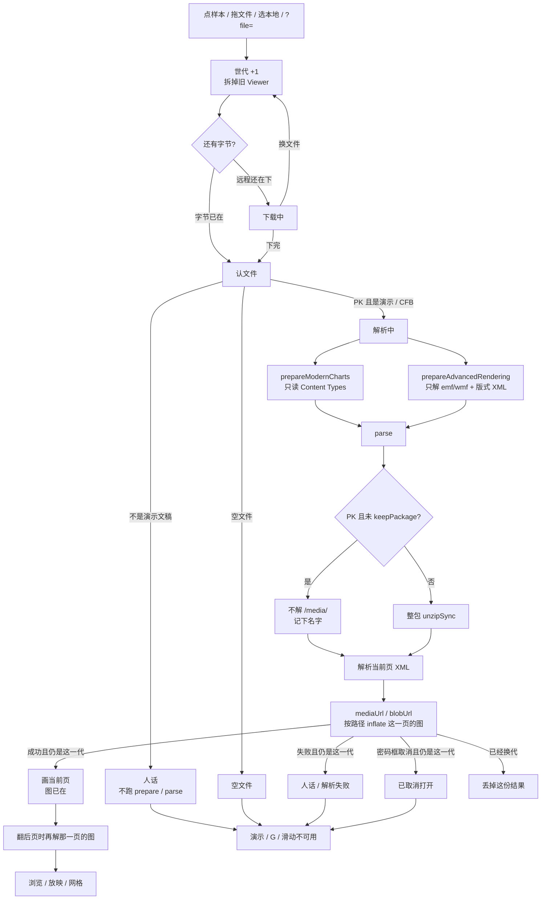
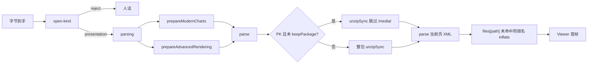

# 预览解析不再整包解媒体

> 第十七轮持续性迭代。只做这一件事：默认 `parse()` 打开真 `.pptx` 时**先不解 `ppt/media`**，当前页真正用到的照片/视频在画这一页时再 inflate。公开函数签名不变，惰性解析不变，首帧不准先错再刷新。`keepPackage` 仍整包解压。假进度条、Worker 解压、FSA / W 本轮不做。

---

## 1. 目标与用户

| 项 | 内容 |
|---|---|
| 用户 | 在浏览器里「先看一眼再演示」的人：拖一份几十 MB 的真 `.pptx`（后页堆满照片、视频），等首屏。不装 Office，文件不出设备。 |
| 要解决的问题 | 第十六轮已经让钩子准备不再二次解媒体。默认 `parse()` 仍对整包 `unzipSync`。惰性解析只推迟 XML，ZIP 里没用到的照片还是会在打开当下全部 inflate，人以为打开卡死。 |
| 成功标准 | 真稿仍先认文件、再准备、再解析；**当前页图片第一帧就在**；后页/未引用的媒体不参与这次等待；`parse()` / `ParseOptions` 签名不变；`keepPackage: true` 的 `package.parts` 仍是完整解压表；ChartEx / EMF+ / 三维仍在 parse 前启用。 |

不为谁做：不接受「先画占位再补图」、不做打开进度条、不把 prepare 的临时解压结果塞进 parse、不改 Worker 默认路径、不恢复本地稿、不做 W。

---

## 2. 用户场景与流程

主路径：拖一份带很多照片的 `.pptx` → 认文件通过 → 钩子只扫图元和版式 XML → **parse 只解 XML / 关系 / 字体等，媒体先记下名字** → 解析当前页时只 inflate 这一页引用的图 → **立刻看见当前页（图已在）** → 点「演示」仍按第一轮。

| 分支 | 行为 |
|---|---|
| 空状态 | 未打开、认错、解析失败、已取消：没有 Viewer。页码 `— / —`。G / B / 滑动不做事。 |
| 失败 | 认文件失败、下载失败、整包不是 Zip/CFB、当前页用到的媒体损坏：只写当前世代。未引用的损坏照片**不**把整份稿判死。 |
| 取消 | 文件选择器没选出文件：不 `begin`。密码框取消：只属于加密稿那一代。 |
| 换文件 | 第一下拆旧稿并 `dispose()`，未解的后页媒体一起丢掉。后一次打开赢。 |
| 首帧正确 | 当前页引用的 PNG / 视频封面 / EMF 在第一次 `renderSlideToSvg` 之前已经 inflate 并建成 URL。不准先画空框再补。ChartEx / EMF+ Only / 三维仍靠打开前 enable。 |
| 翻页 | 惰性页第一次被读到时，只再解那一页引用的 `/media/`。 |
| 返回 | Esc 仍是网格 → 放映 → 关预览。网格会读到各页，那些页的图在进网格时才解。 |
| 恢复 | 不申请文件系统权限。远程 `?file=` 失败仍按第十三轮保留地址。 |

---

## 3. 范围

| 必须做 | 不做 |
|---|---|
| 默认 `parse()`：PK 包先跳过 `/media/`，访问 part 时再解 | 改 `parse()` / `ParseOptions` 签名 |
| 当前页 `mediaUrl` / `blobUrl` / `files[path]` 触发单文件 inflate | 把 prepare 已解部件交给 parse（要新参数或隐式缓存） |
| `keepPackage: true` 仍整包 `unzipSync`，`parts` 仍是普通表 | 给 `package.parts` 做 Proxy（编辑层会 `Object.keys` / 展开，会把媒体一次性解完） |
| 固件：未引用损坏照片不挡首屏；当前页图在；后页图在访问时出现；keepPackage 仍能读未引用 part | 假进度条、「正在打开」新文案 |
| 首页 Demo、样本预览、独立查看器继续 `parse(bytes)` | Worker 解压、`parseInWorker` 改默认 |
|  | FSA / W / 数字+Enter |
|  | 改 `render/`、让 core 碰 `document` |

---

## 4. 调研与缺口

本轮打开并读完的原始页面（不是搜索摘要）：

| 来源 | 用户实际怎么用 | 对本仓库的含义 |
|---|---|---|
| [Files you can store](https://support.google.com/drive/answer/37603?hl=en) | 原文：**「The Google Drive preview is a scaled-down version of the complete file and may, when opened, appear slightly different。」** 可预览类型把 **PowerPoint (.PPT and .PPTX)** 单列。另写 **Presentations Up to 100 MB for presentations converted to Google Slides**；Drive 本身 **Up to 5 TB**。 | Web 预览按「文件可能很大」设计。首屏要的是当前页，不是把 Zip 里所有照片 inflate。 |
| [View & open files](https://support.google.com/drive/answer/2423485?hl=en) | 原文步骤：双击后 **「If you open a video, Microsoft Office file, audio file, or photo, it will open in Google Drive。」** | 「打开就能看见」是预览主路径。卡在 parse 整包解媒体，就是这条路径断了。 |
| [Work with Office files](https://support.google.com/docs/answer/6055139?hl=en) | 原文：**「You can edit, download, and convert Microsoft® Office files in Google Docs, Sheets, and Slides。」** 密码稿先到密码框，再选 **Preview**（只读）或 **Edit**。兼容表把演示限制为 **.ppt / .pptx** 同族。 | 预览承诺的是演示文稿当前画面。加密稿仍走密码框，本轮不改。 |
| [File types supported for previewing files in OneDrive, SharePoint, and Teams](https://support.microsoft.com/en-us/office/file-types-supported-for-previewing-files-in-onedrive-sharepoint-and-teams-e054cd0f-8ef2-4ccb-937e-26e37419c5e4) | 原文：**「You can preview hundreds of file types … without installing the application used to create the file。」** Office Online Server 文档预览含 **PowerPoint (POTM, POTX, PPSM, PPSX, PPT, PPTM, PPTX)**。图片预览另有上限：**「if the image size is less than 100 MB」**。 | 微软把「能预览的种类」和「单张图多大才解」分开。本仓库也不该为了后页照片挡住当前页。 |
| [File API](https://developer.mozilla.org/en-US/docs/Web/API/File_API)（MDN） | 原文：**「The File API enables web applications to access files and their contents. Web applications can access files when the user makes them available, either using a file `<input>` element or via drag and drop。」** `File` 提供元数据；内容要另读。**Note: This feature is available in Web Workers.** | 字节已经在内存里。整包 inflate 是 CPU。Worker 能读文件，但不能替代「当前页第一次画之前必须同步拿到这页的图」。 |
| [Optimize long tasks](https://web.dev/articles/optimize-long-tasks) | 原文：超过 **50 milliseconds** 的部分是 **blocking period**；主线程长任务会挡住交互。建议把不必做的工作拿掉或切到 50ms 以内。 | 未引用媒体的 inflate 是可以删除的长任务。进度条砍不掉这段 CPU。 |
| fflate `0.8.3` 类型定义 | `UnzipFileFilter` 原文：**「Whether or not to extract the current file」**；`UnzipFileInfo` 在解压前就能看 `name` / `originalSize`。`unzipSync(data, opts?)` 可带 `filter`。 | 不需要自己写 Zip parser。跳过 `/media/` 后再按名字解单文件，是库的正式用法。 |

对照本仓库：

| 表面 | 已有 | 缺口 |
|---|---|---|
| 认文件 | 第十四 / 十五轮：错文件不进 prepare / parse | 真 `.pptx` 仍整包解 media |
| 钩子准备 | 第十六轮：只解 emf/wmf + 版式 XML | 结果丢弃，不交 parse |
| 惰性解析 | 默认只解析当前页 XML，首屏约快 11 倍 | `Pkg` 仍对整包 `unzipSync` |
| `keepPackage` | 编辑保存、`Object.keys(parts)`、`{ ...parts }` | 若对 parts 做懒 Proxy，展开会把媒体一次解完 |
| 图元 / 图片 | `mediaUrl` / `blobUrl` 都走 `this.files[path]` | 只要 getter 能补上字节，首帧不会空 |
| ChartEx | 打开前 `prepareModernCharts` | 本轮不推迟 enable |
| FSA / W | 候选 | 覆盖面未变，不解决大文件首屏 |

更高价值检查：来试「拖一份稿看一眼 / 演示」的人，主路径就是默认 `parse()`。Drive / OneDrive 都按大文件预览来写。钩子二次解压已经去掉，剩下的主等待就是 parse 整包 inflate。把 prepare 结果交给 parse 要改公开面或做隐式缓存；评估后不值得。主线程 Worker 解压只有在不能动 parse 时才考虑——现在能少解，就少解。

---

## 5. 是否值得做

| 判定 | 结论 |
|---|---|
| 使用者成本 | 改的是已有 `parse()` 内部。签名不变。普通预览少解后页照片；编辑 `keepPackage` 路径与现在相同。运行时依赖仍是 fflate。 |
| 可行路径 | fflate `filter` 在解压前就能看名字。解析读图只走 `files[path]`。当前页 `parseSlide` 会调用 `mediaUrl`，inflate 发生在第一次渲染之前。 |
| 动发布包？ | 必须。`Pkg` 在 `@web-ppt/core`。体积：多一个按名 filter + 单文件 unzip，不打进 emf-plus / three-d / chart-ex。契约：默认 parse 观察结果与现在相同（当前页图在、后页第一次读也在）；`keepPackage.parts` 仍完整。 |
| 换候选？ | 复用 prepare：要新参数或模块缓存，公开面变大。Worker：接上会丢掉打开前 hook，首屏还多一次往返。进度条：等待还在。跳过当前页图：首帧错。 |
| 判定 | **做默认 parse 跳过未引用 `/media/`。** |

---

## 6. 产品方案

| 元素 | 规则 |
|---|---|
| 何时少解 | 认文件判定为演示文稿之后、默认 `parse()` 解 PK 包时。 |
| 先解什么 | 全部非 `/media/` 部件：presentation / slides / layouts / masters / theme / rels / 图表 XML / 字体 / embeddings。 |
| 后解什么 | 路径匹配 `/media/` 的部件。当前页 `mediaUrl` / `blobUrl` / `files[path]` / `imageMetadata` 第一次碰到时再 `unzipSync({ filter: name === path })`。 |
| 不解什么 | 从未被访问的后页照片、未引用的视频 `.bin`、包里多余的媒体。 |
| `keepPackage` | 仍整包解。编辑保存要按名字取任意 part，且会枚举 `parts`。 |
| ChartEx / EMF+ / 三维 | 仍只在 parse 前由现入口 enable。本轮不改准备扫描。 |
| 首帧 | 启用发生在第一次渲染之前；当前页图在 `parseSlide` 里就已经建成 URL。 |
| 空 / 错文件 | 认文件挡在前面。坏 Zip、缺 `presentation.xml` 仍立刻抛错。 |
| 损坏的未引用照片 | 默认 parse **成功**（不再被整包 `unzipSync` 拖死）。`keepPackage` 仍会在打开时撞上并抛错——编辑要完整 parts。 |
| 损坏的当前页图 | inflate 失败向上抛；该页走现有「第 N 页解析失败」卡片，不吞异常、不假装图在。 |
| 加密 CFB | 解密后的 PK 走同一条默认 parse。密码框仍在 parse。 |
| 放映 / 网格 | 不改交互。网格第一次读到某页时才解那一页的图。 |
| 换文件 | 世代与 `dispose()` 不改；未解媒体随源字节一起丢掉。 |

---

## 7. 技术方案

| 决策 | 选择 | 原因 |
|---|---|---|
| 为什么动发布包 | `Pkg` 是所有预览面共用的解包点；抄到 site/viewer 会再解一次 | 体积几乎不增；`parse()` 签名不变 |
| 为什么只跳 `/media/` | 照片/视频几乎都在这里；XML / 图表 / 字体必须先在，才能知道当前页引用了谁 | embeddings / vba 不是预览主等待 |
| 为什么不把 emf 排除在外 | 当前页 EMF 会走 `mediaUrl`，照样在首帧前 inflate；未引用的图元不必先解 | 规则更短，少特判 |
| 为什么不复用 prepare 结果 | 要给 `parse` 增加预解压参数，或做跨调用缓存 | 公开面变大，世代/释放难讲清 |
| 为什么 keepPackage 仍整包 | `edit-core` 会 `Object.keys(parts)`、`{ ...parts }`；懒 getter 会被展开一次性触发 | 预览默认不带 keepPackage |
| 为什么损坏未引用媒体不再挡默认 parse | 预览用不到它；整包校验会把大照片稿误判为打不开 | keepPackage 仍校验全部，编辑不放水 |
| 为什么当前页损坏图要抛 | fast-fail；该页已有失败卡片 | 不准返回空 src 假装成功 |
| 为什么不做 Worker | 打开前 hook 必须同步发生在 parse 前；Worker 还要把图字节传回主线程 | 先删掉不必做的 inflate |

落点：

| 文件 | 职责 |
|---|---|
| `packages/core/src/pptx/zip-preview.ts` | 跳过 `/media/` 的 `unzipSync` + 按名补解 |
| `packages/core/src/pptx/package-reader.ts` | 非 `keepPackage` 走预览解包；`dispose` 丢掉源字节 |
| `tooling/test-parse-preview-parts.mjs` | 未引用损坏照片不挡首屏；当前页图在；后页访问才需要那张图；keepPackage 仍完整；`--dist` 走发布入口 |
| `package.json` `test:core` / `test:functional` / `verify` | 纳入门禁 |

不变量：`render/` 只认 `types.ts`；core 不碰 `document`；`parse()` 签名不变。

体积对照（源码门禁实测；构建后再核 `dist`）：

| 产物 | 实测 |
|---|---|
| 官网首次打开闭包 gzip | 543760（预算原 543413 + 347）。多出来的是默认 parse 跳过 `/media/` 后按名补解 |
| 主 `dist/core.js` | 222.66 kB / gzip 79.86 kB |

---

## 8. 验收

| # | 标准 | 证据 |
|---|---|---|
| A1 | 当前页有效 PNG + 未引用损坏 PNG：默认 parse 成功，第一页 `image.src` 有值 | 新增契约 |
| A2 | 整包 `unzipSync` 必须撞上这份损坏照片 | 新增契约 |
| A3 | 第二页图在访问 `slides[1]` 后才出现；只读 `length` 不触发后页 | 新增契约 |
| A4 | `keepPackage: true` 仍能读未引用的完好媒体 part；损坏未引用媒体仍抛 | 新增契约 |
| A5 | 未引用视频 `.bin` 损坏不挡文本首页 | 新增契约 |
| A6 | 真 `.pptx` / 加密稿 / 认错 / 换文件 / 放映仍按前十六轮 | 旧契约仍跑 |
| A7 | 四项门禁绿；core 体积对照构建产物 | check / test / build / verify 均通过；`dist/core.js` 222.66 kB / gzip 79.86 kB |
| A8 | browser-use：5174 首页打开 + 5173 打开三维 / EMF+ / 普通稿 / 图表，首帧可见且有图 | `out/parse-preview-parts-browser/01–09-*.png`；404 空态与换稿后三维首帧也过 |

---

## 9. 方案自评

| 对照 | 结论 |
|---|---|
| 目标 | 解决「真稿首屏被 parse 整包解媒体拖住」，没有偷换成做进度条、FSA、W 或 Worker |
| 流程 | 主路径、空、失败、取消、换文件、首帧正确、翻页都有出口 |
| 范围 | 只改默认 PK 解包；不改 parse 公开面 |
| 与前十六轮 | 不回退放映、备注、滑动、黑屏、网格、打开世代、密码、深链、认文件、钩子收窄 |
| AGENTS.md | 不改 `render/`；core 不碰 `document`；动发布包已评估签名/体积/首帧 |
| 风险 | 非 `/media/` 的超大 embeddings 仍会先解——那不是预览主路径。`keepPackage` 观察行为与现在相同。后页三维仍靠打开前扫完全部版式 XML。 |

确认后再开发：用户是「打开一份大真稿看一眼/演示的人」；范围只有默认 parse 跳过未引用媒体；验收即上表。
