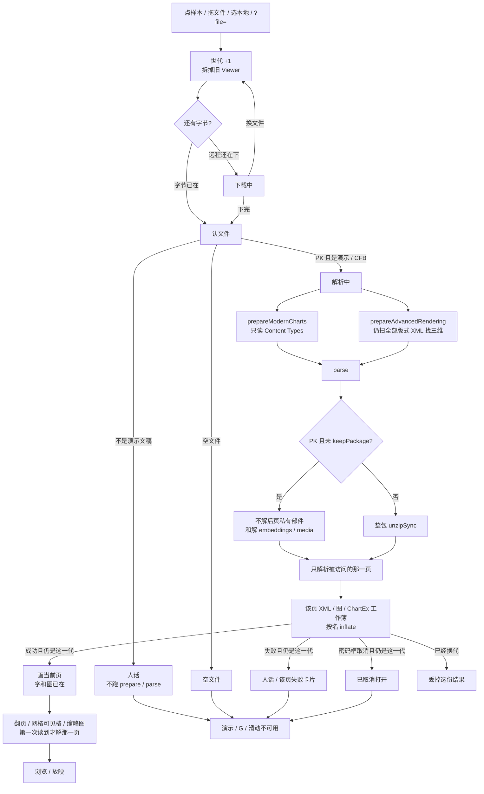
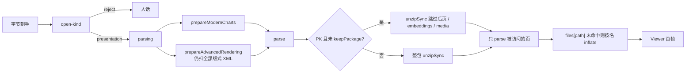

# 预览解析不再整包解后页与嵌入物

> 第十八轮持续性迭代。只做这一件事：默认 `parse()` 打开真 `.pptx` 时，**后页私有部件和未引用 embeddings 先不解**。当前页 XML / 图 / ChartEx 工作簿仍在第一次画之前按名补解。公开函数签名不变。`keepPackage` 仍整包。假进度条、Worker 解压、FSA / W 本轮不做。

---

## 1. 目标与用户

| 项 | 内容 |
|---|---|
| 用户 | 在浏览器里「先看一眼再演示」的人：拖一份 200 页文本稿，或后页塞满内嵌 OLE / 工作簿的真 `.pptx`，等首屏。不装 Office，文件不出设备。 |
| 要解决的问题 | 第十七轮已经让默认 `parse()` 跳过未引用 `/media/`。惰性解析也只解析当前页。但 ZIP 仍会在打开当下 inflate 全部 `ppt/slides/slideN.xml` 和 `ppt/embeddings/*`。文本长稿和 OLE 稿的主等待从照片换成了这些部件。 |
| 成功标准 | 真稿仍先认文件、再准备、再解析；**当前页第一帧文字和图片都在**；只读 `slides.length` 不解后页；网格第一次读到某页才解那一页；未引用 embeddings 损坏不挡首屏；`parse()` / `ParseOptions` 签名不变；`keepPackage: true` 仍整包。 |

不为谁做：不接受「先画空页再补字」、不做打开进度条、不改打开前三维扫描范围、不把 prepare 结果交给 parse、不改 Worker 默认路径、不恢复本地稿、不做 W。

---

## 2. 用户场景与流程

主路径：拖一份 200 页文本稿或带未引用 OLE 的 `.pptx` → 认文件通过 → 钩子仍扫全部版式 XML 找三维 → **parse 只解全局部件，后页 XML / embeddings 记下名字** → 解析当前页时 inflate 这一页的 XML、关系和它引用的图 / 图表 / 工作簿 → **立刻看见当前页** → 点「全部」后，可见格子才解那些页。

| 分支 | 行为 |
|---|---|
| 空状态 | 未打开、认错、解析失败、已取消：没有 Viewer。页码 `— / —`。G / B / 滑动不做事。 |
| 失败 | 认文件失败、下载失败、整包不是 Zip/CFB、当前页 XML / 图 / 工作簿损坏：只写当前世代。未引用的损坏后页或 embeddings **不**把整份稿判死。 |
| 取消 | 文件选择器没选出文件：不 `begin`。密码框取消：只属于加密稿那一代。 |
| 换文件 | 第一下拆旧稿并 `dispose()`，未解的后页和 embeddings 一起丢掉。后一次打开赢。 |
| 首帧正确 | 当前页 XML、关系、图片、图表、ChartEx 工作簿在第一次 `renderSlideToSvg` 之前已经 inflate。不准先画空白再补。ChartEx / EMF+ / 三维仍靠打开前 enable。 |
| 翻页 | 惰性页第一次被读到时，只再解那一页的私有部件和它引用的图 / 嵌入物。 |
| 网格 / 缩略图 | 打开网格只建格子，不遍历 `slides[i]`。IntersectionObserver 让某格可见后才 `slides[i]` + 渲染。宽屏缩略图栏同样按可见项解。 |
| 返回 | Esc 仍是网格 → 放映 → 关预览。 |
| 恢复 | 不申请文件系统权限。远程 `?file=` 失败仍按第十三轮保留地址。 |

---

## 3. 范围

| 必须做 | 不做 |
|---|---|
| 默认 `parse()`：PK 包跳过后页私有部件和 `/embeddings/`，访问 part 时再解 | 改 `parse()` / `ParseOptions` 签名 |
| 当前页 `pkg.xml` / `rels` / `mediaUrl` / ChartEx `readPart` 触发单文件 inflate | 把 prepare 已解的版式 XML 交给 parse |
| `keepPackage: true` 仍整包 `unzipSync` | 给 `package.parts` 做 Proxy |
| 固件：损坏后页 / 未引用 embeddings 不挡首屏；当前页字和图在；网格访问才需要那一页 | 假进度条、「正在打开」新文案 |
| 首页 Demo、样本预览、独立查看器继续 `parse(bytes)` | 收窄 `prepareAdvancedRendering` 的版式 XML 扫描 |
|  | Worker 解压、`parseInWorker` 改默认 |
|  | FSA / W / 数字+Enter |
|  | 改 `render/`、让 core 碰 `document` |

---

## 4. 调研与缺口

本轮打开并读完的原始页面（不是搜索摘要）：

| 来源 | 用户实际怎么用 | 对本仓库的含义 |
|---|---|---|
| [Optimize long tasks](https://web.dev/articles/optimize-long-tasks) | 原文：**「Any task that takes longer than 50 milliseconds is a long task。」** 超出部分是 **blocking period**。**「The browser blocks interactions from occurring while a task of any length is running。」** 结论第三条：**「Finally, do as little work as possible in your functions。」** Worker 只是例外路径，不是先加进度条。 | 200 页 XML 和 OLE 的 inflate 是可以删除的长任务。先少做，再谈切任务或 Worker。 |
| [Files you can store](https://support.google.com/drive/answer/37603?hl=en) | 原文：**「The Google Drive preview is a scaled-down version of the complete file and may, when opened, appear slightly different。」** 可预览类型把 **PowerPoint (.PPT and .PPTX)** 单列。**Presentations Up to 100 MB for presentations converted to Google Slides**；Drive 本身 **Up to 5 TB**。 | Web 预览按「文件可能很大」设计。首屏要的是当前页，不是把后页 XML 和 OLE 解完。 |
| [View & open files](https://support.google.com/drive/answer/2423485?hl=en) | 原文步骤：双击后 **「If you open a video, Microsoft Office file, audio file, or photo, it will open in Google Drive。」** | 「打开就能看见」是预览主路径。卡在 parse 解后页，就是这条路径断了。 |
| [Work with Office files](https://support.google.com/docs/answer/6055139?hl=en) | 原文：**「You can edit, download, and convert Microsoft® Office files in Google Docs, Sheets, and Slides。」** 密码稿先到密码框，再选 **Preview**（只读）或 **Edit**。兼容表把演示限制为 **.ppt / .pptx** 同族。另写嵌入图表在转换时变成图片。 | 预览承诺的是当前画面。加密稿仍走密码框。预览更不需要先打开未引用 OLE 工作簿。 |
| [File types supported for previewing files in OneDrive, SharePoint, and Teams](https://support.microsoft.com/en-us/office/file-types-supported-for-previewing-files-in-onedrive-sharepoint-and-teams-e054cd0f-8ef2-4ccb-937e-26e37419c5e4) | 原文：**「You can preview hundreds of file types … without installing the application used to create the file。」** Office Online Server 文档预览含 **PowerPoint (POTM, POTX, PPSM, PPSX, PPT, PPTM, PPTX)**。图片预览另有上限：**「if the image size is less than 100 MB」**。三维预览另有 **250MB** 上限。 | 微软把「能预览的种类」和「单件多大才解」分开。本仓库也不该为了后页 OLE 挡住当前页。 |
| [File API](https://developer.mozilla.org/en-US/docs/Web/API/File_API)（MDN） | 原文：**「The File API enables web applications to access files and their contents. Web applications can access files when the user makes them available, either using a file `<input>` element or via drag and drop。」** `File` 提供元数据；内容要另读。**Note: This feature is available in Web Workers.** | 字节已经在内存里。整包 inflate 是 CPU。Worker 能读文件，但不能替代「当前页第一次画之前必须同步拿到这一页」。 |
| fflate `0.8.3` 类型定义 | `UnzipFileFilter` 原文：**「Whether or not to extract the current file」**；`UnzipFileInfo` 在解压前就能看 `name` / `originalSize`。 | 不需要自己写 Zip parser。第十七轮的按名补解已经在用。本轮只扩大跳过集合。 |

对照本仓库：

| 表面 | 已有 | 缺口 |
|---|---|---|
| 认文件 | 第十四 / 十五轮：错文件不进 prepare / parse | 真稿仍会解后页 |
| 钩子准备 | 第十六轮：只解 emf/wmf + **全部**版式 XML，为了后页三维第一下就是立体 | 本轮不收窄；那是一次性扫描，结果丢弃 |
| 惰性解析 | 默认只解析当前页 XML，首屏约快 11 倍 | `Pkg` 仍 inflate 全部 slide XML |
| 媒体 | 第十七轮：默认 parse 跳过 `/media/` | embeddings / 后页 XML 仍先解 |
| 网格 / 缩略图 | 只建格子；可见项才 `slides[i]` | 打开当下那些页的 XML 已经解完了 |
| ChartEx | 当前页 `readPart` 读工作簿 | 未引用的其它 embeddings 不必先解 |
| OLE 预览 | 走页面里的 pic / VML → `/media/`，不读 `.bin` | 解 `ppt/embeddings/*` 对预览画面没有贡献 |
| FSA / W | 候选 | 覆盖面未变，不解决大文件首屏 |

更高价值检查：来试「拖一份稿看一眼 / 演示」的人，主路径仍是默认 `parse()`。Drive / OneDrive 都按大文件预览来写。web.dev 的第一刀是少做。媒体已经跳过之后，剩下能在不改公开面、不闪错的前提下删掉的，就是后页私有部件和未引用 embeddings。当前页超大图仍可能 >50ms，那是下一刀；本轮还能少解，就先少解。Worker 和解进度条都砍不掉「根本不必做的 inflate」。

打开前钩子仍会扫全部 slide XML 找三维。产品路径上后页 XML 会被钩子解一次并丢弃，parse 不再解第二次。embeddings 钩子本来就不解，产品路径和 SDK 都少掉整包 OLE inflate。

---

## 5. 是否值得做

| 判定 | 结论 |
|---|---|
| 使用者成本 | 改的是已有 `isPreviewDeferredPart`。签名不变。普通预览少解后页和 OLE；编辑 `keepPackage` 路径与现在相同。运行时依赖仍是 fflate。 |
| 可行路径 | 惰性页已经只在 `slides[i]` 时调用 `parseSlide` → `pkg.xml` / `rels`。网格和缩略图也是可见才读。ChartEx 只对当前页 `files[path]`。扩大 filter 即可。 |
| 动发布包？ | 必须。`Pkg` 在 `@web-ppt/core`。体积：只加路径判断，不打进 emf-plus / three-d / chart-ex。契约：默认 parse 观察结果与现在相同（当前页在、后页第一次读也在）；`keepPackage.parts` 仍完整。 |
| 换候选？ | 复用 prepare：要新参数或模块缓存。收窄钩子扫描：后页三维会扁。Worker：接上会丢掉打开前 hook，首屏还多一次往返。进度条：等待还在。 |
| 判定 | **做默认 parse 跳过后页私有部件和未引用 embeddings。** |

---

## 6. 产品方案

| 元素 | 规则 |
|---|---|
| 何时少解 | 认文件判定为演示文稿之后、默认 `parse()` 解 PK 包时。 |
| 先解什么 | 全局部件：`[Content_Types]`、`presentation.xml` 及其关系、母版 / 版式 / 主题、表格样式、批注作者、嵌入字体。当前页第一次被读到时再解它的私有部件。 |
| 后解什么 | `ppt/slides/slideN.xml` 与对应 `_rels`、`ppt/notesSlides/`、`ppt/comments/`、`ppt/charts/`、`ppt/diagrams/`、`/embeddings/`、`/media/`、`ppt/vbaProject*`。访问 `files[path]` 时按名 inflate。 |
| 不解什么 | 从未被访问的后页、未引用的 OLE / 工作簿、未引用的 VBA、包里多余的媒体。 |
| `keepPackage` | 仍整包解。编辑保存要按名字取任意 part，且会枚举 `parts`。 |
| ChartEx / EMF+ / 三维 | 仍只在 parse 前由现入口 enable。钩子仍扫全部版式 XML。当前页 ChartEx 工作簿走 `readPart` → 按名 inflate，发生在首帧前。 |
| 首帧 | 启用发生在第一次渲染之前；当前页字、图、图表在 `parseSlide` 里就已经建成。 |
| 空 / 错文件 | 认文件挡在前面。坏 Zip、缺 `presentation.xml` 仍立刻抛错。 |
| 损坏的未引用后页 / embeddings | 默认 parse **成功**。`keepPackage` 仍会在打开时撞上并抛错。 |
| 损坏的当前页 | inflate 或解析失败向上走现有「第 N 页解析失败」卡片，不吞异常、不假装页在。 |
| 加密 CFB | 解密后的 PK 走同一条默认 parse。密码框仍在 parse。 |
| 放映 / 网格 | 不改交互。网格第一次读到某页时才解那一页。 |
| `lazy: false` | 会访问全部页，因此会补解全部页私有部件。这是调用方明确要求「全部解析完毕」。 |
| 换文件 | 世代与 `dispose()` 不改；未解部件随源字节一起丢掉。 |

---

## 7. 技术方案

| 决策 | 选择 | 原因 |
|---|---|---|
| 为什么动发布包 | `Pkg` 是所有预览面共用的解包点；抄到 site/viewer 会再解一次 | 体积几乎不增；`parse()` 签名不变 |
| 为什么连 slide rels / notes / charts 一起跳 | 它们只在 `parseSlide` 里读；只跳 `slideN.xml` 仍会 inflate 200 份关系和图表 | 与惰性页同一条访问链 |
| 为什么 embeddings 和 VBA 一起跳 | 预览画面不读 OLE 字节；ChartEx 要读时走 `files[path]` | 未引用的工作簿是文本稿之外的另一类主等待 |
| 为什么不跳母版 / 版式 / 主题 | 当前页继承链马上会读；数量远小于页数 | 少特判，避免首页版式晚一拍 |
| 为什么不改钩子扫描 | 后页三维必须在打开当下 enable，否则第一下是扁的 | 第十六轮已定；本轮只删 parse 的第二次 inflate |
| 为什么 keepPackage 仍整包 | `edit-core` 会 `Object.keys(parts)`、`{ ...parts }` | 预览默认不带 keepPackage |
| 为什么损坏未引用后页不再挡默认 parse | 预览用不到它；整包校验会把长稿误判为打不开 | keepPackage 仍校验全部 |
| 为什么当前页损坏要走失败卡片 | fast-fail；该页已有失败卡片 | 不准返回空页假装成功 |
| 为什么不做 Worker | 打开前 hook 必须同步发生在 parse 前；当前页图仍要在首帧前同步拿到 | 先删掉不必做的 inflate |

落点：

| 文件 | 职责 |
|---|---|
| `packages/core/src/pptx/zip-preview.ts` | 扩大推迟集合；按名补解沿用现 Proxy |
| `packages/core/src/pptx/package-reader.ts` | 注释与第十七轮一致：预览走推迟表 |
| `tooling/test-parse-preview-parts.mjs` | 损坏后页 / 未引用 embeddings 不挡首屏；只读 length 不解后页；网格式访问才需要那一页；keepPackage 仍完整 |
| `docs/expanded-capabilities.md` | 与默认 parse 推迟范围一致 |
| `package.json` 既有门禁 | 不新增命令 |

不变量：`render/` 只认 `types.ts`；core 不碰 `document`；`parse()` 签名不变。

体积对照（构建与官网门禁实测）：

| 产物 | 实测 |
|---|---|
| 官网首次打开闭包 gzip | 543857（预算原 543760 + 97）。多出来的是推迟后页 / embeddings 的路径判断 |
| 主 `dist/core.js` | 222.66 kB / gzip 79.86 kB |

---

## 8. 验收

| # | 标准 | 证据 |
|---|---|---|
| A1 | 当前页有效内容 + 后页 XML 损坏：默认 parse 成功，第一页文字在，只读 `length` 不触发后页 | 新增契约 |
| A2 | 访问损坏后页：走页面失败卡片，不假装页在 | 新增契约 |
| A3 | 未引用 embeddings 损坏不挡文本首页；整包 `unzipSync` 必须撞上 | 新增契约 |
| A4 | `keepPackage: true` 仍能读未引用完好 embeddings；损坏未引用 embeddings 仍抛 | 新增契约 |
| A5 | 当前页图、未引用照片、后页图仍按第十七轮 | 旧契约仍跑 |
| A6 | 真 `.pptx` / 加密稿 / 认错 / 换文件 / 放映 / 网格仍按前十七轮 | 旧契约仍跑 |
| A7 | 四项门禁绿；core 体积对照构建产物 | check / test / build / verify 均通过；`dist/core.js` 222.66 kB / gzip 79.86 kB |
| A8 | browser-use：5174 首页打开 + 5173 打开三维 / EMF+ / 普通稿 / 图表 / 多页跳转，首帧可见 | `out/parse-preview-slides-browser/01–13-*.png`；404 空态与换稿后三维首帧也过 |

---

## 9. 方案自评

| 对照 | 结论 |
|---|---|
| 目标 | 解决「真稿首屏被后页 XML / OLE inflate 拖住」，没有偷换成做进度条、FSA、W 或 Worker |
| 流程 | 主路径、空、失败、取消、换文件、首帧正确、网格可见才解都有出口 |
| 范围 | 只扩大默认 PK 推迟集合；不改 parse 公开面；不改钩子三维扫描 |
| 与前十七轮 | 不回退放映、备注、滑动、黑屏、网格、打开世代、密码、深链、认文件、钩子收窄、媒体推迟 |
| AGENTS.md | 不改 `render/`；core 不碰 `document`；动发布包已评估签名/体积/首帧 |
| 风险 | 产品路径上钩子仍会解一次全部 slide XML——后页三维不能扁。embeddings 不再被那次扫描碰到。`lazy: false` 会补解全部页，这是调用方要的。超大当前页图仍可能 >50ms，本轮不假装已消失。 |

确认后再开发：用户是「打开一份长稿或 OLE 稿看一眼/演示的人」；范围只有默认 parse 扩大推迟集合；验收即上表。
