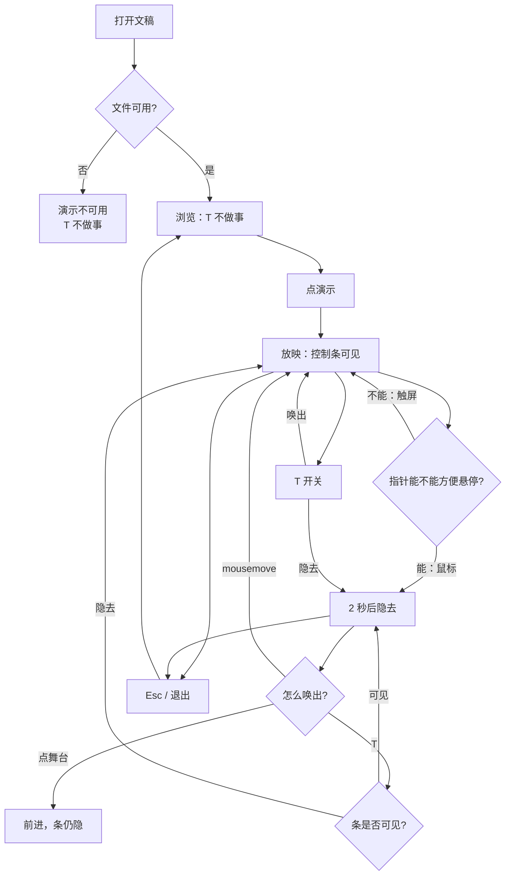
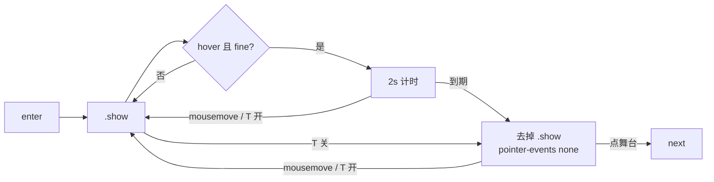

# 放映控制条隐去后还能再唤出

> 第二十轮持续性迭代。只做这一件事：官网首页 Demo 与样本预览在**放映中**，控制条隐去之后还能再看见。`T` 开关；没有悬停的触屏不自动藏。独立查看器演讲者侧栏、Worker 解压、钩子三维扫描、FSA / W 本轮不做。

---

## 1. 目标与用户

| 项 | 内容 |
|---|---|
| 用户 | 在浏览器里打开 `.pptx` / `.ppt` 后点「演示」的人：投屏讲两页、手机上看一眼再退出、键盘上按官方快捷键。不装 Office，文件不出设备。 |
| 要解决的问题 | 控制条 2 秒后 `opacity: 0`，只有 `mousemove` 再唤出。没有 `T`。触屏没有悬停、也没有 Esc，条隐去后看不见退出 / G / B / N。隐去的条仍能点到，底边会被看不见的按钮偷走点击。 |
| 成功标准 | 能悬停时：过一会儿隐去，`T` 开关，鼠标移动再出现。不能方便悬停时：条一直在。隐去后点舞台仍前进，点不到看不见的按钮。浏览态 `T` 不做事。放映、黑屏、滑动、网格、深链仍按前十九轮。 |

不为谁做：不改 `parse()`、不收窄钩子三维扫描、不加 Worker 解压、不做 W、不做数字+Enter、不改独立查看器演讲者侧栏、不做编辑器放映。

---

## 2. 用户场景与流程

主路径：打开文稿 → 点「演示」→ 看见控制条 → 鼠标停住后条隐去 → 按 `T` 或移动鼠标 → 条回来 → 点退出 / Esc 离开。手机：条不隐去，随时能退出。

| 分支 | 行为 |
|---|---|
| 空状态 | 未打开或打开失败：没有放映，`T` 不做事。 |
| 失败 | 全屏被拒：仍在放映。能悬停则照常隐去；不能则条一直在。 |
| 取消 | 浏览态 `T`、输入框里的 `T`：不开关控制条。 |
| 返回 | Esc / 退出 / 退出全屏：离开放映，条一起收掉。 |
| 恢复 | 再进放映从当前页开始，条先可见。换文件先退出，不把上一份的条留在屏幕上。 |
| 黑屏 / 网格 | `T` 只开关控制条。B / G / Esc 分层不改。隐去时黑层、网格仍按前几轮。 |

---

## 3. 范围

| 必须做 | 不做 |
|---|---|
| 首页 Demo、样本预览共用现有 `bindPresentMode` | 独立查看器演讲者侧栏改成隐去 |
| `T` / `t` 开关控制条（官方 toggle） | W、句号别名、数字+Enter |
| `(hover: hover) and (pointer: fine)` 才自动隐去 | 钩子三维扫描、Worker 解压 |
| 隐去后 `pointer-events: none`，点击落到舞台 | FSA、编辑器放映 |
| 鼠标移动仍唤出（条在底中，不要求左下角） | 双屏 / 激光笔 / 画笔 |
|  | 改 `render/`、改 core、推进发布包 |

---

## 4. 调研与缺口

本轮打开并读完的原始页面（不是搜索摘要）：

| 来源 | 用户实际怎么用 | 对本仓库的含义 |
|---|---|---|
| [Present your slide show](https://support.microsoft.com/en-us/powerpoint/present-your-slide-show) · Web 栏（页面 2026-09-15 更新，正文 870 词） | **「After a short time, the control bar may disappear. If so, you can move your cursor to the lower-left corner, and it will reappear. You can also toggle (on/off) with 'T' on the keyboard.」** 控制条只给演讲者看。按钮表有上一页 / 下一页 / **See all slides** / End Show。 | 隐去是官方 Web 行为。唤出有两条：鼠标移向条、`T` **开关**。我们的条在底中，mousemove 对整块舞台等价于「移向条」。缺的是 `T` 和「隐去后不能偷点」。 |
| 同上 · Windows Mobile 栏 | 前进：空格或**点屏幕**。上一页：P。结束：Esc。**B 黑屏**。这一栏没有 `T`，也没有「控制条会消失」。 | 手机官方靠点屏幕和 Esc。我们的手机没有 Esc，条若隐去，退出 / G / B 会看不见。触屏不该自动藏。 |
| [Present slides · Computer](https://support.google.com/docs/answer/1696787?hl=en&co=GENIE.Platform%3DDesktop) | Slideshow 全屏；方向键或**底栏箭头**；Esc 退出。**「When you present, you can choose more options from the toolbar at the bottom of the presentation window」**。快捷键表有 B / W、数字+Enter，**没有 T**。 | Google 桌面把工具条当成放映中的操作面。W / 数字跳页本轮仍不值：网格和 B 已有。 |
| [Present slides · Android](https://support.google.com/docs/answer/1696787?hl=en&co=GENIE.Platform%3DAndroid) | 本机：**左右滑**翻页；**Back arrow** 退出。没有「工具条过一会儿消失」。 | 手机退出必须看得见。我们没有系统返回键接到 `exit()`，控制条上的退出就是那条路。 |
| [hover](https://developer.mozilla.org/en-US/docs/Web/CSS/Reference/At-rules/@media/hover) | **`none`**：**「The primary input mechanism cannot hover at all or cannot conveniently hover (e.g., many mobile devices emulate hovering when the user performs an inconvenient long tap)」**。**`hover`**：可以方便地悬停。 | 用 `(hover: hover) and (pointer: fine)` 判断「能靠移动鼠标唤出」。不要用 UA，也不要把手机长按当成悬停。 |

对照本仓库：

| 表面 | 已有 | 缺口 |
|---|---|---|
| 官网首页 / 样本 | 放映、点舞台、滑动、B、G、N、Esc；条 2 秒隐去 | 只有 `mousemove` 唤出；没有 `T`；触屏同样隐去；隐去后仍能点到按钮 |
| 独立查看器 | 演讲者侧栏一直在，`pvExit` 可见 | 不是本轮缺口 |
| 钩子三维 / Worker | 第十九轮已判定不值 | 没有新的主路径长任务证据 |
| FSA / W | 覆盖面未变 | 不解决「条没了退不出」 |

更高价值检查：来试「打开看一眼 / 演示」的人，主路径已经能进放映。剩下会让这条路断掉的，是控制条隐去之后再看不见。Worker / 三维扫描没有新证据。查看器全文搜索会解后页，不是演示主路径。

---

## 5. 是否值得做

| 判定 | 结论 |
|---|---|
| Worker 解压 | **不做。** 第十九轮：当前页 inflate 低于长任务线；没有新证据。 |
| 推迟钩子三维扫描 | **不做。** 推迟会让后页三维第一下变扁。 |
| FSA / W | **不做。** 覆盖面未变；W 仍是桌面放映增量。 |
| 独立查看器侧栏 | **不做。** 退出按钮一直看得见。 |
| 放映控制条再唤出 | **做。** 官方 Web 写了隐去 + `T` 开关；触屏没有悬停也没有 Esc，自动藏会卡死退出。只动已有 `bindPresentMode`。 |
| 使用者成本 | 不进八个发布包。不增依赖。不能悬停时条一直在，零猜测。 |
| 可行路径 | 首页和样本已经共用 `present-mode.ts`。`matchMedia` 是标准能力。 |

---

## 6. 产品方案

| 元素 | 规则 |
|---|---|
| 何时生效 | 仅 `presenting()`。浏览态、输入框里的 `T` 不开关。 |
| 进入放映 | 条先带 `.show`。 |
| 自动隐去 | 仅 `(hover: hover) and (pointer: fine)`。2 秒无移动则去掉 `.show`。 |
| 唤出 | 舞台上 `mousemove`：唤出并重计时。官方写左下角，是因为他们的条在那儿；我们的条在底中，整块舞台移动即「移向条」。 |
| `T` / `t` | **开关**（官方 toggle）。可见则隐去并清计时；隐去则唤出。 |
| 隐去后的点击 | `pointer-events: none`。点到底边等于点舞台，前进；不能误触看不见的退出。 |
| 触屏 | 不自动隐去。没有键盘也能一直看见退出 / G / B / N。 |
| 悬停能力变化 | 插上鼠标后按「能悬停」再开始计时；拔掉后立刻唤出并保持。 |
| 黑屏 / 网格 | `T` 不恢复黑层、不开关网格。 |
| 离开 | Esc / 退出 / 退出全屏 / 换文件：去掉 `.show`，与第一轮相同。 |

---

## 7. 技术方案

| 决策 | 选择 | 原因 |
|---|---|---|
| 为什么只动 `present-mode.ts` | 首页和样本已经共用；查看器侧栏不隐去 | 一件事；不进发布包 |
| 为什么 `T` 是开关不是只唤出 | 当前官方原文写 **toggle (on/off)** | 前几轮摘要写成「再唤出」，本轮按原文 |
| 为什么不用 UA 判断手机 | MDN：`hover: none` 就是「不能方便悬停」 | 长按模拟悬停不算 |
| 为什么隐去后禁点击 | 看不见的退出 / ‹ › 会偷走底边点击 | 官方隐去后应靠 `T` 或移鼠标，不是盲点 |
| 为什么不把查看器侧栏藏起来 | 侧栏一直有退出；本轮解决的是自动藏的那条条 | 一件事 |
| 为什么不做 W | Google 桌面表有；Microsoft 手机栏没有 | 覆盖面未变 |
| 为什么不做 Worker / 三维推迟 | 第十九轮已定量；没有新的主路径证据 | 不要硬做 |

落点：

| 文件 | 职责 |
|---|---|
| `packages/site/src/present-mode.ts` | `T` 开关；按 `matchMedia` 决定是否自动隐去 |
| `packages/site/src/style.css` | 无 `.show` 时 `pointer-events: none` |
| `tooling/lib/site-present-bar-browser-contract.mjs` | 浏览 `T`、开关、自动隐去、触屏不藏、隐去后点舞台 |
| 既有 `site-i18n-viewer` / `site-i18n-gallery` | 接上 |

不变量：`render/` 只认 `types.ts`；core 不碰 `document`；不进发布包。

---

## 8. 验收

| # | 标准 | 证据 |
|---|---|---|
| A1 | 进入放映后控制条可见 | 新增契约 |
| A2 | 能悬停时约 2 秒后去掉 `.show` | 新增契约 |
| A3 | 隐去后 `T` 唤出，再 `T` 隐去 | 新增契约 |
| A4 | 浏览态 `T` 不给条加上 `.show` 放映态 | 新增契约 |
| A5 | `hover: none` 时等 2 秒条仍在 | 新增契约 |
| A6 | 隐去后点舞台仍前进 | 新增契约 |
| A7 | 放映 / 备注 / 滑动 / 黑屏 / 网格 / 深链仍按前十九轮 | 旧契约仍跑 |
| A8 | 四项门禁绿 | check / test / build / verify |
| A9 | browser-use：5174 放映隐去 / `T` / 窄屏条仍在；样本预览对照 | `out/present-bar-browser/` |

---

## 9. 方案自评

| 对照 | 结论 |
|---|---|
| 目标 | 解决「条隐去后再看不见」，没有偷换成 Worker、三维推迟、W 或查看器侧栏 |
| 流程 | 主路径、空、失败、浏览 `T`、触屏、开关、离开都有出口 |
| 范围 | 只动共用放映会话的隐现；不进发布包 |
| 与前十九轮 | 不回退放映、备注、滑动、黑屏、网格、打开世代、密码、深链、认文件、parse 推迟 |
| AGENTS.md | 不改 `render/` 与 core |
| 风险 | 现有契约用 `element.click()`，不受 `pointer-events` 影响。真鼠标点底边会在隐去后变成前进——这是本轮要的。 |

确认后再开发：用户是「演示时控制条没了还要退出/跳页的人」；范围只有条的隐现与 `T`；验收即上表。
