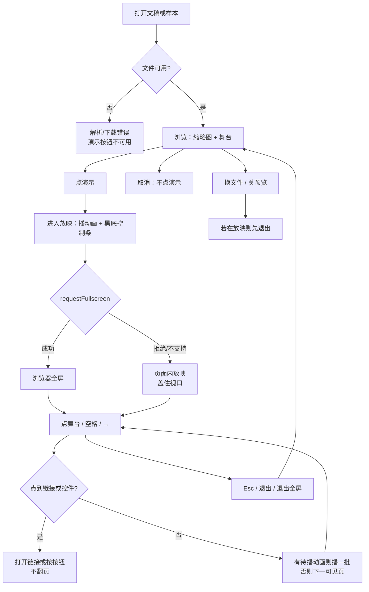
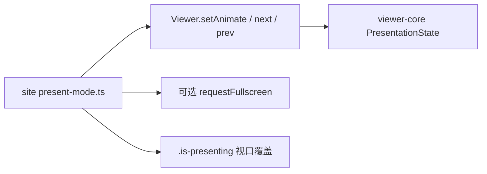

# 官网演示模式：与全屏解耦，点击前进

> 第一轮持续性迭代方案。只做这一件事：用户点「演示」之后，**一定能走进放映**；点/按舞台就是下一步。全屏是增强，不是门槛。

---

## 1. 目标与用户

| 项 | 内容 |
|---|---|
| 用户 | 在浏览器里打开 `.pptx` / `.ppt` 的人：同事甩一份文件要「先看一眼」、自己投屏讲两页、手机上翻一遍。不装 Office，文件不出设备。 |
| 要解决的问题 | 官网/样本预览把「演示」绑死在 `requestFullscreen()` 成功上。全屏被拒或平台只部分支持时，按钮等于没点；舞台本身也不能点着往下翻。 |
| 成功标准 | 点「演示」后，无论全屏是否成功，都进入放映（黑底、控制条、播动画、跳过隐藏页）；点/按舞台前进；Esc / 退出按钮离开并恢复浏览态。现有全屏语言入口契约仍然成立。 |

不为谁做：不在这一轮做演讲者备注双屏、激光笔、计时器、编辑器「放映」页、分享链接协议。

---

## 2. 用户场景与流程

主路径：打开文稿 → 点「演示」→ 能全屏就全屏，不能也留在放映 → 点舞台 / 空格 / 方向键走动画再翻页 → Esc 离开。

| 分支 | 行为 |
|---|---|
| 空状态 | 文稿未打开或打开失败：演示按钮禁用，点了也不进放映 |
| 失败 | 全屏 API 抛错：留在放映，不退回浏览终态；打开失败：明确错误，不假装在放映 |
| 取消 | 还没进放映时，打开密码框取消、关样本预览，都不进入放映 |
| 返回 | Esc、退出按钮、浏览器退出全屏：去掉放映态、停动画、归还语言入口、恢复浏览页码 |
| 恢复 | 退出后再点「演示」从当前页重新进放映；换文件会先退出再打开 |

---

## 3. 范围

| 必须做 | 不做 |
|---|---|
| 官网首页 Demo、样本预览浮层共用同一套放映会话 | 演讲者备注 / 下一页预览（查看器私有包已有，下一轮再接到官网） |
| 全屏失败仍进入放映 | 编辑器「放映」页真正开演 |
| 放映中点/按舞台前进；链接、按钮、页内跳转不抢翻页 | 触控滑动、B 键黑屏、激光笔、画笔 |
| Esc / 退出离开；换文件或关预览先退出 | 新的分享协议、只读托管、服务端转换 |
| 全屏仍作增强：能进就进，现有语言入口全屏契约保持 | 改 `render/`、改 core、给发布包加 DOM 依赖 |

---

## 4. 调研与缺口

读过的原始页面（不是搜索摘要）：

| 来源 | 用户实际怎么用 | 对本仓库的含义 |
|---|---|---|
| [Present your slide show](https://support.microsoft.com/en-us/powerpoint/present-your-slide-show)（Microsoft 官方，含 Web / 桌面 / Mobile） | Web：浏览器里 From Beginning，控制条会自己隐去，用 `T` 再唤出。Mac 桌面：下一步是「点右箭头、**点一下幻灯片**、或按 N」。Mobile：**点屏幕**或空格前进，Esc 结束。 | 「点幻灯片 = 下一步」是官方教给用户的操作，不是锦上添花。Web 放映的控制条也是「过一会儿消失」，不是绑死全屏。 |
| [Use Presenter View](https://support.microsoft.com/en-us/powerpoint/training/use-presenter-view-in-powerpoint) | 演讲者视图是当前页 + 下一页 + 备注，F5 开始。 | 这是下一步候选，不是本轮门槛。没有它也能先把放映走通。 |
| [How certain features behave in web-based PowerPoint](https://support.microsoft.com/en-us/powerpoint/how-certain-features-behave-in-web-based-powerpoint) | Web PowerPoint 明确能「从任何地方放映」；循环放映等能力在 Web 上缺失并单独登记。 | 用户对 Web 的第一期待是「能放映」，不是功能对等桌面。 |
| [Publish Google files](https://support.google.com/a/users/answer/9308870?hl=en) | 发布后的演示可以是只读页，也可以是「presentation mode with full-screen slides」。 | 轻量预览和放映是两条路径；全屏是放映的常见形态，不是唯一形态。 |
| [Can I use Fullscreen API](https://caniuse.com/fullscreen) | Safari on iOS 长期 Partial（12–27.x 仍是 ◐）；旧 iOS 完全没有。 | 把放映成败交给 `requestFullscreen()`，等于主动丢掉手机预览/演示。 |

对照本仓库：

| 表面 | 已有 | 缺口 |
|---|---|---|
| `packages/viewer` | 全屏失败仍保留演讲者布局；键盘翻页 | 点舞台不前进 |
| 官网首页 / 样本预览 | 全屏成功后有控制条、键盘、跳过隐藏页、播动画 | 全屏失败立刻 `setAnimate(false)` 并 return；控制条只挂在 `:fullscreen`；舞台不能点着走 |
| 编辑器「放映」页 | 预览模式 + 播动画 | 没有进入放映。本轮不做 |

首页源码把失败写成「没进成全屏就退回静态终态」——这是产品决策错误，不是 API 限制。

---

## 5. 是否值得做

| 判定 | 结论 |
|---|---|
| 使用者成本 | 只动官网私有层和查看器示例。不进八个发布包默认入口，不增运行时依赖。全屏仍按需请求。 |
| 可行路径 | `Viewer.next()` / `setAnimate()` / `skipHidden` 已具备。首页与样本已经各写了一套全屏逻辑，抽成同一会话即可。 |
| 判定 | **做。** 不值得做的是本轮顺手加演讲者视图或编辑器放映。 |

---

## 6. 产品方案

| 元素 | 规则 |
|---|---|
| 入口 | 按钮文案改为「演示」，说明「播放动画，能全屏就全屏」。未打开文稿时禁用。 |
| 进入 | 当前页开始；切到动画初始态并等一帧再请求全屏，避免全屏动画播到上一帧终态。 |
| 全屏 | 成功则用浏览器全屏；失败则 `position: fixed` 盖住视口。两种都算在放映。 |
| 前进 | 点/按舞台空白处、空格、Enter、→ / PageDown。有待播动画先播一批。 |
| 不前进 | 超链接、页内 `data-slide`、控制条、语言入口、页脚按钮。 |
| 离开 | Esc、退出、浏览器退出全屏。换文件或关样本预览必须先离开。 |
| 语言 | 放映中语言入口跟着舞台走；离开后归还。全屏契约不改。 |

---

## 7. 技术方案

| 决策 | 选择 | 原因 |
|---|---|---|
| 放映态真值 | `.is-presenting`，全屏只是外壳 | 全屏失败时也要有同一套控制条和键盘 |
| 点击前进放哪 | 官网 `present-mode.ts`；查看器示例各自监听 | 浏览态点舞台不能翻页；不能把产品决策塞进 `viewer-core` |
| 退出竞态 | `generation` 令牌 | 等一帧期间用户已 Esc，迟到的 `requestFullscreen` 不能把人拉回去 |
| 样本 Esc | 放映优先于关浮层 | 先离开放映，再 Esc 才关预览 |
| 放映衬底 | 舞台与 SVG 背景改透明/黑 | 浏览态 SVG 白底是为了投影；不关掉时 16:9 幻灯片两侧仍是白边 |

落点：

| 文件 | 职责 |
|---|---|
| `packages/site/src/present-mode.ts` | 进入/离开、可选全屏、点击过滤、Esc、控制条显隐 |
| `packages/site/src/main.ts` / `samples.ts` | 接上会话，换文件先退出 |
| `packages/site/src/style.css` | `:fullscreen` 与 `.is-presenting` 共用放映外观 |
| `packages/viewer/src/main.ts` | 放映中点舞台前进 |
| `tooling/lib/site-viewer-controls-contract.mjs` | 全屏失败仍进入；点舞台翻页；Esc 离开 |

不变量：`render/` 只认 `types.ts`；core 不碰 `document`；词条进 `en-home` / `en-samples`，不进发布包。

---

## 8. 验收

| # | 标准 | 证据 |
|---|---|---|
| A1 | 全屏成功：现有语言入口、Enter 不抢键、退出归还 | 已有 `runViewerFullscreenContract` |
| A2 | `requestFullscreen` 拒绝后仍有 `.is-presenting`，控制条可见 | 新增 fallback 契约 |
| A3 | 放映中点舞台页码前进；点控制条不双跳 | 同上 |
| A4 | Esc / 退出后无放映类、动画关闭、语言归还 | 同上；样本 Esc 先退出放映 |
| A5 | 未打开或打开失败时不能进入放映 | 按钮 disabled |
| A6 | 四项门禁绿；browser-use 走通首页与样本主路径及全屏失败 |

---

## 9. 方案自评

| 对照 | 结论 |
|---|---|
| 目标 | 只解决「进得去、点得动、出得来」，没有偷换成更小的文案改动 |
| 流程 | 主路径、空、失败、取消、返回、恢复都有出口 |
| 范围 | 三处预览表面同一件事；演讲者视图和编辑器放映明确不做 |
| AGENTS.md | 不改 `render/` 与 core；站点词条不进发布包；文件拆出后避免继续堆 `main.ts` |
| 风险 | 现有全屏契约仍先请求全屏，不断掉；点击过滤必须把链接排除，避免误翻页 |
