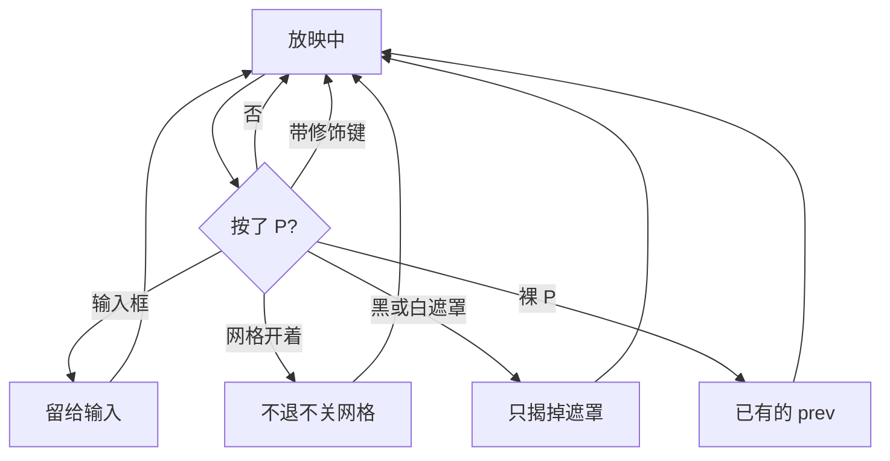
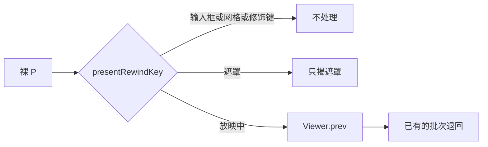

# 放映字母 P：走上一步

> 第三十五轮持续性迭代。只做这一件事：官网首页 Demo、样本预览、独立查看器在**放映中**把裸 `P` 当成上一步。接法与退格相同，调用已有的 `prev()`。

---

## 1. 目标与用户

| 项 | 内容 |
|---|---|
| 用户 | 在浏览器里放映 `.pptx` / `.ppt` 的人。讲到一半想收回刚才那一批，手按在字母 `P` 上。不装 Office，文件不出设备。 |
| 要解决的问题 | 第三十三轮 `prev()` 已经先退当前页的一批。第三十四轮退格也走到它。Microsoft 网页放映表的后退行，Windows 和 Mac 都还有一颗 `P`，现在按下去什么都不做。 |
| 成功标准 | 只在放映、没有输入框和网格时，不带 Ctrl / ⌘ / Alt / Shift 的 `p` / `P` 调用已有的 `prev()`：已播过的点击先退一批，本页开头才去上一张可见页的终态。浏览、搜索框、页码缓冲、黑/白遮罩、网格、Home/End、备注键 `N` / `s`、Esc、换文件都不被这颗键改义。 |

不为谁做：不把 `N` 改成下一页，不认 `key === "Delete"`，不倒放关键帧，不把 `Ctrl` / `⌘+P` 收成上一步。

---

## 2. 用户场景与流程

主路径：放映中已经播过一批 → 按 `P` → 这一批收回，页码不动。本页还在开头再按，才到上一张可见页的终态。

| 分支 | 行为 |
|---|---|
| 空状态 | 未打开或打开失败：没有放映，`P` 不造翻页。浏览态 `P` 仍交给页面，不翻页。 |
| 失败 | 全屏被拒：仍在放映，`P` 照常走上一步。输入框里的 `P` 留给输入。 |
| 取消 | 网格开着、带 Ctrl / ⌘ / Alt / Shift：不退批次、不翻页。未确认的页码被丢掉，但 `P` 不是在删页码的最后一位。 |
| 返回 | 黑/白遮罩里 `P` 只揭遮罩。本页开头再按，才去上一张可见页的终态。 |
| 恢复 | 退出放映后浏览态不再认这颗键。换文件先退出放映。Home / End / 页码确认仍用 `goTo`。 |

---

## 3. 范围

| 必须做 | 不做 |
|---|---|
| 首页 Demo、样本预览、独立查看器在放映中认裸 `p` / `P` | 浏览态用 `P` 翻页 |
| 调用已有 `prev()`，不另写一套退回 | 把 `N` 改成下一页；认 `Delete` |
| 遮罩里只揭开；网格、输入框、修饰键不退 | 用 `P` 删页码缓冲的最后一位 |
| 查看器提示条写上这颗键 | 倒放关键帧；改 `render/` 或 core；认 `Ctrl` / `⌘+P` |

---

## 4. 调研与缺口

本轮打开并读完的原始页面（不是搜索摘要）。日期 2026-09-22。

| 来源 | 用户实际怎么用 | 对本仓库的含义 |
|---|---|---|
| [Use keyboard shortcuts to deliver PowerPoint presentations](https://support.microsoft.com/en-us/accessibility/powerpoint/use-keyboard-shortcuts-to-deliver-powerpoint-presentations) · Web `tabpanel_1_web` 整张「Control the slide show」 | 后退原文：Perform the previous animation or return to the previous slide。Windows 键是 **P、Page up、Left、Up、Backspace**。Mac 键是 **P、Page up、Left、Up、Delete**。前进含 `N`。结束只有 Esc。没有指定页，没有 Home / End，没有 H，没有激光笔。 | `P` 在 Windows 和 Mac 两列都在后退行，而且排在第一个。退格已经接上，这颗字母还空着。 |
| 同上 · Windows `tabpanel_1_windows` 常用表 | 后退行同样是 **P、Page up、Left、Up、Backspace**。`N` 在前进行。下一张表才是「Type the slide number, then press Enter」。指针表里 **Ctrl+P** 是画笔，**Ctrl+L** 是激光笔。媒体表里 **Alt+P** 是播放或暂停。 | 裸 `P` 才是上一步。带 Ctrl 或 Alt 的 `P` 是另一行，不能收成退回。页码和 `P` 也是两件事。 |
| 同上 · macOS `tabpanel_1_macos` 常用表 | 后退行是 **P、Page up、Left、Up、Delete**。指针表里 **⌘+P** 是画笔。 | Mac 的裸 `P` 与 Windows 相同。`⌘+P` 不是上一步。 |
| [Present slides · Computer](https://support.google.com/docs/answer/1696787?hl=en) · 展开 Present mode keyboard shortcuts | PC、Mac、Chrome 三张表的 Previous 都只写 **←**。备注是 **Open speaker notes → `s`**。打印是 **Ctrl+P**（Mac 是 **⌘+P**）。激光笔是 `l`。没有裸 `P`，也没有 previous animation。 | Google 不能用来否定 Microsoft 网页表。`Ctrl` / `⌘+P` 必须留给打印，不能 `preventDefault`。`s` 仍是打开备注。 |

对照本仓库：

| 表面 | 已有 | 缺口 |
|---|---|---|
| `prev()` | 放映中先退一批，开头才去上一张可见页的终态 | 字母 `P` 没有调用它 |
| 左、上、Page Up、退格、上一步按钮、横向滑动 | 都调用 `prev()` | 网页表后退行排在第一位的 `P` 还空着 |
| `N` / `s` | 备注开关 / 放映中打开备注 | 与 `P` 不是同一颗键 |
| 页码缓冲 | 非数字、非 Enter 先丢掉未确认页码，键继续做自己的事 | `P` 若去删最后一位，就和缓冲缠在一起 |

---

## 5. 是否值得做

| 判定 | 结论 |
|---|---|
| 放映中裸 `P` 走上一步 | **做。** 网页表两列都写了这颗键，动作与已经做对的 `prev()` 是同一句。三处预览表面都还没接。 |
| `Ctrl` / `⌘+P`、`Alt+P`、`Shift+P` | **不做。** 桌面表的 Ctrl / ⌘+P 是画笔，Alt+P 是媒体。Google 网页表的 Ctrl / ⌘+P 是打印。带修饰键不能退批次，也不能 `preventDefault`。 |
| `N` 改成下一页 | **不做。** `N` 已经是备注开关。网页表的 `N` 与这里的备注键冲突。 |
| 认 `Delete` | **不做。** 向前删除不在网页表的后退行。Mac 文档里的 Delete 在浏览器里已经是 `Backspace`。 |
| `P` 编辑页码缓冲 | **不做。** 页码的确认键是 Enter。`P` 和缓冲分开：未确认的数字先丢掉，然后才走上一步。 |
| 倒放关键帧 | **不做。** 播放层没有可逆时间轴。`P` 只调用已经做对的 `prev()`。 |
| 使用者成本 | 不进八个发布包。不增依赖。浏览态不拦截，没有额外行为。 |
| 可行路径 | 三处表面已有放映态、`prev()`、遮罩、网格和输入框让键。判断放在退格旁边的谓词里，避免三处各写一套键名。 |

---

## 6. 产品方案

| 元素 | 规则 |
|---|---|
| 何时生效 | 仅放映中。浏览、未打开、打开失败：不翻页，也不 `preventDefault`。 |
| 认哪颗键 | `event.key` 是 `p` 或 `P`，且没有 Ctrl / ⌘ / Alt / Shift，且不在输入法组合中。Caps Lock 打出的 `P` 仍算这颗字母。 |
| 做什么 | 调用已有 `prev()`。已播过的点击先退一批；本页开头才去上一张可见页的终态。 |
| 页码缓冲 | 不删最后一位。和其他上一步键一样：先丢掉未确认页码，再退回。不会跳到缓冲里的数字。 |
| 搜索框 / 文件框 | 焦点在 `input`、`select`、`textarea`、`contenteditable` 时，`P` 留给输入。 |
| 网格 | 开着时不退批次、不关网格、不翻页。 |
| 黑/白遮罩 | 只揭遮罩，不退批次、不翻页。 |
| Home / End | 仍跳到首尾页的开头。`P` 不抢这两颗键。 |
| 备注 | `s` / `N` 的开关不变。`P` 可以发生在备注开着的时候，不因此关掉备注，也不把 `N` 变成下一页。 |
| 离开 | Esc 仍先关网格，再离开放映。换文件先退出放映。再进放映从当前页的开头开始。 |
| 提示 | 查看器 hint 在原有「Backspace 上一步」旁边写「P 上一步」。不进共享词库。 |

---

## 7. 技术方案

| 决策 | 选择 | 原因 |
|---|---|---|
| 键值 | `p` 与 `P` | 表里写的是字母。Caps Lock 时 `key` 是 `P`，`shiftKey` 仍为假 |
| 不认修饰键 | Ctrl / ⌘ / Alt / Shift 直接放过 | 打印、画笔、媒体播放都落在这些组合上 |
| 落点 | `present-back-key.ts` 增加 `presentPrevLetter`，与退格合成 `presentRewindKey` | 查看器已经引用这个文件。再引 `present-mode.ts` 会把全屏控制条卷进去 |
| 遮罩 | 黑屏监听在捕获阶段用同一个谓词，先揭开并停掉后续 | 排在后面的 `prev()` 不会在遮罩下退批次 |
| 网格 | 沿用网格已有的吞键 | 捕获阶段已经 `stopImmediatePropagation`，`P` 到不了翻页 |
| 缓冲 | 不改 `slide-number.ts` | 它已经把非数字、非 Enter 当成「丢掉缓冲，键继续」。`P` 因此不会变成退一位 |
| 浏览 | 谓词为真也不调用，除非正在放映 | 首页浏览的方向键仍翻页；`P` 不能跟着翻 |
| 包 | 不改 `viewer-core` / `core` / `render` | `prev()` 已在第三十三轮完成。本轮只补按键 |

不变量：`render/` 只认 `types.ts`；core 不碰 `document`。

---

## 8. 验收

| # | 标准 | 证据 |
|---|---|---|
| A1 | 浏览态 `P` 不 `preventDefault`、不翻页 | 契约 |
| A2 | 放映中最后一页先进一步再按 `P`，页码不动且批次收回；Caps Lock 的 `P` 同样 | 契约 |
| A3 | `Ctrl` / `⌘` / `Alt` / `Shift+P` 不退批次、不拦截；`Delete` 不退 | 契约 |
| A4 | 未确认页码被丢掉后才退回，不跳到那个数字 | 契约 |
| A5 | 搜索框、文件框里的 `P` 不翻页 | 契约 |
| A6 | 黑/白遮罩只揭开；网格开着不翻页、不关网格 | 契约 |
| A7 | Home / End 仍是首尾页；`N` 仍是备注而不是下一页；`s` 仍打开备注；Esc、换文件后浏览态 `P` 不翻页 | 契约 |
| A8 | 四项门禁绿 | check / test / build / verify |
| A9 | browser-use：5173 与 5174 放映中 `P` 先退批次，浏览不翻 | `out/present-prev-letter-browser/` |

---

## 9. 方案自评

| 对照 | 结论 |
|---|---|
| 目标 | 补的是网页表后退行里已经有 `prev()`、退格已经接上、还没接上的 `P` |
| 流程 | 主路径、空、失败、浏览、输入、网格、修饰键、页码缓冲、黑白遮罩、Home/End、备注、Esc、换文件都有出口 |
| 范围 | 一颗字母，三处表面。不改状态机 |
| 与前三十四轮 | 不回退批次退回、退格、上下方向键、备注键、首尾页、页码、黑白屏、网格。`N` 仍是备注 |
| 证据 | Web 整张表、Windows 与 macOS 的常用表和指针表都读过。Google 三张表的 Previous 只有左方向键，打印是 Ctrl / ⌘+P |
| 不认修饰键 | 裸 `P` 与 Ctrl / ⌘+P 在原文里是两行。认了会吃掉打印 |
| 不编辑页码 | 缓冲的确认是 Enter。`P` 不是数字，现有逻辑会丢掉整段缓冲 |
| AGENTS.md | 不改 `render/` 与 core，不进发布包 |
| 风险 | 若把 `P` 放进冒泡阶段且遮罩不先截住，黑屏下会退批次。所以遮罩用同一个谓词，在捕获阶段先揭开 |

确认后的决定：用户是「放映时想用 `P` 收回刚才那一批」的人；范围只有裸 `p` / `P`；画面仍是已有的 `prev()`；验收即上表。按此实施。
