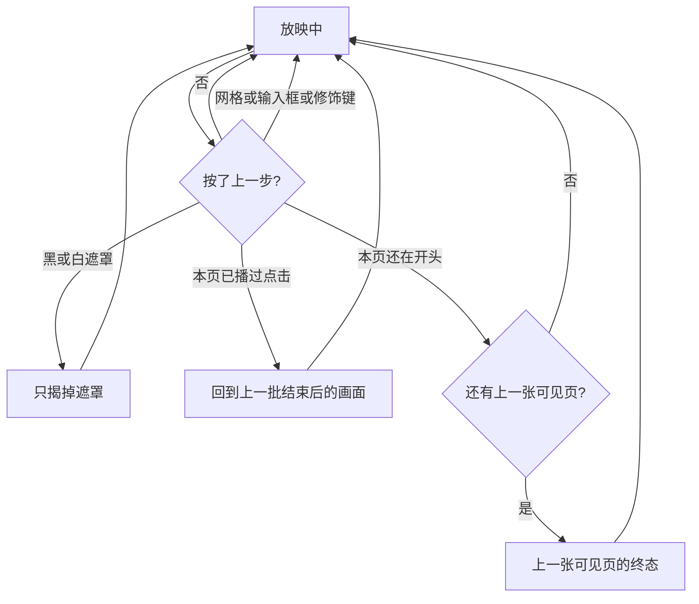
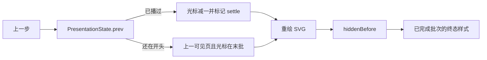

# 放映上一步：先退回当前页的一批动画

> 第三十三轮持续性迭代。只做这一件事：放映里的上一步，若当前页已经播过点击批次，先回到上一批结束后的画面；已经在本页开头，才去上一张可见页，并且落在那一页的终态。不倒放关键帧。

---

## 1. 目标与用户

| 项 | 内容 |
|---|---|
| 用户 | 在浏览器里放映 `.pptx` / `.ppt` 的人。讲到一半按了下一步，想退回刚才那一下，而不是整页跳走。不装 Office，文件不出设备。 |
| 要解决的问题 | `next()` 会先播一批动画。`prev()` 却直接去上一张可见页，并把该页重置到动画开头。Microsoft 网页放映表把后退写成 previous animation or previous slide。 |
| 成功标准 | 只在放映（`animate` 打开）时：已播过的点击先退一批；本页还没播时，去上一张可见页并显示它的终态。浏览仍是整页翻。黑/白遮罩、网格、输入框、页码、Home/End、备注、Esc、换文件都不被这次改义。 |

不为谁做：不倒放飞入/路径的过程，不加 Backspace / Delete，不把 `N` 改成下一页，不做隐藏页 `H`、激光笔。

---

## 2. 用户场景与流程

主路径：放映中按了下一步，画面多出一批内容 → 按上一步，这一批收回，页码不动 → 再按，直到本页回到开头 → 再按，才到上一张可见页，并且那一页是演完的样子。

| 分支 | 行为 |
|---|---|
| 空状态 | 未打开或打开失败：没有放映，上一步不造翻页。浏览态 `animate` 关着，上一步仍是整页。 |
| 失败 | 全屏被拒：仍在放映，上一步照常。输入框里的方向键留给输入。 |
| 取消 | 网格开着、带 Ctrl / ⌘ / Alt / Shift：不退动画、不翻页。 |
| 返回 | 本页开头再按，去上一张可见页的终态。已经是第一张可见页再按，停住。 |
| 恢复 | 退出放映后 `animate` 关掉。换文件先退出放映。Home / End / 页码确认仍用 `goTo`，落到那一页的开头。 |

---

## 3. 范围

| 必须做 | 不做 |
|---|---|
| `prev()` 在放映中先退一批点击 | 把关键帧倒着播 |
| 退到本页开头之后，上一张可见页显示终态 | Backspace / Delete；把 `N` 改成下一页 |
| 官网首页、样本预览、查看器共用这一条 `prev()` | 浏览态改键；隐藏页 `H`；激光笔 |
| 入场/退场用已有的隐藏集；强调和路径铺终态样式 | 改 `render/`；给 core 加 DOM |

---

## 4. 调研与缺口

本轮打开并读完的原始页面（不是搜索摘要）。日期 2026-09-22。

| 来源 | 用户实际怎么用 | 对本仓库的含义 |
|---|---|---|
| [Use keyboard shortcuts to deliver PowerPoint presentations](https://support.microsoft.com/en-us/accessibility/powerpoint/use-keyboard-shortcuts-to-deliver-powerpoint-presentations) · Windows 表 | 常用表原文：Perform the next animation or advance to the next slide。后退原文：Perform the previous animation or return to the previous slide。键是 **P、Page up、Left、Up、Backspace**。 | 后退的第一义是上一批动画，不是直接上一页。`next()` 已经按前一句做了，`prev()` 没有。 |
| 同上 · macOS 表 | 后退键是 **P、Page up、Left、Up、Delete**。动作句子与 Windows 相同。 | Mac 的编辑键是 Delete。本轮不单独加这个键，先把已有的上一步做对。 |
| 同上 · Web 表（点开 Web 标签后的唯一一张表） | 整张表只有开始、前进、后退、Esc。后退：Windows **P、Page up、Left、Up、Backspace**，Mac 把 Backspace 换成 **Delete**。动作仍是 previous animation or previous slide。没有 H，没有激光笔。 | 网页放映要的就是「上一批，否则上一页」。左右、上下、PageUp 已经调用 `prev()`，缺的是 `prev()` 的语义。 |
| [Present slides](https://support.google.com/docs/answer/1696787?hl=en) · 展开 Present mode keyboard shortcuts | PC、Mac、Chrome 三张表的 Previous 都只写 **←**。Next 只写 **→**。没有 previous animation 这句，也没有 Backspace。 | Google 不能用来否定 Microsoft 网页表。已有的左方向键就该承担那一句。 |

对照本仓库：

| 表面 | 已有 | 缺口 |
|---|---|---|
| `PresentationState.next()` | 有待播批次就播一批，否则下一可见页 | 没有对应的退回 |
| `prev()` | 直接上一可见页，并把该页的批次光标清零 | 放映中会跳过刚刚播过的点击；落到上一页时入场又藏起来 |
| 官网 / 查看器的左、上、PageUp、上一步按钮、横向滑动 | 都调用 `prev()` | 改状态机后这些表面一起对齐，不必各写一套键 |
| 浏览 | `setAnimate(false)`，批次为空 | 上一步仍整页翻。不能为了放映把浏览改掉 |

---

## 5. 是否值得做

| 判定 | 结论 |
|---|---|
| 上一步先退回一批 | **做。** 网页表的后退句和已经实现的 `next()` 是一对。现在所有上一步控件都跳页。 |
| 倒放关键帧 | **不做。** 播放层只有 Web Animations 的 `fill: both`，没有可逆时间轴。`withPrev`、路径和强调的终态倒着播会对不齐。做出来是假动画。 |
| 回到上一批的终态 | **做。** 点击批次和 `hiddenBefore` 已经定义入场/退场该谁可见。强调和路径的终态就是播完时留下的那一帧，重绘后铺上去，不播过程。 |
| 上一页落在终态 | **做。** 本页开头再按上一步，应看到上一页演完的样子，才能继续往回退。`goTo`、Home、End、页码确认仍落到开头。 |
| Backspace / Delete | **不做。** 网页表有，但是另一对键。本轮先把已经绑在 `prev()` 上的上一步做对。做完之后再加键才有意义。 |
| `N` 改成下一页 | **不做。** `N` 已经是备注开关。 |
| 使用者成本 | 逻辑在已有的 `viewer-core` 里，浏览不打开动画时没有额外行为。不增依赖。体积用构建后的 gzip 核对。 |
| 可行路径 | 状态机只移动批次光标。`Viewer` 重绘当前 SVG，再按隐藏集和终态样式摆画面。 |

---

## 6. 产品方案

| 元素 | 规则 |
|---|---|
| 何时退批次 | 仅 `animate` 打开且本页已播过至少一批。浏览关着动画，上一步仍整页翻。 |
| 退回的画面 | 上一批**结束之后**的样子：入场/退场跟隐藏集走；已完成的强调和路径用终态样式。不播倒放。 |
| 本页开头 | 去上一张可见页，光标放在该页最后一批之后。没有上一张就停住。 |
| 直接跳页 | Home、End、页码确认、缩略图 `goTo` 仍从那一页的开头开始。 |
| 黑/白遮罩 | 上一步只揭遮罩，不退批次、不翻页。 |
| 网格、修饰键、输入框 | 不退批次、不翻页。未确认的页码被丢掉，然后才走退回；不会跳到刚输入的页。 |
| 备注 | `s` / `N` 的开关不变。退回一批可以发生在备注开着的时候，不因此关掉备注。 |
| 离开 | Esc 仍先关网格，再离开放映。换文件先退出放映。 |

---

## 7. 技术方案

| 决策 | 选择 | 原因 |
|---|---|---|
| 退的单位 | 一个 `clickGroup` | 和 `next()` / `groupSteps` 同一批。一批里的 withPrev 一起退 |
| 画面 | 重绘后摆终态 | `fill: both` 留在节点上，只改 `visibility` 会让退场保持透明、强调保持放大 |
| 终态从哪来 | 入场/退场用 `hiddenBefore`；强调用 `framesFor` 的结束帧；路径用采样折线的最后一点 | 这就是播完时用户看见的样子。不新增动画运行时 |
| 上一页 | `loadAnimations` 之后把光标设到末批，再发 slide | 先发事件再改光标，会先闪一帧开头 |
| 浏览 | `animate` 为假时不进退批次分支 | 批次表是空的，原有翻页不变 |
| 包 | 改 `viewer-core` 的状态机和 DOM 绑定 | 官网、样本、查看器都调用 `prev()`。只改某一处按键，按钮和滑动仍会跳页 |

不变量：`render/` 只认 `types.ts`；core 不碰 `document`。

---

## 8. 验收

| # | 标准 | 证据 |
|---|---|---|
| A1 | 放映中已播过一批时，上一步留在本页，隐藏集回到上一批 | 状态机测试 |
| A2 | 本页开头再按，到上一张可见页，且该页光标在末批 | 状态机测试 |
| A3 | 关闭动画时，上一步仍整页翻，不读批次 | 状态机测试 |
| A4 | 隐藏页仍被跳过；Home / `goTo` 仍从目标页开头开始 | 状态机测试 |
| A5 | 强调终态是放大，路径终态是折线终点；入场不另写样式 | 纯函数测试 |
| A6 | 查看器：最后一页先进一步再上一步，页码不动且计数退回；再上一步才换页 | 浏览器契约 |
| A7 | 搜索框、页码、黑/白屏、网格、Home、备注键、Esc、换文件不误退 | 浏览器契约 |
| A8 | 官网放映同样：最后一页的入场先出现再收回，页码不动 | 浏览器契约 |
| A9 | 四项门禁绿 | check / test / build / verify |
| A10 | browser-use：5173 与 5174 放映中上一步先退批次 | `out/present-rewind-browser/` |

---

## 9. 方案自评

| 对照 | 结论 |
|---|---|
| 目标 | 补的是网页表里 `next()` 已经做到、`prev()` 还没做到的那半句 |
| 流程 | 主路径、空、失败、浏览、输入、网格、修饰键、数字缓冲、黑白遮罩、备注、Esc、换文件、直接跳页都有出口 |
| 范围 | 一条 `prev()`。不倒放，不加新键 |
| 与前三十二轮 | 不回退上下方向键、备注键、首尾页、页码、黑白屏、网格。那些键继续调用原来的 `next` / `prev`，只是 `prev` 的放映语义补全 |
| 证据 | Windows、macOS、Web 三张表都读过后退那一句。Google 三张表只有左方向键，不否定这句 |
| 体积 | 终态函数很小，落在已有播放包里。构建后按实测 gzip 改文档，不先写死 |
| 风险 | 若只改 `visibility` 不重绘，退场和强调会留在 `fill` 上。所以 settle 必须重绘 |

确认后的决定：用户是「放映时按上一步要收回刚才那一批」的人；范围是放映中的 `prev()`；画面是上一批的终态，不是倒放；验收即上表。
