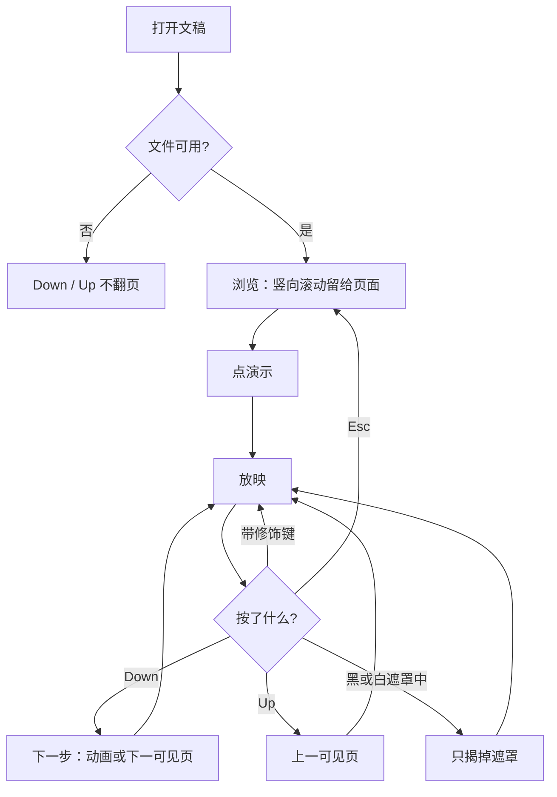
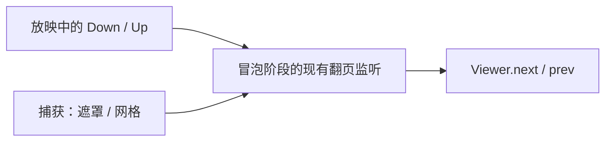

# 放映上下方向键：Down 下一步，Up 上一步

> 第三十二轮持续性迭代。只做这一件事：官网首页 Demo 与样本预览在**放映中**，不带修饰键的 Down 走下一步，Up 走上一步。浏览态不接管，页面仍能竖向滚动。查看器本来就会用这两键翻页，不改。

---

## 1. 目标与用户

| 项 | 内容 |
|---|---|
| 用户 | 在浏览器里放映 `.pptx` / `.ppt` 的人。习惯 PowerPoint 网页版用下方向键前进、上方向键后退。不装 Office，文件不出设备。 |
| 要解决的问题 | 官网放映已经认右/左、PageDown/PageUp、空格和 Enter。Microsoft 网页放映表把 Down / Up 写在同一格里。放映时页面不再滚动，这两键现在什么都不做。 |
| 成功标准 | 只在放映中、没有输入框、网格和 Ctrl / ⌘ / Alt / Shift 时，Down 与右方向键同一条下一步，Up 与左方向键同一条上一步。浏览不翻页、不 `preventDefault`。黑/白遮罩里仍只恢复当前页。 |

不为谁做：不在这一轮做下一张隐藏页、激光笔、把 `N` 改成下一页、用 `P` / Backspace / Delete 后退、让 Up 倒放动画、改查看器已有的上下键、改 `render/` 或 core。

---

## 2. 用户场景与流程

主路径：打开文稿 → 点「演示」→ 按 Down → 有待播动画就播一批，否则下一可见页。按 Up → 上一可见页。浏览时按 Down，长页继续往下滚。

| 分支 | 行为 |
|---|---|
| 空状态 | 未打开或打开失败：没有放映，这两键不造翻页。 |
| 失败 | 全屏被拒：仍在放映，Down / Up 照常。输入框里的方向键留给输入。 |
| 取消 | 浏览态不拦截。网格开着、带 Ctrl / ⌘ / Alt / Shift：不翻页。 |
| 返回 | 已经是第一页再按 Up，或后面没有可见页再按 Down：停在当前页。 |
| 恢复 | 没有额外状态。退出、换文件之后，浏览仍不认这两键。 |

---

## 3. 范围

| 必须做 | 不做 |
|---|---|
| 首页 Demo、样本预览放映中的 Down / Up | 浏览态抢走竖向滚动 |
| 与现有左/右同一条 `next` / `prev` | 用 Up 倒放当前页动画 |
| 修饰键、输入框、网格、数字缓冲、黑/白遮罩、备注键、Esc、换文件 | 查看器改键；`P` / Backspace；隐藏页 `H`；激光笔 |
| 查看器保持现在的上下键，并锁住不回退 | 改 `render/`、推进发布包 |

---

## 4. 调研与缺口

本轮打开并读完的原始页面（不是搜索摘要）。日期 2026-09-22。

| 来源 | 用户实际怎么用 | 对本仓库的含义 |
|---|---|---|
| [Use keyboard shortcuts to deliver PowerPoint presentations](https://support.microsoft.com/en-us/accessibility/powerpoint/use-keyboard-shortcuts-to-deliver-powerpoint-presentations) · Windows `tabpanel_1_windows` | 常用表：下一步是 **N、Enter、Page down、Right、Down、Spacebar**。上一步是 **P、Page up、Left、Up、Backspace**。控制表另有一行：**Go to the next slide, if the next slide is hidden → H**（Presenter View 不可用）。激光笔是 **Ctrl+L**。 | Down / Up 和已经实现的左右方向键是同一格。`H` 是另一行，而且演讲者视图里不可用。 |
| 同上 · macOS `tabpanel_1_macos` | 下一步没有 Enter，有 **N、Page down、Right、Down、Spacebar**。上一步是 **P、Page up、Left、Up、Delete**。隐藏页仍是 **H**。激光笔是 **⌘+L**。 | 上下方向键两栏都有。Mac 的后退编辑键是 Delete，不是 Backspace。 |
| 同上 · Web `tabpanel_1_web` | 整张表只有开始、前进、后退、Esc。前进：Windows 是 **N、Enter、Page down、Right、Down、Spacebar**，Mac 把 Enter 换成 Return，其余相同。后退：Windows **P、Page up、Left、Up、Backspace**，Mac 把 Backspace 换成 **Delete**。**没有 H，没有激光笔，没有 B/W，没有 Home/End。** | 网页放映表明确把 Down / Up 写进前进和后退。隐藏页不在这张表里。 |
| [Present slides](https://support.google.com/docs/answer/1696787?hl=en) · 展开 `Present mode keyboard shortcuts` | 正文：换页用 **arrow keys** 或底栏箭头。PC、Mac、Chrome 三张快捷键表的 Next 只写 **→**，Previous 只写 **←**。没有 Down、Up、H、P、Backspace。`s` 打开备注，`l` 是激光笔开关。 | Google 的快捷键表比正文窄，不能用来否定 Microsoft 网页表里的 Down / Up。也没有隐藏页。 |

对照本仓库：

| 表面 | 已有 | 缺口 |
|---|---|---|
| 官网首页 | 浏览且 Demo 在视口内：左/右、PageUp/PageDown。放映另加空格、Enter | 放映时 Down / Up 不翻页。页面已 `overflow: hidden`，这两键等于没按 |
| 样本预览 | 浮层打开就认左/右、Page、空格 | 放映中 Down / Up 仍不翻页 |
| 查看器 | 浏览和放映都认 Down 为下一步、Up 为上一步 | 没有「只在放映才认」的缺口。不改，避免浏览专用查看器丢掉现成的键 |
| 黑/白遮罩 | Down / Up 已经在「只恢复当前页」的键集里 | 揭遮罩必须仍先于翻页 |

---

## 5. 是否值得做

| 判定 | 结论 |
|---|---|
| 下一张隐藏页 `H` | **不做。** Windows 写明 Presenter View 不可用，macOS 有，Web 整张控制表和 Google 三张表都没有。方向键继续跳过隐藏页。不能只凭桌面表加键。 |
| 放映中的 Down / Up | **做。** Microsoft 网页表把它们和已经支持的左右方向键放在同一格。官网放映缺的就是这一格。浏览不认，因为首页竖向滚动还要这两键。 |
| `P`、Backspace、Delete | **不做。** 网页表有，但和 `N` 是一对。`N` 已经是备注开关，不能改成下一页。只加后退字母键会和备注键拧着。Backspace / Delete 还会撞页码缓冲和输入。 |
| 激光笔 | **不做。** Google 是裸 `l`，PowerPoint 是 Ctrl+L / ⌘+L。 |
| Up 倒放动画 | **不做。** 网页表写的是 previous animation or previous slide。本仓库左方向键已经是直接上一可见页，不倒放。Up 跟左方向键走，不单开一条动画语义。 |
| 查看器 | **不改键。** 上下方向键已经能翻页。本轮只锁住：搜索框、放映、遮罩、网格不被这次改动碰坏。 |
| 使用者成本 | 不进八个发布包。不增依赖。浏览时没有额外行为。 |
| 可行路径 | `Viewer.next()` / `prev()` 已具备。捕获阶段已经由遮罩和网格先吞键。 |

---

## 6. 产品方案

| 元素 | 规则 |
|---|---|
| 何时生效 | 仅放映中。没有输入框、网格，也没有 Ctrl / ⌘ / Alt / Shift。 |
| Down | 与右方向键相同：有待播动画先播一批，否则下一可见页。 |
| Up | 与左方向键相同：上一可见页。不倒放本页动画。 |
| 浏览 | 不拦截、不 `preventDefault`。首页继续滚动。样本浮层未放映时也不翻页。 |
| 查看器 | 浏览和放映都保持现有的 Down / Up。 |
| 数字缓冲 | 未确认的页码被丢掉，然后按下一步或上一步走。Down 不是 Enter，不会跳到刚输入的页。 |
| 黑/白遮罩 | 这两键仍只揭掉遮罩，不翻页。 |
| 网格 | 开着时不翻页、不关网格。 |
| 备注 | `s` 仍只打开，`N` 仍是开关。Down / Up 可以翻页，不开关备注。 |
| 离开 | Esc 仍先关网格，再离开放映。换文件先退出放映。 |

---

## 7. 技术方案

| 决策 | 选择 | 原因 |
|---|---|---|
| 认哪个键 | `ArrowDown` 下一步，`ArrowUp` 上一步；拒绝四种修饰键 | 网页表写的是裸方向键。Ctrl / ⌘+方向键不是这一格 |
| 放在哪 | 首页和样本预览现有的冒泡监听 | 遮罩和网格在捕获阶段 `stopImmediatePropagation`。若放进更早的捕获监听，遮罩下会先翻页 |
| 浏览 | 调用前先看 `presenting()` | 竖向滚动不能被预览抢走 |
| 查看器 | 不加新分支 | `main.ts` 的 switch 已经把 Down / Up 交给 `next` / `prev` |
| 模块 | `present-mode.ts` 导出判断，两处监听调用 | 规则只写一次。不进发布包 |

不变量：`render/` 只认 `types.ts`；core 不碰 `document`；不进发布包。

---

## 8. 验收

| # | 标准 | 证据 |
|---|---|---|
| A1 | 官网浏览态 Down 不翻页，且未 `preventDefault` | 契约 |
| A2 | 放映中 Down 到下一页，Up 回到上一页 | 契约 |
| A3 | Ctrl / ⌘ / Alt / Shift + Down 不翻页 | 契约 |
| A4 | 输入框、未确认页码、黑屏、白屏、网格都不误翻 | 契约 |
| A5 | `s` 仍打开备注；Down 翻页不关备注。Esc 先关网格再离开放映 | 契约 |
| A6 | 换文件后不在放映，浏览 Down 仍不翻页 | 契约 |
| A7 | 查看器浏览 Down 仍翻页；搜索框里不翻；放映、遮罩、网格、失败打开不被这两键改义 | 契约 |
| A8 | 四项门禁绿 | check / test / build / verify |
| A9 | browser-use：5174 放映中 Down 翻页，浏览不翻；5173 查看器 Down 仍翻页 | `out/present-vertical-browser/` |

---

## 9. 方案自评

| 对照 | 结论 |
|---|---|
| 目标 | 补的是 Microsoft 网页放映表里和左右方向键同一格的 Down / Up。没有做隐藏页，也没有改 `N` |
| 流程 | 主路径、空、失败、浏览、输入、网格、修饰键、数字缓冲、黑白遮罩、备注、Esc、换文件都有出口 |
| 范围 | 官网两处预览同一条规则。查看器维持原键 |
| 与前三十一轮 | 不回退备注键、首尾页、页码、黑白屏、网格、Esc 分层、`skipHidden` |
| 证据 | Windows、macOS、Web 三栏和 Google 展开后的三张表都读过。`H` 不在 Web 和 Google。Down / Up 在 Web 前进/后退格里 |
| AGENTS.md | 不改 `render/` 与 core。不进发布包 |
| 风险 | 若 Down 放进捕获监听，黑屏会先翻页再揭遮罩。冒泡监听排在捕获吞键之后，和现有左右方向键同一条路径 |

确认后的决定：用户是「放映时按 Down / Up 要像按左右方向键一样走」的人；范围只有官网放映中的这两键；浏览继续滚动；验收即上表。
