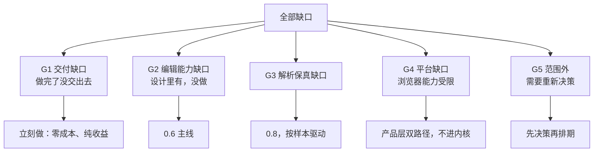
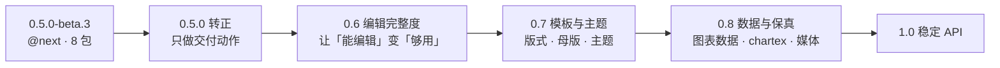
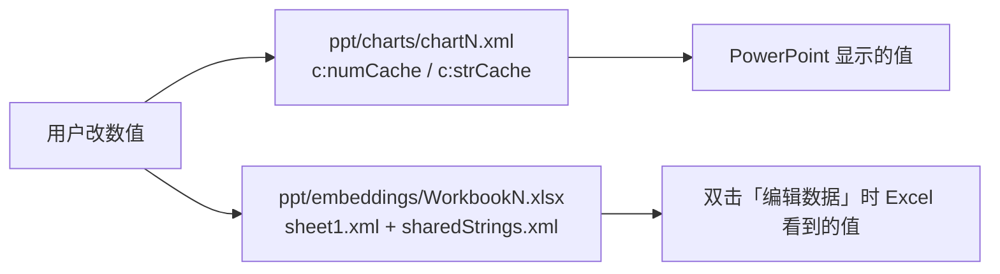

# 能力盘点与演进路线

盘点 `0.5.0-beta.3` 的真实完成度，列全「读 / 写 / 交付」三条线的能力清单，并给出 0.5 转正到 1.0 的
路径与技术方案。范围与词汇沿用 [编辑能力技术方案](editing-design.md) 与 [CONTEXT.md](../CONTEXT.md)。

判断做不做只用两条：**对使用者有没有成本**（运行时、体积、复杂度落不落到用户头上）、**有没有解法**。
工作量不是理由；能做成按需入口 / 可 tree-shake 的等于零成本。

---

## 1. 当前完成度

### 1.1 一句话

**引擎能力、0.6 高频编辑面、0.7 模板/主题产品链及 0.8 经典图表数据编辑已完成。** ChartEx 真实漏斗回退已恢复并通过视觉验收，已补原包释放后的兼容对象生成保存；其他类型与原生绘图仍未完成。自动化交付
缺口已收口；0.5.0 只剩 PowerPoint 真机验收与转正两个外部发布动作，后续能力开发不受阻塞。

### 1.2 门禁实测（2026-09-06，整轮通过）

| 门禁 | 命令 | 状态 | 证据 |
|---|---|---|---|
| 类型检查 | `npm run check` | ✅ 通过 | 本次实跑，退出码 0 |
| 断言总量 | `npm test` | ✅ 5024 项，原性能门禁通过 | 2230 core + 1120 edit + 514 save + 194 chart data + 197 MC fallback + 29 templates + 31 v07 + 9 PowerPoint + 424 editor + 12 adapters + 134 collab + 130 metafile |
| 渲染快照 | 同上 | ✅ 186 个 | `test/snapshots/` |
| 编辑等价指纹 | 同上 | ✅ 546 对 | 83 份固件、273 页，独立进程原始 SVG 两条文本路径 |
| 构建 | `npm run build` | ✅ 8 包通过，原体积预算不变 | core / edit-core / viewer-core / editor / react / vue / fonts / collab |
| 跨产物一致性 | `npm run verify` | ✅ 通过 | 341 项一致性 + 28 项 0.6 审计 + 18 项 0.7 审计；原体积预算不变 |
| PowerPoint 真机 | Windows 自托管工作流 | ❌ **无 runner** | 门禁设施已就绪，缺 Windows + 桌面 PowerPoint |

### 1.3 里程碑

| M | 内容 | 状态 |
|---|---|---|
| M0 | 地基：core 加法 + `EditDoc` + 投影渲染 | ✅ 546 对指纹逐字节等价 |
| M1 | 保存链路：保留型 XML + zip 直通 + 补丁引擎 | ⚠️ 自动证明全绿，**PowerPoint 真机验收缺席** |
| M2 | 选择与变换：三层视图、命中、手柄、吸附、层级、对齐、剪贴板、历史 | ✅ |
| M3 | 文本编辑：覆盖层、IME、扁平模型、段落/run 属性、autofit、Safari engine 行盒 | ✅ |
| M4 | 内容能力：插入形状/图片/表格、填充描边效果、裁剪、超链接、页管理、备注 | ✅ |
| M5 | 打磨：格式刷、查找替换、选择窗格、锁定、崩溃恢复、切换效果 | ✅ |
| M6 | 扩展：动画、顶点、表样式、协同适配包 | ✅ 四项全部独立验收 |
| M7 | 设计：主题、母版、版式、三套按需模板与统一交付旅程 | ✅ Chrome + 11 件 Office 清单 |

### 1.4 本次交付审计（已收口）

`npm run verify` 首次运行暴露的全部是**源码对、交出去的东西不对**这一类；
[建立跨产物一致性闸门](wayfinder/ppt-editor/tickets/076-cross-artifact-consistency-gate.md) 已逐项修复并固化守卫：

| # | 首次发现 | 处理结果 | 固化守卫 |
|---|---|---|---|
| 1 | 三份文档的断言数全线过期 | 按实测同步，当前 4,741 项 | 各套件全绿后落盘，verify 定点比对 |
| 2 | 快照目录会残留无消费者的旧基线 | 新增孤儿基线检查 | core 测试以本轮实际使用集合反查目录 |
| 3 | README 与官网包表漏 `@web-ppt/collab` | 三张表均完整列八包 | 包表集合必须与非 private package 完全一致 |
| 4 | collab 体积无发布入口声明 | 补 11.73KB gzip | 读取 `package.json#main` 后实测 gzip |
| 5 | 14,288B 与 11.76KB 看似冲突 | 前者是排除 peer 的测试薄包，后者是发布入口 | CHANGELOG 同时声明并分别核对 |
| 6 | 稳定版清单仍写七包 | 改为八包及真实发布顺序 | 发布包版本与构建清单同步比对 |

---

## 2. 功能清单

### 2.1 读：解析与渲染

| 域 | `.pptx` | `.ppt` | 缺口 |
|---|---|---|---|
| 预设几何 | ✅ 187 个（ECMA-376 全集） | ✅ MSOSPT 全表 | — |
| 自定义几何 | ✅ custGeom + gdLst 公式 + arcTo | ✅ pVertices / pSegmentInfo | — |
| 填充 | ✅ 纯色/线性/径向渐变/图片/平铺/图案/主题色变换 | ✅ 纯色/渐变/图片 | — |
| 描边 | ✅ 虚线/箭头/端点/连接 | ✅ 虚线/箭头 | — |
| 效果 | ✅ 外阴影/内阴影/发光/柔化/倒影 | ⚠️ 格式本身没有 | 无解，非缺陷 |
| 3D | ✅ 挤出/斜角/轮廓/材质/视角 | ⚠️ 缺可信样本 | 等轴测近似，非真投影 |
| 文本 | ✅ 完整 + 15 种艺术字变形 | ✅ 基础字符与段落 | 包络型艺术字只弯基线 |
| 样式继承 | ✅ 母版→版式→占位符→段落→run | ✅ TxMasterStyle | — |
| 图片 | ✅ 裁剪/裁进形状/透明度/灰度 | ✅ Pictures 流 | — |
| EMF/WMF/PICT | ✅ 解码为 SVG | ✅ | **EMF+ 未处理**；光栅操作码、Region 布尔无解 |
| 表格 | ✅ tableStyles/条纹/合并/边框/垂直对齐 | ✅ 网格启发式 | — |
| 图表 | ✅ 经典 16 种 + 次坐标轴 + 3D | ✅ 经内嵌 EMF | **chartex 7 种未实现** |
| SmartArt | ✅ 缓存 drawing / 6 种布局族自排 | ❌ | `.ppt` SmartArt 未实现 |
| 媒体·墨迹·评论·节 | ✅ | ❌ | — |
| 组合 | ✅ 嵌套 + 子坐标系 | ✅ 展平 | — |
| 切换 / 动画 | ✅ 20 种 / 四类按点击分批 | ✅ 6 种 / 5 步 | — |
| 加密 | ✅ 标准 AES-ECB / 敏捷 AES-CBC | ✅ RC4 CryptoAPI | **打开密码文件不可解析** |
| 数学公式 | ✅ OMML 解析 | ❌ | 只取线性文本，**不做 MathML 排版** |
| 嵌入字体 | ✅ EOT 剥壳 | — | MTX 压缩需外部 `setFontDecoder` |

导出：PNG（data: URI + foreignObject，像素与预览一致）、独立 SVG 文件（原生 `<text>`，自包含）、
批量动画终态 PNG ZIP（按需入口、有界并发）与可打印 HTML（按动画批次展开）。**无直接 PDF、无视频。**

### 2.2 写：编辑命令（61 个已实现）

| 域 | 已实现 | 未实现 |
|---|---|---|
| 变换 | `SetXfrm` `SetFlip` `AlignElements` `DistributeElements` `Group` `Ungroup` | — |
| 结构 | `RemoveElement` `SetZ` `PasteElements` `SetName` `SetAltText` `SetLocked` `SetElementHidden` | — |
| 形状 | `AddShape` `SetFill` `SetStroke` `SetEffects` `SetGeometry` `ConvertToCustomGeometry` `SetPreset` `SetAdj` | `SetScene3D` |
| 图片 | `AddImage` `ReplaceImage` `SetCrop` | **`SetPictureFx`**（透明度/灰度/双色调） |
| 文本 | `EditText` `SetRunProps`（含高亮/字距/大小写/上下标/精确下划线与单双删除线）`ClearFormat` `SetParaProps`（含项目符号/编号）`SetBodyProps` `FitTextShape` `ReplaceText` | — |
| 表格 | `AddTable` `InsertRow` `InsertColumn` `RemoveRow` `RemoveColumn` `MergeCells` `SplitCell` `SetRowHeight` `SetColumnWidth` `SetCellProps` `SetTableStyle` + 单元格文字 | — |
| 页面 | `AddSlide` `RemoveSlide` `MoveSlide` `DuplicateSlide` `AddSection` `RenameSection` `MoveSection` `RemoveSection` `SetSlideSize` `SetLayout` `SetBackground` `SetBackgroundImage` `SetBackgroundCrop` `SetHidden` `SetNotes` `SetTransition` `SetAnimations` | — |
| 链接 | `SetLink`（元素级 + run 级） | — |
| 格式 | `ApplyFormat`（格式刷） | — |
| 版式/母版/主题 | `SetTheme` + 主题目录；版式/母版设计画布 + 复用元素/背景/切换命令 + `p:txStyles` | — |
| 经典图表 | 框架级操作 + 按需数据集增删改、cache/内嵌工作簿同步 | 类型切换、格式样式编辑 |
| SmartArt/OLE/墨迹/媒体 | 仅框架级 `SetXfrm` / `SetZ` / `RemoveElement` | 内部编辑 |

保存：补丁保存（原包直通，只改脏 part）、生成保存（无原包时确定性生成）、`.ppt` 编辑另存 `.pptx`。

### 2.3 工程与产品

| 能力 | 状态 |
|---|---|
| 发布包 | ✅ 8 个（core / edit-core / viewer-core / editor / react / vue / fonts / collab），`@next` 同版本 |
| 框架适配 | ✅ React 1.12KB + Vue 1.34KB gzip，单一 adapter contract，Svelte / WC 可直接复用 |
| 崩溃恢复 | ✅ 版本化帧 + IndexedDB 分块 + 原子换代 + 挂载前决策 |
| 协同 | ✅ 字段级 LWW、分数序、可插拔 provider、BroadcastChannel 双标签页 |
| 无障碍 | ✅ 选择窗格键盘导航 / 锁定 / 隐藏；⚠️ **画布本身无 AT 语义** |
| 性能契约 | ✅ 抗环境负载，功能失败与预算超标分离 |
| 官网编辑页 | ✅ 独立 `editor.html`，本机打开/模板新建/编辑/保存/恢复 |
| 触屏 / 移动 | ✅ 手指细描边容差 + 双指缩放/平移 + 长按上下文 seam；查看模式保留页面滚动 |
| 国际化 | ❌ 编辑包零文案（好事）；官网**仅中文** |
| 文件保存 UX | ⚠️ 仅 download，**未接 File System Access** |

---

## 3. 缺口分类与取舍判定



| 缺口 | 用户有成本？ | 有解法？ | 判定 |
|---|---|---|---|
| 跨产物一致性 / collab 漏列 | 有（装错包、信错数字） | 有 | ✅ **已完成** |
| 表格结构编辑 | 有（表格是 PPT 高频对象，只能追加行等于不可用） | 有（rowId 已有，缺 colId 与合并不变量） | ✅ **已完成** |
| 项目符号 / 编号 | 有（做 PPT 必用） | 有（继承重基与自动编号求值都已具备） | ✅ **已完成** |
| 形状预设切换 + 调节柄 | 有（形状库不能变形等于半个形状库） | 有（`a:ahLst` 从固定规范源生成，惰性查表零默认成本） | ✅ **已完成** |
| 字符高级属性 + 清除格式 | 有 | 有（双层模型天然支持删覆盖） | ✅ **已完成** |
| 分布 / 替代文字 / 节 / 页面尺寸 | 有（各自小，合起来是「像不像 PowerPoint」） | 有（全是既有基础设施的加法） | ✅ **已完成** |
| 触屏手势 | 有（平板打不开等于少一半设备） | 有（Pointer Events 已统一） | ✅ **已完成** |
| 批量导出图片 | 有 | 有（复用 `slideToPng` + fflate） | ✅ **已完成** |
| 主题编辑 | 有（换配色是模板定制第一需求） | 有（phClr / fillRef 求值链路已全通） | ✅ **已完成** |
| 版式 / 母版编辑 | 有（企业模板定制） | 有（统一设计画布与反向失效索引） | ✅ **已完成** |
| 图表数据编辑 | 有（图表是 PPT 第二高频对象） | 有（同时改 cache 与 embedded xlsx，按需入口） | **0.8 P0 已完成** |
| chartex 解析 | 原生未完成；真实漏斗图片回退已验证，缺原包保存未完成 | 有，除 `regionMap` 原生渲染 | **0.8 P1**，继续回退保存与真实语料 |
| 媒体插入 | 有 | 有 | **0.8 P2** |
| File System Access | 有（Safari/Firefox 无法原地覆盖） | 部分（仅 Chromium） | **产品层双路径**，不进内核 |
| EditContext | 无（contenteditable 已能用） | 部分（仅 Chromium） | 渐进增强，不改主路径 |
| Safari LBSE | 无（engine 行盒已兜住） | 上游未默认开启 | **保留兜底，不要删** |
| `.ppt` 二进制写回 | 无（明确转 `.pptx`） | 有但会静默降级 | **不做**（范围外，已决策） |
| EMF+ / 光栅操作码 / Region 布尔 | 无（无样本 / SVG 表达不了） | 无 | **不做**（无解） |
| 地图图表 regionMap | 无 | 无（需数 MB 行政区边界，违反零成本） | **不做**（无解 + 有成本） |
| 宏 / AI 生成 / 模板市场 / 服务端转换 | — | — | **不做**（非目标） |

---

## 4. 演进路线



| 版本 | 主题 | 票据 | 阻塞 |
|---|---|---|---|
| **0.5.0** | 转正，零新能力 | 一致性闸门 ✅ · PowerPoint 真机 · 转正七步（八包） | PowerPoint 真机需 Windows + 桌面 PowerPoint |
| **0.6** | 编辑完整度 | [补齐 0.6 高频编辑能力](wayfinder/ppt-editing-completeness/map.md)：表格 · 列表 · 预设形状 · 字符格式 · 常用命令 · 触屏 · 批量导出 | 无 |
| **0.7** | 模板与主题 | [主题编辑 · 版式编辑 · 母版编辑 · 内置模板 · 集成验收](wayfinder/ppt-template-theme/map.md) ✅ | 无 |
| **0.8** | 数据与保真 | [图表数据编辑 · chartex 解析 · 媒体插入 · 官网 i18n](wayfinder/ppt-data-fidelity/map.md) | 需真实语料 |
| **1.0** | 稳定 API | API 冻结 · 语料回归 · 文档完整 | 依赖 beta 反馈周期 |

一致性闸门已完成。PowerPoint 真机验收全程外部阻塞，不要让它挡住 0.6 的开发，只挡 0.5.0 的 tag。

---

## 5. 技术方案

### 5.1 [补齐表格结构与单元格格式编辑](wayfinder/ppt-editing-completeness/tickets/001-table-structure-editing.md)

现在只有尾部追加行。缺的是删行、插/删列、合并/拆分、行高列宽、单元格样式。

**落点**

| 能力 | OOXML |
|---|---|
| 行 | `a:tbl/a:tr`，`@h` 行高（EMU） |
| 列 | `a:tbl/a:tblGrid/a:gridCol@w`；**每行 `a:tc` 数必须等于 `gridCol` 数** |
| 合并 | 锚格 `a:tc@gridSpan`（横跨）/ `@rowSpan`（纵跨）；被覆盖格写 `@hMerge="1"` / `@vMerge="1"` 且**仍须存在** |
| 单元格 | `a:tcPr`：`@anchor` `@marL/R/T/B` `@vert` + `a:lnL/lnR/lnT/lnB/lnTlToBr/lnBlToTr` + 填充 |

**为什么只做了追加**——四个真难点：

| 难点 | 后果 | 解法 |
|---|---|---|
| 删行/列会切断跨越它的合并矩形 | `hMerge`/`vMerge` 悬空 → PowerPoint 提示修复 | 删除前先把跨越边界的合并**分解**成独立格，作为同一事务的一部分 |
| 表格 frame 的 `ext` 由行高列宽之和决定 | 插行后 frame 高度不对，视觉漂移 | 复用 `037`（spAutoFit）的 **entry 级因果历史**：结构改动与 frame 改高是一个原子单元 |
| 协同/恢复日志需要稳定地址 | 行有 `rowId`（`039` 引入），列没有 | 补对称的 `colId`，与 `rowId` 同一分配器 |
| 条纹与首末行列样式由**序号**派生 | 插删后整表样式全变 | 投影缓存对表格**整体失效**，不做逐格失效 |

**模型**：合并只保留**单一真值**——锚格 + 跨度。`hMerge`/`vMerge` 是投影期展开的产物，模型里不可写，
从源头掐掉「两个地方都能改、改得不一致」这类 bug。

**命令**

```ts
InsertRow{ id, at }            // 扩展现有：at 省略仍为尾部追加
RemoveRow{ id, row: RowId }
InsertCol{ id, at, width }
RemoveCol{ id, col: ColId }
MergeCells{ id, from: CellAddr, to: CellAddr }
SplitCell{ id, cell: CellAddr }
SetRowHeight{ id, row, h } / SetColWidth{ id, col, w }
SetCellProps{ id, cells: CellAddr[], props }   // null 恢复来源，同 SetEffects 双语义
```

**不变量**（进 `model-invariants.ts`，事务边界校验）：① 每行 `tc` 数 == `gridCol` 数
② 合并矩形互不重叠、不越界 ③ 锚格自身不是 `hMerge`/`vMerge` ④ 行高列宽 ≥ 0。

**验收**：确定性固件 `sample-editor-table-structure.pptx`（含预置合并）+ LibreOffice 网格 oracle +
独立进程等价指纹 + PowerPoint 无修复打开 + 60 格提交预算。

### 5.2 ✅ [切换预设形状并拖动调节柄](wayfinder/ppt-editing-completeness/tickets/003-preset-shape-adjustments.md)

编辑投影以互斥的 `presetGeometry` / `geometry` 稀疏覆盖保留语义；切换时用对侧 tombstone 保证
历史、恢复与字段级 LWW 协同都只留下一个几何真值。

| 命令 | 落点 | 说明 |
|---|---|---|
| `SetPreset{ id, preset }` | `a:prstGeom@prst` + 重置 `a:avLst` | 保留填充/描边/效果/`a:txBody`，只换几何 |
| `SetAdj{ id, name, value }` | `a:avLst/a:gd@name@fmla="val N"` | 拖动调节柄 |

调节柄来自预设定义里的 `a:ahLst`（adjust handle list）：
`a:ahXY` 给出手柄坐标与 `minX/maxX/minY/maxY`，`a:ahPolar` 给出 `minR/maxR/minAng/maxAng`。
现在的几何层只求值 path，没读 ahLst。

- 表由固定 Apache POI 预设源生成并校验 commit + SHA-256：187 个预设，120 个含句柄
- `@web-ppt/core/geometry/handles` 与 `@web-ppt/editor/adjustments` 都是独立构建的按需入口；构建守卫
  禁止句柄定义进入 core、edit-core 与 editor 主入口
- 公式在 DrawingML EMU 空间求值，最终位置才转 CSS px；187 预设通过同点拖拽恒等性质
- 旋转形状拖动只更新 interaction 层，提交为单一历史事务；补丁与生成保存都回写规范 `prstGeom/avLst`

### 5.3 ✅ [编辑项目符号与自动编号](wayfinder/ppt-editing-completeness/tickets/002-bullets-and-numbering.md)

`SetParaProps` 扩展一个 `bullet` 字段：

```ts
bullet?: { kind: 'none' }
       | ({ kind: 'char'; char: string } & BulletStyle)
       | ({ kind: 'autoNum'; type: AutoNumType; startAt?: number } & BulletStyle)
       | ({ kind: 'blip'; image: ImageRef } & BulletStyle)
       | null   // null = 删覆盖，回到版式/母版继承
```

| 事实 | 影响 |
|---|---|
| `a:buNone` / `a:buChar` / `a:buAutoNum` / `a:buBlip` **互斥** | 写时必须先删同组其它元素（同 `SetFill` 的坑）；`xml/order.ts` 里这组 sequence **已经登记好了** |
| 级别默认项目符号来自版式/母版 `a:lvlNpPr` | 「无覆盖」≠「无项目符号」，必须走 `068` 建立的九级继承重基 |
| 自动编号续号 | `text-auto-number.ts` 的 `formatDrawingAutoNumber` 已实现，投影直接复用 |

已贯通命令、查询、富文本剪贴板、格式刷、表格、恢复/协同、补丁与生成保存；配套
`a:buFont` / `a:buClr` / `a:buSzPct` / `a:buSzPts`，图片资源按内容哈希去重并建立关系闭包。

### 5.4 ✅ [补齐字符高级格式与清除格式](wayfinder/ppt-editing-completeness/tickets/004-advanced-run-formatting.md)

`SetRunProps` 与 `TextRun` 现已贯通全部目标字段：

| 属性 | 落点 |
|---|---|
| 高亮 | `a:rPr/a:highlight` |
| 字距 | `a:rPr@spc`（1/100 pt） |
| 大小写 | `a:rPr@cap="all\|small\|none"` |
| 上下标 | `a:rPr@baseline`（1/1000 %） |
| 下划线类型 | `a:rPr@u`（17 种，现在只有布尔） |
| 删除线类型 | `a:rPr@strike="sngStrike\|dblStrike"` |

精确 `underline` / `strikeType` 与旧 `u` / `strike` 布尔别名并存：读取始终给旧消费者派生布尔值，
旧写入在首次编辑时迁移到精确值。`ClearFormat{ id, range }` 以 mark 级清除意图删除来源 `a:rPr` 的
视觉直设并回到 Source Value；文字、段落、超链接、动态字段和公式原子不变。折叠光标的清除留在视图，
与下一次可信输入或 IME 原子提交，不制造零宽 OOXML run。

### 5.5 ✅ [补齐分布、替代文字、节与页面尺寸](wayfinder/ppt-editing-completeness/tickets/005-common-object-and-slide-commands.md)

全是既有基础设施的加法，合并成一张票：

| 命令 | 落点 | 复用 |
|---|---|---|
| `DistributeElements{ ids, axis }` | 批量 `a:off` | `028` 的世界 AABB + 父空间逆变换；≥3 个才允许 |
| `SetAltText{ id, title, descr }` | `p:cNvPr@title/@descr` | 选择窗格的 `SetName` 已经在改同一个节点 |
| `AddSection` / `RenameSection` / `MoveSection` / `RemoveSection` | `p:extLst/p14:sectionLst` | 解析侧已支持；`045` 删页闭包已经在维护 `sectionLst` |
| `SetSlideSize{ w, h }` | `p:sldSz` | v1 只做「最大化」；PowerPoint 的「确保适合」要等比重排全部元素，留 P2 |

四组命令现已贯通 Source Value 恢复、原子历史、恢复日志、字段级协同、保留型/生成式保存与公开
editor/adapter seam。页面尺寸只改变画布，挂载视图在同一提交帧同步舞台、静态 SVG 与交互 viewBox；
节以稳定 `SlideId` 重建，复制/删除页不会留下漂移成员。

### 5.6 ✅ [补齐触屏编辑手势](wayfinder/ppt-editing-completeness/tickets/006-touch-editing-gestures.md)

Pointer Events 继续作为唯一输入边界，三项触屏能力现已在编辑器交互层闭环：

| 项 | 实现 | 不变量 |
|---|---|---|
| 命中容差 | 手指在真实 SVG 几何外扩 12 个屏幕像素 | 鼠标/触控笔仍走浏览器精确命中；不改模型 |
| 双指缩放/平移 | 单指升级双指，rAF 合帧发布 `viewport` | 只同步视图 zoom，外层滚动归宿主；不进历史/恢复/保存 |
| 长按菜单 | 500ms 发布 `onContextRequest` | 移动 8px 即取消；菜单内容和呈现归产品层 |

`pointercancel`、capture 丢失、切页/模式、宿主缩放和 destroy 统一收束；多视图不合并触点。真实 Chrome
验证距离/中心误差均为 0、60 元素触屏帧 p95 约 1ms，并覆盖可信 capture 与长按阈值。查看模式不绑定
编辑触屏事件且清空 `touch-action`，默认 viewer 路径没有新增依赖或运行时分支。

### 5.7 ✅ [批量导出幻灯片图片](wayfinder/ppt-editing-completeness/tickets/007-batch-image-export.md)

按需入口 `@web-ppt/core/image-zip` 提供 `presentationToImageZip(pres, options)`：稳定原页码命名、
隐藏页策略、动画终态、确定性 ZIP 元数据和 1–8 路有界并发都由 core 负责，产品层不再自行循环打包。
单页仍复用 data URI + `foreignObject` 与 `SecurityError` 回退，默认 core 入口不暴露批量 API。

**直接 PDF 不做**——`presentationToPrintableHtml` + 浏览器打印已经能出矢量、可搜索的 PDF。
真正缺的是**无人值守导出**（不弹打印对话框），那要 PDF 写入器 + 字体子集化，收益不抵成本，留待后续评估。

### 5.8 ✅ [模板与主题编辑（0.7，已完成）](wayfinder/ppt-template-theme/map.md)

**收益排序：主题 > 版式 > 母版。** 改一处主题，全文档立刻变样，而 `phClr` / `fillRef` / `lnRef`
的求值链路解析侧已经全通。

| 阶段 | 命令 | 落点 | 难点 |
|---|---|---|---|
| 主题 ✅ | `SetTheme{ clrScheme?, fontScheme? }` | `ppt/theme/themeN.xml` | 按主题分支精确失效 |
| 版式 ✅ | 以 `DesignTarget` 复用通用画布命令 | `ppt/slideLayouts/slideLayoutN.xml` | 反向索引 + 占位符重绑 |
| 母版 ✅ | 同上 | `ppt/slideMasters/slideMasterN.xml` | 同上，再加 `p:txStyles` |

**继承倒灌已由增量反向索引闭环**：`layoutId → SlideId[]` 在 `SetLayout` / `AddSlide` / `RemoveSlide`
时维护，`masterId → layoutId[]` 接入同一条链；改设计来源只失效真正依赖它的后代。

**占位符反向重绑也已完成**：版式改动后仍可匹配的页面占位符保留逻辑身份和直接覆盖，失去宿主的占位符
固定必要外观并安全降级。

写回无新基础设施：补丁引擎本来就能改任意 part。

内置模板不是复制一批固定 `.pptx`。`@web-ppt/edit-core/templates` 复用生成保存的确定性骨架，提供极光、
刊页、夜幕三套主题、母版和五种常用版式配方；现有 `createBlankPptx()` 保持字节兼容，未打开新建选择器的用户
不加载模板目录或模板数据。

**0.7 集成验收已闭环**：三套模板逐一走完“模板 → 主题 → 母版 → 版式 → 普通页面 → 保存重开”，覆盖权限
隔离、撤销重做、恢复后续编、字段级协同、直接覆盖、占位符身份与无关 DOM 身份；补丁保存、生成保存和 `.ppt`
另存汇入唯一 11 件清单，由 LibreOffice 逐件打开，Windows PowerPoint 工作流消费同一清单并绑定提交与字节。

### 5.9 [图表数据编辑（0.8，已完成）](wayfinder/ppt-data-fidelity/tickets/001-chart-data-editing.md)

经典图表保留 `editable: 'frame'` 的原子画布身份，数据编辑通过独立按需入口完成。一个 `ChartDataset` 是唯一
语义真值，保存时**同时投影到两处**：



实现覆盖柱/线/饼/面积等类别图、散点图、气泡图和组合图的系列、类别、点位增删改；稳定语义 ID、撤销重做、
恢复帧与字段级 LWW 协同共用既有编辑模型。保存事务原子更新 cache、公式范围、工作表及 shared strings；共享
图表 part、共享工作簿、歧义绑定和不可写来源显式只读，不能假装 Excel 已同步。

`@web-ppt/core/chart-edit`、`@web-ppt/edit-core/chart`、`@web-ppt/editor/chart` 及 React/Vue 转发均为按需入口，
官网数据表同样动态加载；默认 core / edit-core / editor 和官网初始依赖闭包没有增长。确定性固件来自 Apache POI
真实嵌入工作簿语料；194 项专项断言、真实 Chrome、LibreOffice 打开与缓存/工作簿一致性均通过，Windows
PowerPoint 继续消费同一工件清单提供提交绑定证据。图表类型切换仍不在本阶段范围内。

### 5.10 chartex（0.8）

`cx:chartSpace` 是**另一套 schema**，按用户功能分为 7 类：树状图、旭日、直方图（含 Pareto）、箱线、瀑布、漏斗、地图。
落在 `ppt/charts/chartEx1.xml`，通过 `p:graphicFrame` 的 `<mc:AlternateContent>` 挂载。

**实测纠正（2026-09-05）：有预览图不等于回退已生效。** LibreOffice 官方语料中的 PowerPoint 漏斗 PPTX
确实带有 `Fallback/p:pic`，旧解析器却把 Choice 的未知图表占位当成非空成功结果，两条 SVG 均丢图。
[兼容回退修复](wayfinder/ppt-data-fidelity/tickets/008-alternate-content-fallback.md)现已恢复真实漏斗图片，并通过
Chrome 屏幕与独立 SVG 解码；197 项专项守住整壳编辑、身份、补丁与生成保存。编辑会话按引用保留兼容
源文件及实际依赖，原包释放后仍可导出；源数据缺失或与生成包冲突时明确拒绝，不能把预览图片等同于原生图表数据。
新建/嵌套分组、解组、单独复制孩子及冷恢复后的来源转交已贯通；解组不重复物化表格追加行，生成保存保持有效层级顺序。
另外八个真实 XLSX 只有公式引用与文字回退，不能替代其余六类 PPTX 的验收；完整证据见
[回退与真实语料调查](wayfinder/ppt-data-fidelity/tickets/002-chartex-fallback-corpus.md)。

真要实现，六种都是纯几何，`chart/plots.ts` 已有同类代码：squarify（树状图）、极坐标堆叠（旭日）、
累计基线（瀑布）、五数概括（箱线）、梯形（漏斗）、分箱 + 累计线（直方图/Pareto）。

**`regionMap` 明确不做**：需要几 MB 的世界行政区边界数据，塞进包里把成本落到每个用户头上，
按需下载又要求文件可公网获取——与「文件不出本机」冲突。保持 fallback。

### 5.11 平台事实与对策

调研结论（2026-08）：

| 平台能力 | 事实 | 对我们的影响 | 对策 |
|---|---|---|---|
| WebKit LBSE | 2026 年 7 月 Igalia 仍在做性能优化，**默认未开启**，需 runtime flag | Safari 的 `foreignObject` 缩放 bug 还在 | **保留 `034` 的 engine 行盒路径，不要因为「LBSE 快落地了」删掉** |
| EditContext | 仍**只有 Chromium**，Safari/Firefox 未实现（有社区 polyfill） | 自绘文本 + 完整 IME 只能在 Chrome 用 | contenteditable 保持主路径；EditContext 只做渐进增强，且必须在两条路径跑同一套断言 |
| File System Access | `showSaveFilePicker` **只有 Chromium**；Safari/Firefox 仅 OPFS，且 Firefox 是**有意不实现** | Safari/Firefox 保存只能是下载，无法原地覆盖 | 产品层双路径：有 FSA 就 `showSaveFilePicker` + 记住句柄；否则 download。**属于产品层职责，不进 `editor` 包**（与 `Ctrl/Cmd+S` 现有分工一致） |

---

## 6. 需要重新决策的范围外项

`map.md` 的「Out of scope」定于首个完整版本，0.5 之后其中三条值得重新过一遍：

| 项 | 原因 | 建议 |
|---|---|---|
| 图表数据编辑 | 原文是「首个完整版本只支持框架级」 | **改为 0.8 目标**（§5.9 已给方案） |
| 母版 / 版式编辑 | 未明确列为范围外 | **纳入 0.7** |
| 审阅批注工作流 | 明确非目标 | 解析侧已支持结构化评论；**只做只读展示与导出，不做工作流**，保持非目标 |
| `.ppt` 二进制写回 | 会静默降级 OOXML 独有能力 | **维持不做** |
| SmartArt / OLE / 墨迹内部编辑 | 内部结构不可安全改写 | **维持 `editable: 'frame'`** |
| 宏 / 真三维 / 模板市场 / AI 生成 / 服务端转换 | 与产品边界冲突 | **维持不做** |

---

## 7. 立即可执行的三件事

| 顺序 | 动作 | 阻塞 | 产出 |
|---|---|---|---|
| 1 | ✅ [0.7 集成验收](wayfinder/ppt-template-theme/tickets/005-v07-integration-readiness.md)已完成 | — | 设计来源与模板形成同一产品面 |
| 2 | 找一台 Windows + 桌面 PowerPoint 跑自托管 runner | **外部** | 解开 0.5.0 转正 |
| 3 | [修复未知扩展对象阻断兼容回退](wayfinder/ppt-data-fidelity/tickets/008-alternate-content-fallback.md) | 真实漏斗显示与补丁保存已通过 | 补缺原包保存；继续其他类型真实语料 |

第 2 项全程外部阻塞，**只挡 0.5.0 的 tag，不挡后续能力开发**。
