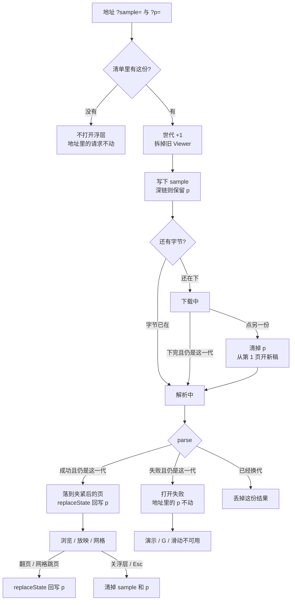
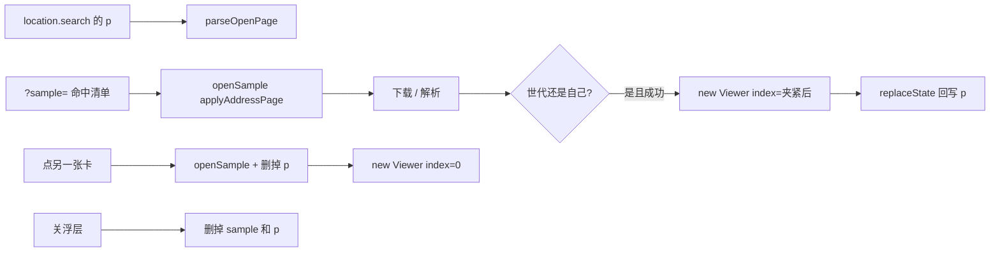

# 样本页 `?sample=` + `?p=`：预览停在指定页

> 第十二轮持续性迭代。只做这一件事：样本库预览的地址既写文件名也写页码，复制出去仍指向眼前这一页。官网首页回写、查看器换本地后清 `?file=`、W 白屏、数字+Enter 本轮不做。

---

## 1. 目标与用户

| 项 | 内容 |
|---|---|
| 用户 | 在样本库里挑一份、看某一页、把地址或「复制链接」甩给别人的人。不装 Office，文件不出设备。 |
| 要解决的问题 | 样本页已经回写 `?sample=`，复制能分享「哪一份」。翻到第 5 页再复制，对方仍停在第 1 页。首页读完 `?p=` 就清掉，不是分享表面。独立查看器上一轮才把 `?file=` + `?p=` 做成分享物；样本页这条真正带「复制链接」的轻量预览还没有页码。 |
| 成功标准 | `?sample=` 加上合法 `?p=` 打开后停在那一页；非法页码落到第一页并删掉撒谎的 `p`；超出总页落到最后一页并写成实际页；隐藏页可以直接落到；翻页 / 网格跳页后地址跟着变；换另一份样本不再套用上一份的页码；打开失败不改人家写进来的 `p`；关掉预览清掉 `sample` 和 `p`。Esc、网格、黑屏、滑动、打开世代仍按前十一轮。 |

不为谁做：不在这一轮让首页回写地址、不清查看器换本地后的 `?file=`、不做 W 白屏、不做数字+Enter、不做样本密码框、不改 `render/` 或 core、不推进发布包。

---

## 2. 用户场景与流程

主路径：打开 `samples.html?sample=deck.pptx&p=5` → 浮层打开这份 → 看见第 5 页 → 地址仍是 `p=5` → 翻到第 6 页 → 地址变成 `p=6` → 「复制链接」或复制地址栏，对方也停在第 6 页 → 点「演示」仍按第一轮从当前页进放映。

| 分支 | 行为 |
|---|---|
| 空状态 | 清单没有这份、还没点预览：浮层关着。只有 `p`、没有 `sample`：删掉孤儿 `p`。 |
| 非法页码 | 缺省、空、`foo`、`0`、负数、小数：当成第 1 页。成功打开后删掉 `p`。 |
| 超出总页 | 夹到最后一页。成功后把 `p` 写成实际页。 |
| 隐藏页 | 可以直接落到（和网格点隐藏页一样）。`skipHidden` 只约束 ‹ › / 滑动。 |
| 失败 | 下载失败、解析失败：不落页、不改 `p`。`sample` 仍指着正在看的那一份。 |
| 取消 | 关浮层 / Esc / 点遮罩：清掉 `sample` 和 `p`。没有密码框可取消。 |
| 换文件 | 点另一张卡的「预览」：一开始就删掉 `p`，从第 1 页打开。上一份的页码不能跟着走。 |
| 返回 | 浏览器后退回到**上一条历史记录**。翻页用 `replaceState`，不往历史栈里堆每一页。Esc 仍是网格 → 放映 → 关浮层。 |
| 恢复 | 打开成功后停在夹紧后的页。再点「演示」从当前页进放映。刷新沿用地址里当时的 `sample` 和 `p`。 |

---

## 3. 范围

| 必须做 | 不做 |
|---|---|
| 样本页读 `?p=`（1-based），与已有 `?sample=` 一起生效 | 官网首页再写一套（读完就清，故意保持干净主页） |
| 非法 / 超范围夹紧；隐藏页可直达 | 查看器换本地文件后清 `?file=` |
| 预览成功后，翻页 / 网格 / 滑动用 `replaceState` 回写 `p` | W 白屏、数字+Enter |
| 换另一份样本清掉 `p`；关浮层清掉 `sample` 和 `p` | 样本预览密码框（清单没有加密稿） |
| 「复制链接」继续复制当前地址（自然带上页码） | hash `#slide=` / `#page=`、改「在首页打开」带页 |
| 打开失败：不改地址里的 `p` | 改 `render/`、改 core、推进发布包 |

---

## 4. 调研与缺口

本轮打开并读完的原始页面（不是搜索摘要）：

| 来源 | 用户实际怎么用 | 对本仓库的含义 |
|---|---|---|
| [Share files from Google Drive](https://support.google.com/drive/answer/2494822?hl=en)（展开 permissions / Anyone with the link） | Viewer = 能打开。Anyone with the link → Copy link → **Paste the link in an email or any place you want to share it**。 | 分享物就是一条打开链接。样本页的「复制链接」已经是这条。缺的是链接里的「打开到哪一页」。 |
| [View & open files](https://support.google.com/drive/answer/2423485?hl=en) | Drive 网页双击：Office 文件先在 Drive **打开/预览**；「Select Open with **from the file preview**」是从预览再进编辑器。 | Web 第一期待是「打开就能看见」。样本浮层就是这个独立预览表面。 |
| [Make Google Docs, Sheets, Slides & Forms public](https://support.google.com/docs/answer/183965?hl=en) | Publish to web 之后「Copy the URL and send it」。演示文稿别人看到的是 **view-only 或全屏放映**。嵌入只选尺寸和换片速度。 | 发给别人的就是 URL。轻量预览从这条 URL 开始。 |
| [Present slides · Computer](https://support.google.com/docs/answer/1696787?hl=en&co=GENIE.Platform%3DDesktop)（展开 `Present mode keyboard shortcuts`） | Esc 结束；**7 再 Enter 跳到第 7 页**；Home / End；**B 黑屏、W 白屏**。 | 「去指定页」是桌面放映里的一等能力。分享预览连打开都到不了那一页。 |
| [Present slides · Android](https://support.google.com/docs/answer/1696787?hl=en&co=GENIE.Platform%3DAndroid) | Present on this device → **左右滑** → 返回键退出。没有数字跳页，没有 W。 | 手机官方主手势仍是滑。指定页要靠打开时的地址，不能指望手机快捷键。 |
| [Create a URL to open a PDF file at a specific page](https://helpx.adobe.com/acrobat/kb/link-html-pdf-page-acrobat.html)（2025-04-16） | 正文：**「When you open a PDF file in a web browser, the first page of the PDF file will be shown by default. You can add a string to the HTML link so a PDF file opens and jumps to a specified page」**。语法是 `#page=4`。本地盘路径不能带页；HTTP/HTTPS 可以。 | 浏览器预览用 URL 停在指定页是常规做法。本仓库查询串已经有 `p`，不抄 Adobe 的 hash，避免和 `?sample=` 两套语法。 |
| [Present your slide show](https://support.microsoft.com/en-us/powerpoint/present-your-slide-show) · Web 栏 | 控制条：上一页 / 下一页 / **See all slides** / 结束。没有 URL 页码。 | 放映表假定文件已经打开。网格第七轮已做。指定页仍要在打开这一步完成。 |
| 同上 · Windows Mobile 栏 | 空格或点屏幕前进；P 上一页；Esc 结束；**B 黑屏，再按 B 恢复当前页**。没有 W。 | B 第五轮已做。W 仍不是手机官方快捷键。 |
| Google `docs/answer/1696872`（链到指定幻灯片） | 本轮 HTTP **404**：「Sorry, this page can't be found。」 | 不能把 404 页当成深链说明。 |
| Microsoft `/office/add-a-hyperlink-to-a-slide`、`/office/open-files-in-office-for-the-web` | 本轮均为 **Sorry, page not found**。 | 不能把 404 页当打开说明。 |

对照本仓库：

| 表面 | 已有 | 缺口 |
|---|---|---|
| 官网首页 | 读 `?sample=` + `?p=`，立刻 `replaceState` 清掉 | 不是本轮缺口。首页是「试一下」，地址要保持干净主页。 |
| 样本预览 | 回写 `?sample=`，有「复制链接」，没有 `?p=` | **地址是分享物，却不能停在指定页** |
| 独立查看器 `?file=` | 第十一轮已做 `?p=`；换本地会清 `p`，`?file=` 仍指着远程 | 刷新会打开另一份。本地文件写不进地址，清掉 `file` 之后刷新也不是眼前那份 |
| 放映快捷键 | B / G / 滑动 / Esc 分层已齐 | 没有新的强证据要做 W 或数字+Enter |

更高价值检查：样本页是官网轻量预览的分享入口，每个被甩「复制链接」的人都可能被指向「看第 N 页」。查看器换本地后清 `?file=` 能止住撒谎，但止住之后刷新仍丢失本地稿，解决不了「分享眼前这一页」。W 仍只有 Google 桌面表。清单没有加密稿。

---

## 5. 是否值得做

| 判定 | 结论 |
|---|---|
| 使用者成本 | 复用已有 `open-page.ts`。只动私有样本页 + 契约。不进八个发布包，不增运行时依赖。打开完只在翻页时改查询串。 |
| 可行路径 | 页码解析 / 夹紧 / `replaceState` 已有；`Viewer` 构造函数已接受 `index`；样本页已经回写 `sample` 并刷新语言锚点。 |
| 换候选？ | 查看器清 `?file=`：地址诚实，但本地文件无法成为分享物，刷新仍对不上眼前内容。W / 数字+Enter：本轮原文没有新证据，网格已经能跳页。 |
| 判定 | **做样本页 `?sample=` + `?p=` 深链。** |

---

## 6. 产品方案

| 元素 | 规则 |
|---|---|
| 键名 | 查询串 `p`，1-based。与首页、查看器相同。不读 hash。 |
| 何时生效 | 地址里的 `?sample=` 在已校验清单里查到时，那一次打开套用 `p`。点卡打开不读、不套用。 |
| 合法值 | 纯数字且 ≥ 1。其余当第 1 页。 |
| 夹紧 | 大于总页 → 最后一页。文稿没有幻灯片 → 立刻抛错（fast-fail）。 |
| 隐藏页 | 允许直达。‹ › / 滑动仍跳过隐藏页。 |
| 成功回写 | 当前页 > 1 则 `p=N`；第 1 页删掉 `p`。`replaceState`，不 `pushState`。语言锚点跟着当前地址走。 |
| 失败 | 不改 `p`。`sample` 仍是这一份。 |
| 换样本 | `openSample` 一开始就删掉 `p`，从第 1 页打开。 |
| 关浮层 | 删掉 `sample` 和 `p`。 |
| 孤儿 `p` | 没有 `sample` 却带着 `p`：删掉。没有预览就没有当前页。 |
| 清单没有这份 | 不打开浮层。地址里的请求不动——那是人家写进来的，不是当前页。 |
| 浏览器后退 | 回到上一条完整导航。翻页不占历史。 |
| 打开期间 | `viewer === null`。G / B / 滑动不作用到旧稿。 |
| 放映 / 网格 | 从当前页进。网格跳页走同一套回写。 |
| 地址 | 不写密码。不读 `?password=`。「在首页打开」仍只带文件名。 |

---

## 7. 技术方案

| 决策 | 选择 | 原因 |
|---|---|---|
| 模块放哪 | 复用官网 `open-page.ts` | 解析规则已经单测过。样本页只多「何时套用 / 何时清」 |
| 为什么回写、不像首页那样读完就清 | 首页地址必须保持干净主页；样本页的 `?sample=` 就是分享物，清掉 `p` 之后复制出去又停在第一页 | 两套表面职责不同 |
| 为什么构造时传 `index` | 先画第 1 页再 `goTo` 会闪一帧 | 状态机本来就接受初始页 |
| 为什么 `replaceState` 而不是 `pushState` | 翻 20 页不该留下 20 条历史；后退应离开这一次预览，不是撤销翻页 | 翻页已经有 ‹ › / 滑动 |
| 为什么第 1 页删 `p` | `p=1` 与缺省同义；成功打开后还留着非法 `p=foo` 会撒谎 | 地址只表达非默认页 |
| 为什么失败不改 `p` | 人写的是请求；失败时没有「当前页」 | 空态页码是 `— / —` |
| 为什么换样本要删 `p` | 否则新稿套用旧页码，复制出去指着 B 却带着 A 的页 | 和查看器换本地清 `p` 同一理由 |
| 为什么关浮层要连 `p` 一起删 | 浮层关了就没有当前页；只删 `sample` 会留下孤儿 `p` | 地址必须和眼前内容一致 |
| 为什么隐藏页可直达 | 网格已经是这个契约；深链等于「点了那一格」 | `skipHidden` 只管顺序走 |
| 为什么不做 hash | 首页、查看器、样本都在查询串 | 两套语法会让分享链接分裂 |
| 为什么不做官网回写 | 首页故意清参数 | 一件事 |
| 为什么本轮不清查看器 `?file=` | 本地文件写不进地址；清掉之后刷新对不上眼前内容，解决不了轻量预览分享 | 下一轮候选 |
| 文案 | 无新词 | 页码已经在 `.preview-pager`；「复制链接」继续复制 `location.href` |

落点：

| 文件 | 职责 |
|---|---|
| `packages/site/src/open-page.ts` | 解析、夹紧、回写、清除（已有） |
| `packages/site/src/samples.ts` | 深链套用；点卡清除；成功回写；关浮层清参数 |
| 契约 | 样本页一条；旧画廊 / 网格 / 放映契约仍跑 |

不变量：`render/` 只认 `types.ts`；core 不碰 `document`；不进发布包。

---

## 8. 验收

| # | 标准 | 证据 |
|---|---|---|
| A1 | `?sample=page-contract.pptx&p=3`：`3 / 7`，`ready`，地址仍有 `p=3` | 新增契约 |
| A2 | `p=foo` / `p=0`：`1 / 7`，成功后地址没有 `p` | 同上 |
| A3 | `p=999`：最后一页，地址写成实际页 | 同上 |
| A4 | 隐藏稿 `p=2`：停在隐藏的第 2 页 | 同上 |
| A5 | 从 `p=3` 翻到下一页：地址变成 `p=4`；`history.back` 回到上一份完整导航 | 同上 |
| A6 | `p=3` 时点另一份：从第 1 页打开，地址没有 `p` | 同上 |
| A7 | 同一份 `p=3` 下载失败：失败可见，`— / —`，地址仍有 `p=3`，G 不可用 | 同上 |
| A8 | 落到第 3 页后进放映：控制条仍是第 3 页；网格跳页回写 `p` | 同上 |
| A9 | 关浮层：地址没有 `sample` 也没有 `p` | 新增 + 旧画廊契约 |
| A10 | 「复制链接」复制当前地址（含页码） | 旧复制契约仍跑 |
| A11 | 放映 / 网格 / 黑屏 / 滑动 / 打开世代仍按前十一轮 | 旧契约仍跑 |
| A12 | 四项门禁绿；browser-use 走 5174，查看器 5173 不回退 | 本轮验证 |

---

## 9. 方案自评

| 对照 | 结论 |
|---|---|
| 目标 | 解决「样本预览分享不能停在指定页」，没有偷换成做 W 或查看器清 `?file=` |
| 流程 | 主路径、空、失败、取消、返回、恢复、换样本都有出口 |
| 范围 | 只补样本页地址这一段；首页清参数不重做 |
| 与前十一轮 | 不回退放映、备注、滑动、黑屏、小视口、网格、打开世代、下载进度、密码框、查看器深链；Esc 仍分层 |
| AGENTS.md | 不改 `render/` 与 core；不进发布包 |
| 风险 | 先画第 1 页再跳会闪——所以初始页走构造函数。`pushState` 会让后退变成撤销翻页——所以只 `replaceState`。换样本若不删 `p`，新稿会套用旧页码 |

确认后再开发：用户是「用样本页地址打开到指定页的人」；范围只有样本预览深链；验收即上表。
