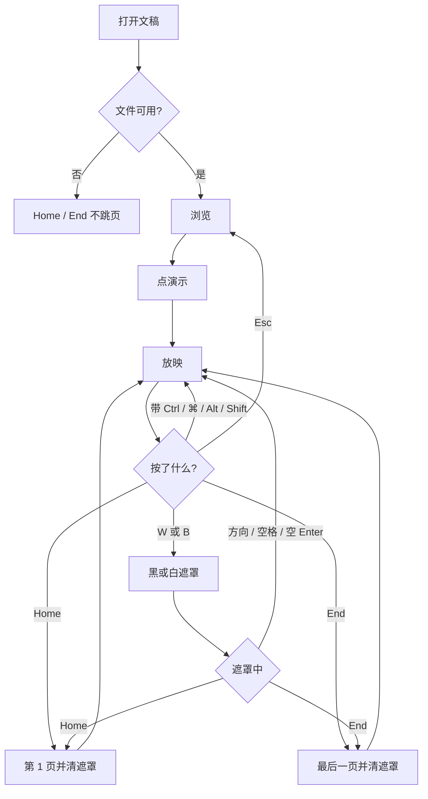
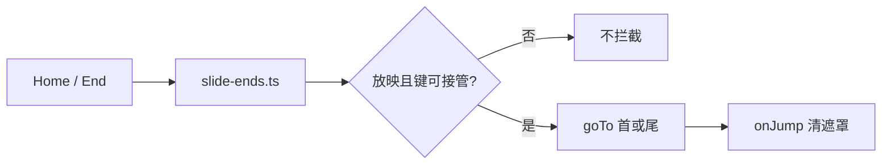

# 放映首尾页：Home 与 End

> 第三十轮持续性迭代。只做这一件事：官网首页 Demo、样本预览、独立查看器在**放映中**，不带修饰键的 Home 回到第一页，End 到最后一页，并清掉黑/白遮罩。浏览态不跳。

---

## 1. 目标与用户

| 项 | 内容 |
|---|---|
| 用户 | 在浏览器里放映 `.pptx` / `.ppt` 的人：已经讲到后面，要回到开头或直接收尾。不装 Office，文件不出设备。 |
| 要解决的问题 | 查看器浏览和放映都能到首尾页，但黑/白遮罩会把这两键收成「只恢复当前页」。官网放映键盘只有方向键、空格和 Enter，没有首尾页。 |
| 成功标准 | 只在放映中、没有输入框和网格时，Home 到第 1 页、End 到最后一页，并揭掉黑/白遮罩。浏览、搜索框、修饰键、数字缓冲、网格、Esc、换文件都不误跳。 |

不为谁做：不在这一轮做激光笔、备注内查找、浏览态改查看器已有的 Home / End、改 `render/` 或 core。

---

## 2. 用户场景与流程

主路径：打开文稿 → 点「演示」→ 翻到后面 → 按 Home → 停在第 1 页。按 End → 停在最后一页。浏览时按这两键，官网仍是整页滚动，查看器仍是原来的跳页。

| 分支 | 行为 |
|---|---|
| 空状态 | 未打开或打开失败：没有放映，这两键不造跳页。 |
| 失败 | 全屏被拒：仍在放映，Home / End 照常。输入框里的 Home / End 留给输入。 |
| 取消 | 浏览态不拦截。网格开着、带修饰键：不跳页。 |
| 返回 | 已经在第一页再按 Home，或已经在最后一页再按 End：页码不变，但遮罩要揭掉。 |
| 恢复 | 退出、换文件：没有残留的首尾页状态。再进放映从当前页开始，不会自己跳。 |

---

## 3. 范围

| 必须做 | 不做 |
|---|---|
| 首页 Demo、样本预览、独立查看器放映中的 Home / End | 浏览态改掉查看器已有的首尾页 |
| 合法跳页并清掉黑/白遮罩 | 再监听 Fn+方向键 |
| 数字缓冲、网格、搜索框、修饰键、Esc、换文件 | 激光笔、备注内查找 |
| 查看器提示条写上首尾页 | 改 `render/`、推进发布包 |

---

## 4. 调研与缺口

本轮打开并读完的原始页面（不是搜索摘要）。日期 2026-09-22。

| 来源 | 用户实际怎么用 | 对本仓库的含义 |
|---|---|---|
| [Use keyboard shortcuts to deliver PowerPoint presentations](https://support.microsoft.com/en-us/accessibility/powerpoint/use-keyboard-shortcuts-to-deliver-powerpoint-presentations) · Windows `tabpanel_1_windows` | 控制放映表：**Return to the first slide → Home**。**Go to the last slide → End**。媒体表另有 **Alt+Home / Alt+End**（上一个 / 下一个书签）。结束是 Esc。 | 首尾页是单独的 Home / End。带 Alt 的是书签，不能当成跳页。 |
| 同上 · macOS `tabpanel_1_macos` | **Return to the first slide → Function+Left arrow key**。**Go to the last slide → Function+Right arrow key**。没有写成 Home / End 这两个词。 | 不能只抄 Windows 的键名。Mac 表写的是用户手上的组合。 |
| 同上 · Web `tabpanel_1_web` | 只有开始、前进、后退、Esc。没有首尾页。 | Web 栏没写，和白屏、数字跳页一样，不以这一栏否定另外两栏和 Google。 |
| [Present slides](https://support.google.com/docs/answer/1696787?hl=en) · 展开 `Present mode keyboard shortcuts` | PC、Mac、Chrome 三张表同一行：**First slide → Home**，**Last slide → End**。Mac 表没有改成 Fn+方向键。 | 浏览器里的放映（含 Mac）官方写的就是 Home / End。 |
| [Mac keyboard shortcuts](https://support.apple.com/en-us/102650) | **Fn–Left Arrow：Home，滚到文档开头。Fn–Right Arrow：End，滚到文档结尾。** | macOS 把 Fn+左/右定义成 Home / End 这两个键，不是第三套方向键。浏览时这两键要留给整页滚动。 |
| [UI Events key values](https://developer.mozilla.org/en-US/docs/Web/API/UI_Events/Keyboard_event_key_values) | 导航键的键值是 `"Home"`、`"End"`。macOS 虚拟键是 `kVK_Home`、`kVK_End`。 | 页面上要认的是 `event.key`。Fn+方向键进到浏览器之后已经是这两个值。 |

对照本仓库：

| 表面 | 已有 | 缺口 |
|---|---|---|
| 查看器 | 浏览和放映的 Home / End 会 `goTo` 第一页和最后一页 | 遮罩把这两键收成只恢复，放映时盖着就跳不过去。放映跳页也不刷新演讲者侧的下一页 |
| 官网首页 / 样本 | 放映里方向键、空格、Enter 能前进 | 没有 Home / End。浏览时若接上，会抢走整页滚动 |
| 黑/白遮罩 | 方向键、空格、空 Enter、Home、End 都只恢复当前页 | Home / End 和「只恢复」抢同一件事 |

---

## 5. 是否值得做

| 判定 | 结论 |
|---|---|
| 认哪组键 | **认 `Home` / `End`。** Google 的 Mac 表写 Home / End。Apple 把 Fn+左/右定义成这两个键。Microsoft Mac 写 Function+方向键，是同一组键在没有独立 Home 键的键盘上怎么按出来。再监听方向键会变成上一页 / 下一页。 |
| 放映中的首尾页 | **做。** 三处预览里，官网两处没有；查看器有，但遮罩会吃掉。已知要回开头或收尾时，现在只能连按方向键或打开网格。 |
| 浏览态 | **官网不跳。** Apple 写明这时是滚到文档开头/结尾。查看器浏览已经会跳，本轮不改。 |
| 激光笔、备注内查找 | **不做。** 快捷键两家不一致，或比首尾页更靠后。 |
| 使用者成本 | 不进八个发布包。不增依赖。没有按下时没有额外行为。 |
| 可行路径 | `Viewer.goTo`、放映态、遮罩的 `clear`、网格的 `keysActive` 都在。越界不用交给 `goTo`：目标只有 0 和最后一页。 |

---

## 6. 产品方案

| 元素 | 规则 |
|---|---|
| 何时生效 | 仅放映中，且键盘没有被输入框、网格或 Ctrl / ⌘ / Alt / Shift 拿走。 |
| Home | `goTo(0)`。页码指示器的第 1 页，和数字跳页同一套索引。 |
| End | `goTo(count - 1)`。最后一页，不另算「最后一个未隐藏页」。方向键仍跳过隐藏页。 |
| 遮罩 | 跳页之后清掉黑/白遮罩。已经在那一页时，页码不动，遮罩也要揭掉。方向键、空格、空 Enter 仍只恢复、不翻页。 |
| 数字缓冲 | Home / End 先丢掉未确认的页码，再跳。不会在跳页之后再按缓冲里的数字走一次。 |
| 浏览态 | 不 `preventDefault`。官网留给整页滚动。查看器浏览仍是原来的 `goTo`。 |
| 搜索框 | 焦点在输入框时，Home / End 留给光标。 |
| 网格 | 开着时不跳页、不关网格。Esc 仍先关网格。 |
| 连发 | 按住只认第一次。重复的键丢掉，避免反复 `goTo`。 |
| 离开 | Esc 仍是离开放映或先关网格。换文件先退出放映，没有首尾页要清的状态。 |

---

## 7. 技术方案

| 决策 | 选择 | 原因 |
|---|---|---|
| 认哪个键 | `event.key` 为 `Home` 或 `End`，且没有 ctrl / meta / alt / shift | Apple 把 Fn+方向键定义成这两个键值。Alt+Home 在 Windows 放映里是书签 |
| 不认方向键 | 不看 `ArrowLeft` / `ArrowRight` | 那两键已经是上一页 / 下一页。Fn 在进页面之前就被系统换成 Home / End |
| 监听顺序 | 捕获阶段，排在数字缓冲之后、黑屏之前 | 缓冲先丢掉未确认页码。排在黑屏之后，遮罩会把这两键收成只恢复 |
| 遮罩 | 从「只恢复」名单拿掉，跳页时 `blank.clear()` | 名单留着的话，没拦住的 Home 会只揭遮罩、停在当前页 |
| 已在目标页 | 仍调用 `onJump` | `goTo` 同页直接返回，不会顺便揭遮罩 |
| 浏览态 | 直接返回，不拦截 | 官网 Home / End 是整页滚动 |
| 查看器冒泡 | 放映中不再处理 Home / End | 否则修饰键会漏到原来的 `goTo` |
| 模块 | 只加 `slide-ends.ts`，三处表面各接一次 | 与数字缓冲、黑屏同一模式。不进发布包 |
| 提示 | 查看器 hint 加「Home / End 首尾页」 | 不进共享词库 |

落点：

| 文件 | 职责 |
|---|---|
| `packages/site/src/slide-ends.ts` | 放映中的 Home / End |
| `packages/site/src/main.ts` / `samples.ts` | 排在黑屏之前 |
| `packages/viewer/src/main.ts` | 同一模块；放映中冒泡不再跳 |
| `packages/site/src/blank-screen.ts` | 只恢复名单不再包含这两键 |
| `packages/viewer/index.html` | 提示条写上首尾页 |
| `tooling/lib/slide-ends-browser-contract.mjs` | 浏览、跳页、缓冲、遮罩、修饰键、连发、搜索、网格、Esc、换文件 |

不变量：`render/` 只认 `types.ts`；core 不碰 `document`；不进发布包。

---

## 8. 验收

| # | 标准 | 证据 |
|---|---|---|
| A1 | 官网浏览态 Home / End 不翻页，事件仍冒泡且未 `preventDefault` | 契约 |
| A2 | 查看器浏览态 Home 回第一页、End 到最后一页；搜索框里不跳 | 契约 |
| A3 | 放映中 Home 到第 1 页、End 到最后一页，且这次按键不冒泡 | 契约 |
| A4 | 未确认的数字再按 Home：芯片消失，落到第一页而不是那个数字 | 契约 |
| A5 | 白屏或黑屏上的 Home / End 跳页并揭掉遮罩；带修饰键的 Home 保持遮罩和页码 | 契约 |
| A6 | 已经在最后一页时，黑屏再按 End 只揭遮罩 | 契约 |
| A7 | 网格开着不跳、不关网格；Esc 先关网格；再 Esc 离开放映 | 契约 |
| A8 | 换文件后不在放映、停在新文件第一页 | 契约 |
| A9 | 四项门禁绿 | check / test / build / verify |
| A10 | browser-use：5173 与 5174 放映中 Home / End 跳页，浏览态按方案 | `out/slide-ends-browser/` |

---

## 9. 方案自评

| 对照 | 结论 |
|---|---|
| 目标 | 补的是放映表上的第一页 / 最后一页。没有改成激光笔，也没有把 Fn+方向键做成第二套上一页 / 下一页 |
| 流程 | 主路径、空、失败、浏览、输入、网格、修饰键、连发、数字缓冲、黑/白、已在目标页、Esc、换文件都有出口 |
| 范围 | 三处预览表面同一条规则。不新增按钮 |
| 与前二十九轮 | 不回退数字缓冲、黑屏、白屏、网格、Esc 分层。方向键和空 Enter 在遮罩里仍只恢复 |
| 证据 | Microsoft 三栏、Google 展开后的三张表、Apple 键盘表、MDN 键值都读过。Mac 的 Function+方向键按 Apple 的定义就是 Home / End |
| AGENTS.md | 不改 `render/` 与 core |
| 风险 | 若这个监听排在黑屏之后，Home 只会揭遮罩。注册顺序写在调用处，契约用白屏上的 Home 卡住 |

确认后的决定：用户是「放映时要直接回开头或收到最后一页的人」；范围只有这组键；验收即上表。
