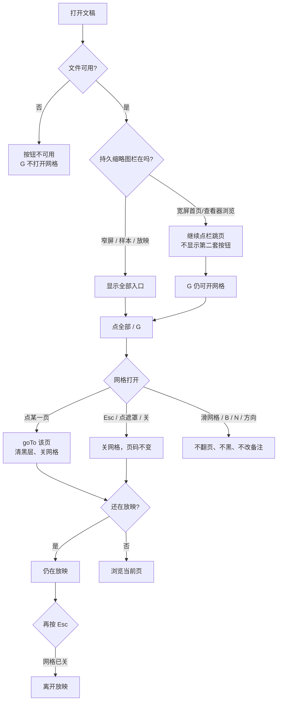
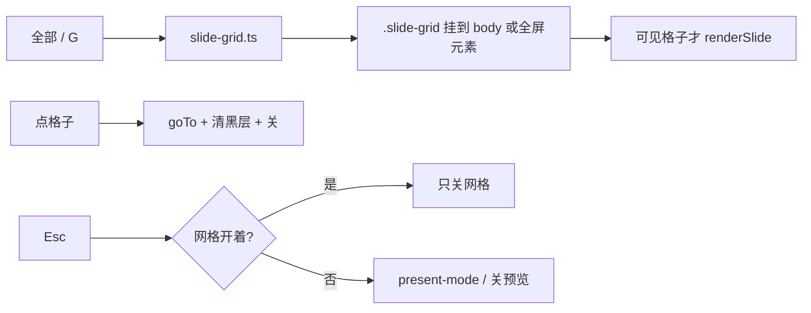

# 按需「全部幻灯片」网格

> 第七轮持续性迭代。只做这一件事：官网首页 Demo、样本预览、独立查看器在**需要跳页时**打开全部缩略图网格。桌面宽屏已有持久栏时不叠第二套入口。W 白屏本轮不做。

---

## 1. 目标与用户

| 项 | 内容 |
|---|---|
| 用户 | 在浏览器里打开 `.pptx` / `.ppt` 的人：手机先翻到某一页、窄窗口快速看稿、放映中要跳过中间几页。不装 Office，文件不出设备。 |
| 要解决的问题 | 第三轮官网、第六轮查看器都在 620px 藏掉缩略图栏。顺序翻（滑 / ‹ › / 键盘）还在，任意跳页没了。样本预览任何宽度都没有栏。Microsoft Web 放映控制条和演讲者视图用的是按需 **See all slides**，不是一直钉在左边的栏。 |
| 成功标准 | 需要时打开网格；点一页就跳过去并关上；Esc / 点遮罩关上且不跳页。宽屏已有栏时不出现第二套浏览按钮。放映、黑屏、滑动、备注、Esc 分层仍按前六轮。 |

不为谁做：不在这一轮做 W 白屏、数字+Enter 跳页、句号别名、双屏、编辑器放映、改 `render/` 或 core。

---

## 2. 用户场景与流程

主路径：窄屏打开文稿 → 点「全部」→ 看到全部页 → 点第 5 页 → 停在第 5 页，网格关掉 → 点「演示」→ 控制条再开网格跳页 → Esc 先关网格，再按才离开放映。

| 分支 | 行为 |
|---|---|
| 空状态 | 未打开或打开失败：按钮禁用，G 不造网格。 |
| 失败 | 全屏被拒：仍在放映，控制条网格照常。输入框里的 G 不打开。 |
| 取消 | 点遮罩、点关闭、Esc：关网格且不跳页。位移不足的滑、点备注：不打开网格。 |
| 返回 | 网格打开时 Esc 只关网格。网格已关后，Esc 仍是离开放映 / 关样本浮层。换文件、关预览必须清掉网格。 |
| 恢复 | 跳页后停在目标页。退出放映保持该页。拉宽窗口：浏览按钮藏起，持久栏回来。 |

---

## 3. 范围

| 必须做 | 不做 |
|---|---|
| 首页 Demo、样本预览、独立查看器共用同一套网格 | W 白屏、数字+Enter 跳页 |
| 窄屏浏览、样本任何宽度、放映控制条：给打开入口 | 宽屏首页/查看器浏览再做一套按钮 |
| 打开 / 关闭 / 点选跳转 / Esc | 把网格做成第二套持久栏 |
| 虚拟化渲染，避免 200 页一次插光 SVG | 双屏 / 激光笔 / 画笔 |
| 与放映、黑屏、滑动、备注、Esc 分层不打架 | 改 `render/`、改 core、推进发布包 |

---

## 4. 调研与缺口

读过的原始页面（打开后抽了全文，不是搜索摘要）：

| 来源 | 用户实际怎么用 | 对本仓库的含义 |
|---|---|---|
| [Present your slide show](https://support.microsoft.com/en-us/powerpoint/present-your-slide-show) · Web 栏 | From Beginning；控制条过一会儿隐去，`T` 再唤出。控制条按钮表有 **See all slides**，和上一页 / 下一页 / End Show 同一排。 | Web 官方跳页是控制条上的按需动作，不是左侧一直开着的栏。 |
| 同上 · Windows Mobile 栏 | 前进：空格或点屏幕。上一页：P。结束：Esc。**B 黑屏，再按 B 恢复当前页。** 这一栏没有 W，也没有 See all slides。 | 手机官方主手势仍是顺序走。B 第五轮已做。W 不是手机官方快捷键。 |
| [Start the presentation and see your notes in Presenter view](https://support.microsoft.com/en-us/powerpoint/training/start-the-presentation-and-see-your-notes-in-presenter-view) | **To view all the slides in your presentation, select See all slides.** 提示写明会看到全部缩略图，以便跳到指定页。黑屏是另一颗 **Black or unblack slide show**。 | 网格是叠加层。点选的目的是跳到那一页并看见它。 |
| [Present slides · Android](https://support.google.com/docs/answer/1696787?hl=en&co=GENIE.Platform%3DAndroid) | 本机放映左右滑；返回键退出。没有胶片栏，也没有网格。 | 顺序滑第三/四轮已做。缺的是任意跳。 |
| [Present slides · iPhone](https://support.google.com/docs/answer/1696787?hl=en&co=GENIE.Platform%3DiOS) | 同样左右滑。画笔模式才改到备注区滑。 | 默认滑舞台。网格不能把备注区滑当成翻页。 |
| [Present slides · Computer](https://support.google.com/docs/answer/1696787?hl=en&co=GENIE.Platform%3DDesktop) | 方向键或底栏箭头；**7 再 Enter 跳到第 7 页**。文末快捷键表：**B 黑屏、W 白屏**，任意键从空白回来。 | 数字跳页是桌面键盘习惯。W 仍是桌面放映增量。手机看稿先要看见「有哪些页」。 |

对照本仓库：

| 表面 | 已有 | 缺口 |
|---|---|---|
| 官网首页 620px | 藏 `.thumbs`；能滑、能黑 | 不能跳到不相邻的页 |
| 样本预览 | 任何宽度都没有缩略图栏 | 只能 ‹ › / 滑 |
| `packages/viewer` 窄屏 | 第六轮藏 `#thumbs` | 底栏只有 ‹ › 和页码 |
| 桌面宽屏首页/查看器 | 持久缩略图，点一下就跳 | 不缺浏览入口；缺的是放映里的按需网格 |
| 放映控制条 | ‹ ›、N、B、退出 | 没有 See all slides |

更高价值检查：没有新的渲染性能证据要求本轮改 `render/`。数字+Enter 和 W 都是桌面放映增量。窄屏藏栏后不能跳页，是「手机上快速看稿」的主路径断点。

---

## 5. 是否值得做

| 判定 | 结论 |
|---|---|
| 使用者成本 | 只动两个私有应用。不进八个发布包，不增运行时依赖。网格按需挂上，关着零 SVG。 |
| 可行路径 | `Viewer.goTo`、缩略图虚拟化、放映控制条、620px 断点都在。 |
| 换候选？ | W 的 Google 桌面表完整，但 Microsoft 手机栏没有，也不是藏栏后的断点。数字+Enter 同样是桌面键盘。 |
| 判定 | **做按需网格。** 不值得做的是本轮顺手做 W。 |

---

## 6. 产品方案

| 元素 | 规则 |
|---|---|
| 何时显示浏览按钮 | 持久栏不在：视口 `max-width: 620px`，或样本预览（从来没有栏）。宽屏首页/查看器浏览：**不显示**这颗按钮。 |
| 何时显示放映按钮 | 只要在放映里。此时持久栏不是当前操作面。 |
| 打开 | 点按钮、按 G（文稿已打开且不在输入框）。宽屏无按钮时，G 仍可开——快捷键不是第二套视觉入口。 |
| 格子里有什么 | 全部页，含隐藏页（与现有栏一致，带「隐藏」标记）。点隐藏页仍 `goTo`，`skipHidden` 只约束 ‹ ›。 |
| 点选 | 跳到该页，关上网格，**清掉黑层**——人是来看那一页的。 |
| 关闭且不跳 | Esc、点遮罩、点关闭。 |
| 网格打开时 | 滑网格不翻页；B / N / 方向 / 空格不作用到舞台。 |
| Esc 分层 | 开着网格：只关网格。网格已关：放映离开 / 关样本浮层。 |
| 离开 | 换文件、关预览、离开放映：网格必须不在。 |
| 全屏 | 网格要跟进全屏元素，否则 `host.requestFullscreen()` 之后看不见。 |

---

## 7. 技术方案

| 决策 | 选择 | 原因 |
|---|---|---|
| 模块放哪 | 官网 `slide-grid.ts`，查看器相对导入 | 与滑动、黑屏同一模式；禁止复制两套；不进发布包 |
| 浏览按钮何时出现 | `thumbsVisible()` 为假 | 宽屏栏还在时叠按钮会变成两套跳页 |
| 为什么放映仍要按钮 | 放映盖住或搬走了栏 | Microsoft Web 也是控制条上的 See all slides |
| 缩略图怎么渲 | IntersectionObserver，走 `renderSlide`；列表 `align-content: start` | 与栏同一条：主视图同时在，不能共用 defs id 缓存。默认 stretch 会把几十页压成细条 |
| Esc 为什么改 present-mode | 放映 Esc 是捕获阶段且先注册 | 不加 `consumeEscape`，第一下 Esc 会直接离开放映 |
| 跳页为什么清黑层 | 人从网格里点的是「去看那一页」 | 控制条 ‹ › 仍保持黑，那是明确的顺序走 |
| 点黑层与滑动尾巴 | 层还盖着时 click 必须恢复 | 滑动 ignore / 黑层 swallow 只挡「层已关」之后的误触翻页 |
| 挂到哪 | 默认 `document.body`；非 `documentElement` 的全屏元素再搬进去 | 官网放映全屏的是舞台宿主；只挂 body 会在全屏里消失 |
| 文案为什么不进词库 | 与 B 相同，读 `document.documentElement.lang` | 编辑器首包会把 `en-home` 整表打进去 |
| 为何不做 W | Google 桌面有，Microsoft 手机栏没有 | 一件事；看稿跳页先于放映空白 |

落点：

| 文件 | 职责 |
|---|---|
| `packages/site/src/slide-grid.ts` | 开/关、G、点选、虚拟化、Esc、全屏挂载 |
| `packages/site/src/present-mode.ts` | `consumeEscape`；排除 `.slide-grid` |
| `packages/site/src/main.ts` / `samples.ts` | 接上按钮与 `keysActive` |
| `packages/site/index.html` / 样本控制条 | 浏览「全部」、放映 G |
| `packages/site/src/style.css` | 网格层 |
| `packages/viewer/src/main.ts` / `index.html` / `style.css` | 同一模块 |
| 契约 | 官网一条、独立查看器一条 |

不变量：`render/` 只认 `types.ts`；core 不碰 `document`；词条不进发布包。

---

## 8. 验收

| # | 标准 | 证据 |
|---|---|---|
| A1 | 1280 首页/查看器浏览：全部按钮 `hidden` | 新增契约 |
| A2 | 390 首页/查看器：按钮可见；点第 3 格到 `3 / 7` 并关网格 | 同上 |
| A3 | 样本预览 1280：仍有全部按钮（从来没有栏） | 同上 |
| A4 | Esc / 点遮罩关网格，页码不变 | 同上 |
| A5 | 放映中开网格，Esc 只关网格；再 Esc 才离开 | 同上 |
| A6 | 网格上滑、B、方向不翻页、不黑屏 | 同上 |
| A7 | 未打开或打开失败：G 不造网格 | 同上 |
| A8 | 四项门禁绿；browser-use 走 5174 与 5173，覆盖桌面与窄屏 | 本轮验证 |

---

## 9. 方案自评

| 对照 | 结论 |
|---|---|
| 目标 | 解决「藏栏之后不能跳页」，没有偷换成做 W |
| 流程 | 主路径、空、失败、取消、返回、恢复都有出口 |
| 范围 | 三处预览表面同一件事；宽屏栏不叠按钮 |
| 与前六轮 | 不回退放映、备注、滑动、黑屏、小视口；Esc 仍分层 |
| AGENTS.md | 不改 `render/` 与 core；不进发布包 |
| 风险 | 放映 Esc 先注册会吞掉关网格——所以要 `consumeEscape`。全屏宿主若不收纳网格，官方 `requestFullscreen` 路径会让人以为按钮没反应 |

确认后再开发：用户是「手机/窄屏要跳页的人」；范围只有按需网格；验收即上表。
