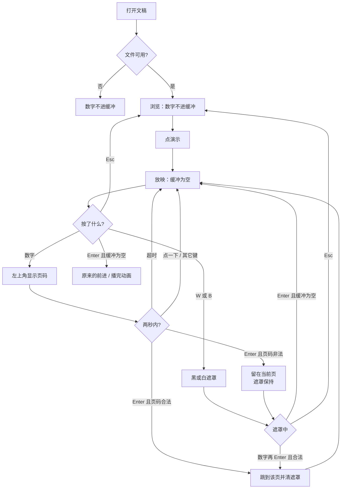
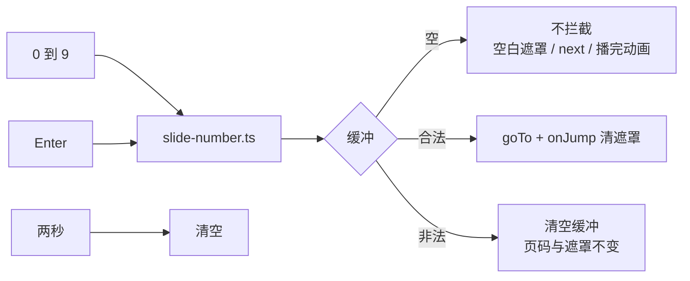

# 放映数字跳页：数字后再按 Enter

> 第二十九轮持续性迭代。只做这一件事：官网首页 Demo、样本预览、独立查看器在**放映中**把连续数字收成页码，Enter 跳到那一页。缓冲为空时，Enter 仍是现在的前进、播完动画，或遮罩里的只恢复。

---

## 1. 目标与用户

| 项 | 内容 |
|---|---|
| 用户 | 在浏览器里放映 `.pptx` / `.ppt` 的人：已经知道要去第几页，不想打开网格再点。不装 Office，文件不出设备。 |
| 要解决的问题 | Google 三张现行表和 Microsoft Windows / macOS 放映表都写了「输入页码再按 Enter / Return」。网格能跳，放映键盘没有这段缓冲。 |
| 成功标准 | 只在放映中、没有输入框和网格时，数字进缓冲，Enter 跳到 1 起始的那一页并清掉黑/白遮罩。缓冲是空的，Enter 不改现有含义。浏览、搜索框、非法页码、两秒未确认、换文件、Esc 都不误跳。 |

不为谁做：不在这一轮做官网放映的 Home / End、激光笔、浏览态数字跳页、改 `render/` 或 core。

---

## 2. 用户场景与流程

主路径：打开文稿 → 点「演示」→ 按 `3` → 左上角看到 3 → 按 Enter → 停在第 3 页。什么都没按就按 Enter，仍是原来的下一步。

| 分支 | 行为 |
|---|---|
| 空状态 | 未打开或打开失败：没有放映，数字不造页码。 |
| 失败 | 全屏被拒：仍在放映，数字照常。输入框里的数字留给输入。 |
| 取消 | 浏览态、网格开着、带 Ctrl / ⌘ / Alt 的数字：不进缓冲。点一下、方向键、黑/白键、Esc：丢掉未确认的页码，键本身仍做原来的事。 |
| 返回 | 缓冲为空的 Enter：官网放映仍前进，查看器仍播完本页动画，黑/白遮罩里仍只恢复当前页。 |
| 恢复 | 两秒没有下一个数字也没有 Enter：缓冲清空，下一次 Enter 不再跳页。换文件、离开放映：缓冲和左上角一起消失。 |

---

## 3. 范围

| 必须做 | 不做 |
|---|---|
| 首页 Demo、样本预览、独立查看器共用一个缓冲 | 浏览态用数字跳页 |
| 放映中不带 Ctrl / ⌘ / Alt 的 `0`–`9`，Enter 确认 | 官网放映补 Home / End |
| 合法页码 `goTo` 并清掉黑/白遮罩 | 激光笔、第二套跳页按钮 |
| 非法页码留在当前页；空 Enter 不拦截 | 改 `render/`、推进发布包 |
| 搜索框、网格、两秒超时、换文件、Esc | 任意键都当成确认 |

---

## 4. 调研与缺口

本轮打开并读完的原始页面（不是搜索摘要）。日期 2026-09-22。

| 来源 | 用户实际怎么用 | 对本仓库的含义 |
|---|---|---|
| [Use keyboard shortcuts to deliver PowerPoint presentations](https://support.microsoft.com/en-us/accessibility/powerpoint/use-keyboard-shortcuts-to-deliver-powerpoint-presentations) · Windows `tabpanel_1_windows` | 前进一行含 **Enter**。指定页：**Type the slide number, then press Enter**。第一页 **Home**，最后一页 **End**。白屏是 W 与逗号，黑屏是 B 与句号。结束是 **Esc**。 | 页码和前进共用 Enter。缓冲为空时 Enter 必须仍去前进，不能改成「只有跳页」。 |
| 同上 · macOS `tabpanel_1_macos` | 指定页：**Type the slide number, then press Return**。第一页是 **Function+Left arrow**，最后一页是 **Function+Right arrow**。结束含 Esc、连字符、⌘+.。 | macOS 的首尾页不是 Home / End。数字 + Return 仍在。 |
| 同上 · Web `tabpanel_1_web` | 只有开始、前进（含 Enter / Return）、后退、Esc。没有指定页，也没有 Home / End。 | Web 栏没写，不推翻桌面表。白屏那一轮已经按桌面表补过。 |
| [Present slides · Computer](https://support.google.com/docs/answer/1696787?hl=en&co=GENIE.Platform%3DDesktop) · 展开后的三张表 | PC、Mac、Chrome 同一行：**Go to specific slide (7 followed by Enter goes to slide 7) → Number followed by Enter**。下一行第一页 **Home**，再下一行最后一页 **End**。黑屏 `b`、白屏 `w`，回来是 Press any key。 | 例子是 1 起始的第 7 页。三张表都有数字跳页，也都有 Home / End。 |

对照本仓库：

| 表面 | 已有 | 缺口 |
|---|---|---|
| 官网首页 / 样本 / 查看器 | 放映中网格能点到任意页；黑/白遮罩的空 Enter 只恢复 | 放映里没有数字缓冲 |
| 官网放映 Enter | 与空格一样 `next`：有动画先播动画，否则翻页 | 缓冲非空时如果放行，会在跳页之后再前进一次 |
| 查看器 Enter | 放映中播完本页剩余动画，不翻页。浏览里 `0` 是适应窗口 | 放映里的 `0` 若仍去适应窗口，就组不出 10 这类页码 |
| 查看器 Home / End | 浏览和放映都能到第一页和最后一页 | 官网放映键盘没有这两键 |

---

## 5. 是否值得做

| 判定 | 结论 |
|---|---|
| 数字 + Enter | **做。** Google 三张表和 Microsoft Windows、macOS 都写了。网格是睁眼点选；放映时已知页码，缺的就是这段缓冲。上一轮把冲突留到单独一轮，本轮只做这一件，并把浏览、搜索、空 Enter、黑/白、非法页、超时、换文件、Esc 都定死。 |
| 官网放映 Home / End | **不做。** 查看器已经有。Google 三张表和 Microsoft Windows 有 Home / End；macOS 写的是 Fn+左右方向，Web 栏没有。比数字跳页小，留给下一轮。 |
| 激光笔 | **不做。** Google 是裸 `l`，PowerPoint 是 Ctrl+L / ⌘+L。 |
| 浏览态数字跳页 | **不做。** 两家表都写在放映里。查看器浏览的 `0` 已经是适应窗口。 |
| 使用者成本 | 不进八个发布包。不增依赖。缓冲空着时没有节点开销以外的行为；芯片默认隐藏。 |
| 可行路径 | `Viewer.goTo`、放映态、黑/白遮罩、网格的 `keysActive` 都在。越界不能交给 `goTo`，它会把页码夹到最后一页。 |

---

## 6. 产品方案

| 元素 | 规则 |
|---|---|
| 何时生效 | 仅放映中，且键盘没有被输入框、网格或 Ctrl / ⌘ / Alt 拿走。 |
| 入缓冲 | `0`–`9`。左上角只显示这些数字。按住不连发，否则查看器里按住 `0` 会去适应窗口。 |
| 位数 | 不超过总页数的位数。已经顶满再按，新数字重新开始。7 页时按 `1` 再按 `2`，缓冲是 `2` 不是 `12`。 |
| 确认 | 缓冲非空的 Enter：按 1 起始解析。`1`…总页数就 `goTo`，并清掉黑/白遮罩。`0`、大于总页数：留在当前页，遮罩保持，这次 Enter 不前进。 |
| 空 Enter | 不 `preventDefault`、不拦截。官网放映仍 `next`，查看器仍播完动画，遮罩里仍只恢复。 |
| 超时 | 最后一次数字之后 2 秒没有后续：清空。官方表没写时长；再久，下一次用来前进的 Enter 会被旧数字抢走。 |
| 浏览态 | 数字不进缓冲、不翻页。查看器的 `0` 仍是适应窗口。 |
| 搜索框 | 焦点在输入框时，数字是查询里的字符。 |
| 网格 | 开着时数字不进缓冲、不关网格、不翻页。打开网格的 G、点一下，都会丢掉未确认的页码。 |
| 黑/白 | 数字可以在遮罩上接着输。合法确认后清遮罩并看见那一页。非法确认不借 Enter 把遮罩揭掉。空 Enter 仍只恢复。 |
| 其它键 | 方向、W、B、句号、逗号、Esc：先丢掉缓冲，键继续做原来的事。Esc 仍是离开放映或先关网格。 |
| 离开 | 退出、换文件、关闭预览：缓冲消失。再进放映从空缓冲开始。 |

---

## 7. 技术方案

| 决策 | 选择 | 原因 |
|---|---|---|
| 监听顺序 | 捕获阶段，并且排在 `blank-screen` 之前 | 遮罩里的 Enter 现在会 `stopImmediatePropagation`。排在后面，合法页码永远确认不到 |
| 空 Enter | 直接返回 | 三处表面的 Enter 含义不同，缓冲模块不能收成一种 |
| 非法页 | 自己判断，不调用 `goTo` | `goTo` 会夹到最后一页。`0` 和 `99` 必须留在当前页 |
| 合法页清遮罩 | `onJump` 里 `blank.clear()` | 和网格点选一样：人是来看那一页的。控制条 ‹ › 仍不在这条路径上 |
| 认哪个键 | `event.key` 为 `0`–`9`，且没有 ctrl / meta / alt | 美式键盘 Shift+3 的字符是 `#`，不是数字。小键盘的 `key` 同样是数字 |
| 自动重复 | 拦住但不追加 | 第一次已经入缓冲。放行的话，查看器按住 `0` 会 `applyFit` |
| 超时 | 2000ms，从最后一位重计 | 够按出两位。官方没写秒数，必须有一个可观察的清空，否则 Enter 的旧含义不稳定 |
| 点一下 | `pointerdown` 清空且不拦截 | 点舞台或 ‹ › 是另一件事。缓冲若还在，随后的 Enter 会跳页 |
| 芯片放哪 | 放映宿主上，不放进舞台 | `Viewer.paint()` 会 `innerHTML` 清掉舞台。黑/白层已经为这件事座回；页码不应该再绑一次 |
| 模块 | 只加 `slide-number.ts`，三处表面各接一次 | 与黑屏、网格同一模式。不进发布包 |
| 提示 | 查看器 hint 加「数字+Enter 跳页」 | 不进共享词库。编辑器首包会把首页词表打进去 |

落点：

| 文件 | 职责 |
|---|---|
| `packages/site/src/slide-number.ts` | 缓冲、超时、确认、清空 |
| `packages/site/src/main.ts` / `samples.ts` | 排在黑屏之前；退出和换文件时清空 |
| `packages/viewer/src/main.ts` | 同一模块；放映里的 `0` 不再适应窗口 |
| `packages/site/src/style.css` / `packages/viewer/src/style.css` | 左上角芯片，黑白底上都能看见 |
| `packages/viewer/index.html` | 提示条写上数字跳页 |
| `tooling/lib/slide-number-browser-contract.mjs` | 浏览、空 Enter、跳页、改口、非法、修饰键、点一下、超时、搜索、网格、黑/白、Esc、换文件 |

不变量：`render/` 只认 `types.ts`；core 不碰 `document`；不进发布包。

---

## 8. 验收

| # | 标准 | 证据 |
|---|---|---|
| A1 | 浏览态数字不出现芯片、不翻页；查看器 `0` 仍回到适应窗口 | 契约 |
| A2 | 放映中 `3` 再 Enter 到第 3 页，且这次 Enter 不冒泡；7 页时 `1` 再 `2` 的缓冲是 `2` | 契约 |
| A3 | `0` 与 `9` 再 Enter 留在当前页；空 Enter 仍冒泡到原来的监听 | 契约 |
| A4 | 点一下或两秒后缓冲消失，随后的 Enter 不会跳到刚才的数字 | 契约 |
| A5 | 搜索框里的数字留在查询里；网格开着时数字不跳页、不关网格 | 契约 |
| A6 | 白屏上的合法 Enter 跳页并揭掉遮罩；非法 Enter 保持白屏；空 Enter 仍只恢复 | 契约 |
| A7 | Esc、换文件之后没有芯片、不在错误页 | 契约 |
| A8 | 四项门禁绿 | check / test / build / verify |
| A9 | browser-use：5173 与 5174 放映中按 3 再 Enter 到第 3 页，浏览态不跳 | `out/slide-number-browser/` |

---

## 9. 方案自评

| 对照 | 结论 |
|---|---|
| 目标 | 补的是放映表上的「输入页码再确认」。没有改成 Home / End 或激光笔 |
| 流程 | 主路径、空、失败、浏览、输入、网格、修饰键、超时、点一下、非法页、黑/白、空 Enter、Esc、换文件都有出口 |
| 范围 | 三处预览表面同一缓冲。不新增按钮 |
| 与前二十八轮 | 不回退网格、黑屏、白屏、放映 Enter、查看器 `0` 适应、搜索、Esc 分层。逗号和 W 仍是白屏 |
| 证据 | Microsoft 三栏和 Google 展开后的三张表都读过。Web 栏没有指定页，和白屏一样不以这一栏否定桌面表 |
| 不做 Home / End | 查看器已经能到首尾页。macOS 官方写的还不是 Home / End。数字缓冲是三处表面都缺的那一行 |
| AGENTS.md | 不改 `render/` 与 core |
| 风险 | 若这个监听排在黑屏之后，遮罩里的 Enter 会被先吃掉。注册顺序写在调用处。若非法页交给 `goTo`，会落到最后一页 |

确认后的决定：用户是「放映时想按页码跳过去的人」；范围只有这段缓冲；验收即上表。
