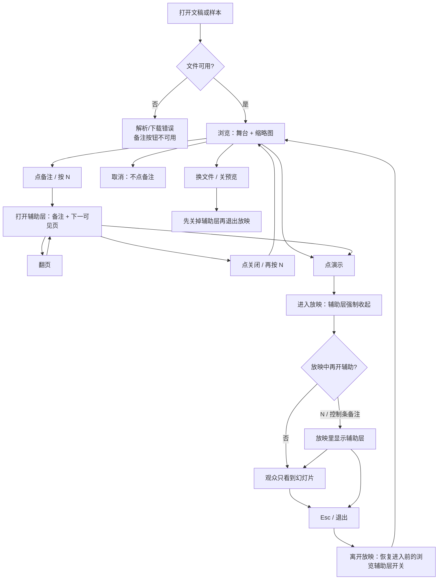
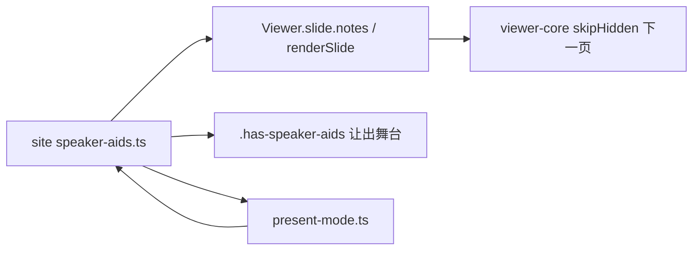

# 官网演讲者辅助：备注 + 下一页预览

> 第二轮持续性迭代。只做这一件事：首页 Demo 与样本预览能看到**演讲者备注**和**下一可见页**；默认「演示」仍是给观众的干净画面。

---

## 1. 目标与用户

| 项 | 内容 |
|---|---|
| 用户 | 在官网打开 `.pptx` / `.ppt` 的人：同事甩一份文件要「先看一眼」、自己对着备注过两页、投屏前先核对下一张。不装 Office，文件不出设备。 |
| 要解决的问题 | 引擎已经解析 `slide.notes`，查看器私有包也能显示备注和下一页；官网首页默认文稿 `showcase.pptx` 每页都写了备注，界面上却完全看不见。 |
| 成功标准 | 浏览态能打开备注与下一可见页；进入「演示」时辅助层自动收起；放映中可再打开；Esc / 关闭能回到干净浏览态。空状态、失败、取消、换文件都有出口。 |

不为谁做：不在这一轮做双屏 / 第二窗口演讲者视图、触控滑动、B 键黑屏、激光笔、编辑器「放映」页、改 `render/` 或 core。

---

## 2. 用户场景与流程

主路径：打开文稿 → 点「备注」或按 N → 看到本页备注和下一可见页 → 翻页内容跟着变 → 点「演示」投屏（辅助层收起）→ 需要时再按 N → Esc 离开放映。

| 分支 | 行为 |
|---|---|
| 空状态 | 文稿未打开或打开失败：备注按钮禁用。本页无备注：写「本页无备注」，不是空白。最后一页或后面全是隐藏页：写「没有下一页」。 |
| 失败 | 下载/解析失败：不能打开辅助层。全屏被拒：仍按上一轮留在放映，辅助层默认收起。 |
| 取消 | 密码框取消、关样本预览、不点备注：都不打开辅助层。 |
| 返回 | 辅助层关闭按钮、再按 N、Esc（放映优先于关辅助层，辅助层优先于关样本浮层）。 |
| 恢复 | 退出放映后回到进入前的浏览开关；换文件或关预览必须清空，不能把上一份的备注留在屏幕上。 |

---

## 3. 范围

| 必须做 | 不做 |
|---|---|
| 首页 Demo、样本预览浮层共用同一套辅助层 | 双屏 / `getScreenDetails` / 第二窗口 |
| 浏览态：当前页备注 + 下一**可见**页预览 | 把备注画进默认放映画面 |
| 进入「演示」自动收起；放映中可再打开 | 触控滑动、B 键、激光笔、画笔 |
| 点辅助层不触发舞台前进 | 编辑器「放映」页 |
| Esc / 关闭 / 换文件的出口 | 改 `render/`、改 core、给发布包加 DOM 依赖 |

---

## 4. 调研与缺口

读过的原始页面（不是搜索摘要）：

| 来源 | 用户实际怎么用 | 对本仓库的含义 |
|---|---|---|
| [Present your slide show](https://support.microsoft.com/en-us/powerpoint/present-your-slide-show)（Microsoft，含 Windows / Mac / Web / Mobile 各栏） | Web：From Beginning，控制条会隐去，`T` 再唤出。Mac：下一步是点右箭头、**点幻灯片**或按 N。Mobile：**点屏幕**或空格前进，Esc 结束。Mobile 在双屏时才用 Presenter View 看备注和即将出现的幻灯片。 | 「演示」是给观众的幻灯片。备注和下一页属于演讲者视图，不是默认放映的一部分。 |
| [Start the presentation and see your notes in Presenter view](https://support.microsoft.com/en-us/powerpoint/training/start-the-presentation-and-see-your-notes-in-presenter-view) | 演讲者视图在**自己的屏幕**上看备注，投影出去的屏幕只有幻灯片。单屏也可以从控制条再打开 Presenter View。可以关掉。备注在右侧窗格，太长就滚动。 | 官网只有一个窗口。默认「演示」必须保持上一轮的干净画面；备注要做成可开关的辅助层，进入放映时先收起。 |
| [Present slides](https://support.google.com/docs/answer/1696787?hl=en&co=GENIE.Platform%3DDesktop)（Google Slides，Computer） | Slideshow 是全屏给观众。备注走独立的 Presenter view → Speaker notes。文档写明：**不能在同一块屏幕上同时用 Presenter view 和 Full screen**。 | 轻量预览更不该把备注嵌进默认全屏放映。 |
| 同上 Android / iPhone 栏 | 手机放映：左右**滑动**翻页。iOS 画笔模式下，在备注区域滑动才翻页。 | 滑动是下一轮候选，不是本轮门槛。本轮点舞台 / 按钮已经能翻页。 |

对照本仓库：

| 表面 | 已有 | 缺口 |
|---|---|---|
| `core` | `slide.notes` 已解析 | 不缺 |
| `packages/viewer` | 浏览态备注面板 + 放映态当前页 / 下一页 / 备注 | 私有包已有，官网没接 |
| 官网首页 / 样本预览 | 上一轮：能进放映、点舞台前进、Esc 离开 | 默认文稿每页都有备注，界面零入口 |
| 编辑器 | 可编辑演讲者备注 | 本轮不接到预览 |

首页默认文件 `showcase.pptx` 的备注不是空壳，例如第 1 页「形状库：验证 140+ 预设几何…」、第 7 页说明立体与动画。这些字今天只存在于 OOXML 里。

---

## 5. 是否值得做

| 判定 | 结论 |
|---|---|
| 使用者成本 | 只动官网私有层。不进八个发布包，不增运行时依赖。辅助层按需打开，默认放映不付布局成本。 |
| 可行路径 | `Viewer.slide.notes`、`Viewer.renderSlide(i)`、`skipHidden` 的下一可见页都能直接用。查看器私有包已有同一产品形态。 |
| 换候选？ | 触控滑动也有证据（Google 手机官方就是滑）。但上一轮已经让点舞台前进，滑动是手势增量。备注是官网正在演示、用户却看不见的能力。 |
| 判定 | **做备注 + 下一可见页。** 不值得做的是把它们画进默认放映，或本轮顺手做滑动。 |

---

## 6. 产品方案

| 元素 | 规则 |
|---|---|
| 入口 | 浏览条「演讲者备注」；放映控制条 N。未打开文稿时禁用。N 开关键（与查看器私有包一致；前进仍是点舞台 / 空格 / →，不把桌面 PowerPoint 的 N=下一步搬过来）。 |
| 浏览 | 舞台右侧辅助层：上为下一可见页，下为备注。打开时舞台让出右侧，避免备注盖住幻灯片。 |
| 放映 | 进入时强制收起。放映中再打开则铺在黑底右侧，点辅助层不翻页。 |
| 下一页 | 按 `skipHidden` 找下一张可见页，静态 SVG。没有则「没有下一页」。 |
| 备注 | 用户正文只走 `textContent`。没有则 CSS `:empty` 显示「本页无备注」（不进共享词库，避免编辑器首包涨体积）。 |
| 离开 | 关闭按钮、再按 N。Esc：先离开放映，再关辅助层，再关样本浮层。 |
| 换文件 | 先 `reset` 辅助层，再退出放映、打开新文件。 |

小视口（缩略图本身已隐藏）：辅助层改贴底部，舞台让出下沿。

---

## 7. 技术方案

| 决策 | 选择 | 原因 |
|---|---|---|
| 默认放映是否带备注 | 否，进入时收起 | Microsoft / Google 都把备注放在演讲者屏幕；上一轮放映衬底写明投出去只该有幻灯片 |
| 辅助层放哪 | `stage-wrap` 里的 aside | 放映时 `stage-wrap` 已经铺满视口，辅助层跟着走，不必再搬 DOM |
| 下一页怎么渲 | `renderSlide`，不走主视图缓存 | 与缩略图同一理由：同页两个 SVG 不能撞 defs id |
| 隐藏页 | 与 `PresentationState.next()` 相同，跳过 | 预览一张放映里到不了的页会骗人 |
| N 键 | 开关键，不是下一步 | 查看器私有包已经把 N 给备注；官网对齐自己的查看器 |
| 退出放映 | 恢复进入前的浏览开关 | 看备注 → 演示一下 → 回来，不应强迫人再点一次 |

落点：

| 文件 | 职责 |
|---|---|
| `packages/site/src/speaker-aids.ts` | 开关、收起/恢复、备注与下一可见页、N 键 |
| `packages/site/src/main.ts` / `samples.ts` | 接上按钮，换文件先 reset |
| `packages/site/src/present-mode.ts` | 点辅助层不前进 |
| `packages/site/src/style.css` | 浏览 / 放映 / 小视口布局 |
| `packages/site/index.html` | 浏览条与放映条入口 |
| `en-home.ts` | 词条 |
| `tooling/lib/site-viewer-controls-contract.mjs` | 打开、翻页、空状态、进入放映收起、放映中再开、点层不翻页 |

不变量：`render/` 只认 `types.ts`；core 不碰 `document`；词条不进发布包。

---

## 8. 验收

| # | 标准 | 证据 |
|---|---|---|
| A1 | showcase 第 1 页打开备注能看到「形状库」；翻到第 2 页变成「效果与填充」 | 新增契约 |
| A2 | 最后一页预览为「没有下一页」；无备注文稿为「本页无备注」 | 同上 |
| A3 | 点「演示」后辅助层关闭；放映中 N 能再打开；点辅助层页码不变 | 同上 |
| A4 | Esc 离开放映后，进入前若开着则恢复，若关着则保持关 | 同上 |
| A5 | 未打开或打开失败时按钮禁用 | 失败契约补一行 |
| A6 | 四项门禁绿；browser-use 走通首页与样本主路径及空 / 失败态 | 本轮验证 |

---

## 9. 方案自评

| 对照 | 结论 |
|---|---|
| 目标 | 解决「引擎有备注、官网看不见」，没有偷换成改文案 |
| 流程 | 主路径、空、失败、取消、返回、恢复都有出口 |
| 范围 | 两处预览表面同一件事；双屏和滑动明确不做 |
| 与上一轮 | 不回退放映；进入演示仍先收起辅助层 |
| AGENTS.md | 不改 `render/` 与 core；站点词条不进发布包 |
| 风险 | 备注正文必须 `textContent`；下一页必须独立 defs；进入放映漏收起会把备注投给观众 |
