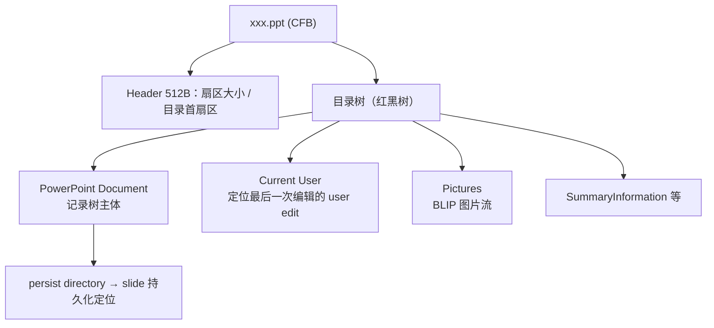

# .ppt 规范地图（MS-PPT / CFB / Escher）

给未来开发的规范导航：`.ppt` 由哪几份规范定义、记录模型怎么组织、每个功能域对应仓库哪个模块。`.ppt` 与 `.pptx` 的语义差异（效果概念、SmartArt、媒体）见 [README 已知限制](../../README.md#已知限制)。

## 1. 规范体系

| 规范 | 内容 | 获取 |
|---|---|---|
| **[MS-PPT]** | PowerPoint 97–2003 二进制格式本体：stream 组织、记录树、文本 / 版式 / 动画 / 母版语义（当前 10.1 版，2024-11） | [规范主页](https://learn.microsoft.com/en-us/openspecs/office_file_formats/ms-ppt/6be79dde-33c1-4c1b-8ccc-4b2301c08662)（含 [PDF](https://officeprotocoldocs-f5hpbjgea6b8gneq.b02.azurefd.net/files/MS-PPT/%5bMS-PPT%5d.pdf)，约 1000 页） |
| **[MS-CFB]** | Compound File Binary 容器（OLE2）：扇区 / FAT / 目录 / miniFAT / 流 | [规范主页](https://learn.microsoft.com/en-us/openspecs/windows_protocols/ms-cfb/) |
| **[MS-ODRAW]** | OfficeArt（Escher）二进制绘图层：DGG/DG/SPGR/SP 记录、FOPT 属性表、BLIP 图片 | [规范主页](https://learn.microsoft.com/en-us/openspecs/office_file_formats/ms-odraw/8560795e-7759-4745-838f-f7f2ef2f1872) |
| **[MS-OFFCRYPTO]** | 加密：`.ppt` 用 RC4 + CryptoAPI（与 pptx 的 AES 系不同章） | [规范主页](https://learn.microsoft.com/en-us/openspecs/office_file_formats/ms-offcrypto/3c34d72a-1a61-4b52-a893-196f9157f083) |
| **[MS-EMF] / [MS-WMF]** | 图片流里的图元文件 | 同 learn 站点 |

MS-PPT 的授权是 Open Specifications Promise，可自由实现（规范页 IPR 声明）。

## 2. 物理结构：CFB → 流



| 层 | 规范 | 仓库模块 |
|---|---|---|
| 扇区 / FAT / miniFAT / 目录 | MS-CFB | `ppt/cfb.ts`（魔数 `D0CF11E0` 就在这里验） |
| Current User → user edit → persist directory | MS-PPT | `ppt/parser.ts`（页面定位链） |
| Pictures 流 BLIP | MS-PPT + MS-ODRAW | `ppt/escher.ts`（含 zlib 解压） |

## 3. 记录模型

PowerPoint Document 流的内容是一棵**记录树**，每种记录 8 字节头：

```
RecordHeader（8B）：
  verInst: u16 LE ── 低 4 bit = recVer，高 12 bit = recInstance
  recType: u16 LE
  recLen:  u32 LE
规则：recVer == 0xF ⇒ 容器记录（体里是子记录）；其余 ⇒ 原子记录（体是数据）
复用：recInstance 在 Escher 里常承载语义（形状类型 / BLIP 类型），不是单纯计数
```

仓库实现就是这段的直译：[`ppt/records.ts`](../../packages/core/src/ppt/records.ts) 的 `records()` 生成器（`isContainer: version === 0xf`）。**改记录解析前先读它的注释**。

## 4. 功能域 → 规范 → 仓库模块

| 功能域 | 规范位置 | 模块 |
|---|---|---|
| 记录遍历与通用解码 | MS-PPT §2 / MS-ODRAW | `ppt/records.ts` |
| 演示 / 页面 / 版式 / 母版记录树 | MS-PPT 各 container 章节 | `ppt/parser.ts` |
| Escher 形状与属性（FOPT 6 字节条目、复杂属性尾部追加） | MS-ODRAW OfficeArtFOPT | `ppt/escher.ts` |
| 文本（TextCharsAtom / TextBytesAtom / TxMasterStyle 九级） | MS-PPT 文本章节 | `ppt/parser.ts`；`edit-core/master-text-style-state.ts` |
| 母版文本样式（TxMasterStyleAtom） | MS-PPT | 同上 |
| 自动编号 | MS-PPT autonum | `ppt/autonum.ts`、`text-auto-number.ts` |
| 主题色（excolor / 索引色求值） | MS-PPT | `ppt/theme.ts` |
| 动画 / 交互 timing | MS-PPT interactive / timing 章节 | `ppt/timing.ts` |
| 自定义几何（pVertices / pSegmentInfo） | MS-ODRAW shape path | `ppt/custom-path.ts` |
| 隐藏页（F_HIDDEN）等页面属性 | MS-PPT | `ppt/parser.ts` |
| RC4 CryptoAPI 解密 | MS-OFFCRYPTO | `crypto/ppt.ts` |
| 图表 | 无原生概念——**经内嵌 EMF 显示** | `image/emf.ts` |
| `.ppt` 生成保存（写侧） | MS-PPT 记录定义 + MS-CFB 写入 | `edit-core/ppt/`（按投影生成，不保留未知记录） |

## 5. 坑（规范与样本层面）

| 坑 | 事实 | 影响 |
|---|---|---|
| 效果概念缺失 | OfficeArt 二进制没有发光 / 柔化 / 倒影（那是 DrawingML 2007+ 的概念）；外阴影有 | `.ppt` 文件里这些效果本来就不存在，不是解析缺失 |
| 3D 样本双重叠加 | LibreOffice 转 `.ppt` 会把 3D 烘进 cube 预设几何**又**保留 3D 属性，照样本实现会双重叠加 | `.ppt` 3D 暂缺可信样本（roadmap 登记中） |
| SmartArt 无二进制定义 | `.ppt` SmartArt 未实现（无样本与规范路径） | 已知限制 |
| LibreOffice 转换非确定性 | 同一 pptx 转两次字节不同 | fixture 按**渲染结果**比对而非字节（AGENTS 陷阱） |
| recInstance 语义复用 | 不是计数器而是类型 / 标志载体 | 读 `records.ts` 注释再动手 |

## 6. 开发场景索引

| 要做的功能 | 先读 | 参照实现 |
|---|---|---|
| 新记录类型解析 | MS-PPT 该记录的词条（§2 记录参考按 recType 检索） | `ppt/parser.ts` 的 switch 结构 |
| 新 Escher 属性 | MS-ODRAW 属性表（property id 对照） | `ppt/escher.ts` 的 `ESCHER` 表 |
| 扩展 `.ppt` 原生写回范围 | MS-PPT 记录 + persist 语义 | `edit-core/ppt/`（票据 010 legacy-ppt-scope） |
| 图片流新格式 | MS-ODRAW BLIP + 对应图片规范 | `ppt/escher.ts`、`image/` |
| 加密变体 | MS-OFFCRYPTO RC4 章节 | `crypto/ppt.ts` |
