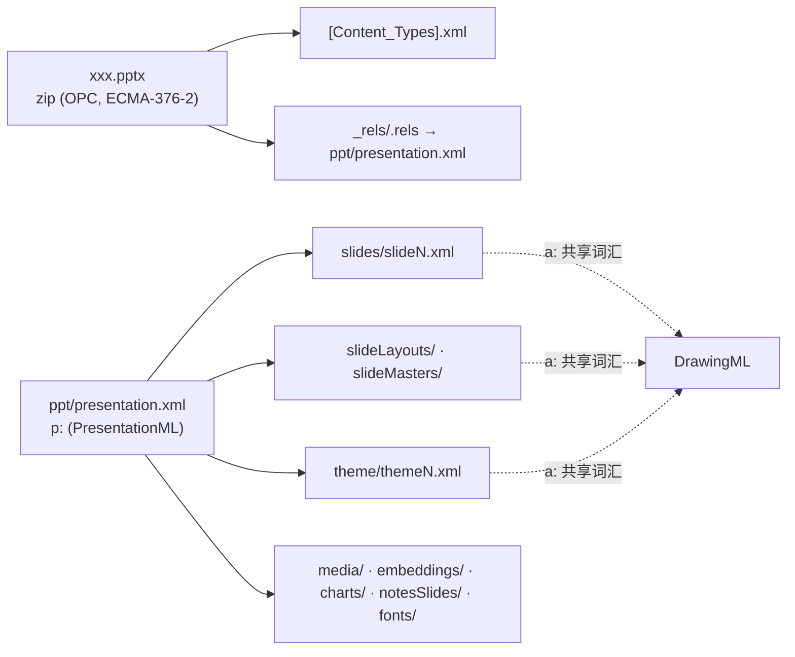

# .pptx 规范地图（ECMA-376 / OOXML）

给未来开发的规范导航：`.pptx` 由哪几份规范定义、每个功能域读哪一节、对应仓库哪个模块、哪里有规范没写清的坑。仓库现状见 [architecture.md](../architecture.md)；坑的完整索引见 [pitfalls.md](../pitfalls.md)。

## 1. 规范体系与版本

| 版本 | 时间 | 结构 | 与 ISO 的关系 |
|---|---|---|---|
| ECMA-376 1st | 2006-12 | 5 部（Markup Language Reference 是独立的 Part 4） | 尚未进 ISO |
| ECMA-376 2nd | 2008-12 | 4 部 | = ISO/IEC 29500:2008 |
| ECMA-376 3rd | 2011-06 | 4 部 | ≈ ISO/IEC 29500:2011/2012，**首次划分 Strict / Transitional 两个一致性类别** |
| ECMA-376 4th / 5th | 2015 / 2016-12 | 4 部 | = ISO/IEC 29500:2015/2016（现行） |

| Part | 名称 | 内容 |
|---|---|---|
| Part 1 | Fundamentals and Markup Language Reference（约 5560 页） | 全部标记语言参考。clause 17 = WordprocessingML、18 = SpreadsheetML、**19 = PresentationML**、**20–21 = DrawingML**（形状 / 文本 / 图表 / 图片等共享图形词汇） |
| Part 2 | Open Packaging Conventions（OPC，约 129 页） | zip 包模型：`[Content_Types].xml`、`_rels`、part 寻址、核心属性 |
| Part 3 | Markup Compatibility and Extensibility（约 40 页） | `mc:AlternateContent` 扩展协商机制 |
| Part 4 | Transitional Migration Features（约 1464 页） | 遗留构造，**VML 在这里**（OLE 预览图部件用到） |

**Transitional vs Strict**：同一概念两套命名空间（如 `p:sldIdLst` vs `p16:sldIdLst` 形式的 URI 差异）；PowerPoint 实际写的是 **Transitional**，本仓库解析与保存都以 Transitional 为准。

获取：[Ecma 官方页](https://ecma-international.org/publications-and-standards/standards/ecma-376)（各版 PDF/ZIP 免费下载）、[第五版 PDF 镜像](https://github.com/QtExcel/ecma-376-5th)。5560 页的 Part 1 靠**元素名查 PDF 书签**导航（本文映射表不写子节号，原因即此）。

## 2. 包结构与命名空间

| 前缀 | 命名空间 | 定义处 | 仓库用途 |
|---|---|---|---|
| `p:` | presentationml/2006/main | ECMA-376-1 §19 | 演示结构、页面、占位符、timing |
| `a:` | drawingml/2006/main | ECMA-376-1 §20–21 | 形状、几何、文本、填充、效果、表格 |
| `c:` / `cx:` | chart / **2014** chartex | ECMA-376-1 / **[MS-ODRAWXML]** | 经典图表 / 现代图表（见 §4） |
| `r:` | officeDocument/2006/relationships | ECMA-376-2 | 部件间引用（`r:embed` 等） |
| `mc:` | markup-compatibility/2006 | ECMA-376-3 | `AlternateContent` 新旧版本协商 |
| `p14:` `p15:` `a14:` | 微软扩展（2009/2012） | [MS-ODRAWXML] 及各扩展页 | 切换 / 动画 / 图片属性扩展、分节 `p14:sectionLst` |

## 3. 功能域 → 规范章节 → 仓库模块

| 功能域 | 规范位置 | 解析模块 | 编辑 / 渲染落点 |
|---|---|---|---|
| OPC 包读取、内容类型、关系 | Part 2 | `pptx/package-reader.ts` | `edit-core/opc/`（补丁引擎）、`save/` |
| 演示结构（sldIdLst、sldSz、分节） | Part 1 §19 | `pptx/parser.ts`、`sections.ts` | `edit-core/sections.ts`、`slide-size.ts` |
| 母版 / 版式 / 占位符继承链 | §19（sldMaster / sldLayout / ph） | `slide-inheritance.ts`、`layout-catalog.ts`、`layout-reparse.ts` | `edit-core/layout.ts`、`master.ts`、设计画布 |
| 形状树（sp / pic / graphicFrame / grpSp / cxnSp） | §19 spTree | `pptx/parser.ts` | `types.ts` → `render/svg.ts` |
| 预设几何（prstGeom + avLst）与自定义几何（custGeom） | §20–21 DrawingML 几何 | `pptx/geometry.ts`（OOXML 读取） | `geometry/`（187 预设求值，零依赖）、`edit-core/preset-geometry.ts` |
| 填充 / 渐变 / 图案 / 主题色变换（shade/tint） | DrawingML 填充 | `pptx/color.ts` | `render/fill.ts`（线性 RGB 变换） |
| 效果（阴影 / 发光 / 柔化 / 倒影） | DrawingML 效果 | `pptx/effects.ts` | `render/effect-svg.ts`、`three-d/` |
| 文本（txBody、pPr/rPr、项目符号、autofit） | DrawingML 文本 | `text-body.ts`、`paragraph-props.ts` | `render/text-*`、`edit-core/text-model.ts` 及 `run-* / paragraph-*` |
| 主题（clrScheme / fontScheme / fmtScheme） | DrawingML 主题 | `pptx/`（theme part 解析） | `edit-core/theme.ts`、`theme-projection.ts` |
| 表格（a:tbl / tblPr / tblGrid / 合并） | DrawingML 表格 | `pptx/table-style.ts`、`builtin-table-styles.ts` | `edit-core/table-*` 系列 |
| 经典图表（c:chartSpace） | DrawingML Charts | `chart/`（hook 注入的第四条链路） | `edit-core/chart/`、`chart-design/`、`chart-shared/` |
| 现代图表（cx:chartSpace） | **[MS-ODRAWXML]** | `chart-ex/`、`chart-ex.ts`（hook 注入） | `edit-core/chart-ex/` |
| SmartArt / diagram | DrawingML Diagram | `pptx/diagram.ts` | `edit-core/smartart/` |
| 媒体（视频 / 音频 / 海报） | §19 + MS-ODRAWXML media 扩展 | `pptx/parser.ts` 媒体关系 | `edit-core/media/`、`viewer-core/video/` |
| 切换（p:transition）与动画（p:timing） | §19 | `transition.ts`、`animation.ts`、`animation-timing.ts` | `viewer-core/playback.ts`、`edit-core/slide-animation.ts` |
| 备注（notesSlide / notesMaster） | §19 | `pptx/parser.ts` | `edit-core/notes-part.ts`、`slide-notes.ts` |
| OMML 数学公式（m: 命名空间） | Part 1 OMML 章节 | `pptx/omml.ts` | `render/math-svg.ts`（结构化排版） |
| mc:AlternateContent 协商 | Part 3 | `markup-compatibility.ts`、`shape-compatibility.ts`、`compatibility-source.ts` | 回退保真（见 §5 陷阱） |
| 嵌入字体（embeddedFontLst + fntdata） | §19（容器语义在实现层） | `font/eot.ts`（EOT 剥壳） | `fonts` 包、Worker 字形（见 §5） |
| OLE 嵌入（oleObject + VML 预览） | §19 + **Part 4 VML** | `pptx/parser.ts` | `edit-core/ole/` |
| OLE 对象 / OPC 加密包装 | [MS-OFFCRYPTO] | `crypto/ooxml.ts`（AES-ECB / 敏捷 AES-CBC） | 密码打开（`PasswordRequiredError`） |
| EMF / WMF / PICT 图片解码 | [MS-EMF] [MS-WMF] / PICT | `image/` | `render/image-fill.ts` |
| 图片效果 / 3D / EMF+ | [MS-ODRAWXML] 相关扩展 | `advanced-rendering.ts`、`emf-plus.ts`、`three-d.ts`（按需） | 官网自动加载 |

## 4. 微软扩展层（不在 ECMA-376 内）

| 规范 | 内容 | 获取 |
|---|---|---|
| **[MS-ODRAWXML]** | DrawingML 的微软扩展：`cx:chartSpace` 现代图表（2014 命名空间）、media / 图片属性扩展 | [规范主页](https://learn.microsoft.com/en-us/openspecs/office_standards/ms-odrawxml/06cff208-c6e1-4db7-bb68-665135e5f0de)（在线分节可检索） |
| **[MS-OFFCRYPTO]** | Office 文档加密结构：标准加密（AES-ECB）、敏捷加密（AES-CBC + SHA 系） | [规范主页](https://learn.microsoft.com/en-us/openspecs/office_file_formats/ms-offcrypto/3c34d72a-1a61-4b52-a893-196f9157f083) |
| **[MS-OI29500]** | ISO/IEC 29500 的 Office 实现信息：Office 实际行为与规范的偏差（对无效值的容忍度、默认值处理） | Microsoft Learn openspecs |
| p14 / p15 / a14 扩展元素 | 切换（如 ripple）、动画扩展、`sectionLst` | 分散在各扩展页，常经 `mc:AlternateContent` 挂载 |

## 5. 规范没写清的坑（本仓库踩过）

| 坑 | 事实 | 出处 |
|---|---|---|
| 嵌入字体不是裸 TTF | `fntdata` 是 EOT 容器且普遍开 MTX 压缩；**MTX 无公开规范**，只能注入逆向实现（`mtx-decompressor`） | [AGENTS 陷阱表](../../AGENTS.md#已知陷阱) |
| 图表 XML 本身就是 OOXML | `chart/` 复用 `pptx/color` 是正当的（chart XML 是 DrawingML），不是分层违规 | 同上 |
| 有预览图 ≠ 回退已生效 | `mc:AlternateContent` 的 Fallback 分支解析器可能拿 Choice 的占位当成功结果，两条路径都丢图——roadmap §5.10 实测纠正 | [roadmap](../roadmap.md) |
| Strict / Transitional 混存 | 真实文件几乎全为 Transitional；保存写 Transitional 才是 PowerPoint 兼容路径 | 本仓库实现约定 |
| VML 只在 Part 4 | OLE 预览图是 VML（Transitional 遗留），解析它不代表支持完整 VML | `pptx/parser.ts` |
| LibreOffice 不是规范实现 | ground truth 对照只用于横向比较；它自己的近似（图表画法、空字符串省略）不能当 oracle | [pitfalls](../pitfalls.md) |

## 6. 开发场景索引

| 要做的功能 | 先读 | 参照实现 |
|---|---|---|
| 新切换 / 动画效果 | ECMA-376-1 §19 的 transition/timing 元素 + p14 扩展页 | `pptx/transition.ts`、`viewer-core/playback.ts` |
| 新图表类型 | DrawingML Charts 章节（c:）或 MS-ODRAWXML（cx:） | `chart/plots.ts`、`chart-ex/` |
| 新填充 / 效果 | DrawingML 填充与效果章节 | `pptx/color.ts`、`render/fill.ts` |
| 新预设形状 | 已全集（187 个），只需调 `geometry/` | `geometry/` |
| 写入新 part / 关系 | ECMA-376-2（OPC） | `edit-core/opc/`、`save/` |
| 新的 OOXML 扩展命名空间 | ECMA-376-3（mc 机制）+ MS-ODRAWXML | `pptx/markup-compatibility.ts` |
| 新导出格式 | 无需读格式规范（只读 Schema） | `browser-export.ts`、`pdf/` |
| 加密新算法变体 | MS-OFFCRYPTO 对应章节 | `crypto/ooxml.ts` |
