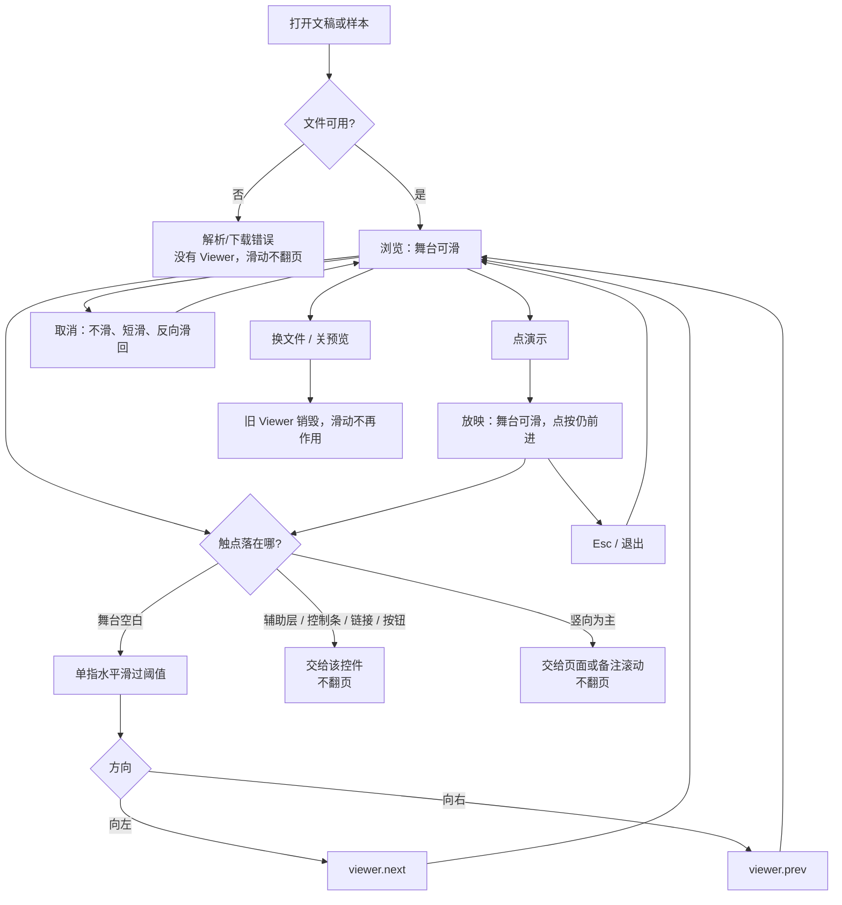
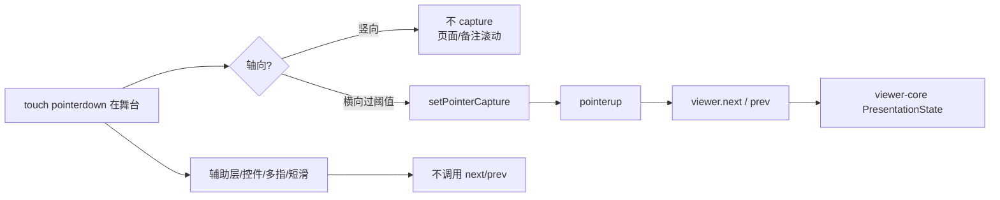

# 官网触控滑动翻页

> 第三轮持续性迭代。只做这一件事：首页 Demo 与样本预览在**舞台上左右滑**就能翻页（放映里与点舞台同一条 `next` / `prev`）。双屏演讲者视图本轮不做。

---

## 1. 目标与用户

| 项 | 内容 |
|---|---|
| 用户 | 在浏览器里打开 `.pptx` / `.ppt` 的人：同事甩一份文件要「先看一眼」、手机上翻一遍、投屏时用手指走下一步。不装 Office，文件不出设备。 |
| 要解决的问题 | 620px 已藏缩略图，手机浏览只剩底栏小按钮；放映已能点舞台前进，但官方手机放映的主手势是左右滑。舞台上滑、辅助层上滑、竖向滚页面目前没有边界。 |
| 成功标准 | 单指在舞台上水平滑过阈值：向左 = `next()`，向右 = `prev()`。浏览态与放映都生效。辅助层、控制条、链接、竖滑、短滑、多指、鼠标拖都不翻页。Esc / 退出 / 换文件出口不变。 |

不为谁做：不在这一轮做双屏 / 第二窗口、B 键黑屏、激光笔、画笔、编辑器「放映」页、查看器私有包、改 `render/` 或 core。

---

## 2. 用户场景与流程

主路径：打开文稿 →（小视口）在舞台上向左滑 → 下一可见页 → 点「演示」→ 继续左右滑（有动画先播一批）→ Esc 离开。

| 分支 | 行为 |
|---|---|
| 空状态 | 文稿未打开或打开失败：`viewer()` 为空，滑动不翻页。 |
| 失败 | 下载/解析失败：没有可用 Viewer。全屏被拒：仍按第一轮留在放映，滑动照常。 |
| 取消 | 位移不足阈值、竖向锁死、第二指落下、`pointercancel`、松手时回到起点：都不调用 `next` / `prev`。横向手势会在短窗口内压掉随后的 click，避免放映里连跳；竖滑不压后续轻点。 |
| 返回 | Esc、退出按钮、浏览器退出全屏：第一轮规则不变。辅助层关闭 / N：第二轮规则不变。滑动不接管 Esc。 |
| 恢复 | 退出放映后浏览态仍可滑。换文件或关预览后旧页码不能被滑回来。 |

---

## 3. 范围

| 必须做 | 不做 |
|---|---|
| 首页 Demo、样本预览浮层共用同一套滑动 | 双屏 / `getScreenDetails` / 第二窗口 |
| 浏览态与放映态：舞台单指左右滑 = `next` / `prev` | 把滑动做成绕过动画的「整页跳」 |
| 辅助层、控制条、链接、页内 `data-slide` 上滑不翻页 | 画笔模式下改到备注区才能滑（我们没有画笔） |
| 竖滑交给页面滚动或备注滚动 | 鼠标拖动画布翻页 |
| 放映中滑成功后不让随后的 click 再 `next` 一次 | 查看器私有包、编辑器放映、B 键、激光笔 |
| 现有点舞台 / 键盘 / Esc 保持原样 | 改 `render/`、改 core、给发布包加 DOM 依赖 |

---

## 4. 调研与缺口

读过的原始页面（不是搜索摘要）：

| 来源 | 用户实际怎么用 | 对本仓库的含义 |
|---|---|---|
| [Present slides · Android](https://support.google.com/docs/answer/1696787?hl=en&co=GENIE.Platform%3DAndroid)（Google 官方） | 本机放映：`Present on this device` → **左右滑换页** → 返回键退出。投 Chromecast 时同样「swipe right or left」。 | 手机官方主手势就是滑，不是点底栏箭头。 |
| [Present slides · iPhone](https://support.google.com/docs/answer/1696787?hl=en&co=GENIE.Platform%3DiOS) | 同样左右滑换页；退出是双击再 Close。画笔模式：在幻灯片上画，**换页改为在演讲者备注区左右滑**。 | 默认滑的是舞台。备注区滑动只在画笔抢走舞台手势时才改道。我们没有画笔，备注区必须继续给滚动，不能当翻页。 |
| [Present slides · Computer](https://support.google.com/docs/answer/1696787?hl=en&co=GENIE.Platform%3DDesktop) | 桌面用方向键或底栏箭头。多显示器：必须 Chrome + **至少一块外接屏** + 授权；**同一块屏不能同时用 Presenter view 和 Full screen**。 | 双屏是桌面投影能力，不是轻量预览门槛。 |
| [Present your slide show](https://support.microsoft.com/en-us/powerpoint/present-your-slide-show)（Microsoft，含 Web / Mobile 栏） | Web / 桌面：快捷键与点幻灯片。Mobile 栏：前进是空格或 **tap the screen**，P 上一页，Esc 结束。全文没有 swipe。 | 点舞台前进第一轮已做。Microsoft 手机官方不靠滑，缺的是 Google 那边的手势，不是再做一遍点按。 |
| [Window Management API](https://developer.mozilla.org/en-US/docs/Web/API/Window_Management_API)（MDN） | `getScreenDetails()` 是实验能力，需要 `window-management` 权限；被拒抛 `NotAllowedError`。用途是把窗口放到指定屏幕。 | 双屏必须走这条路。 |
| [Can I use: getScreenDetails](https://caniuse.com/mdn-api_window_getscreendetails) | Chrome / Edge 100+ 有；Firefox 全线没有；Safari / iOS 没有。 | 官网「先看一眼」的主力机（iPhone Safari）做不了双屏。 |

对照本仓库：

| 表面 | 已有 | 缺口 |
|---|---|---|
| 官网 620px | 缩略图 `display: none` | 浏览态没有舞台手势，只能点底栏 ‹ › |
| 放映 | 点舞台 / 键盘 `next`；全屏失败仍放映 | 没有滑动；滑完若再冒 click 会连跳 |
| 辅助层 | 小视口贴底，备注可滚 | 在备注上滑若当翻页，人看不完备注 |
| 查看器私有包 | 点舞台前进、键盘 | 本轮不接滑动 |
| 双屏 | 单窗口辅助层已能看备注和下一页 | `getScreenDetails` + 外接屏，Safari 不可用 |

---

## 5. 是否值得做

| 判定 | 结论 |
|---|---|
| 使用者成本 | 只动官网私有层。不进八个发布包，不增运行时依赖。只在触点为 `touch` 时跟踪，鼠标桌面零开销。 |
| 可行路径 | `Viewer.next` / `prev`、`isPresentAdvanceTarget`、现有 CDP 触点契约都在。`touch-action: pan-y` 把竖向还给浏览器。 |
| 换候选？ | 双屏有官方形态，但 Google 自己要求外接屏 + Chrome 授权；MDN 标实验，Firefox / Safari 没有。单窗口辅助层已能先看备注。滑动补的是轻量手机预览正在缺的手势。 |
| 判定 | **做舞台左右滑。** 不值得做的是本轮顺手上双屏。 |

---

## 6. 产品方案

| 元素 | 规则 |
|---|---|
| 谁能滑 | 仅 `pointerType === 'touch'` 的主指针。鼠标继续点按/键盘；笔留给以后的墨迹，本轮不抢。 |
| 滑哪里 | 从舞台空白处起手（与点舞台前进同一份排除表：链接、按钮、控制条、语言入口、辅助层）。 |
| 方向 | 向左超过阈值 → `next()`（有待播动画先播一批）；向右 → `prev()`。竖向为主则锁死，交给页面或备注滚动。 |
| 阈值 | 水平位移 ≥ 48px，且水平明显大于竖直。不足则当取消。首尾页 `next` / `prev` 原本就不挪，不循环。 |
| 浏览 | 620px 没有缩略图时，滑是翻页主手势；宽屏触摸板/带触屏的笔电同样可滑。 |
| 放映 | 与点舞台同一条状态机。滑成功后压掉这次手势冒出的 click，避免连跳。轻点仍走第一轮的点前进。 |
| 辅助层 | 在备注或下一页预览上起手：只滚内容，不翻页。没有画笔，不搬 Google 画笔模式的「改到备注区滑」。 |
| 多指 | 跟踪中落下第二指：取消，不翻页。 |
| 离开 | 不新增出口。Esc 仍先离开放映，再关辅助层，再关样本浮层。 |

---

## 7. 技术方案

| 决策 | 选择 | 原因 |
|---|---|---|
| 手势放哪 | 官网 `swipe-nav.ts` | 浏览态能不能滑是产品决策，不能塞进 `viewer-core` |
| 与点前进的排除表 | 复用 `isPresentAdvanceTarget` | 两套表会漂；辅助层、控制条、链接必须两边一致 |
| 何时 capture | 判定为横向之后 | 按下立刻 capture 会抢走竖向滚页面 |
| 为何不听 `touch*` 另写一套 | 只要 Pointer Events | 与编辑器触屏同一模型；测试走 CDP `dispatchTouchEvent` |
| 放映 click 连跳 | 超过轻点容差就在捕获阶段压掉随后 click | 浏览器在 swipe 后仍可能冒 click；第一轮的 `next` 在冒泡阶段 |
| 舞台 `touch-action` | `pan-y` + `overscroll-behavior-x: none` | 竖滑归浏览器；降低水平滑被当成系统返回手势的机会 |

落点：

| 文件 | 职责 |
|---|---|
| `packages/site/src/swipe-nav.ts` | 跟踪、轴向锁、阈值、`next` / `prev`、压 click |
| `packages/site/src/main.ts` / `samples.ts` | 接上同一绑定 |
| `packages/site/src/style.css` | 舞台 / 辅助层的 `touch-action` |
| `tooling/lib/site-viewer-controls-contract.mjs` | 左右滑、竖滑、辅助层上滑、短滑、放映不连跳 |

不变量：`render/` 只认 `types.ts`；core 不碰 `document`；无新词条进发布包。

---

## 8. 验收

| # | 标准 | 证据 |
|---|---|---|
| A1 | 浏览态从第 1 页向左滑到第 2 页；再向右滑回第 1 页 | 新增契约 |
| A2 | 竖滑、位移不足、在辅助层上滑，页码不变 | 同上 |
| A3 | 放映中向左滑会前进；同一次手势不会再被点舞台逻辑加一页 | 同上 |
| A4 | 未打开或打开失败时滑动不制造假页码 | 失败路径仍无 Viewer |
| A5 | Esc / 备注 / 点舞台 / 键盘与前两轮一致 | 旧契约仍跑 |
| A6 | 四项门禁绿；browser-use 走通桌面主路径 + 小视口滑动 | 本轮验证 |

---

## 9. 方案自评

| 对照 | 结论 |
|---|---|
| 目标 | 解决「手机预览只能抠底栏按钮、放映不能滑」，没有偷换成改文案 |
| 流程 | 主路径、空、失败、取消、返回、恢复都有出口 |
| 范围 | 两处预览表面同一件事；双屏和查看器私有包明确不做 |
| 与前两轮 | 不回退放映；辅助层上滑不翻页；点舞台仍在 |
| AGENTS.md | 不改 `render/` 与 core；站点逻辑不进发布包 |
| 风险 | 按下就 capture 会废掉页面滚动；滑完不压 click 会在放映里连跳 |
