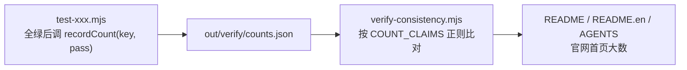

# 测试贡献规范

给贡献者与编码代理的操作指南（how-to）：在这个仓库里怎么加测试、加固件、登记计数、过门禁。命令清单见 [AGENTS.md](../AGENTS.md)；本文解释每条约定背后的机制，写新测试前先读完。

## 1. 四条门禁各自拦什么

| 门禁 | 命令 | 拦截目标 | 为什么排这个位置 |
|---|---|---|---|
| 类型检查 | `npm run check` | 走源码的 tsc 全仓类型错误 | 不需要构建，最快失败 |
| 测试 | `npm test` = `test:functional` + `test:editor:performance` | 行为回归、快照漂移、契约破坏 | 唯一入口清单，见 §2 |
| 构建 | `npm run build` | 八个包的产物编译 + 七个边界审计（§6） | verify 要读 dist |
| 跨产物一致性 | `npm run verify` | 文档数字照抄旧值、死链、发布包清单漂移、`--dist` 复验 | 必须最后跑：读 dist 体积与测试落盘的断言数 |

## 2. 新增测试套件

1. 测试写进 `tooling/test-<name>.mjs`（Node 直跑，jsdom 供 DOM，esbuild 打 `src/` 后跑真实解析与渲染，不 mock 解析逻辑）。
2. `package.json` 挂 script，并**加入 `test:functional`**——它是本地 `npm test`、PR CI 与发布流水线共用的唯一入口，单独挂 script 不进清单就会漏跑。
3. 发布产物也要覆盖的能力，script 里支持 `--dist`（改从 `packages/*/dist` 加载），并把它加进 `npm run verify` 的 `--dist` 序列；否则只验了源码没验交付物。

## 3. 登记断言计数

文档与官网的断言数字由实测产生，链路是：

- `recordCount` 只在测试全绿路径调用（`tooling/lib/measured.mjs` 的约定：失败运行不留半截数字）。
- 文档里新增一处数字声明，必须同时在 `verify-consistency.mjs` 的 `COUNT_CLAIMS` 登记对应正则——漏登记不会被抽查，改了文案却没同步正则会报「正则没匹配到，文案改了就来这里同步」。
- 本地没跑过测试时 `counts.json` 不存在，verify 跳过这组而不判错；所以「verify 绿」要以前一轮跑过 `npm test` 为准。

## 4. 新增固件（fixture）

| 约定 | 原因 |
|---|---|
| 固件只能由 `tooling/make-*-fixture.mjs` 生成，手写 OOXML、内置编码器、零外部样本 | 字节必须确定性：CI 用 `git diff --exit-code --stat fixtures/` 验证重跑一致，生成脚本里出现时间戳或随机数会让任何人跑一次都带进 diff |
| 生成脚本挂进 `npm run fixtures`（依赖序复杂时用 `prefixtures` / `postfixtures` 两段） | 测试样本与脚本永远同步 |
| **新能力必须同时加固件** | 历史教训：隐藏页曾零固件覆盖，`skipHidden` 的真 bug 在近千项断言下存活；快照挡得住「变了」，挡不住「一开始就没测过」 |

`.ppt` 样本特殊：LibreOffice 转换非确定性，`make-ppt-samples.mjs` 按**渲染结果**而非字节比对，内容没变就保留原文件。

## 5. 渲染快照基线

- 基线在 `test/snapshots/`（`fixture × 页 × 两条文本路径`），比对前归一化 blob URL、data URI（转摘要）与 defs id，跨机器稳定。
- 有意的渲染改动：`UPDATE_SNAPSHOTS=1 npm run test:core` 更新基线，然后 `git diff test/snapshots/` 逐行确认符合预期再提交——自动更新不是免审。
- 快照只证明「没变」。判断保真度用 LibreOffice ground truth：`npm run compare <file>` 产出 SSIM / MAE / 热力图，用途是横向比较改动前后与定位整片偏色，不是及格线。
- 渲染结果同进程不可重复（defs id 来自跨解析累加的全局计数器），比对渲染指纹必须独立进程，见 `tooling/lib/ppt-fingerprint.mjs`。

## 6. 边界审计与门禁契约

- `tooling/check-*-boundary.mjs` 系列守模块边界：模板配方必须只在 `edit-core/templates` 动态入口（默认入口不许碰运气靠 tree-shaking）、图表数据、媒体、chartex、字体字形、站点 i18n 等，多数在 `npm run build` 末尾对 dist 产物做 sentinel 检查；`check-architecture-boundary.mjs` 则审计源码的分层依赖方向（render 白名单、geometry 零依赖、DOM 边界、包依赖单向），规则见 [architecture-rules.md](architecture-rules.md)，build 与 verify 双挂。
- `test-test-gate-contract.mjs`（verify 第一步）守的是测试框架自身的契约——失败用例必须把 request 传给后续打开检查这类门禁有效性，属于「测试自己的测试」。
- 测试套件经过变异验证：把已修复的 bug 逐个改回去确认能被抓到，新增回归锚点时照此自检。

## 7. 性能门禁的现状

浏览器性能契约（如复制 16ms 预算）受宿主并行负载影响，历史上固定基线曾从 5ms 漂到 40ms。现状：CI 与发布流水线保留采样并落红灯证据，但 `continue-on-error` 不阻断发布；独立运行（隔离环境）则必须过预算。判定性能回归时先跑隔离复测，再下结论。
