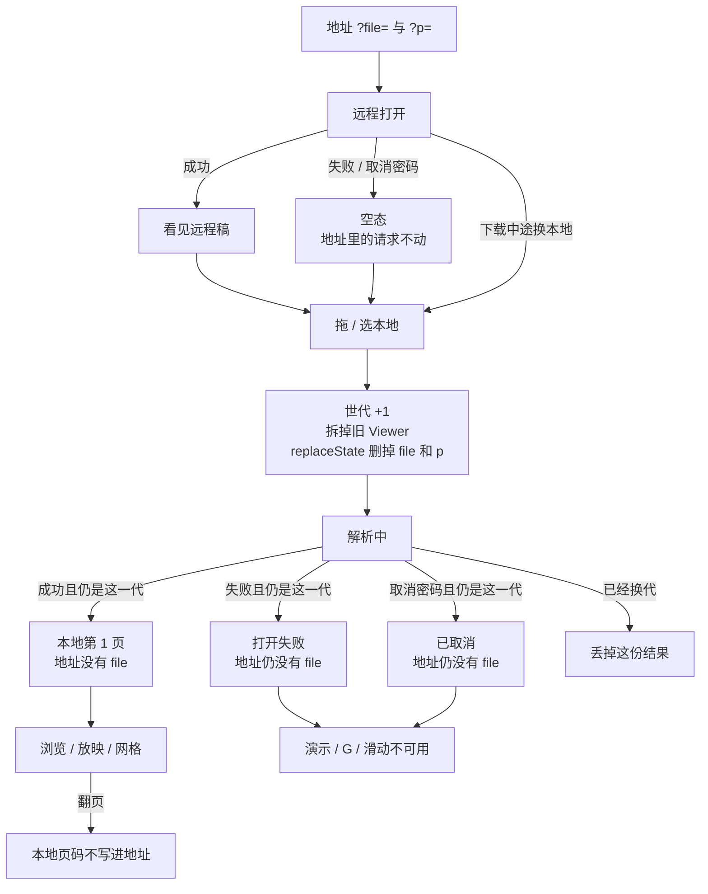
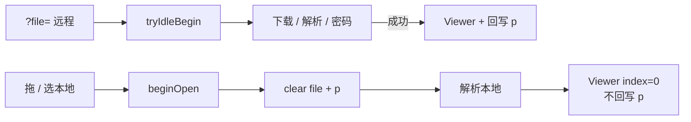

# 独立查看器换本地文件后清掉 `?file=`

> 第十三轮持续性迭代。只做这一件事：独立查看器拖 / 选本地文件后，地址不再指着上一份远程稿。复制或刷新不会打开另一份。官网首页回写、W 白屏、数字+Enter、用 File System Access 恢复本地稿本轮不做。

---

## 1. 目标与用户

| 项 | 内容 |
|---|---|
| 用户 | 先用 `?file=` 打开一份远程稿，再拖或选本地 `.pptx` / `.ppt` 的人。不装 Office，本地文件不出设备。 |
| 要解决的问题 | 第十一轮已经把页码写诚实：换本地会删 `p`。`?file=` 还指着远程那一份。屏幕是本地稿，地址却是别人甩过来的链接。复制出去对方看到另一份；刷新自己也回到另一份。 |
| 成功标准 | 一开始选本地就删掉 `file`（和 `p`）；成功、失败、取消密码都不再把远程文件写在地址里；远程失败 / 远程取消密码仍保留人家写进来的 `file`；刷新不再打开上一份远程稿；Esc、网格、黑屏、滑动、打开世代、下载进度、密码框、深链 `p` 仍按前十二轮。 |

不为谁做：不在这一轮把本地文件写进地址、不写 `blob:` / `file://`、不用 File System Access 在刷新后恢复眼前那份、不做 W 白屏、不做数字+Enter、不改官网首页、不改 `render/` 或 core、不推进发布包。

---

## 2. 用户场景与流程

主路径：打开 `?file=/deck.pptx&p=5` → 看见远程第 5 页 → 拖本地稿 → 旧页立刻消失、地址立刻没有 `file` 和 `p` → 解析中 → 看见本地第 1 页 → 复制地址不再指向 `/deck.pptx` → 刷新不再打开 `/deck.pptx` → 点「演示」仍按第一轮从当前页进放映。

| 分支 | 行为 |
|---|---|
| 空状态 | 未打开、解析失败、已取消：没有 Viewer。页码是 `- / -`。若人已经选过本地，地址没有 `file`——眼前没有可分享的远程稿。 |
| 远程失败 | 显式 `?file=` 下载 / 解析失败：不改 `file` 和 `p`。那是人家写进来的请求。 |
| 远程取消 | 远程加密稿取消密码 / Esc：不改 `file` 和 `p`。刷新应再问同一份。 |
| 本地失败 | 一开始就删掉 `file`。失败可见。刷新不再打开上一份远程。 |
| 本地取消 | 本地加密稿取消密码：`file` 已在选文件时删掉。刷新不是眼前那份，也不假装是远程那份。 |
| 换文件 | 拖 / 选本地的第一下就删。下载中途、密码框开着、放映中、网格开着都一样。 |
| 返回 | `replaceState`，不 `pushState`。后退回到**上一条完整导航**，不会出现「地址是远程、屏幕是本地」。 |
| 恢复 | 本地文件写不进地址。刷新按当前地址：没有 `file` 就拉默认 `/sample.pptx`（没有则空舞台）。这是止谎，不是把眼前那份变回来。 |
| 文件选择器取消 | 没选出文件：不 `begin`，地址不动。 |

---

## 3. 范围

| 必须做 | 不做 |
|---|---|
| 独立查看器拖 / 选本地时 `replaceState` 删掉 `file` | 把本地路径、`blob:`、`file://` 写进地址 |
| 一开始就删，不等成功 | 用 File System Access / IndexedDB 刷新后恢复本地稿 |
| 本地失败 / 取消后地址仍没有 `file` | 官网首页再写一套、样本页再写一套 |
| 远程失败 / 远程取消密码：不改 `file` | W 白屏、数字+Enter |
| 翻页仍只在远程地址打开时回写 `p` | hash `#slide=`、`?local=`、`?password=` |
| 放映 / 网格 / 黑屏 / 滑动 / 打开世代不被这次清参数破坏 | 改 `render/`、改 core、推进发布包 |

---

## 4. 调研与缺口

本轮打开并读完的原始页面（不是搜索摘要）：

| 来源 | 用户实际怎么用 | 对本仓库的含义 |
|---|---|---|
| [Share files from Google Drive](https://support.google.com/drive/answer/2494822?hl=en)（展开 permissions / 单文件 / Anyone with the link） | Viewer = 能打开。Anyone with the link → Copy link → **Paste the link in an email or any place you want to share it**。 | 分享物就是一条打开链接。链接必须指向眼前这份。换了本地稿还留着上一份 `?file=`，复制出去就是另一份。 |
| [View & open files](https://support.google.com/drive/answer/2423485?hl=en) | Drive 网页双击：Office 文件先在 Drive **打开/预览**；「Select Open with **from the file preview**」是从预览再进编辑器。 | Web 第一期待是「打开就能看见」。眼前看见的文件才是当前预览。 |
| [Make Google Docs, Sheets, Slides & Forms public](https://support.google.com/docs/answer/183965?hl=en) | Publish to web 之后「Copy the URL and send it」。演示文稿别人看到的是 **view-only 或全屏放映**。 | 发给别人的就是 URL。URL 必须是当前这份。 |
| [Create a URL to open a PDF file at a specific page](https://helpx.adobe.com/acrobat/kb/link-html-pdf-page-acrobat.html)（2025-04-16） | 正文：**「When you open a PDF file in a web browser, the first page of the PDF file will be shown by default. You can add a string to the HTML link so a PDF file opens and jumps to a specified page」**。语法 `#page=4`。**「If you use URLs containing local hard drive addresses (c:\folder\), you cannot link to page numbers or set destinations. A link to a page number works only if you use HTTP or HTTPS locations.」** | 浏览器预览用 URL 命名**那一份文件**。本地盘路径连页码都带不上。本仓库不能把本地稿假装写成远程 `?file=`。 |
| [History.replaceState()](https://developer.mozilla.org/en-US/docs/Web/API/History/replaceState) | 改当前这一条历史的 URL，不新增条目。示例：地址栏变成 `bar2.html`，**不会加载**那个地址。后退看到的是被替换后的 URL。 | 清 `file` 必须 `replaceState`。`pushState` 会让后退把远程 `?file=` 变回来，屏幕却仍是本地稿。 |
| [File API](https://developer.mozilla.org/en-US/docs/Web/API/File_API) | Web 应用只有在用户用 `<input>` 或拖放交出文件后才能读。`File` 是内存里的对象，不是一条 HTTP 地址。 | 本地稿没有可写进查询串的分享身份。能做的是删掉已经失效的远程身份。 |
| [URL.createObjectURL()](https://developer.mozilla.org/en-US/docs/Web/API/URL/createObjectURL_static) | 给 `File` 造 `blob:` URL，用完要 `revokeObjectURL`。Service Worker 里不可用，理由是可能泄漏。 | `blob:` 不能当分享链接，刷新也回不来。不要写进地址。 |
| [File System API](https://developer.mozilla.org/en-US/docs/Web/API/File_System_API) | 经用户许可拿到 handle；handle 可放进 IndexedDB。OPFS 对外不可见。 | 刷新后恢复本地稿有可行路径，但恢复的不是分享 URL。本轮只止谎，不恢复。 |
| [Present slides · Computer](https://support.google.com/docs/answer/1696787?hl=en&co=GENIE.Platform%3DDesktop)（展开 `Present mode keyboard shortcuts`） | Esc 结束；**7 再 Enter**；**B 黑屏、W 白屏**。 | W 仍在桌面放映表。不解决「地址指着另一份」。 |
| [Present slides · Android](https://support.google.com/docs/answer/1696787?hl=en&co=GENIE.Platform%3DAndroid) | Present on this device → **左右滑** → 返回键退出。没有 W，没有数字跳页。 | 手机官方没有 W。 |
| [Present your slide show](https://support.microsoft.com/en-us/powerpoint/present-your-slide-show) · Web 栏 | 控制条：上一页 / 下一页 / **See all slides** / 结束。没有 URL 页码，没有 W。 | 放映表假定文件已经打开。网格第七轮已做。 |
| 同上 · Windows Mobile 栏 | 空格或点屏幕前进；P 上一页；Esc 结束；**B 黑屏，再按 B 恢复当前页**。没有 W。 | B 第五轮已做。W 仍不是手机官方快捷键。 |
| Google `docs/answer/1696872` | 本轮 HTTP **404**。 | 不能把 404 页当成深链说明。 |
| Microsoft `/office/open-files-in-office-for-the-web`、`/office/add-a-hyperlink-to-a-slide` | 本轮均为 **Sorry, page not found**。 | 不能把 404 页当打开说明。 |

对照本仓库：

| 表面 | 已有 | 缺口 |
|---|---|---|
| 官网首页 | 读 `?sample=` + `?p=`，立刻清掉 | 不是本轮缺口。首页故意保持干净主页。 |
| 样本预览 | 第十二轮回写 `sample` + `p` | 换样本会改 `sample`，不存在「本地文件却留着远程参数」。 |
| 独立查看器 `?file=` | 下载进度、密码、`?p=`；换本地清 `p`，`file` 仍在 | **页码不撒谎，文件参数还在撒谎** |
| 放映快捷键 | B / G / 滑动 / Esc 分层已齐 | 没有新的强证据要做 W 或数字+Enter |

更高价值检查：每个先打开分享链接再看自己稿的人，都会把错误的远程地址复制出去或刷新回去。W 仍只有 Google 桌面表。网格已经能跳页。File System Access 能恢复眼前那份，但解决不了「地址必须和眼前内容一致」——本地稿仍然没有可分享身份。本轮先把谎止住。

---

## 5. 是否值得做

| 判定 | 结论 |
|---|---|
| 使用者成本 | 只动私有查看器 + 已有 `open-page.ts`。不进八个发布包，不增运行时依赖。打开完零持续开销。 |
| 可行路径 | `beginOpen` 已经清 `p` 并 `replaceState`。再删一个查询键。 |
| 换候选？ | W / 数字+Enter：本轮原文没有新证据。File System Access 恢复本地稿：刷新能看见眼前那份，但地址仍不能命名它，且要新的权限与存储；下一轮再评。 |
| 判定 | **做查看器换本地后清 `?file=`。** |

---

## 6. 产品方案

| 元素 | 规则 |
|---|---|
| 何时清 `file` | 拖文件 / 选本地的**第一下**，与清 `p`、拆旧稿同一时刻。 |
| 怎么清 | `replaceState` 删掉查询键 `file`。保留 hash 和其它键。不 `pushState`。 |
| 成功 | 本地第 1 页。地址没有 `file`，也不回写 `p`。 |
| 本地失败 | 地址没有 `file`。错误可见。 |
| 本地取消密码 | 地址没有 `file`。写「已取消」。 |
| 远程失败 | 不改 `file` / `p`。 |
| 远程取消密码 | 不改 `file` / `p`。 |
| 文件选择器取消 | 不改地址。 |
| 默认示例 | 地址本来没有 `file`：清 `file` 是空操作。 |
| 刷新 | 按当前地址。没有 `file` → 默认 `/sample.pptx`（没有则空舞台）。不是上一份远程，也不是刚看的本地。 |
| 浏览器后退 | 回到上一条完整导航。 |
| 打开期间 | `viewer === null`。G / B / 滑动不作用到旧稿。 |
| 放映 / 网格 | 换本地先退出放映、关掉网格，再解析新稿。 |
| 地址 | 不写密码，不写本地名，不写 `blob:`。 |

---

## 7. 技术方案

| 决策 | 选择 | 原因 |
|---|---|---|
| 模块放哪 | 官网 `open-page.ts` 增加 `clearOpenFileParam` | 页码回写已经在这里走 `replaceState`。禁止再抄一套地址改写。不进发布包 |
| 为什么一开始就删 | 人选的是下一份；解析中复制地址也会把远程稿发出去 | 和第八轮「一开始就拆旧稿」同一时刻 |
| 为什么不写本地名 / `blob:` | File API 的 `File` 不是 HTTP 地址；`blob:` 刷新即废，也不能分享 | 止谎不是伪造新身份 |
| 为什么不用 File System Access | 能恢复眼前那份，但不能让地址命名它；还要用户授权和持久化 | 一件事；恢复是下一轮候选 |
| 为什么 `replaceState` | `pushState` 让后退把远程 `?file=` 变回来，屏幕仍是本地 | MDN：替换的是当前这一条历史 |
| 为什么远程失败不删 | 人写的是请求；失败时没有「当前打开的文件」，但请求还在 | 空态页码是 `- / -`，地址仍是那份远程 |
| 为什么本地失败要删 | 人已经放弃远程，改选了本地 | 刷新再打开远程才是撒谎 |
| 为什么本地不回写 `p` | 本地页码写进没有 `file` 的地址，刷新会拿这个页去套默认示例 | 第十一轮已经定了：只有地址驱动的远程打开才绑页码 |
| 为什么放映中换本地要先退出 | `detachOpen` 必须拆掉旧 Viewer；舞台还在放映层里会画错地方 | 前几轮已有 |
| 文案 | 无新词 | 地址栏自己变化 |

落点：

| 文件 | 职责 |
|---|---|
| `packages/site/src/open-page.ts` | 删掉 `file`，与回写 `p` 共用 `replaceState` |
| `packages/viewer/src/main.ts` | `beginOpen` 时清 `file` |
| 单测 | 删 `file`、保留 hash、与 `p` 互不覆盖 |
| 契约 | 独立查看器一条；旧打开 / 密码 / 深链契约仍跑 |

不变量：`render/` 只认 `types.ts`；core 不碰 `document`；不进发布包。

---

## 8. 验收

| # | 标准 | 证据 |
|---|---|---|
| A1 | `?file=/demo/showcase.pptx&p=3` 拖本地：立刻没有 `file` / `p`，成功后是本地第 1 页 | 新增契约 |
| A2 | 本地还在解析：地址已经没有 `file` | 同上 |
| A3 | 成功后再刷新：不再打开 `showcase.pptx` | 同上 |
| A4 | `?file=/missing.pptx&p=3`：失败可见，地址仍有 `file` 和 `p=3` | 旧深链 + 本轮对照 |
| A5 | 远程加密稿取消密码：地址仍有 `file` | 新增契约 |
| A6 | 本地加密稿取消密码：失败可见，地址没有 `file`，G 不可用 | 同上 |
| A7 | 本地打开失败后地址不再指着远程 `file` | 与 A6 同一条路径：取消即失败，不造会打 console 的坏字节 |
| A8 | 放映中 / 网格开着换本地：先退出，再打开本地，地址没有 `file` | 同上 |
| A9 | 清 `file` 后 `history.back` 回到上一份完整导航，不会「地址远程、屏幕本地」 | 同上 |
| A10 | 远程打开后翻页仍回写 `p`；本地打开后翻页不写 `p` | 旧深链 + 本轮 |
| A11 | 放映 / 网格 / 黑屏 / 滑动 / 打开世代 / 下载进度 / 密码框 / 样本深链仍按前十二轮 | 旧契约仍跑 |
| A12 | 四项门禁绿；browser-use 走 5173，官网 5174 不回退 | 本轮验证 |

---

## 9. 方案自评

| 对照 | 结论 |
|---|---|
| 目标 | 解决「屏幕是本地、地址是远程」，没有偷换成做 W 或恢复本地稿 |
| 流程 | 主路径、空、远程失败、远程取消、本地失败、本地取消、选择器取消、返回、恢复都有出口 |
| 范围 | 只删查看器的 `file`；不伪造本地身份 |
| 与前十二轮 | 不回退放映、备注、滑动、黑屏、小视口、网格、打开世代、下载进度、密码框、查看器深链、样本深链；Esc 仍分层 |
| AGENTS.md | 不改 `render/` 与 core；不进发布包 |
| 风险 | `pushState` 会造成「后退恢复远程地址、屏幕仍是本地」——所以只 `replaceState`。成功后再删会让解析中的复制继续撒谎——所以在 `beginOpen` 删。本地成功后若回写 `p`，刷新会拿这个页去套默认示例——所以本地不绑页码 |

确认后再开发：用户是「换本地文件后还可能复制或刷新地址的人」；范围只有查看器清 `file`；验收即上表。
