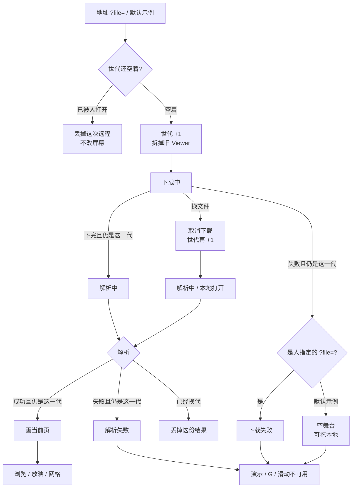
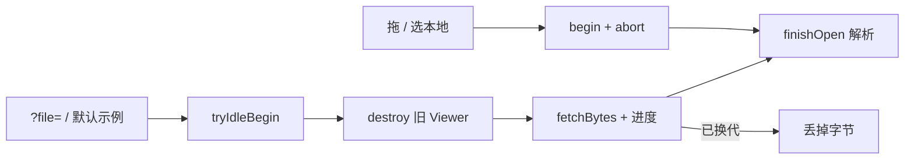

# 独立查看器远程 `?file=`：下载进度可见

> 第九轮持续性迭代。只做这一件事：独立查看器打开远程文件时，先看见下载，再看见解析；换文件立刻拆掉并取消上一趟下载。官网首页/样本进度、网格按需渲染、W 白屏、数字+Enter 本轮不做。

---

## 1. 目标与用户

| 项 | 内容 |
|---|---|
| 用户 | 用地址打开一份 `.pptx` / `.ppt` 的人：同事甩 `?file=/deck.pptx`、自己本机 `npm run dev` 指定文件、大文件还在路上。不装 Office，文件不出设备。 |
| 要解决的问题 | 第八轮打开会话只管字节到手之后。独立查看器远程打开仍是一次 `fetch` + `arrayBuffer()`：大文件像卡死；失败把「正在加载内置示例…」清掉就走，人以为查看器坏了。 |
| 成功标准 | 远程一开始就拆旧稿并进入下载；有体积画体积，没有就报已下载量；字节到手再「解析中」；后一次打开赢，上一趟下载取消；显式 `?file=` 失败写在当前这一代。Esc、网格、黑屏、滑动仍按前八轮。 |

不为谁做：不在这一轮做 W 白屏、数字+Enter、网格再渲一遍、官网再做一套进度、改 `render/` 或 core、把能力推进发布包。

---

## 2. 用户场景与流程

主路径：打开 `?file=/deck.pptx` → 旧页立刻消失 → 「下载中 · 已下 / 总量」→ 「解析中」→ 看见当前页 → 点「演示」仍按第一轮。

| 分支 | 行为 |
|---|---|
| 空状态 | 未指定 `?file=` 且默认示例没有：空舞台，页码 `- / -`，G / B / 滑动不做事。 |
| 失败 | 显式 `?file=` 下载失败：当前这一代写「下载失败」和原因。默认示例 404：不装成用户指定失败。解析失败仍按第八轮。 |
| 取消 | 下载中途拖文件 / 选本地：取消上一趟 fetch，立刻进入新一代。没有单独的「取消下载」按钮。 |
| 返回 | Esc 仍是网格 → 放映。下载态不是一层 Esc。 |
| 恢复 | 打开成功后停在第一页（查看器没有 `?p=`，本轮不补）。再点「演示」从当前页进放映。 |

---

## 3. 范围

| 必须做 | 不做 |
|---|---|
| 独立查看器 `?file=` 与默认 `/sample.pptx` 走带进度的下载 | 官网首页 / 样本再做一套（已经有） |
| 一开始打开就拆旧稿；下载、解析两段文案 | 网格再做按需渲染（第七轮 IntersectionObserver 已做） |
| 后一次打开覆盖前一次；换文件 `abort` 上一趟 fetch | W 白屏、数字+Enter |
| 显式 `?file=` 失败可见；默认示例缺失回到空舞台 | 查看器密码框、`?p=` 深链 |
| 打开期间 G / B / 滑动 / 方向键不作用到旧稿 | 改 `render/`、改 core、推进发布包 |

---

## 4. 调研与缺口

本轮打开并读完的原始页面（不是搜索摘要）：

| 来源 | 用户实际怎么用 | 对本仓库的含义 |
|---|---|---|
| [View & open files](https://support.google.com/drive/answer/2423485?hl=en) | Drive 网页双击：Office 文件先在 Drive **打开/预览**；「Select Open with **from the file preview**」是从预览再进编辑器。PDF 可选同页 preview。 | Web 第一期待是「打开就能看见」，预览是独立表面。`?file=` 就是这条打开入口。 |
| [Files you can store](https://support.google.com/drive/answer/37603?hl=en) | PPT / PPTX 在可预览类型表里。原文：**「The Google Drive preview is a scaled-down version of the complete file」**。转成 Slides 的演示上限 100 MB。 | 浏览器预览默认按「文件可能很大」设计。大文件远程打开必须把下载和解析分开。 |
| [Download a file](https://support.google.com/drive/answer/2423534?hl=en) | 下载失败要写清原因：所有者关了下载、第三方 Cookie、限流。大文件不要靠公开 Drive 链接硬扛。 | 失败必须停在当前这一次，不能让人以为查看器坏了或文件坏了。 |
| [Share files from Google Drive](https://support.google.com/drive/answer/2494822?hl=en) | 分享可只给 **open**。对方拿到的是一条打开链接。 | `?file=` 就是本仓库的打开链接。链接打开时不能先沉默。 |
| [Present your slide show](https://support.microsoft.com/en-us/powerpoint/present-your-slide-show) · Web 栏 | 控制条：上一页 / 下一页 / **See all slides** / 结束。没有下载进度，也没有 W / B。`/office/present-your-slide-show` 与 `/office/open-files-in-office-for-the-web` 均为 **Sorry, page not found**。 | 放映表假定文件已经打开。不能把 404 页当打开说明。网格第七轮已做。 |
| 同上 · Windows Mobile 栏 | 空格或点屏幕前进；P 上一页；Esc 结束；**B 黑屏，再按 B 恢复当前页**。没有 W。 | B 第五轮已做。W 仍不是手机官方快捷键。 |
| [Present slides · Computer](https://support.google.com/docs/answer/1696787?hl=en&co=GENIE.Platform%3DDesktop)（展开 `Present mode keyboard shortcuts`） | Esc 结束；**7 再 Enter 跳到第 7 页**；**B 黑屏、W 白屏**，任意键从空白回来。 | W 和数字跳页仍只在桌面放映表。打开文件本身不在这张表。 |
| [Present slides · Android](https://support.google.com/docs/answer/1696787?hl=en&co=GENIE.Platform%3DAndroid) | Present on this device → **左右滑** → 返回键退出。没有 W，没有数字跳页，没有打开进度。 | 手机官方主手势仍是滑。打开体验不靠桌面快捷键。 |

对照本仓库：

| 表面 | 已有 | 缺口 |
|---|---|---|
| 官网首页 / 样本 | `fetchBytes` + 下载/解析两段 + 世代 | 不是本轮缺口 |
| 独立查看器 `?file=` | 第八轮：字节到手才 `tryIdleBegin`；一次 `arrayBuffer()` | 下载不可见；失败近乎静默；换文件取消不了 fetch |
| 网格缩略图 | 第七轮 IntersectionObserver，可见格才 `renderSlide` | 候选 2 已经做完，不再做 |
| 放映快捷键 | B / G / 滑动 / Esc 分层已齐 | 没有新的强证据要做 W 或数字+Enter |

更高价值检查：每个被分享 `?file=` 的人都会先碰到字节到达。网格按需渲染已经在 `slide-grid.ts`。W 仍只有 Google 桌面表。

---

## 5. 是否值得做

| 判定 | 结论 |
|---|---|
| 使用者成本 | 只动私有查看器 + 共用的 `fetchBytes` 可选 `AbortSignal`。不进八个发布包，不增运行时依赖。打开完零持续开销。 |
| 可行路径 | 官网已有 `fetchBytes`、世代、下载/解析文案。查看器已相对导入 `open-session`。 |
| 换候选？ | 网格按需：第七轮已做。W / 数字+Enter：本轮原文没有新证据。 |
| 判定 | **做独立查看器远程下载进度。** |

---

## 6. 产品方案

| 元素 | 规则 |
|---|---|
| 何时开始下载态 | 地址里有 `?file=`，或默认去拉 `/sample.pptx`，且还没人打开过。第一下就拆旧稿。 |
| 下载 | 「下载中 · 已下 / 总量」。没有 `Content-Length` 只报已下。`data-open-phase=download`。 |
| 解析 | 字节到手：沿用第八轮「解析中」。 |
| 成功 | 当前页 SVG。`data-open-phase=ready`。 |
| 显式失败 | 人写了 `?file=`：当前世代写失败原因。`fileInfo` 回到「未打开文件」。页码 `- / -`。HTTP 失败、跨域、以及 200 但内容是网页（Vite 把未知路径回成首页）都停在下载失败。 |
| 默认示例缺失 | 不是人指定的文件：空舞台，可拖本地。不把 HTTP 404 写成用户事故。 |
| 换文件 | 取消上一趟 fetch。本地打开直接解析中。后一次赢。 |
| 打开期间 | `viewer === null`。G / B / 滑动 / 方向键不翻旧页。 |
| Esc | 网格 → 放映，与前八轮相同。下载不是一层 Esc。 |

---

## 7. 技术方案

| 决策 | 选择 | 原因 |
|---|---|---|
| 模块放哪 | 查看器画打开态；`fetchBytes` 加可选 `AbortSignal` | 官网已经会下；禁止再抄一套流式读取。不进发布包 |
| 为什么一开头就占世代 | 不占的话，下载画在「还没打开」上，人拖进来的文件和默认示例会抢 | 第八轮 `tryIdleBegin` 放在 `arrayBuffer()` 之后，大文件窗口正是竞态窗口 |
| 为什么要 abort | 只认世代会丢掉结果，但大文件仍占带宽；换文件的人已经不要这份 | 取消是恢复动作，不是吞异常 |
| HTML 200 为什么当下载失败 | Vite / 部分静态站把未知 `.pptx` 回成首页，解析器只会说「不是 pptx」 | 人指定的是文件地址，先承认没下到稿 |
| 默认示例失败为什么不当错误页 | 仓库默认 `/sample.pptx` 经常不在；那是「没有内置示例」，不是用户指定失败 | 现有契约也按「未打开文件」验收 `/missing.pptx` 的空态；显式 `?file=` 才升级成错误 |
| 文案为什么硬编码中文 | 独立查看器没有词库 | 与现有中文界面一致 |
| 为何不做网格再渲 | `slide-grid.ts` 已按可见格 `renderSlide` | 候选 2 已交付 |
| 为何不做 W | Google 桌面表完整，Android / Microsoft 手机栏没有 | 一件事；打开链接先于放映空白 |

落点：

| 文件 | 职责 |
|---|---|
| `packages/site/src/fetch-bytes.ts` | 可选 `AbortSignal`；有总长先报 0 / 总量 |
| `packages/viewer/src/open-status.ts` | 下载 / 解析 / 失败 / 空舞台 |
| `packages/viewer/src/main.ts` | 远程打开占世代、abort、认世代 |
| `packages/viewer/src/style.css` | 下载条 |
| 契约 | 独立查看器一条；`/missing.pptx` 空态仍要能用 |

不变量：`render/` 只认 `types.ts`；core 不碰 `document`；不进发布包。

---

## 8. 验收

| # | 标准 | 证据 |
|---|---|---|
| A1 | 远程还在下：`data-open-phase=download`，没有旧 SVG，G 不造网格 | 新增契约 |
| A2 | 字节到手后能观察到 `parsing`，成功后 `ready` | 同上 |
| A3 | 下载中途打开本地：后一次赢；被取消的远程回来不能画画布 | 同上 |
| A4 | 显式 `?file=` 404：错误可见，`fileInfo` 为未打开，G / 演示不可用 | 新增 + 旧空态契约 |
| A5 | 未指定 `?file=` 且默认示例没有：空舞台，不是错误页 | 本轮验证 |
| A6 | 放映 / 网格 / 黑屏 / 滑动 / Esc 仍按前八轮 | 旧契约仍跑 |
| A7 | 四项门禁绿；browser-use 走 5173 | 本轮验证 |

---

## 9. 方案自评

| 对照 | 结论 |
|---|---|
| 目标 | 解决「远程打开只剩干等」，没有偷换成做 W 或重做网格 |
| 流程 | 主路径、空、失败、取消、返回、恢复都有出口 |
| 范围 | 只补查看器远程打开这一段；官网进度不重做 |
| 与前八轮 | 不回退放映、备注、滑动、黑屏、小视口、网格、打开世代；Esc 仍分层 |
| AGENTS.md | 不改 `render/` 与 core；不进发布包 |
| 风险 | `/missing.pptx` 若改成错误页，旧契约认的是「未打开文件」——失败必须仍把 `fileInfo` 写回未打开，页码保持 `- / -` |

确认后再开发：用户是「用地址打开文件的人」；范围只有查看器远程下载进度；验收即上表。
