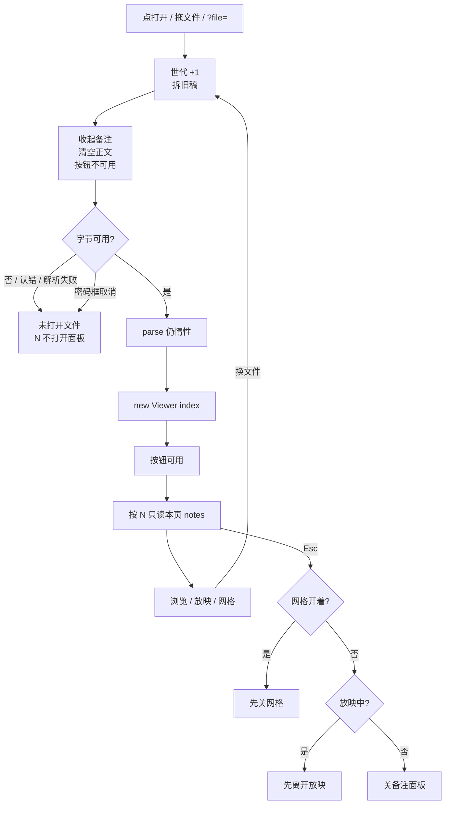

# 独立查看器失败后不再留着上一份备注

> 第二十二轮持续性迭代。只做这一件事：独立查看器**文稿没了**时，N 备注面板不能再展示上一份正文。打开失败、取消、换文件、未打开都收起并清空。用户打字查找仍会扫后页，留给下一轮。编辑器放映、首页回写 `?p=`、Worker / 三维钩子 / W / FSA 本轮不做。

---

## 1. 目标与用户

| 项 | 内容 |
|---|---|
| 用户 | 在浏览器里打开 `.pptx` / `.ppt` **先看一眼再演示**的人：对着备注过两页，再拖一份打不开的文件，或密码框点取消。不装 Office，文件不出设备。 |
| 要解决的问题 | 第十五轮已经让官网辅助层换文件 / 失败时 `reset()`。第二十一轮让独立查看器换文件 / 失败清空搜索。备注面板仍只在 `updateChrome` 里写正文：失败和空状态没有 Viewer，面板和 `notesBody` 不动。人看见「未打开文件」，N 面板却还是上一份讲稿。 |
| 成功标准 | 未打开、认错、解析失败、密码取消、换文件：备注面板收起，正文空，按钮不可用。打开成功后 N 仍只读本页。Esc 先网格、再放映、再关备注。放映侧栏、滑动、查找算法不改。 |

不为谁做：不改全文查找、不加增量索引、不改 `viewer-core.search()`、不改官网辅助层（已经 reset）、不做编辑器放映、不回写首页 `?p=`、不加 Worker。

---

## 2. 用户场景与流程

主路径：打开文稿 → 按 N 看本页备注 → 再打开失败或取消 → 舞台是未打开 / 已取消 → 备注面板已经收起，上一份正文不在。

| 分支 | 行为 |
|---|---|
| 空状态 | 未打开、认错、解析失败、已取消：`未打开文件`，备注面板 `hidden`，`notesBody` 空，按钮 `disabled`。N 不打开。G / 演示仍按前二十轮不可用。 |
| 失败 | 下载失败、认错、解析失败：不造 Viewer。备注已在换代时收起。 |
| 取消 | 文件选择器没选出文件：不 `begin`，备注保持当时状态。密码框取消：只属于那一代；备注已收起。 |
| 换文件 | 第一下拆旧稿并收起备注。成功后再按 N 才看新稿本页。上一份正文不能闪一帧。 |
| 本页备注 | 打开成功后按钮可用。N / 点击切换。正文只走 `textContent`。本页无备注仍是「（本页无备注）」。 |
| 查找 | 不改。用户打字仍走现有 `runSearch()`（会扫后页）。 |
| 返回 | Esc：网格 → 放映 → 备注面板。搜索框聚焦时键仍不接管。 |
| 恢复 | 再打开从第 1 页或地址页起；不继承上一份备注开关。 |

---

## 3. 范围

| 必须做 | 不做 |
|---|---|
| 独立查看器空 / 失败 / 取消 / 换文件收起备注并清空正文 | 改查找算法、增量索引、`viewer-core.search()` |
| 未打开时禁用备注按钮，N 不打开 | 官网首页 / 样本辅助层（已 reset） |
| Esc 在网格、放映之后关备注 | 编辑器放映 chrome |
| 打开成功后 N 仍只读本页 | 首页回写 `?p=` |
|  | Worker、三维推迟、FSA、W、数字+Enter |
|  | 改 `render/`、改 core、推进发布包 |
|  | 把浏览备注画进默认放映 |

---

## 4. 调研与缺口

本轮打开并读完的原始页面（不是搜索摘要）：

| 来源 | 用户实际怎么用 | 对本仓库的含义 |
|---|---|---|
| [View & open files](https://support.google.com/drive/answer/2423485?hl=en)（本轮用浏览器读完 `document.body.innerText`） | 双击后 **「If you open a video, Microsoft Office file, audio file, or photo, it will open in Google Drive。」** 第一期待是打开就能看见当前文件。 | 预览表面展示的是**这一次**打开的文件。打开失败后不应再展示上一份演讲者备注。 |
| [Optimize long tasks](https://web.dev/articles/optimize-long-tasks?hl=zh-cn)（页面 2024-12-19 更新，本轮浏览器读完全文） | **「任何运行时间超过 50 毫秒的任务都是长任务。」** 结论：**「最后，尽量减少函数中的工作量。」** 拆任务是例外；短作业不要每项 `yield`。并写明 `Array.prototype.forEach` 不会等待。 | 200 页纯文本固件上，用户打字查找中位约 **42ms**，低于 50ms。查找是用户主动要的全文扫描。失败后备注面板留下上一份正文，是可以删掉的多余工作。 |
| [Present your slide show](https://support.microsoft.com/en-us/powerpoint/present-your-slide-show) · Web 栏（本轮浏览器打开，`aria-selected=true` 已在 Web） | 放映控制条只给演讲者。按钮表是上一页 / 下一页 / See all slides / End Show。**没有「打开失败后仍显示上一份备注」。** | 备注属于当前这次演示。文件不在了，就不该还挂着上一份。 |
| [Present slides · Computer](https://support.google.com/docs/answer/1696787?hl=en&co=GENIE.Platform%3DDesktop)（本轮读完全文） | 备注走 **Presenter view → Speaker notes**。Esc 结束放映。不能在同一块屏幕上同时用 Presenter view 和 Full screen。 | 备注是当前文稿的演讲者辅助。文稿没了，辅助层必须收。Esc 是返回链，不是让过期备注留着。 |
| [Work with Office files](https://support.google.com/docs/answer/6055139?hl=en)（本轮读完全文） | 密码稿先到密码框，再选 **Preview** 或 **Edit**。取消就停在输入屏，不会带着另一份文件的备注进预览。 | 密码取消属于这一代打开失败。备注必须已经空。 |

对照本仓库：

| 表面 | 已有 | 缺口 |
|---|---|---|
| 官网辅助层 | `speaker.reset()`：换文件 / 失败关面板、清下一页、按钮禁用 | 不缺 |
| 独立查看器打开 | 第二十一轮：状态栏不扫后页；换文件 / 失败清空搜索 | **`detachOpen` 不收备注面板，不清 `notesBody`** |
| 独立查看器备注 | N / 点击切换；`updateChrome` 写本页；无备注走 `:empty` | 没有 Viewer 时按钮仍可用，N 仍能打开上一份正文 |
| 独立查看器 Esc | 网格 → 放映 | 备注开着时 Esc 是空操作 |
| 查找 | 顶栏搜索框；`/` 聚焦；空查询早退 | 用户打字仍 `slides.forEach` + `slideText`。200 页纯文本 42ms，本轮不做算法 |
| 编辑器「放映」页 | 没有 `bindPresentMode` | 不是轻量预览主路径 |
| 首页 `?p=` | 第十九轮读一次就清掉 | 产品判断未变 |

上一轮候选用证据裁定：

| 候选 | 判定 |
|---|---|
| 查看器全文搜索扫全部 `slides[i]` | **本轮不做。** 同一类 200 页纯文本固件，首次 `forEach` + `slideText` 中位 **42ms**，低于 50ms。官方长任务文先要求少做不该做的事；查找是用户要的全文扫描。短作业按项 `yield` 会被原文写成开销大于工作。 |
| 失败 / 空状态备注面板留着上一份正文 | **做。** 打开路径已经不再为状态栏扫后页，搜索也会在换代时清空。剩下会在「未打开文件」时骗人的，是 N 面板里的上一份讲稿。官网已经 reset。 |
| 编辑器放映 chrome | **不做。** 编辑器没有放映会话。 |
| 首页 `?p=` 仍被清 | **不做。** 分享面已经是查看器 / 样本。 |
| Worker / 三维 / W / FSA / 数字+Enter | **不做。** 没有新的主路径长任务证据。 |

实测（Node 24.3.0，`out/round22-research/measure-search.mjs`，200 页纯文本 `.pptx`，每次重新 `parse()`）：

| 对象 | 中位 |
|---|---|
| 默认 `parse()` | 约 1.8ms |
| 只读第 1 页 `slideText` | 约 0.7ms |
| 首次 `slides.forEach` + `slideText` | 约 **42ms** |
| 已 inflate 后再搜 | 约 0.16ms |

更高价值检查：来试「打开看一眼 / 演示」的人，打开当下已经不再无条件打穿后页。失败后舞台写「未打开文件」，备注却还是上一份，这是轻量预览空状态还没收口。

---

## 5. 是否值得做

| 判定 | 结论 |
|---|---|
| 查找算法 / 增量索引 | **不做。** 42ms 低于长任务线；交互完整的增量扫描留给有更长 inflate 证据的下一轮。 |
| 编辑器放映 | **不做。** 没有放映会话可跟官网条。 |
| 首页保留 `?p=` | **不做。** 分享面已经是查看器 / 样本。 |
| Worker / 三维推迟 | **不做。** 当前页 inflate 仍低于长任务线。 |
| 失败后收起备注 | **做。** 官方打开路径展示当前文件；备注是当前文稿的演讲者辅助。只动独立查看器私有包。 |
| 使用者成本 | 不进八个发布包。不增依赖。未打开时少一个能点开的过期面板。 |
| 可行路径 | `detachOpen` 已经拆旧稿、清搜索。官网 `speaker.reset()` 已有同一产品形态。 |

---

## 6. 产品方案

| 元素 | 规则 |
|---|---|
| 打开成功 | 备注按钮可用。按 N 或点按钮打开本页。无备注仍写「（本页无备注）」。 |
| 打开失败 / 密码取消 / 空 | 面板收起，正文空，按钮不可用。N 不打开。 |
| 换文件 | 第一下收起并清空。新稿成功后再按 N。 |
| 文件选择器没选出 | 不 `begin`，备注保持当时开关。 |
| Esc | 网格 → 放映 → 备注面板。搜索框里的 Esc 仍不接管。 |
| 放映 | 侧栏 `pvNotes` 仍读当前页。进入放映不改浏览面板开关；离开放映后若还开着，正文已是当前页。 |
| 网格 / 滑动 / 深链 / 查找 | 不改算法。网格开着时 Esc 仍先关网格。 |

---

## 7. 技术方案

| 决策 | 选择 | 原因 |
|---|---|---|
| 为什么失败要关面板而不是只清正文 | 只清正文会留下「（本页无备注）」空壳，人以为这是新稿 | 未打开就不应有演讲者辅助 |
| 为什么换文件也关，不保留开关 | 官网辅助层换文件已经 `reset`；上一份开关不属于新稿 | 避免新稿第一帧先闪旧备注 |
| 为什么 Esc 第三位才关备注 | 网格和放映已经占用 Esc；与官网「先离开演示再关辅助层」同一条返回链 | 放映中 Esc 不能误关背后的浏览面板就算完事 |
| 为什么不改查找 | 42ms 低于 50ms；本轮缺口是过期备注 | 每次只做一件 |
| 为什么只动独立查看器 | 官网已经 reset | 一件事；缺口在查看器 |
| 为什么不动 core | 备注正文已经在 `viewer.slide.notes` | `render/` 只认 `types.ts` |

落点：

| 文件 | 职责 |
|---|---|
| `packages/viewer/src/viewer-notes.ts` | `resetViewerNotes` / `setViewerNotesOpen`；失败必须 disable |
| `packages/viewer/src/main.ts` | `detachOpen` 收起；成功后才启用；Esc 第三位关面板 |
| `packages/viewer/index.html` | 备注按钮默认 `disabled` |
| `tooling/test-viewer-notes-clear.mjs` | reset 清空并禁用；源码换代必走 reset |
| `tooling/lib/standalone-notes-clear-browser-contract.mjs` | 打开 N、失败收起、N 无效、成功后再开、Esc 关 |
| 既有独立查看器契约 | 接上 |

不变量：`render/` 只认 `types.ts`；core 不碰 `document`；不进发布包。

---

## 8. 验收

| # | 标准 | 证据 |
|---|---|---|
| A1 | `resetViewerNotes` 收起面板、清空正文、去掉 active、禁用按钮 | 新增节点测试 |
| A2 | `detachOpen` 调用 `resetViewerNotes`；打开成功路径才启用按钮 | 源码契约 |
| A3 | 打开 showcase 后 N 仍能看到本页备注 | 新增浏览器契约 |
| A4 | 备注开着再打开失败：面板 hidden、正文空、按钮 disabled、`未打开文件` | 新增浏览器契约 |
| A5 | 失败后按 N 或点按钮，面板仍不打开 | 新增浏览器契约 |
| A6 | 再打开成功：按钮可用，面板默认关；N 打开的是新稿本页 | 新增浏览器契约 |
| A7 | 浏览态 Esc 关备注；网格开着时 Esc 先关网格；放映中 Esc 先离开放映 | 新增浏览器契约 |
| A8 | 本页备注、放映、网格、深链、认文件、打开不扫后页仍按前二十一轮 | 旧契约仍跑 |
| A9 | 四项门禁绿 | check / test / build / verify |
| A10 | browser-use：5173 打开 / N / 失败 / 再开 / Esc | `out/viewer-notes-clear-browser/` |

---

## 9. 方案自评

| 对照 | 结论 |
|---|---|
| 目标 | 解决「未打开时还留着上一份备注」，没有偷换成查找算法、编辑器放映或首页 `?p=` |
| 流程 | 主路径、空、失败、取消、换文件、Esc、与网格/放映冲突都有出口 |
| 范围 | 只动独立查看器备注 chrome；不进发布包 |
| 与前二十一轮 | 不回退放映、滑动、黑屏、网格、打开世代、密码、深链、认文件、parse 推迟、控制条 `T`、打开不扫后页 |
| AGENTS.md | 不改 `render/` 与 core |
| 风险 | 换文件会关掉备注——这是本轮要的，与官网一致。放映侧栏仍跟当前页，不走浏览面板。 |

确认后再开发：用户是「打开看一眼/演示的人」；范围只有失败/空状态备注收口；验收即上表。
