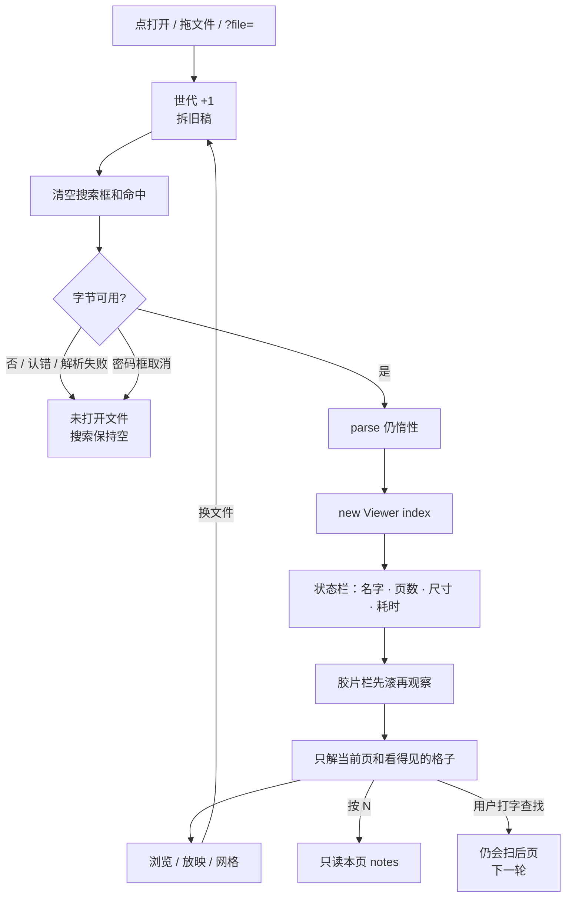

# 独立查看器打开不再扫完全部页

> 第二十一轮持续性迭代。只做这一件事：独立查看器**打开文稿时**不再为了状态栏「N 页有备注」、也不带着上一份的搜索，去读全部 `slides[i]`。用户自己打字查找仍会扫后页，留给下一轮。编辑器放映、首页回写 `?p=`、Worker / 三维钩子 / W / FSA 本轮不做。

---

## 1. 目标与用户

| 项 | 内容 |
|---|---|
| 用户 | 在浏览器里打开 `.pptx` / `.ppt` **先看一眼再演示**的人：拖一份 200 页文本稿或后页带图的真文件。不装 Office，文件不出设备。 |
| 要解决的问题 | 第十七、十八轮已经让默认 `parse()` 把后页 XML / 图推迟到第一次读到。第十九轮让深链第一帧就是目标页。独立查看器每次打开仍 `slides.filter((s) => s.notes)`，再 `runSearch()`。状态栏要一个「几页有备注」，就把后页重新变成当前页。 |
| 成功标准 | 打开后只付当前页（以及胶片栏看得见的格子）；状态栏仍有名字、页数、尺寸、耗时；本页备注仍按 N；换文件 / 失败 / 取消清空搜索，不拿上一份的查询去扫新稿。放映、网格、滑动、深链仍按前二十轮。 |

不为谁做：不改全文查找算法、不加增量索引、不改 `viewer-core.search()`、不改官网首页状态栏、不做编辑器放映、不回写首页 `?p=`、不加 Worker。

---

## 2. 用户场景与流程

主路径：打开文稿 → 立刻看见当前页 → 状态栏是名字和页数，不再等「数完全部备注页」 → 要看备注按 N → 点「演示」仍按前二十轮。

| 分支 | 行为 |
|---|---|
| 空状态 | 未打开、认错、解析失败、已取消：`未打开文件`，页码 `- / -`。搜索框空。G / 演示不可用。 |
| 失败 | 下载失败、认错、解析失败：不造 Viewer，不扫后页。搜索已在换代时清空。 |
| 取消 | 文件选择器没选出文件：不 `begin`。密码框取消：只属于那一代；搜索已空。 |
| 换文件 | 第一下拆旧稿并清空搜索。上一份的查询不能拿去扫新稿。 |
| 首帧 | 构造 Viewer 时带 `index`。状态栏只读 `slides.length` / 宽高 / `source`，禁止 `filter` / `forEach` / `slideText`。 |
| 本页备注 | N / 备注面板 / 放映侧栏只读 `viewer.slide.notes`。没有全稿「N 页有备注」。 |
| 查找 | 打开、失败、取消、换文件都清空。用户之后自己打字仍走现有 `runSearch()`（会扫后页，本轮不改算法）。 |
| 返回 | Esc 仍是网格 → 放映。搜索框是输入框，里面的键不接管翻页。 |
| 恢复 | 再打开从第 1 页或地址页起；不继承上一份的搜索。 |

---

## 3. 范围

| 必须做 | 不做 |
|---|---|
| 独立查看器打开态 chrome 不遍历 `slides[i]` | 改查找算法、增量索引、`viewer-core.search()` |
| 状态栏去掉「N 页有备注」 | 官网首页 / 样本预览改状态栏 |
| 换文件 / 失败 / 取消清空搜索，打开成功后不再 `runSearch()` | 编辑器放映 chrome |
| 本页备注、放映、网格、深链、认文件仍按前二十轮 | 首页回写 `?p=` |
|  | Worker、三维推迟、FSA、W、数字+Enter |
|  | 改 `render/`、改 core、推进发布包 |

---

## 4. 调研与缺口

本轮打开并读完的原始页面（不是搜索摘要）：

| 来源 | 用户实际怎么用 | 对本仓库的含义 |
|---|---|---|
| [Present your slide show](https://support.microsoft.com/en-us/powerpoint/present-your-slide-show) · Web 栏（本轮点开 Web 后读完全文） | 放映控制条只给演讲者。按钮表是上一页 / 下一页 / See all slides / End Show。备注走 **Presenter view**：「view your presentation with speaker notes on one computer … while only the slides themselves appear on the screen that your audience sees」。没有「打开时数一数几页有备注」。 | 备注是当前页、给演讲者看的。状态栏报全稿备注页数不是官方 Web 打开路径。 |
| [View & open files](https://support.google.com/drive/answer/2423485?hl=en)（本轮读完全文） | 双击后 **「If you open a video, Microsoft Office file, audio file, or photo, it will open in Google Drive。」** 第一期待是打开就能看见。 | Web 打开路径是「看见当前文件」，不是先为状态栏扫完全部页。 |
| [Optimize long tasks](https://web.dev/articles/optimize-long-tasks)（页面 2024-12-19 更新，本轮读完全文） | **「Any task that takes longer than 50 milliseconds is a long task。」** 结论：**「Finally, try to do as little work as possible in your functions。」** 拆任务是例外路径，先删掉不该做的工作。 | 200 页纯文本固件上，`slides.filter((s) => s.notes)` 中位约 **92ms**，超过 50ms。`slides.length` 约 0ms，读第 1 页 `notes` 约 1.6ms。打开当下数备注是可以删掉的长任务。 |

对照本仓库：

| 表面 | 已有 | 缺口 |
|---|---|---|
| 默认 `parse()` | 第十八轮：后页 XML / 图第一次读到再解 | 产品层打开仍遍历全部页 |
| 官网首页 / 样本 | 状态栏用 `slides.length`，字体只看当前页 | 没有全页备注计数 |
| 独立查看器打开 | `new Viewer({ index })`，胶片栏先滚再观察 | **`slides.filter((s) => s.notes)` 每次成功打开都跑** |
| 独立查看器查找 | 顶栏搜索框；`/` 聚焦；空查询早退 | 打开成功后无条件 `runSearch()`；换文件不清空，上一份的查询会扫新稿 |
| 本页备注 | N / 备注面板 / 放映侧栏读当前页 | 不缺。缺的是不要为了计数去读后页 |
| 编辑器「放映」页 | 只有预览 / 播动画 / 页面尺寸，没有 `bindPresentMode` | 那是另一条产品，不是轻量预览主路径 |
| 首页 `?p=` | 第十九轮读一次就清掉，不当分享面 | 产品判断未变 |

上一轮候选用证据裁定：

| 候选 | 判定 |
|---|---|
| 查看器全文搜索扫全部 `slides[i]` | **打开路径更先、更无条件。** 空查询的 `runSearch()` 早退；真正打穿首屏的是备注计数。查找仍留给下一轮。 |
| 编辑器放映 chrome | **不做。** 编辑器没有放映会话，不是「先看一眼再演示」。 |
| 首页 `?p=` 仍被清 | **不做。** 第十九轮已定：首页不是分享面。查看器 / 样本已经回写 `p`。 |
| Worker / 三维 / W / FSA / 数字+Enter | **不做。** 没有新的主路径长任务证据；打开当下 92ms 的备注计数才是能删的工作。 |

实测（Node 24.3.0，`out/round21-measure.mjs`，200 页纯文本 `.pptx`，每次重新 `parse()`）：

| 对象 | 中位 |
|---|---|
| 默认 `parse()` | 约 7ms |
| 只读 `slides.length` | <0.01ms |
| 只读 `slides[0].notes` | 约 1.6ms |
| `slides.filter((s) => s.notes)` | 约 **92ms** |

更高价值检查：来试「打开看一眼 / 演示」的人，主路径已经不是再少解后页。剩下会在打开当下把懒解析打穿的，是状态栏那一次全页遍历。

---

## 5. 是否值得做

| 判定 | 结论 |
|---|---|
| 查找算法 / 增量索引 | **不做。** 查找是用户打字后的第二条路。空查询不扫页。先修打开当下无条件的那一次。 |
| 编辑器放映 | **不做。** 没有放映会话可跟官网条。 |
| 首页保留 `?p=` | **不做。** 分享面已经是查看器 / 样本。 |
| Worker / 三维推迟 | **不做。** 当前页 inflate 仍低于长任务线；没有新证据。 |
| 打开不再扫全部页 | **做。** 官方打开路径是看见当前文件；备注是本页。92ms 的全页 `filter` 超过 50ms，而且发生在每一次成功打开。只动独立查看器私有包。 |
| 使用者成本 | 不进八个发布包。不增依赖。状态栏少一句「N 页有备注」；本页备注入口还在。 |
| 可行路径 | 状态栏已经有页数。`formatOpenFileInfo` 只收标量。`detachOpen` 已经拆旧稿。 |

---

## 6. 产品方案

| 元素 | 规则 |
|---|---|
| 打开成功 | 状态栏：`名字 · N 页 · 宽×高px · 耗时ms`；`.ppt` 仍加「· .ppt 二进制格式」。**不写「N 页有备注」。** |
| 打开失败 / 取消 / 空 | `未打开文件`。搜索框空，命中清空。 |
| 换文件 | 第一下清空搜索和命中。新稿从当前打开规则起，不继承查询。 |
| 打开成功后 | 不再自动 `runSearch()`。 |
| 本页备注 | N / 备注面板 / 放映侧栏不变。本页无备注仍写「（本页无备注）」。 |
| 查找 | 用户之后自己打字或按 Enter 才搜。窄屏仍藏搜索框。 |
| 放映 / 网格 / 滑动 / 深链 | 不改。 |

---

## 7. 技术方案

| 决策 | 选择 | 原因 |
|---|---|---|
| 为什么删掉备注页数而不是惰性计数 | 官方打开路径不报这个数；惰性计数会变成撒谎的「已看见的页里有几页备注」 | 本页备注已经有 N |
| 为什么打开成功后不再 `runSearch()` | 空查询本来就不做事；有残留查询会把新稿整份解完 | 换文件清空查询，残留不属于新稿 |
| 为什么只动独立查看器 | 官网首页已经只用 `slides.length` | 一件事；缺口在查看器 |
| 为什么不改 `viewer-core.search()` | 发布包契约 / 体积不动；本轮产品层自己扫页 | 没有证据必须进发布包 |
| 为什么不改查找算法 | 用户打字查找是下一轮；本轮先保住打开 | 每次只做一件 |
| 为什么不动 core | 第 1 页之后被读到是产品层问的 | `render/` 只认 `types.ts` |

落点：

| 文件 | 职责 |
|---|---|
| `packages/viewer/src/open-file-info.ts` | `formatOpenFileInfo` 只收标量；`resetViewerSearch` 清输入和命中文案 |
| `packages/viewer/src/main.ts` | 打开态用上面两个函数；`detachOpen` 清搜索；成功后不 `runSearch()` |
| `tooling/test-viewer-open-lazy.mjs` | 格式化不碰 `slides[i]`；`filter` 会读后页；源码不含打开态全页遍历 |
| `tooling/lib/standalone-open-lazy-browser-contract.mjs` | 打开后没有「页有备注」；换文件 / 失败清空搜索；本页备注仍在 |
| 既有独立查看器契约 | 接上 |

不变量：`render/` 只认 `types.ts`；core 不碰 `document`；不进发布包。

---

## 8. 验收

| # | 标准 | 证据 |
|---|---|---|
| A1 | `formatOpenFileInfo` 不接收 `slides`，输出不含「页有备注」 | 新增节点测试 |
| A2 | 对惰性稿做 `slides.filter((s) => s.notes)` 会读到后页；格式化函数不会 | 新增节点测试 |
| A3 | `packages/viewer/src/main.ts` 打开成功路径不再 `slides.filter` / `slides.forEach` / 成功后 `runSearch()` | 源码契约 |
| A4 | 打开 showcase 后状态栏有页数，没有「页有备注」 | 新增浏览器契约 |
| A5 | 搜索后再换文件：输入框和命中清空，新稿状态栏仍无数备注 | 新增浏览器契约 |
| A6 | 打开失败：`未打开文件`，搜索空 | 新增浏览器契约 |
| A7 | 本页备注、放映、网格、深链、认文件仍按前二十轮 | 旧契约仍跑 |
| A8 | 四项门禁绿 | check / test / build / verify |
| A9 | browser-use：5173 打开 / 换文件 / 失败 / 本页备注 | `out/viewer-open-lazy-browser/` |

---

## 9. 方案自评

| 对照 | 结论 |
|---|---|
| 目标 | 解决「打开当下把懒解析打穿」，没有偷换成查找算法、编辑器放映或首页 `?p=` |
| 流程 | 主路径、空、失败、取消、换文件、本页备注、残留搜索都有出口 |
| 范围 | 只动独立查看器打开态 chrome；不进发布包 |
| 与前二十轮 | 不回退放映、备注、滑动、黑屏、网格、打开世代、密码、深链、认文件、parse 推迟、控制条 `T` |
| AGENTS.md | 不改 `render/` 与 core |
| 风险 | showcase 每页都有备注，删掉计数后状态栏变短——这是本轮要的。胶片栏可见格仍会解附近页，那是预取，不是全页 `filter`。 |

确认后再开发：用户是「打开看一眼/演示的人」；范围只有打开态 chrome 不扫后页；验收即上表。
