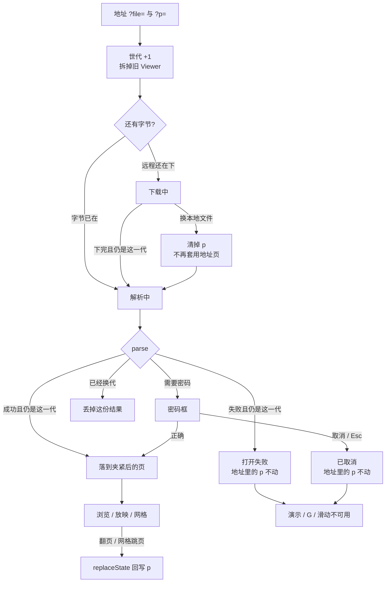
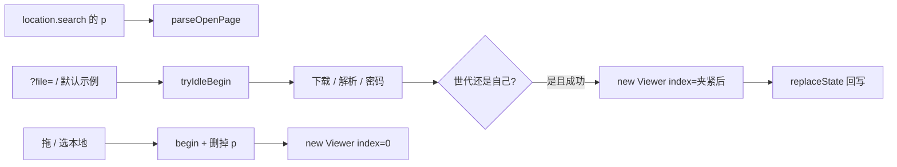

# 独立查看器 `?file=` + `?p=`：打开后停在指定页

> 第十一轮持续性迭代。只做这一件事：独立查看器打开远程文件时按地址里的页码落页，翻页后地址保持诚实，复制出去仍指向当前页。官网首页再写一套、样本预览密码框、W 白屏、数字+Enter 本轮不做。

---

## 1. 目标与用户

| 项 | 内容 |
|---|---|
| 用户 | 用一条地址打开 `.pptx` / `.ppt` 的人：同事甩 `?file=/deck.pptx&p=5`、自己翻到某一页后把地址栏复制出去。不装 Office，文件不出设备。 |
| 要解决的问题 | 第九轮把 `?file=` 变成能打开的分享链接。第十轮补上加密稿。链接仍一律停在第一页。官网首页已经能读 `?p=`，独立查看器这条真正会把文件写进地址的表面没有。 |
| 成功标准 | `?file=` 加上合法 `?p=` 打开后停在那一页；非法页码落到第一页；超出总页落到最后一页；隐藏页可以直接落到；翻页后地址里的 `p` 跟着变；换本地文件不再套用上一份的页码。Esc、网格、黑屏、滑动、打开世代、下载进度、密码框仍按前十轮。 |

不为谁做：不在这一轮改官网首页的「读一次就清掉」、不做样本预览密码框、不做 W 白屏、不做数字+Enter、不把密码写进地址、不改 `render/` 或 core、不推进发布包。

---

## 2. 用户场景与流程

主路径：打开 `?file=/deck.pptx&p=5` → 下载 / 解析 / 必要时密码框 → 看见第 5 页 → 地址仍是 `p=5` → 翻到第 6 页 → 地址变成 `p=6` → 复制地址给别人，对方也停在第 6 页 → 点「演示」仍按第一轮从当前页进放映。

| 分支 | 行为 |
|---|---|
| 空状态 | 未打开、解析失败、已取消：没有 Viewer。页码是 `- / -`。地址里的 `p` 不改——那是人家写进来的请求，不是当前页。 |
| 非法页码 | 缺省、空、`foo`、`0`、负数、小数：当成第 1 页。成功打开后删掉 `p`，避免地址继续撒谎。 |
| 超出总页 | 夹到最后一页。成功后把 `p` 写成实际页。 |
| 隐藏页 | 可以直接落到（和网格点隐藏页一样）。`skipHidden` 只约束 ‹ › / 滑动，不挡深链。 |
| 失败 | 下载失败、解析失败：不落页、不改 `p`。 |
| 取消 | 密码框取消：不落页、不改 `p`。 |
| 换文件 | 拖 / 选本地：一开始就删掉 `p`，从第 1 页打开新稿。上一份的页码不能跟着走。 |
| 返回 | 浏览器后退回到**上一条历史记录**（通常是进查看器之前的页面，或上一次完整导航）。翻页用 `replaceState`，不往历史栈里堆每一页。Esc 仍是网格 → 放映。 |
| 恢复 | 打开成功后停在夹紧后的页。再点「演示」从当前页进放映。刷新沿用地址里当时的 `p`。 |

---

## 3. 范围

| 必须做 | 不做 |
|---|---|
| 独立查看器读 `?p=`（1-based），只作用于地址驱动的那一次远程打开 | 官网首页再写一套（已经读 `?p=`，并立刻清掉，避免换样本后地址撒谎） |
| 非法 / 超范围夹紧；隐藏页可直达 | 样本预览密码框 |
| 地址打开成功后，翻页 / 网格 / 搜索跳页用 `replaceState` 回写 `p` | W 白屏、数字+Enter |
| 换本地文件清掉 `p`，不再套用 | hash `#slide=` / `#page=` / `?password=` |
| 打开失败或取消：不改地址里的 `p` | 改 `render/`、改 core、推进发布包 |

---

## 4. 调研与缺口

本轮打开并读完的原始页面（不是搜索摘要）：

| 来源 | 用户实际怎么用 | 对本仓库的含义 |
|---|---|---|
| [Share files from Google Drive](https://support.google.com/drive/answer/2494822?hl=en)（展开 permissions / 单文件 / Anyone with the link / 公开） | Viewer = 能打开。Anyone with the link → Copy link → 粘到邮件或任何地方。对方拿到的是一条打开链接。 | `?file=` 已经是这条打开链接。缺的是链接里的「打开到哪一页」。 |
| [View & open files](https://support.google.com/drive/answer/2423485?hl=en) | Drive 网页双击：Office 文件先在 Drive **打开/预览**；「Select Open with **from the file preview**」是从预览再进编辑器。 | Web 第一期待是「打开就能看见」。分享预览是独立表面。 |
| [Make Google Docs, Sheets, Slides & Forms public](https://support.google.com/docs/answer/183965?hl=en)（展开 published look / Embed） | Publish to web 之后「Copy the URL and send it」。演示文稿别人看到的是 **view-only 或全屏放映**。嵌入只选尺寸和换片速度。 | 发给别人的就是 URL。预览/放映从这条 URL 开始。 |
| [Present slides · Computer](https://support.google.com/docs/answer/1696787?hl=en&co=GENIE.Platform%3DDesktop)（展开 `Present mode keyboard shortcuts`） | Esc 结束；**7 再 Enter 跳到第 7 页**；Home / End；**B 黑屏、W 白屏**。 | 「去指定页」是桌面放映里的一等能力。本仓库的分享链接连打开都到不了那一页。 |
| [Present slides · Android](https://support.google.com/docs/answer/1696787?hl=en&co=GENIE.Platform%3DAndroid) | Present on this device → **左右滑** → 返回键退出。没有数字跳页，没有 W。 | 手机官方主手势仍是滑。指定页要靠打开时的地址，不能指望手机快捷键。 |
| [Present your slide show](https://support.microsoft.com/en-us/powerpoint/present-your-slide-show) · Web 栏 | 控制条：上一页 / 下一页 / **See all slides** / 结束。没有下载进度，也没有 URL 页码。 | 放映表假定文件已经打开。网格第七轮已做。指定页仍要在打开这一步完成。 |
| [Create a URL to open a PDF file at a specific page](https://helpx.adobe.com/acrobat/kb/link-html-pdf-page-acrobat.html) | 标题即产品：用 URL 打开文件并停在指定页。本轮浏览器里正文一直 `readyState=loading`、`innerText` 为空；curl 对该域返回 HTTP 403。 | 不能把没读到的正文当规则。标题本身说明「URL 带页码」是浏览器预览的常规做法。本仓库用已有的 `?p=`，不抄未读到的 Adobe 语法。 |
| Microsoft `add-a-hyperlink-to-a-slide` / `open-files-in-office-for-the-web` | 本轮打开均为 **Sorry, page not found**。 | 不能把 404 页当成深链说明。 |

对照本仓库：

| 表面 | 已有 | 缺口 |
|---|---|---|
| 官网首页 | 读 `?sample=` + `?p=`，立刻 `replaceState` 清掉 | 不是本轮缺口。首页是「试一下」，地址要保持干净主页。 |
| 样本预览 | 回写 `?sample=`，没有 `?p=` | 清单没有加密稿；页码深链也不是样本页的分享契约 |
| 独立查看器 `?file=` | 下载进度、世代、密码框；Viewer 从第 0 页起 | `?p=` 被丢掉；翻页后地址也不知道人在哪一页 |
| 放映快捷键 | B / G / 滑动 / Esc 分层已齐 | 没有新的强证据要做 W 或数字+Enter |

更高价值检查：每个被分享 `?file=` 的人都可能被指向「看第 N 页」。加密已经能打开。W 仍只有 Google 桌面表。样本页密码框没有加密清单。官网首页的 `?p=` 清掉是故意的，不能在查看器上照抄——查看器的地址就是分享物。

---

## 5. 是否值得做

| 判定 | 结论 |
|---|---|
| 使用者成本 | 只动私有查看器 + 一个无 DOM 依赖的页码解析模块。不进八个发布包，不增运行时依赖。打开完只在翻页时改查询串。 |
| 可行路径 | 首页已有 1-based `?p=`；`Viewer` 构造函数已接受 `index`；`goTo` 可落到隐藏页。 |
| 换候选？ | 样本密码框：清单没有加密稿。W / 数字+Enter：本轮原文没有新证据，网格已经能跳页。 |
| 判定 | **做独立查看器 `?file=` + `?p=` 深链。** |

---

## 6. 产品方案

| 元素 | 规则 |
|---|---|
| 键名 | 查询串 `p`，1-based。与首页相同。不读 hash。 |
| 何时生效 | 只有地址驱动的远程打开（显式 `?file=` 或默认 `/sample.pptx`）。拖文件 / 选本地不读、不套用。 |
| 合法值 | 纯数字且 ≥ 1。其余当第 1 页。 |
| 夹紧 | 大于总页 → 最后一页。文稿没有幻灯片 → 立刻抛错（fast-fail）。 |
| 隐藏页 | 允许直达。‹ › / 滑动仍跳过隐藏页。 |
| 成功回写 | 当前页 > 1 则 `p=N`；第 1 页删掉 `p`。`replaceState`，不 `pushState`。 |
| 失败 / 取消 | 不改 `p`。 |
| 换本地文件 | `begin` 时删掉 `p`，从第 1 页打开。 |
| 浏览器后退 | 回到上一条完整导航。翻页不占历史。 |
| 打开期间 | `viewer === null`。G / B / 滑动不作用到旧稿。 |
| 放映 / 网格 | 从当前页进。网格跳页走同一套 `onChange` 回写。 |
| 地址 | 不写密码。不读 `?password=`。 |

---

## 7. 技术方案

| 决策 | 选择 | 原因 |
|---|---|---|
| 模块放哪 | 官网 `open-page.ts`，查看器相对导入 | 与滑动 / 黑屏 / 打开世代同一模式。解析规则单测可跑。不进发布包 |
| 为什么不用首页那套「读完就清」 | 首页地址必须保持干净主页；查看器的 `?file=` 就是分享物，清掉 `p` 之后复制出去又停在第一页 | 两套表面职责不同 |
| 为什么构造时传 `index` | 先画第 1 页再 `goTo` 会闪一帧 | 状态机本来就接受初始页 |
| 为什么 `replaceState` 而不是 `pushState` | 翻 20 页不该留下 20 条历史；后退应离开查看器或回到上一份导航，不是撤销翻页 | 翻页已经有 ‹ › / 滑动 |
| 为什么第 1 页删 `p` | `p=1` 与缺省同义；成功打开后还留着非法 `p=foo` 会撒谎 | 地址只表达非默认页 |
| 为什么失败不改 `p` | 人写的是请求；失败时没有「当前页」 | 空态页码是 `- / -` |
| 为什么本地打开要删 `p` | 否则刷新会按旧 `p` 打开远程文件，看起来像还在看本地那一页 | `?file=` 撒谎是旧账，本轮至少不让页码跟着撒谎 |
| 为什么隐藏页可直达 | 网格已经是这个契约；深链等于「点了那一格」 | `skipHidden` 只管顺序走 |
| 为什么不做 hash | 首页和 `?file=` 都在查询串 | 两套语法会让分享链接分裂 |
| 为什么不做官网回写 | 首页故意清参数 | 一件事 |
| 文案 | 无新词 | 页码已经在 `#pageIndicator` |

落点：

| 文件 | 职责 |
|---|---|
| `packages/site/src/open-page.ts` | 解析、夹紧、回写、清除 |
| `packages/viewer/src/main.ts` | 地址打开套用；本地打开清除；`onChange` 回写 |
| 单测 | 解析 / 夹紧 / 回写 |
| 契约 | 独立查看器一条；旧打开 / 密码 / 网格契约仍跑 |

不变量：`render/` 只认 `types.ts`；core 不碰 `document`；不进发布包。

---

## 8. 验收

| # | 标准 | 证据 |
|---|---|---|
| A1 | `?file=/demo/showcase.pptx&p=3`：`3 / 7`，`ready`，地址仍有 `p=3` | 新增契约 |
| A2 | `p=foo` / `p=0`：`1 / 7`，成功后地址没有 `p` | 同上 |
| A3 | `p=999`：最后一页，地址写成实际页 | 同上 |
| A4 | `sample-hidden.pptx&p=2`：停在隐藏的第 2 页 | 同上 |
| A5 | 从 `p=3` 翻到下一页：地址变成 `p=4`；`history.back` 回到上一份完整导航 | 同上 |
| A6 | `p=3` 时拖本地：从第 1 页打开，地址没有 `p` | 同上 |
| A7 | `?file=/missing.pptx&p=3`：失败可见，`- / -`，地址仍有 `p=3`，G 不可用 | 同上 |
| A8 | 落到第 3 页后进放映：控制条仍是第 3 页；网格跳页回写 `p` | 同上 |
| A9 | 加密稿 `?p=`：密码正确后落到夹紧页 | 同上 |
| A10 | 放映 / 网格 / 黑屏 / 滑动 / 打开世代 / 下载进度 / 密码框仍按前十轮 | 旧契约仍跑 |
| A11 | 四项门禁绿；browser-use 走 5173，官网 5174 不回退 | 本轮验证 |

---

## 9. 方案自评

| 对照 | 结论 |
|---|---|
| 目标 | 解决「分享链接不能停在指定页」，没有偷换成做 W 或样本密码框 |
| 流程 | 主路径、空、失败、取消、返回、恢复都有出口 |
| 范围 | 只补查看器地址这一段；首页清参数不重做 |
| 与前十轮 | 不回退放映、备注、滑动、黑屏、小视口、网格、打开世代、下载进度、密码框；Esc 仍分层 |
| AGENTS.md | 不改 `render/` 与 core；不进发布包 |
| 风险 | 先画第 1 页再跳会闪——所以初始页走构造函数。`pushState` 会让后退变成撤销翻页——所以只 `replaceState`。本地打开若不删 `p`，刷新会用旧页码打开远程文件 |

确认后再开发：用户是「用地址打开到指定页的人」；范围只有查看器深链；验收即上表。
