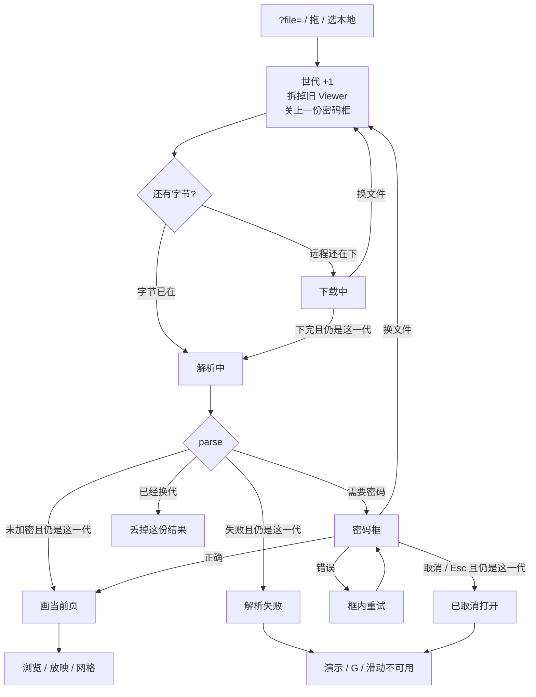
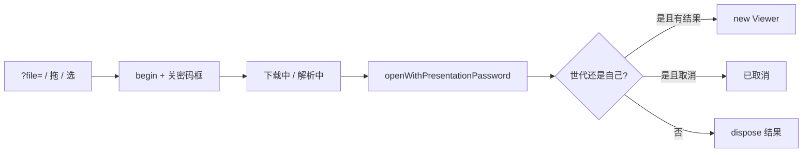

# 独立查看器加密稿：打开时要密码框

> 第十轮持续性迭代。只做这一件事：独立查看器打开加密 `.pptx` / `.ppt` 时弹出密码框，错了可重试，取消停在当前这一代；换文件必须关掉上一份密码框。官网首页密码框、`?p=` 深链、W 白屏、数字+Enter 本轮不做。

---

## 1. 目标与用户

| 项 | 内容 |
|---|---|
| 用户 | 用地址或拖文件打开一份加密稿的人：同事甩 `?file=/secret.pptx` 再口头给密码、自己本机打开加密汇报。不装 Office，密码和文件都不出设备。 |
| 要解决的问题 | 官网首页已经能问密码。独立查看器 `?file=` / 拖文件仍一次 `parse()`：加密稿变成解析错误，人以为文件坏了或查看器坏了。 |
| 成功标准 | 发现加密就弹出密码框；错了留在框里重试；取消、Esc、换文件只改当前这一代；成功后才画当前页。Esc、网格、黑屏、滑动、下载进度仍按前九轮。 |

不为谁做：不在这一轮做 `?p=` 深链、W 白屏、数字+Enter、样本页密码框、把密码写进地址、改 `render/` 或 core、推进发布包。

---

## 2. 用户场景与流程

主路径：打开加密稿 → 下载/解析中 → 密码框 → 输入正确密码 → 看见当前页 → 点「演示」仍按第一轮。

| 分支 | 行为 |
|---|---|
| 空状态 | 未打开、解析失败、已取消：没有 Viewer。G 不造网格，B 不黑屏，滑动不翻页。页码是 `- / -`。 |
| 失败 | 非密码解析错误：只在当前这一代写错误。密码错误不关框、不写舞台。 |
| 取消 | 点取消或 Esc：当前这一代写「已取消打开」。空密码当错误密码，不当成取消。 |
| 返回 | 换文件先 `cancelOpenPassword`，再占新世代。上一份取消文案不能盖到新打开上。 |
| 恢复 | 打开成功后停在第一页（查看器仍没有 `?p=`，本轮不补）。再点「演示」从当前页进放映。 |

---

## 3. 范围

| 必须做 | 不做 |
|---|---|
| 独立查看器 `?file=`、拖文件、选本地同一套密码框 | 官网首页再做一套（已经有） |
| 错密码重试；取消 / Esc 停在当前代 | 样本页密码框 |
| 换文件关掉未完成的密码框；后一次打开赢 | `?p=` 深链、地址回写当前页 |
| 密码只在本机解密，不写进 URL、不上传 | W 白屏、数字+Enter |
| 打开期间 G / B / 滑动 / 方向键不作用到旧稿 | 改 `render/`、改 core、推进发布包 |

---

## 4. 调研与缺口

本轮打开并读完的原始页面（不是搜索摘要）：

| 来源 | 用户实际怎么用 | 对本仓库的含义 |
|---|---|---|
| [View & open files](https://support.google.com/drive/answer/2423485?hl=en) | Drive 网页双击：Office 文件先在 Drive **打开/预览**；「Select Open with **from the file preview**」是从预览再进编辑器。 | Web 第一期待是「打开就能看见」。`?file=` 就是这条打开入口。 |
| [Files you can store](https://support.google.com/drive/answer/37603?hl=en) | PPT / PPTX 在可预览类型表里。原文：**「The Google Drive preview is a scaled-down version of the complete file」**。Microsoft 类型表单独列出 **Password-protected Microsoft Office files**。 | 浏览器预览把加密 Office 当成一类能打开的文件，不是解析失败。 |
| [Share files from Google Drive](https://support.google.com/docs/answer/2494822?hl=en)（展开 Sharing basics / permissions / public） | 分享可只给 **Viewer = 能打开**。Anyone with the link → Copy link。对方拿到的是一条打开链接。 | 加密稿的分享链接若没有密码框，打开这一步直接断。 |
| [Download a file](https://support.google.com/drive/answer/2423534?hl=en) | 下载失败要写清原因：所有者关了下载、第三方 Cookie、限流。 | 取消和失败必须停在当前这一次，不能让人以为查看器坏了。 |
| [Present slides · Computer](https://support.google.com/docs/answer/1696787?hl=en&co=GENIE.Platform%3DDesktop)（展开 `Present mode keyboard shortcuts`） | Esc 结束；**7 再 Enter 跳到第 7 页**；**B 黑屏、W 白屏**，任意键从空白回来。 | W 和数字跳页仍只在桌面放映表。打开加密稿不在这张表。 |
| [Present slides · Android](https://support.google.com/docs/answer/1696787?hl=en&co=GENIE.Platform%3DAndroid) | Present on this device → **左右滑** → 返回键退出。没有 W，没有数字跳页，没有密码说明。 | 手机官方主手势仍是滑。打开体验不靠桌面快捷键。 |
| [Present slides · iPhone](https://support.google.com/docs/answer/1696787?hl=en&co=GENIE.Platform%3DiOS) | 左右滑；退出双击再 Close。画笔模式改到备注区滑。没有 W / 数字跳页。 | 同上。 |
| Microsoft `present-your-slide-show` / `password-protect-a-presentation` / Office for the web | 本轮打开均为 **HTTP 404**。 | 不能把 404 页当成打开或加密说明。 |

对照本仓库：

| 表面 | 已有 | 缺口 |
|---|---|---|
| 官网首页 | 密码框、世代、取消、错密码重试、`?p=` | 不是本轮缺口 |
| 样本预览 | 打开会话、下载/解析 | 清单里没有加密样本；本轮不做 |
| 独立查看器 `?file=` | 第九轮下载进度；第八轮世代；`parse(data)` 不带密码 | 加密稿停在解析错误 |
| 放映快捷键 | B / G / 滑动 / Esc 分层已齐 | 没有新的强证据要做 W 或数字+Enter |

更高价值检查：每个被分享加密 `?file=` 的人都会先碰到解析。`?p=` 是「从第一页开始」的降级，文件仍能看。加密是打不开。W 仍只有 Google 桌面表。

---

## 5. 是否值得做

| 判定 | 结论 |
|---|---|
| 使用者成本 | 只动私有查看器 + 复用已有密码框。不进八个发布包，不增运行时依赖。打开完零持续开销。 |
| 可行路径 | 官网已有 `openWithPresentationPassword`、世代、取消回调。core 已注入解密器。固件 `sample-encrypted-agile.pptx` 密码已知。 |
| 换候选？ | `?p=`：分享仍能看，只是停在第一页。W / 数字+Enter：本轮原文没有新证据。样本页：清单没有加密稿。 |
| 判定 | **做独立查看器加密稿密码框。** |

---

## 6. 产品方案

| 元素 | 规则 |
|---|---|
| 何时问密码 | 字节到手并 `parse` 抛出需要密码。下载阶段不问。 |
| 密码框 | 模态。文件名按文本显示。说明密码只在本机解密。 |
| 错误密码 | 框不关，提示「密码错误，请重试」，焦点回到输入。 |
| 空密码 | 当错误密码，不当取消。 |
| 成功 | 当前页 SVG。`data-open-phase=ready`。耗时只计成功那一次解析。 |
| 取消 / Esc | 当前世代写「已取消打开」。`fileInfo` 为未打开。页码 `- / -`。不弹失败 toast。 |
| 换文件 | 先取消上一份密码框并 resolve。后一次赢。 |
| 打开期间 | `viewer === null`。G / B / 滑动 / 方向键不翻旧页。密码输入时方向键不翻页。 |
| Esc | 密码框自己取消。没有框时仍是网格 → 放映。密码框不是放映的一层 Esc。 |
| 地址 | 不写密码，也不读 `?password=`。 |

---

## 7. 技术方案

| 决策 | 选择 | 原因 |
|---|---|---|
| 模块放哪 | 查看器复用 `password-dialog.ts`；默认中文写入 | 与滑动 / 黑屏同一模式。禁止再抄一套对话框。不进发布包 |
| 为什么对话框不能 import 官网 i18n | `i18n/runtime` 一加载就会按站点语言改地址 | 独立查看器没有词库，也不能被站点 `localStorage` 带跑 |
| 官网为什么仍传入 setText | 首页有中英文 | 默认写入保持中文；官网继续走词条 |
| 为什么一开头就 cancel | 只 `remove()` 会让上一份 `show()` 挂死 | 第八轮已写明，查看器必须同样走取消回调 |
| 为什么空密码当错误 | 人可能误提交；取消有明确按钮和 Esc | 空口令再 parse 一次会得到 WrongPasswordError |
| 为什么不做 `?password=` | 密码进地址等于写进历史和分享链接 | 口头给密码，框里输入 |
| 为什么不做 `?p=` | 加密稿打不开是硬失败；深链是从第一页开始 | 一件事 |
| 文案为什么硬编码中文 | 独立查看器没有词库 | 与现有中文界面一致 |

落点：

| 文件 | 职责 |
|---|---|
| `packages/site/src/password-dialog.ts` | 可选文案写入；默认不碰 i18n |
| `packages/site/src/main.ts` | 首页仍传入站点词条写入 |
| `packages/viewer/src/main.ts` | 解析走密码框；换文件取消 |
| `packages/viewer/src/open-status.ts` | 取消文案 |
| `packages/viewer/src/style.css` | 暗色密码框 |
| 契约 | 独立查看器一条；官网密码框单测仍跑 |

不变量：`render/` 只认 `types.ts`；core 不碰 `document`；不进发布包。

---

## 8. 验收

| # | 标准 | 证据 |
|---|---|---|
| A1 | `?file=` 加密稿：出现模态密码框，没有旧 SVG | 新增契约 |
| A2 | 错误密码：框还在，提示重试 | 同上 + 旧单测 |
| A3 | 正确密码：`ready`，能看到幻灯片 | 新增契约 |
| A4 | 取消 / Esc：已取消可见，`fileInfo` 未打开，G / 演示不可用 | 同上 |
| A5 | 密码框还开着时打开另一份：后一次赢；取消文案不盖新稿 | 同上 |
| A6 | 放映 / 网格 / 黑屏 / 滑动 / 下载进度仍按前九轮 | 旧契约仍跑 |
| A7 | 四项门禁绿；browser-use 走 5173，官网 5174 不回退 | 本轮验证 |

---

## 9. 方案自评

| 对照 | 结论 |
|---|---|
| 目标 | 解决「加密分享链接打不开」，没有偷换成做 `?p=` 或 W |
| 流程 | 主路径、空、失败、取消、返回、恢复都有出口 |
| 范围 | 只补查看器打开这一段；官网密码框不重做产品 |
| 与前九轮 | 不回退放映、备注、滑动、黑屏、小视口、网格、打开世代、下载进度；Esc 仍分层 |
| AGENTS.md | 不改 `render/` 与 core；不进发布包 |
| 风险 | 查看器若直接 import 现有对话框，会被站点语言运行时改地址——所以默认写入必须离开 i18n |

确认后再开发：用户是「打开加密稿的人」；范围只有查看器密码框；验收即上表。
