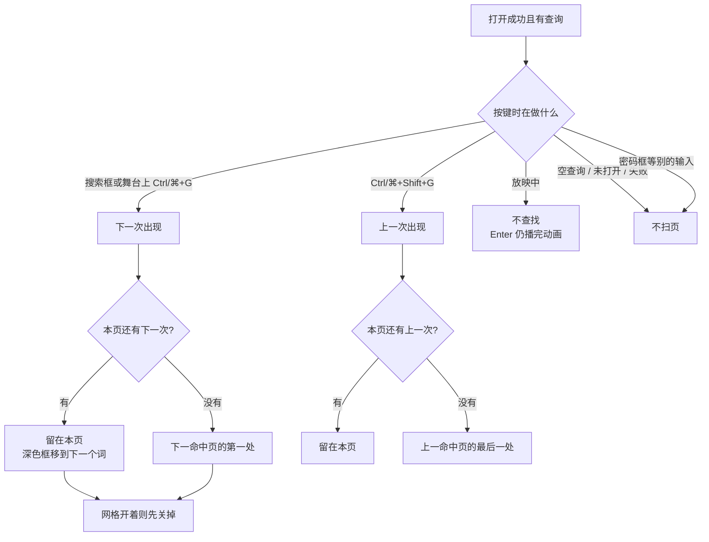
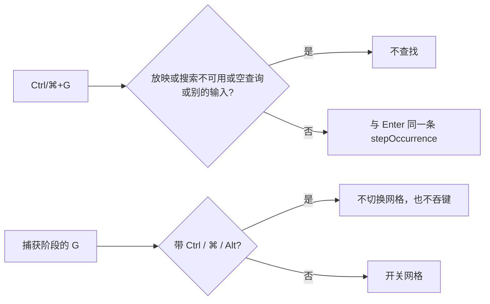

# 独立查看器：搜索框没聚焦时再找一次

> 第二十六轮持续性迭代。只做这一件事：独立查看器里，查询还在、人已经点到舞台上时，**Ctrl+G / ⌘+G 走到下一次出现，Ctrl+Shift+G / ⌘+Shift+G 走到上一次**。放映不接这组键。放映里的 Enter 仍是播完本页动画。

---

## 1. 目标与用户

| 项 | 内容 |
|---|---|
| 用户 | 在浏览器里打开 `.pptx` / `.ppt` **先看一眼再演示**的人：打几个字找到词之后，要点舞台看清那一处，再找下一次。不装 Office，文件不出设备。 |
| 要解决的问题 | 第二十五轮把 Enter / Shift+Enter 放在搜索框里。焦点一离开输入框，官方的 Find again 就没了；人得先点回搜索框才能走到下一个词。 |
| 成功标准 | 没在放映、搜索可用、查询非空时，Ctrl/⌘+G 与 Ctrl/⌘+Shift+G 走和搜索框里 Enter / Shift+Enter 同一条「下一次 / 上一次」。放映中这组键不查找、不抢 Enter。空查询、别的输入框、未打开、失败都不扫页。 |

不为谁做：不在放映里查找；不把 Enter 改成查找；不提示「词在备注」；不给官网首页加查找框；不改 `render/`。

---

## 2. 用户场景与流程

主路径：打开文稿 → 打字查找 → 点舞台（搜索框失去焦点）→ Ctrl/⌘+G 走到下一次出现 → 需要时 Ctrl/⌘+Shift+G 走回上一次 → 点「演示」后这组键不再查找。

| 分支 | 行为 |
|---|---|
| 空状态 | 未打开、认错、解析失败、已取消：搜索不可用。这组键不查找、不扫页。 |
| 空查询 | 不扫描后页，不跳页。 |
| 别的输入框 | 密码框、其他输入有焦点时不抢走这组键。 |
| 搜索框仍聚焦 | 同一条下一处 / 上一处。Enter / Shift+Enter 仍可用。 |
| 查询改了还没扫完 | 按新词重扫，不拿上一趟命中往下跳。 |
| 本页多处 / 一处 | 与第二十五轮相同：还有词就留在本页；只剩一处才翻到相邻命中页。 |
| 备注关着 | 看不见的词不计入。不自动打开备注。 |
| 网格 | 走到下一处时先关网格。单独的 G 仍是开关网格；带 Ctrl / ⌘ / Alt 的 G 不是网格。 |
| 放映 | 不查找，不 preventDefault。Enter 仍播完本页剩余动画。 |
| 换文件 / 失败 | 搜索被清掉并禁用，这组键不再查找。 |
| 返回 | Esc 仍是网格 → 放映 → 备注。不清搜索。 |
| 恢复 | 再打开不继承上一份查询。 |

---

## 3. 范围

| 必须做 | 不做 |
|---|---|
| 独立查看器：Ctrl/⌘+G 下一处，Ctrl/⌘+Shift+G 上一处 | 放映里绑定查找；放映里的 Enter 改成查找 |
| 搜索框没聚焦时也能走 | 官网首页 / 样本预览加查找框 |
| 带修饰键的 G 不再误开网格 | 「词在备注」提示 |
| 空查询、别的输入、未打开、放映都不扫页 | W 白屏、数字+Enter、编辑器放映、首页 `?p=`、Worker |

---

## 4. 调研与缺口

本轮打开并读完的原始页面（不是搜索摘要）：

| 来源 | 用户实际怎么用 | 对本仓库的含义 |
|---|---|---|
| [Keyboard shortcuts for Google Slides](https://support.google.com/docs/answer/1696717?hl=en) · PC Common actions | **Find again：Ctrl + g。Find previous：Ctrl + Shift + g。** Group 才是 Ctrl + Alt + g。 | 再找一次是普通操作，而且不是「必须先停在查找框里」。Alt 组合不能当成查找。 |
| 同一页 · Mac Common actions | **Find again：⌘ + g。Find previous：⌘ + Shift + g。** | Mac 用 ⌘，不是 Ctrl。 |
| 同一页 · PC / Mac Presenting | 下一页是方向键。**Go to specific slide：Number followed by Enter。** 黑屏 `b or .`，白屏 `w or ,`。**这一节没有 Find / Find again。** | 放映不接查找。Enter 在放映里不是 Find again。本仓库放映 Enter 继续播完动画。 |
| [Find and replace text](https://support.microsoft.com/en-us/powerpoint/find-and-replace-text) · Windows / macOS / Web | 三栏都是 **Find Next** 找下一次出现。Web：**「Select Find Next and then select Replace。」** 全文没有「词在备注」。 | 步子仍是 occurrence。备注提示没有官方句，不做。 |
| [How certain features behave in web-based PowerPoint](https://support.microsoft.com/en-us/powerpoint/how-certain-features-behave-in-web-based-powerpoint) | **Reading View：「You can flip through slides and show or hide speaker notes。」** Find 在编辑区：**「The Find command is available on the Home tab of the Ribbon。」** Slide Show：点幻灯片或空格下一页，右键返回 / 跳页 / 结束。没有 Find。 | 阅读预览仍不加查找框。放映没有查找。 |

对照本仓库：

| 表面 | 已有 | 缺口 |
|---|---|---|
| 独立查看器查找 | 搜索框里 Enter / Shift+Enter 按出现次序走 | **焦点离开搜索框后，没有 Find again** |
| 网格 | 单独的 G 开关全部幻灯片 | 捕获阶段见 `g` 就切换，**Ctrl+G 会被当成网格** |
| 放映 | Enter 播完动画；Ctrl+F 在放映里不聚焦搜索 | 不缺查找键；不该新绑进去 |
| 官网首页 | 翻页、备注、网格、演示 | 官方阅读态没有 Find。不加框 |

上一轮候选用证据裁定：

| 候选 | 判定 |
|---|---|
| 搜索框没聚焦时的 Find again | **做。** 普通操作写明 Ctrl/⌘+G 与 Ctrl/⌘+Shift+G。放映节没有这组键，所以只在浏览态接。 |
| 词只在备注里、备注关着时提示「词在备注」 | **不做。** Windows / macOS / Web 查找页和 Web 能力页都没有这句。 |
| W、数字+Enter | **不做。** Presenting 里仍有这两条，但和前几轮读到的是同一张表，没有新的打开路径证据。 |
| 官网查找框 / 编辑器放映 / 首页 `?p=` / Worker | **不做。** Reading View 仍然只有翻页和备注。 |

---

## 5. 是否值得做

| 判定 | 结论 |
|---|---|
| 浏览态 Find again | **做。** 查找已经存在。人点开舞台之后，官方下一处的快捷键还没接上。 |
| 放映里的查找键 | **不做。** Presenting 没有 Find again。Enter 继续播完动画。 |
| 备注-only 文案 | **不做。** 官方没有对应句。 |
| 使用者成本 | 不进发布包。不改 `render/`。仍走已经画好的命中步。 |
| 可行路径 | 产品层在文档键盘上认 Ctrl/⌘+G。网格捕获阶段放行这组键。 |

---

## 6. 产品方案

| 元素 | 规则 |
|---|---|
| Ctrl 或 ⌘，且没有 Alt，键是 G | 下一处。Shift 则上一处。 |
| 搜索框聚焦或已经点到舞台 | 同一条步。 |
| 放映 | 不调用查找，不 preventDefault。 |
| 空查询 / 搜索禁用 / 没有文稿 | 不扫页。 |
| 焦点在别的输入框 | 不接。 |
| 网格 | 单独 G 仍开关。Ctrl/⌘/Alt+G 不开关；若因此走到下一处，先关网格。 |
| Enter | 搜索框里仍是下一处。框外和放映里仍是播完动画。 |
| Esc | 仍先关网格，再退放映，再关备注。 |

---

## 7. 技术方案

| 决策 | 选择 | 原因 |
|---|---|---|
| 为什么不是只在搜索框里 | 缺口就是焦点已经离开输入框 | 框里的 Enter 已经能走 |
| 为什么放映不 preventDefault | 和现有 Ctrl+F 一样：不接就不拦截 | 拦截等于把查找键绑进放映 |
| 为什么排除 Alt | PC 上 Ctrl+Alt+G 是 Group | 那不是 Find again |
| 为什么网格要放行 | 网格用捕获阶段听 `g`，会先吞掉 Ctrl+G | 不放行的话，下一处永远走不到 |
| 为什么空查询不聚焦搜索框 | Ctrl+F 已经负责聚焦 | Find again 是重复上一次查找 |
| 为什么不动 core | 步数已经在查看器产品层 | `render/` 只认 `types.ts` |

落点：

| 文件 | 职责 |
|---|---|
| `packages/viewer/src/viewer-search.ts` | `findAgain`：能接才走现有的下一处 / 上一处 |
| `packages/viewer/src/main.ts` | 文档键盘认 Ctrl/⌘+G，放映中不拦截 |
| `packages/site/src/slide-grid.ts` | 带 Ctrl / ⌘ / Alt 的 G 不切换、不吞键 |
| `packages/viewer/index.html` | 搜索框说明这组键 |
| `tooling/test-viewer-search-highlight.mjs` | 没聚焦、别的输入、放映、空查询 |
| `tooling/lib/standalone-search-highlight-browser-contract.mjs` | 舞台上 Ctrl+G、⌘+Shift+G、网格、放映 |

不变量：`render/` 只认 `types.ts`；core 不碰 `document`；不进发布包。

---

## 8. 验收

| # | 标准 | 证据 |
|---|---|---|
| A1 | 搜索框没聚焦时，下一处 / 上一处与 Enter 同一条 | 节点测试 |
| A2 | 别的输入框、放映、空查询、禁用时不接，且不改页 | 节点测试 |
| A3 | 查询改了还没扫完时按新词重扫 | 节点测试 |
| A4 | 源码：放映 Enter 仍是 `finishAnimations`；网格放行带修饰键的 G | 节点测试 |
| A5 | showcase 搜「挤出」后点开舞台，Ctrl+G 从第 2 处到第 3 处 | 浏览器契约 |
| A6 | ⌘+Shift+G 回到上一处；单独的 G 仍开网格；网格开着时 Ctrl+G 先关网格再走 | 浏览器契约 |
| A7 | 放映中 Ctrl+G 与 Enter 不改页、不把焦点送回搜索框、没有黄框 | 浏览器契约 |
| A8 | 空查询与打开失败后 Ctrl+G 不扫页、不清不掉的状态不再出现高亮 | 浏览器契约 |
| A9 | 四项门禁绿 | check / test / build / verify |
| A10 | browser-use：5173 未聚焦再找、网格、放映 | `out/viewer-search-again-browser/` |

---

## 9. 方案自评

| 对照 | 结论 |
|---|---|
| 目标 | 解决「点到舞台之后不能再找下一次」。没有改成放映查找或备注提示 |
| 流程 | 主路径、空、失败、别的输入、换文件、网格、放映、Esc 都有出口 |
| 范围 | 只动查看器查找键和网格对修饰键 G 的误伤；不进发布包 |
| 与前二十五轮 | 不回退当前这一处、命中页标字、50ms 让出、放映 Enter、单独的 G |
| AGENTS.md | 不改 `render/` 与 core |
| 风险 | 放映中浏览器自己的查找下一处仍可能出现，因为这组键故意不拦截。词只在备注里时舞台上仍没有框 |

确认后再开发：用户是「已经查到词、焦点离开搜索框、还要下一次出现的人」；范围只有浏览态的 Ctrl/⌘+G；验收即上表。
