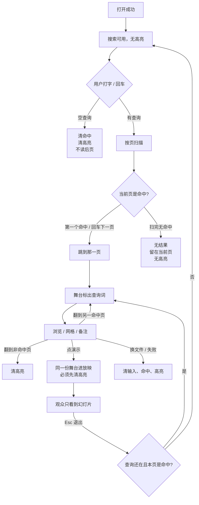
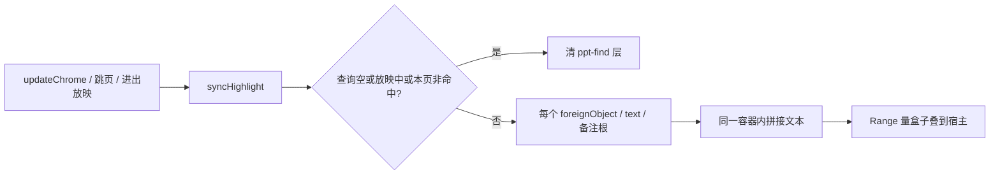

# 独立查看器查找在命中页内标字

> 第二十四轮持续性迭代。只做这一件事：独立查看器**已经跳到的命中页**把查询词标出来。空查询 / 无命中 / 换文件 / 放映必须清掉。官网首页 / 样本预览加查找框、编辑器放映、首页回写 `?p=`、Worker / 三维钩子 / W / FSA / 数字+Enter 本轮不做。

---

## 1. 目标与用户

| 项 | 内容 |
|---|---|
| 用户 | 在浏览器里打开 `.pptx` / `.ppt` **先看一眼再演示**的人：打几个字找到某一页之后，还要在这一页里看见那个词。不装 Office，文件不出设备。 |
| 要解决的问题 | 第二十三轮已经能打字找页。人到了那一页，词还埋在版式里，要自己扫。官方 Find 会标出当前命中。 |
| 成功标准 | 当前页是命中页时，舞台上的查询词被标出。空查询、无命中、换文件、打开失败、进入放映都看不到高亮。不改 `render/`，不进发布包。 |

不为谁做：不给官网首页 / 样本预览加查找框；不把高亮画进默认放映画面；不改 `viewer-core.search()`；不加全文索引进发布包。

---

## 2. 用户场景与流程

主路径：打开文稿 → 打字查找 → 跳到第一个命中页 → **页里的词被标出** → 回车下一命中页，那一页的词被标出 → 点「演示」高亮消失。

| 分支 | 行为 |
|---|---|
| 空状态 | 未打开、认错、解析失败、已取消：搜索不可用，没有高亮。 |
| 空查询 | 中止扫描，清命中和胶片栏，清高亮，不读后页。 |
| 无命中 | 写「无结果」，不跳页，清高亮。 |
| 命中页 | 舞台里该词被标出。跨 run 拆开的词也要标。备注里的词：备注面板开着才看得见，不自动打开备注。 |
| 翻到非命中页 | 清高亮，查询和胶片栏命中还在。 |
| 放映 | 舞台会被整块移进演示视图。进放映前清高亮。`/` 仍不抢查找。 |
| 网格 | 跳到命中先关网格，再标当前页。 |
| 换文件 / 失败 | 第一下清输入、命中、高亮。 |
| 返回 | Esc 仍是网格 → 放映 → 备注。清空搜索框等于空查询。 |
| 恢复 | 再打开不继承上一份查询和高亮。 |

---

## 3. 范围

| 必须做 | 不做 |
|---|---|
| 独立查看器：命中页内标出查询词 | 官网首页 / 样本预览加查找框 |
| 空查询 / 无命中 / 换文件 / 失败清高亮 | 改 `render/`、加 `includeEditMarkers` |
| 进放映清高亮；退出后若仍命中再标 | 把高亮画给观众 |
| 跨同一文本容器的 run 拼接后再标 | 改 `viewer-core.search()`、发布包全文索引 |
| 与第二十三轮 50ms 让出 / 缓存共存 | 编辑器放映 chrome、首页回写 `?p=` |
|  | Worker、三维推迟、FSA、W、数字+Enter |

---

## 4. 调研与缺口

本轮打开并读完的原始页面（不是搜索摘要）：

| 来源 | 用户实际怎么用 | 对本仓库的含义 |
|---|---|---|
| [View & open files](https://support.google.com/drive/answer/2423485?hl=en) | 双击后 **「If you open a video, Microsoft Office file, audio file, or photo, it will open in Google Drive。」** 全文没有 Find。 | 网盘预览的第一期待是打开就能看见。阅读预览不加查找。 |
| [Search and use find and replace](https://support.google.com/docs/answer/62754?hl=en&co=GENIE.Platform%3DDesktop) | Docs / Slides：**「Click Edit · Find and replace。」** **「You can also search within a file using the keyboard shortcut Ctrl + f。」** 替换写的是 **「To replace the highlighted word」**。 | 官方 Find 属于编辑菜单，并且**会标字**。 |
| [Keyboard shortcuts for Google Slides](https://support.google.com/docs/answer/1696717?hl=en&co=GENIE.Platform%3DDesktop) | 普通操作：Find `Ctrl + F`。**Presenting 一节没有 Find。** Esc 结束放映。 | 查找是浏览态。放映条不找字。 |
| [Find and replace text](https://support.microsoft.com/en-us/powerpoint/find-and-replace-text) · Web 栏 | **「On the right end of the Home tab, select Replace (or Find > Replace).」** Windows 栏写 **「the currently selected occurrence」。** | 官方 Web Find 在 Home 编辑区，当前命中是选中/标出的。 |
| [How certain features behave in web-based PowerPoint](https://support.microsoft.com/en-us/powerpoint/how-certain-features-behave-in-web-based-powerpoint) | **Reading View： 「You can flip through slides and show or hide speaker notes。」** Find 写在 Editing：**「The Find command is available on the Home tab of the Ribbon。」** Slide Show 没有 Find。 | 官网首页已经是翻页 + 备注 + 演示，对应 Reading View + Slide Show，**官方阅读态没有查找框**。 |
| [Present your slide show](https://support.microsoft.com/en-us/powerpoint/present-your-slide-show) · Web 栏 | 控制条：上一页 / 下一页 / See all slides / End Show / `T` 再唤出。**没有查找。** | 放映是给观众的干净画面。本仓库舞台会整块移进演示视图，高亮必须先清掉。 |
| [Present slides · Computer](https://support.google.com/docs/answer/1696787?hl=en&co=GENIE.Platform%3DDesktop) | Slideshow 全屏；底栏是箭头、选页、Presenter view、画笔。**Highlight & annotate** 是笔，不是 Find。Esc 结束。 | 放映里的「高亮」是演讲者画笔，不是查找标字。 |

对照本仓库：

| 表面 | 已有 | 缺口 |
|---|---|---|
| 官网首页 / 样本预览 | 翻页、备注、网格、演示 | 没有查找框。官方 Reading View 也没有。 |
| 官网编辑器 | 查找与替换 + 页内标字 | 不缺；不是轻量预览主路径 |
| 独立查看器查找 | 顶栏框、`/`、50ms 让出、缓存、跳页 | **跳到命中页后不标字** |
| 放映 | 舞台整块移进演示视图 | 若带着高亮进去，观众会看见黄块 |

上一轮候选用证据裁定：

| 候选 | 判定 |
|---|---|
| 官网首页 / 样本预览加查找框 | **不做。** 官方 Reading View 只翻页和备注。showcase 7 页本来就能翻。加框是给阅读预览发明官方没有的东西。 |
| 命中页内标字 | **做。** 查看器查找已经存在。官方 Find 写明 highlighted / selected occurrence。人已经到了那一页，还要自己找词。 |
| 编辑器放映 chrome | **不做。** 编辑器没有放映会话。 |
| 首页保留 `?p=` | **不做。** 分享面已经是查看器 / 样本。 |
| Worker / 三维 / W / FSA / 数字+Enter | **不做。** 没有新的打开路径长任务证据。 |

更高价值检查：来试「打开看一眼 / 演示」的人，官网预览已经对齐官方阅读态。剩下会在**已经发生的查找**里卡住的，是跳到页后找不到那个词。

---

## 5. 是否值得做

| 判定 | 结论 |
|---|---|
| 命中页内标字 | **做。** 官方 Find 标字；现有查找只跳页。 |
| 官网查找框 | **不做。** 官方阅读预览没有 Find；首页已经是翻页 + 备注 + 演示。 |
| 编辑器放映 | **不做。** 没有放映会话。 |
| 首页保留 `?p=` | **不做。** |
| Worker / 三维推迟 | **不做。** |
| 使用者成本 | 不进八个发布包。不改 `render/`。标字是已渲染 DOM 上的一层黄框。 |
| 可行路径 | 产品层按文本容器做 Range，用 `getClientRects` 在舞台 / 备注上叠框。 |

---

## 6. 产品方案

| 元素 | 规则 |
|---|---|
| 打开成功 | 搜索可用。无高亮，不自动扫。 |
| 打开失败 / 密码取消 / 空 | 搜索空且不可用。无高亮。 |
| 换文件 | 第一下中止扫描、清缓存、清输入、命中和高亮。 |
| 空查询 | 中止扫描，清命中、胶片栏和高亮，不读后页。 |
| 无命中 | 「无结果」，留在当前页，无高亮。 |
| 命中页 | 舞台标出查询词。回车到下一命中页后标那一页。 |
| 非命中页 | 清高亮。 |
| 备注-only 命中 | 不自动打开备注。备注开着时备注正文里的词一并标出。 |
| 放映 | 进放映清高亮。`/` 不聚焦。退出后若查询还在且本页是命中，再标。 |
| 网格 | 跳到命中先关网格。 |
| 缩放 | `+/-` / 适应后立刻再量盒子。 |
| 备注开关 | 打开后量备注正文；关上后清掉看不见的备注框。 |

---

## 7. 技术方案

| 决策 | 选择 | 原因 |
|---|---|---|
| 为什么不做官网查找框 | 官方 Reading View 没有 Find | 首页已经对齐翻页 + 备注 + 演示 |
| 为什么不改 `render/` | `includeEditMarkers` 会改渲染契约，编辑器才需要 | 屏幕预览的字已经在 DOM 里 |
| 为什么叠黄框而不是 `::highlight` | Chrome 不给 foreignObject 里的 HTML 画 Custom Highlight | 人必须看见标字，不能只登记 Range |
| 为什么框做宿主的子节点 | 备注滚、舞台滚时框跟着字走 | 绝对定位相对舞台 / 备注，缩放后再量一次 |
| 为什么按文本容器拼接，不把整页 SVG 拼成一串 | 相邻形状拼在一起会假命中 | 同一段落拆 run 才是真拆词 |
| 为什么放映必须清 | 舞台 DOM 就是观众看到的那份 | 官方放映没有 Find 标字 |
| 为什么不动 core | 标字是产品层对已渲染 DOM 的投影 | `render/` 只认 `types.ts` |

落点：

| 文件 | 职责 |
|---|---|
| `packages/viewer/src/viewer-search-highlight.ts` | 按容器收集 Range、在舞台 / 备注叠黄框 |
| `packages/viewer/src/viewer-search.ts` | 命中变化后 `syncHighlight` |
| `packages/viewer/src/main.ts` | 翻页、进放映、退出放映时同步 |
| `packages/viewer/src/style.css` | `.ppt-find-layer` / `.ppt-find-box` |
| `tooling/test-viewer-search-highlight.mjs` | 空查询 / 跨节点 / 清高亮 / 源码不碰 `render/` |
| `tooling/lib/standalone-search-highlight-browser-contract.mjs` | 打字标字、空查询清、无结果清、放映清、换文件清 |

不变量：`render/` 只认 `types.ts`；core 不碰 `document`；不进发布包。

---

## 8. 验收

| # | 标准 | 证据 |
|---|---|---|
| A1 | 同一容器内拆开的词能标出 | 新增节点测试 |
| A2 | 空查询收集 Range 直接失败，产品层只清除 | 新增节点测试 |
| A3 | 清除后 registry 与黄框都空 | 新增节点测试 |
| A4 | 源码不改 `render/`，不含 `includeEditMarkers` | 新增节点测试 |
| A5 | 打开 showcase 打「立体效果」跳到第 7 页且有高亮 | 新增浏览器契约 |
| A6 | 清空查询：高亮消失 | 新增浏览器契约 |
| A7 | 无命中：无高亮，页码不变 | 新增浏览器契约 |
| A8 | 放映中没有黄框 | 新增浏览器契约 |
| A9 | 换文件 / 失败：高亮与输入一起空 | 新增浏览器契约 |
| A10 | 查找让出、打开不扫后页、失败收起备注仍按前二十三轮 | 旧契约仍跑 |
| A11 | 四项门禁绿 | check / test / build / verify |
| A12 | browser-use：5173 打开 / 查找标字 / 空查询 / 无命中 / 放映 / 失败 | `out/viewer-search-highlight-browser/` |

---

## 9. 方案自评

| 对照 | 结论 |
|---|---|
| 目标 | 解决「跳到命中页后还要自己找词」，没有偷换成官网查找框或编辑器放映 |
| 流程 | 主路径、空、失败、取消、换文件、无命中、非命中页、放映、网格、备注都有出口 |
| 范围 | 只动独立查看器查找投影；不进发布包；不改 `render/` |
| 与前二十三轮 | 不回退放映、滑动、黑屏、网格、打开世代、密码、深链、认文件、parse 推迟、控制条 `T`、打开不扫后页、失败收起备注、查找 50ms 让出 |
| AGENTS.md | 不改 `render/` 与 core |
| 风险 | 备注-only 命中在备注关着时页上没有字可标，这是「不自动打开备注」，不是漏标舞台。胶片栏缩略图不标字。 |

确认后再开发：用户是「已经用查找跳到某一页、还要看见那个词的人」；范围只有查看器命中页标字；验收即上表。
