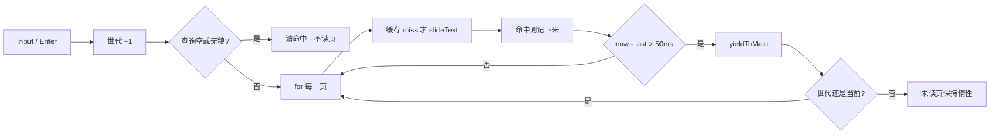

# 独立查看器查找不再一次打穿后页

> 第二十三轮持续性迭代。只做这一件事：独立查看器**用户打字查找**按 50ms 让出，缓存 `slideText`，空查询 / 无命中 / 取消 / 换文件与懒解析共存。打开路径已经不再无条件打穿。编辑器放映、首页回写 `?p=`、官网查找、Worker / 三维钩子 / W / FSA 本轮不做。

---

## 1. 目标与用户

| 项 | 内容 |
|---|---|
| 用户 | 在浏览器里打开 `.pptx` / `.ppt` **先看一眼再演示**的人：打开一份 200 页带图或带备注的长稿，打几个字找某一页。不装 Office，文件不出设备。 |
| 要解决的问题 | 第十七、十八轮把后页 XML / 图推迟到第一次读到。第二十一轮打开不再为状态栏扫后页。用户打字仍 `slides.forEach` + `slideText`，一次同步任务把后页整份 inflate。带图稿中位约 **139ms**，带备注约 **138ms**，都超过 50ms。 |
| 成功标准 | 空查询不读后页。有查询才按页扫，超过 50ms 让出主线程。取消 / 换文件 / 失败中止，未读页保持惰性。第二次相同查询走缓存。无命中留在当前页。放映中 `/` 不抢查找。打开、备注、网格、深链仍按前二十二轮。 |

不为谁做：不改 `viewer-core.search()`、不加全文索引进发布包、不给官网首页 / 样本预览加查找、不做编辑器放映、不回写首页 `?p=`、不加 Worker。

---

## 2. 用户场景与流程

主路径：打开文稿 → 立刻看见当前页 → 打字查找 → 先跳到第一个命中，其余页继续扫 → 状态写「N 页」或「无结果」→ 回车跳下一个命中 → 点「演示」仍按前二十轮。

```mermaid
flowchart TD
  A[点打开 / 拖文件 / ?file=] --> B[世代 +1<br/>拆旧稿]
  B --> C[清空搜索<br/>中止扫描<br/>丢掉缓存]
  C --> D{字节可用?}
  D -->|否 / 认错 / 解析失败| E[未打开文件<br/>搜索不可用]
  D -->|密码框取消| E
  D -->|是| F[parse 仍惰性]
  F --> G[new Viewer index]
  G --> H[搜索可用，不自动扫]
  H --> I[用户打字 / 回车]
  I --> J{查询空?}
  J -->|是| K[清命中<br/>不读后页]
  J -->|否| L[按页 slideText<br/>缓存]
  L --> M{已超过 50ms?}
  M -->|否| L
  M -->|是| N[让出主线程]
  N --> O{已取消 / 换代?}
  O -->|是| P[未读页保持惰性]
  O -->|否| L
  L --> Q{有命中?}
  Q -->|第一个命中| R[跳到那一页]
  Q -->|扫完无命中| S[无结果<br/>留在当前页]
  Q -->|扫完有命中| T[N 页]
  R --> U[回车下一个]
  H --> V[浏览 / 放映 / 网格]
  V -->|换文件| B
  V -->|放映中 /| W[/ 不聚焦搜索]
```

| 分支 | 行为 |
|---|---|
| 空状态 | 未打开、认错、解析失败、已取消：搜索框空且不可用。`/` 不聚焦。 |
| 失败 | 换代时中止扫描、清缓存、清输入和命中。 |
| 取消 | 文件选择器没选出：不 `begin`，搜索保持当时状态。密码取消：属于那一代，搜索已空。输入框清空 / 换成空查询：中止扫描，清命中，不读剩下的页。 |
| 换文件 | 第一下中止扫描并丢掉上一份缓存。新稿不继承查询。 |
| 无命中 | 写「无结果」，不跳页。 |
| 查找中 | 只有让出时才写「查找中 · 已扫/总页」。短于 50ms 的查询不闪这一句。 |
| 第一个命中 | 立刻跳到那一页；后面继续扫。回车在已找到的命中里循环。 |
| 放映 | `/` 与 Ctrl/Cmd+F 不聚焦搜索。控制条仍是上一页 / 下一页 / G / B / 退出。若扫描在进放映前已开始，跳页时同步演讲者侧栏。 |
| 网格 | 跳到命中时先关网格，让人看见那一页。Esc 仍先关网格。 |
| 备注 | 跳页走既有 `updateChrome`，只读本页。 |
| 返回 | Esc：网格 → 放映 → 备注。搜索框是输入框，里面的键不接管翻页。 |
| 恢复 | 再打开不继承上一份查询和缓存。 |

---

## 3. 范围

| 必须做 | 不做 |
|---|---|
| 独立查看器查找按页扫描，50ms 让出 | 改 `viewer-core.search()`、发布包全文索引 |
| 缓存本份文稿的 `slideText` | 官网首页 / 样本预览加查找 |
| 空查询 / 无命中 / 取消 / 换文件 / 失败与懒解析共存 | 编辑器放映 chrome |
| 放映中不抢 `/`；跳页关网格 | 首页回写 `?p=` |
| 打开成功后仍不自动查找 | Worker、三维推迟、FSA、W、数字+Enter |
|  | 改 `render/`、改 core |

---

## 4. 调研与缺口

本轮打开并读完的原始页面（不是搜索摘要）：

| 来源 | 用户实际怎么用 | 对本仓库的含义 |
|---|---|---|
| [Optimize long tasks](https://web.dev/articles/optimize-long-tasks?hl=zh-cn)（页面 2024-12-19 更新，本轮读完全文） | **「任何运行时间超过 50 毫秒的任务都是长任务。」** **「请务必检查全局 scheduler 并确保它具有 yield 方法。」** 按 50ms 一批再让出。并写明 **`Array.prototype.forEach` 不会等待**。结论：**「最后，尽量减少函数中的工作量。」** | 带图 / 带备注 200 页首次查找中位 139ms / 138ms，必须拆任务。空查询是可以删掉的工作。短作业不要每页 `yield`。 |
| [View & open files](https://support.google.com/drive/answer/2423485?hl=en)（本轮读完全文） | 双击后 **「If you open a video, Microsoft Office file, audio file, or photo, it will open in Google Drive。」** 第一期待是打开就能看见当前文件。 | 打开路径继续只付当前页。查找是用户后来自己要的扫描，可以取消，不能在打开当下做。 |
| [Present your slide show](https://support.microsoft.com/en-us/powerpoint/present-your-slide-show) · Web 栏（本轮读完全文） | 控制条：上一页 / 下一页 / See all slides / End Show / `T` 再唤出。**没有查找。** | 放映是给观众的干净画面。`/` 不能在放映里抢走查找。 |
| [Present slides · Computer](https://support.google.com/docs/answer/1696787?hl=en&co=GENIE.Platform%3DDesktop)（本轮读完全文） | Slideshow 全屏；底栏是箭头、选页、Presenter view、画笔。Esc 结束。**没有 Find。** | 查找属于浏览态。跳到命中页时若网格开着，先关掉网格。 |

对照本仓库：

| 表面 | 已有 | 缺口 |
|---|---|---|
| 默认 `parse()` | 后页 XML / 图第一次读到再解 | 不缺 |
| 打开态 | 第二十一轮：状态栏不扫后页；换文件清空搜索 | 不缺 |
| 失败后备注 | 第二十二轮：空 / 失败收起 N 面板 | 不缺 |
| 独立查看器查找 | 顶栏搜索框；`/` 聚焦；空查询早退；250ms 防抖 | **`forEach` + `slideText` 同步打穿后页，无缓存、不能取消** |
| 放映 | `T` / G / B / Esc | `/` 仍会聚焦顶栏搜索 |
| 官网首页 / 样本 | 没有查找 | 本轮不做；留给下一轮 |
| 编辑器「放映」页 | 没有 `bindPresentMode` | 不是轻量预览主路径 |
| 首页 `?p=` | 第十九轮读一次就清掉 | 产品判断未变 |

上一轮候选用证据裁定：

| 候选 | 判定 |
|---|---|
| 查看器全文搜索扫全部 `slides[i]` | **做。** 打开路径已经不再无条件打穿。用户打字仍是同步 `forEach`。带图 / 带备注稳定超过 50ms。 |
| 纯文本 42ms 所以再观望 | **不做观望。** 本轮复测：纯文本 88ms（含访问包装），后页带图 **139ms**，每页备注 **138ms**。空查询 0ms。已 inflate 后再搜 0.3ms。 |
| 官网首页加查找 | **本轮不做。** 官网还没有查找框；先收口已经存在的查看器查找。 |
| 编辑器放映 chrome | **不做。** 编辑器没有放映会话。 |
| 首页 `?p=` 仍被清 | **不做。** 分享面已经是查看器 / 样本。 |
| Worker / 三维 / W / FSA / 数字+Enter | **不做。** 没有新的打开路径长任务证据。 |

实测（Node 24.3.0，`out/round23-research/measure-search.mjs`，每次重新 `parse()`，打开后只读第 1 页再搜）：

| 对象 | 中位 |
|---|---|
| 默认 `parse()`（200 页） | 约 4ms |
| 200 页纯文本首次 `forEach` + `slideText` | 约 **88ms** |
| 200 页后页带图首次查找 | 约 **139ms** |
| 200 页每页备注首次查找 | 约 **138ms** |
| 已 inflate 后再搜 | 约 **0.3ms** |
| 空查询 | 约 **0ms** |
| showcase / hardcases / 图表 / 媒体（≤10 页） | 2–23ms |

更高价值检查：来试「打开看一眼 / 演示」的人，打开当下已经不再无条件打穿后页。剩下会在打几个字时把懒解析整份解开、并卡住主线程的，是查看器这条同步查找。

---

## 5. 是否值得做

| 判定 | 结论 |
|---|---|
| 查找算法 / 50ms 让出 + 缓存 | **做。** 真文件路径稳定超过长任务线；取消必须能留下未读页。 |
| 官网查找 | **不做。** 官网还没有查找框，不是本轮这一件。 |
| 编辑器放映 | **不做。** 没有放映会话可跟官网条。 |
| 首页保留 `?p=` | **不做。** 分享面已经是查看器 / 样本。 |
| Worker / 三维推迟 | **不做。** 当前页 inflate 仍低于长任务线。 |
| 使用者成本 | 不进八个发布包。不增依赖。短查询不闪「查找中」。 |
| 可行路径 | 产品层按页 `slideText` + `Map` 缓存 + `scheduler.yield` / `setTimeout(0)`。`detachOpen` 已经清搜索。 |

---

## 6. 产品方案

| 元素 | 规则 |
|---|---|
| 打开成功 | 搜索可用。不自动扫。 |
| 打开失败 / 密码取消 / 空 | 搜索空且不可用。`/` 不聚焦。 |
| 换文件 | 第一下中止扫描、清缓存、清输入和命中。 |
| 空查询 | 中止扫描，清命中和胶片栏高亮，不读后页。 |
| 无命中 | 「无结果」，留在当前页。 |
| 有命中 | 第一个命中立刻跳页；扫完写「N 页」。回车循环已找到的命中。 |
| 查找中 | 只有让出时写「查找中 · 已扫/总页」。 |
| 放映 | `/`、Ctrl/Cmd+F 不聚焦。进放映不自动开查找。 |
| 网格 | 跳到命中先关网格。Esc 仍先关网格。 |
| 备注 | 跳页只更新本页。 |
| 文件选择器没选出 | 不 `begin`，搜索保持当时开关。 |

---

## 7. 技术方案



| 决策 | 选择 | 原因 |
|---|---|---|
| 为什么按 50ms 一批而不是每页 yield | 原文：短作业每项 yield，开销会大于工作 | 带图稿约 139ms，大约让出两三次 |
| 为什么缓存 `slideText` 而不是改 `viewer-core.search()` | 发布包契约 / 体积不动；产品层自己扫页就能取消 | 没有证据必须进发布包 |
| 为什么空查询必须换代 | 只清文案的话，上一趟扫描还会把后页 inflate | 取消 = 留下未读页 |
| 为什么第一个命中立刻跳 | 人是来找某一页的，不必等扫完 200 页 | 无命中才留在当前页 |
| 为什么放映不抢 `/` | 官方 Web 放映条没有查找 | 放映是给观众的 |
| 为什么只动独立查看器 | 官网还没有查找框 | 一件事；缺口在查看器已有的框 |
| 为什么不动 core | `slideText` 已经够用；inflate 发生在读 `slides[i]` | `render/` 只认 `types.ts` |

落点：

| 文件 | 职责 |
|---|---|
| `packages/viewer/src/viewer-search.ts` | 按页扫描、50ms 让出、缓存、换代取消 |
| `packages/viewer/src/open-file-info.ts` | `resetViewerSearch` 同时禁用；成功后 `enableViewerSearch` |
| `packages/viewer/src/main.ts` | 打开 / 换代走上面两个；查找不再 `forEach` |
| `packages/viewer/index.html` | 搜索框默认 `disabled`；命中带 `aria-live` |
| `tooling/test-viewer-search-lazy.mjs` | 空查询不读页；取消留下后页；缓存命中不再读；源码不再同步 `forEach` |
| `tooling/lib/standalone-search-lazy-browser-contract.mjs` | 打字命中、空查询、无结果、换文件 / 失败清空、放映不抢 `/` |
| 既有独立查看器契约 | 接上 |

不变量：`render/` 只认 `types.ts`；core 不碰 `document`；不进发布包。

---

## 8. 验收

| # | 标准 | 证据 |
|---|---|---|
| A1 | 空查询不访问 `slides[i]` | 新增节点测试 |
| A2 | 扫描中换代，后页不会被读到 | 新增节点测试 |
| A3 | 同一页第二次查走缓存，不再读 `slides[i]` | 新增节点测试 |
| A4 | 超过 deadline 才 `yield`；`forEach` 不再出现在查找路径 | 新增节点测试 + 源码契约 |
| A5 | 打开 showcase 后打字出现「N 页」，并跳到命中页 | 新增浏览器契约 |
| A6 | 清空查询：命中文案空，不跳去「无结果」页 | 新增浏览器契约 |
| A7 | 无命中：写「无结果」，页码不变 | 新增浏览器契约 |
| A8 | 换文件 / 失败：输入和命中清空，搜索不可用 | 新增浏览器契约 |
| A9 | 放映中 `/` 不聚焦搜索；网格开着时跳页先关网格 | 新增浏览器契约 |
| A10 | 打开不扫后页、失败收起备注仍按前二十二轮 | 旧契约仍跑 |
| A11 | 四项门禁绿 | check / test / build / verify |
| A12 | browser-use：5173 打开 / 查找 / 空查询 / 无命中 / 失败 / 放映 | `out/viewer-search-lazy-browser/` |

---

## 9. 方案自评

| 对照 | 结论 |
|---|---|
| 目标 | 解决「打字查找一次打穿后页」，没有偷换成官网查找、编辑器放映或首页 `?p=` |
| 流程 | 主路径、空、失败、取消、换文件、无命中、放映、网格、备注都有出口 |
| 范围 | 只动独立查看器查找 chrome；不进发布包 |
| 与前二十二轮 | 不回退放映、滑动、黑屏、网格、打开世代、密码、深链、认文件、parse 推迟、控制条 `T`、打开不扫后页、失败收起备注 |
| AGENTS.md | 不改 `render/` 与 core |
| 风险 | 胶片栏可见格仍会解附近页，那是预取，不是查找 `forEach`。短查询不显示「查找中」，避免闪一下。 |

确认后再开发：用户是「打开看一眼/演示、打字找某一页的人」；范围只有查看器查找与懒解析共存；验收即上表。
