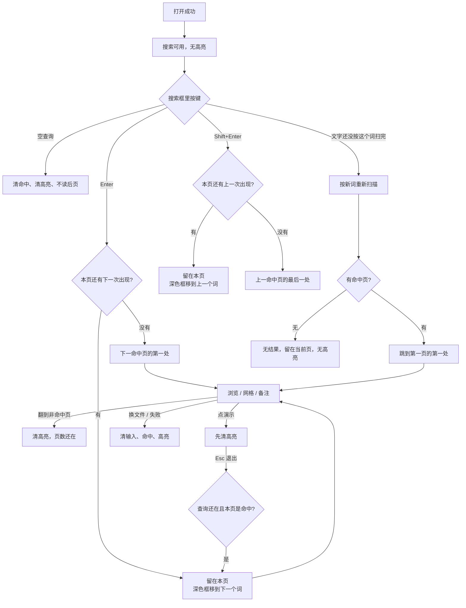
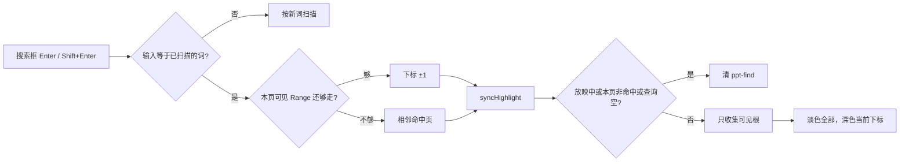

# 独立查看器查找标出当前这一处

> 第二十五轮持续性迭代。只做这一件事：独立查看器里，**同一页出现多次的查询词标出当前这一处**，搜索框里的 Enter 走到下一次出现，Shift+Enter 走到上一次。一页只有一处时，Enter 仍落到下一命中页。官网首页 / 样本预览不加查找框。备注-only 不自动打开，也不另做「词在备注」提示。

---

## 1. 目标与用户

| 项 | 内容 |
|---|---|
| 用户 | 在浏览器里打开 `.pptx` / `.ppt` **先看一眼再演示**的人：打几个字找到某一页之后，这个词在这一页里出现了不止一次。不装 Office，文件不出设备。 |
| 要解决的问题 | 第二十四轮把命中页上所有词都涂成一样的黄框，回车直接去下一页。人还是要自己在这些黄框里扫，而且按了回车会跳过本页剩下的词。 |
| 成功标准 | 当前这一处用深色框标出，其余可见命中用淡色框留着。Enter 移到下一次出现；本页还有词时不翻页。一页只有一处时，Enter 仍去下一命中页。空查询、无命中、换文件、失败、放映都清掉深色框和「第几处」。 |

不为谁做：不给官网首页 / 样本预览加查找框；不在放映里查找；不自动打开备注；不改 `viewer-core.search()`；不加全文索引进发布包。

---

## 2. 用户场景与流程

主路径：打开文稿 → 打字查找 → 跳到第一个命中页 → **深色框落在这一页第一次出现的词上**，其余是淡色 → 回车移到同页下一个词 → 本页走完才去下一命中页 → 点「演示」高亮消失。

| 分支 | 行为 |
|---|---|
| 空状态 | 未打开、认错、解析失败、已取消：搜索不可用，没有高亮，也没有「第几处」。 |
| 空查询 | 中止扫描，清命中和胶片栏，清高亮，不读后页。 |
| 输入已改、扫描还没按新词跑完 | Enter 与 Shift+Enter 都按新词重扫，不拿上一趟命中往下跳。 |
| 无命中 | 写「无结果」，不跳页，无高亮。 |
| 本页多处 | 淡色标出全部可见命中，深色只标当前这一处。状态在「N 页」后面加上「第 k/n 处」。 |
| 本页一处 | 只写「N 页」。Enter 去下一命中页的第一处。 |
| 备注关着 | 备注里的词不参与「下一处」，也不画框。不自动打开备注。 |
| 备注开着 | 舞台上的词走完，下一处才是备注里的词。关上备注后，若当前落在备注里，深色框回到舞台上最后一处。 |
| 翻到非命中页 | 清高亮。「N 页」还在，没有「第几处」。再翻回同一命中页时，仍停在离开前的那一处。 |
| 放映 | 进放映清高亮。`/` 仍不抢查找。退出后若查询还在且本页是命中，按离开前的那一处再标。 |
| 网格 | 同页移动或跳页都先关网格，让人看见深色框。 |
| 换文件 / 失败 | 第一下清输入、命中、高亮和「第几处」。 |
| 返回 | Esc 仍是网格 → 放映 → 备注，不清搜索。搜索框里 Shift+Enter 是上一处。清空搜索框等于空查询。 |
| 恢复 | 再打开不继承上一份查询和高亮。 |

---

## 3. 范围

| 必须做 | 不做 |
|---|---|
| 独立查看器：当前这一处深色，其余可见命中淡色 | 官网首页 / 样本预览加查找框 |
| 搜索框 Enter = 下一次出现；Shift+Enter = 上一次 | 全局 Ctrl+G / Ctrl+Shift+G |
| 一页只有一处时，Enter 仍去下一命中页 | 改 `render/`、改 `viewer-core.search()` |
| 关掉的备注不计入「下一处」 | 自动打开备注；「词在备注」提示 |
| 空查询 / 无命中 / 换文件 / 失败 / 放映清掉深色框 | 编辑器放映、首页回写 `?p=`、Worker、三维、W、FSA、数字+Enter |

---

## 4. 调研与缺口

本轮打开并读完的原始页面（不是搜索摘要）：

| 来源 | 用户实际怎么用 | 对本仓库的含义 |
|---|---|---|
| [Find and replace text](https://support.microsoft.com/en-us/powerpoint/find-and-replace-text) · Windows 栏 | **「To search for the next occurrence of the text, choose Find Next。」** **「To replace the currently selected occurrence of the text, choose Replace。」** **「To cancel a search in progress, press ESC。」** | 官方单位是 occurrence，不是下一页。当前是被选中的那一处。Esc 取消的是进行中的搜索；本仓库 Esc 已经分给网格 / 放映 / 备注，搜索框清空才是取消查询。 |
| 同一页 · Web 栏 | **「On the right end of the Home tab, select Replace (or Find > Replace)。」** **「Select Find Next and then select Replace。」** | Web 版同样是 Find Next，一步一处。 |
| [How certain features behave in web-based PowerPoint](https://support.microsoft.com/en-us/powerpoint/how-certain-features-behave-in-web-based-powerpoint) | **Reading View：「You can flip through slides and show or hide speaker notes。」** Find 写在编辑区：**「The Find command is available on the Home tab of the Ribbon。」** 这一页的 Replace 行写 Web 没有 Replace，和上面较新的 Find 页 Web 栏不一致。 | 阅读预览仍然没有查找框。Find 属于编辑。不给官网首页加框。较新的 Find 页已经写明 Web 有 Find Next，本轮以那条为准。 |
| [Search and use find and replace](https://support.google.com/docs/answer/62754?hl=en) | 文档和演示文稿同一套：**「To see the next time the word is used, click Next. To go back to the previous word, click Prev。」** **「To replace the highlighted word, click Replace。」** | Next / Prev 按「这个词再出现的一次」走。被替换的是 **the highlighted word**，单数，就是当前这一处。 |
| [Keyboard shortcuts for Google Slides](https://support.google.com/docs/answer/1696717?hl=en) | 普通操作：Find `Ctrl+F`，Find again `Ctrl+G`，Find previous `Ctrl+Shift+G`。**Presenting 一节没有 Find。** 放映里的「数字然后 Enter」是跳到第几页。Esc 结束放映。 | 查找是浏览/编辑态。放映里的 Enter 不能被查找抢走。查看器不绑全局 Ctrl+G，避免和浏览器、放映抢键；只在已经聚焦的搜索框里用 Enter / Shift+Enter。 |

对照本仓库：

| 表面 | 已有 | 缺口 |
|---|---|---|
| 官网首页 / 样本预览 | 翻页、备注、网格、演示 | 没有查找框。官方 Reading View 也没有。 |
| 独立查看器查找 | 跳页、50ms 让出、命中页全部黄框 | **黄框没有当前这一处；Enter 直接下一页** |
| 备注 | 开着才标备注里的词 | 关着时若把备注算进「下一处」，Enter 会走进看不见的字 |
| 放映 | 进放映清高亮 | 不缺 |

上一轮候选用证据裁定：

| 候选 | 判定 |
|---|---|
| 同一页多处：标当前这一处，Enter 走下一个词 | **做。** Google 写的是 next time the word is used / the highlighted word。PowerPoint 写的是 next occurrence / currently selected occurrence。 |
| 备注-only 提示「词在备注」 | **不做。** 读完的官方页没有这种提示。Reading View 只规定可以显示或隐藏备注，查找不在阅读态。不自动打开备注仍保持。 |
| 官网查找框 / 编辑器放映 / 首页 `?p=` / Worker / 三维 / W / FSA / 数字+Enter | **不做。** 没有新的打开路径证据。阅读预览官方没有 Find。 |

---

## 5. 是否值得做

| 判定 | 结论 |
|---|---|
| 当前这一处 + Enter 下一次出现 | **做。** 查找已经存在，官方 Next 的单位是词，不是页。 |
| 备注-only 文案 | **不做。** 官方没有对应句。关着的备注不计入步数，避免 Enter 走进看不见的字。 |
| 官网查找框 | **不做。** |
| 使用者成本 | 不进八个发布包。不改 `render/`。仍是已渲染 DOM 上的黄框。 |
| 可行路径 | 产品层按可见文本容器收集 Range，深色框只打在当前下标上。 |

---

## 6. 产品方案

| 元素 | 规则 |
|---|---|
| 打开成功 | 搜索可用。无高亮，不自动扫。 |
| 打开失败 / 密码取消 / 空 | 搜索空且不可用。无高亮。 |
| 换文件 | 第一下中止扫描、清缓存、清输入、命中、高亮和「第几处」。 |
| 空查询 | 中止扫描，清命中、胶片栏和高亮，不读后页。 |
| 无命中 | 「无结果」，留在当前页，无高亮。 |
| 本页 n 处，n > 1 | 淡色 n 个框，深色 1 个。文案 `N 页 · 第 k/n 处`。 |
| 本页 1 处 | 一个深色框。文案仍是 `N 页`。 |
| Enter | 搜索框里：下一次出现。本页还有就留在本页；没有就去下一命中页的第一处，到末尾回到第一页。 |
| Shift+Enter | 上一次出现。本页开头再往前，去上一命中页的最后一处。 |
| 文字改了还没扫完 | Enter / Shift+Enter 都按新词重扫。 |
| 备注关着 | 不画、不计入步数、不自动打开。 |
| 备注开着 | 舞台词在前，备注词在后。 |
| 放映 | 清高亮。搜索框不聚焦。退出后恢复离开前的那一处。 |
| 网格 | 移动当前这一处或跳页时先关网格。 |
| 缩放 | 再量盒子。当前这一处尽量滚进视野，已经看得见则不动。 |
| Esc | 仍先关网格，再退放映，再关备注。不清搜索。 |

---

## 7. 技术方案

| 决策 | 选择 | 原因 |
|---|---|---|
| 为什么其余命中留淡色 | 第二十四轮已经让人看见词 | 官方要指认的是当前这一处。全部藏起来，同页其他出现会再次看不见 |
| 为什么深色只有一个 | Google 写 the highlighted word；PowerPoint 写 currently selected occurrence | 一样黄的框，人还是要自己扫 |
| 为什么 Enter 不是全局 Ctrl+G | 快捷键页把 Find again 放在普通操作，放映节没有 | 查看器放映里的 Enter 仍是播完动画。只有搜索框聚焦时才走下一处 |
| 为什么一页一处不写「第 1/1 处」 | 和上一轮「N 页」同一句 | 只有多处时才需要告诉人回车还会留在本页 |
| 为什么关掉的备注不计入 | 不自动打开备注 | 把看不见的字算进下一步，Enter 会像没反应 |
| 为什么不提示「词在备注」 | 读完的官方页没有这句 | 留给下一轮；本轮不发明阅读态文案 |
| 为什么不动 core | 步数来自已经画好的 DOM | `render/` 只认 `types.ts` |

落点：

| 文件 | 职责 |
|---|---|
| `packages/viewer/src/viewer-search-highlight.ts` | 可见根、Range 下标、淡色框与深色框 |
| `packages/viewer/src/viewer-search.ts` | Enter / Shift+Enter 按出现次序走；关着的备注不计入 |
| `packages/viewer/src/style.css` | 淡色框与 `.ppt-find-current` |
| `packages/viewer/index.html` | 搜索框说明 Enter / Shift+Enter |
| `tooling/test-viewer-search-highlight.mjs` | 当前下标、越界、同页 Enter、一处仍翻页、隐藏备注 |
| `tooling/lib/standalone-search-highlight-browser-contract.mjs` | showcase「挤出」同页移动、网格先关、空查询 / 放映 / 失败仍清 |

不变量：`render/` 只认 `types.ts`；core 不碰 `document`；不进发布包。`main.ts` 已有的 `onJump` 会关网格并 `syncHighlight`，同页移动也走它。

---

## 8. 验收

| # | 标准 | 证据 |
|---|---|---|
| A1 | 多处命中时可见框等于命中数，深色框只有当前这一处 | 节点测试 |
| A2 | 当前下标越界直接失败 | 节点测试 |
| A3 | 同页还有下一次时 Enter 不翻页；只剩一处时 Enter 去下一页 | 节点测试 |
| A4 | Shift+Enter 回上一处；本页开头再往前去上一页最后一处 | 节点测试 |
| A5 | 输入已改时 Enter 按新词查找 | 节点测试 |
| A6 | `[hidden]` 里的备注根不画、不计入 | 节点测试 |
| A7 | 空查询 / 无命中 / 放映 / reset 清掉深色框 | 节点测试 |
| A8 | showcase 搜「挤出」：第 1 处，Enter 变成第 2 处且仍在第 7 页 | 浏览器契约 |
| A9 | 网格开着时 Enter 先关网格再移到下一处 | 浏览器契约 |
| A10 | 空查询、无命中、放映、换文件失败仍清高亮 | 既有浏览器契约 |
| A11 | 四项门禁绿 | check / test / build / verify |
| A12 | browser-use：5173 同页移动、Shift+Enter、网格、放映、失败 | `out/viewer-search-occurrence-browser/` |

---

## 9. 方案自评

| 对照 | 结论 |
|---|---|
| 目标 | 解决「同页多处分不清当前、回车跳过剩下的词」。没有改成官网查找框或备注提示 |
| 流程 | 主路径、空、失败、取消、换文件、无命中、非命中页、放映、网格、备注开关、Esc、Shift+Enter 都有出口 |
| 范围 | 只动独立查看器查找投影；不进发布包；不改 `render/` |
| 与前二十四轮 | 不回退放映、滑动、黑屏、网格、打开世代、密码、深链、认文件、parse 推迟、控制条 `T`、打开不扫后页、失败收起备注、查找 50ms 让出、命中页标字 |
| AGENTS.md | 不改 `render/` 与 core |
| 风险 | 词只在备注里、备注又关着时，舞台上仍然没有框，状态只写「N 页」。这是本轮明确不做的提示。胶片栏缩略图不标字 |

确认后再开发：用户是「已经跳到命中页、这一页里同一个词出现多次的人」；范围只有查看器的当前这一处和 Enter / Shift+Enter；验收即上表。
