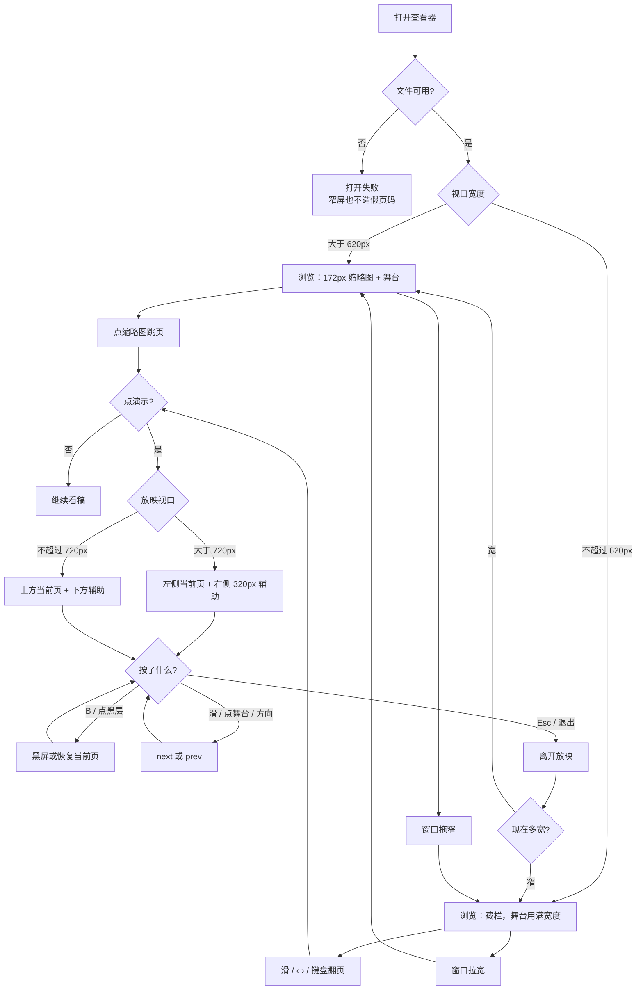
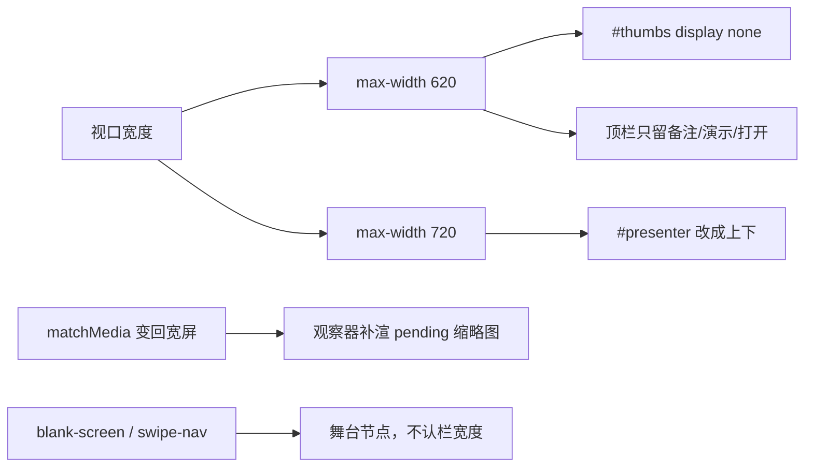

# 查看器小视口：把舞台还给幻灯片

> 第六轮持续性迭代。只做这一件事：独立查看器在窄屏上不再用固定 172px 缩略图栏和 320px 演讲者侧栏挤舞台。官网 620px 已藏栏，本轮不改官网。W 白屏本轮不做。

---

## 1. 目标与用户

| 项 | 内容 |
|---|---|
| 用户 | 在浏览器里打开独立查看器看 `.pptx` / `.ppt` 的人：手机先翻几页、窄窗口快速看稿、投屏前过一遍。不装 Office，文件不出设备。 |
| 要解决的问题 | 缩略图栏写死 `width: 172px`，390px 宽只剩约 218px 给舞台，16:9 幻灯片高约 122px，标题都看不清。放映侧栏再写死 `width: 320px`，同一部手机上当前页只剩约 70px。官网 Demo 在 620px 已经把栏藏掉；查看器是「本机看稿」入口，却仍按桌面三栏排。 |
| 成功标准 | 窄屏浏览：栏不占宽度，舞台用满剩余视口，左右滑 / 底栏 ‹ › / 页码仍能翻页。窄屏放映：当前页仍是主体，备注和下一页改到下方，不把幻灯片挤没。桌面宽屏栏还在。Esc / 黑屏 / 滑动 / 键盘与前五轮一致。 |

不为谁做：不在这一轮做 W 白屏、句号别名、「全部幻灯片」网格、双屏、编辑器放映、改官网、改 `render/` 或 core。

---

## 2. 用户场景与流程

主路径：手机打开查看器 → 内置示例就绪 → 舞台几乎全宽，能看清当前页 → 左右滑或点 ‹ › 翻页 → 点「演示」（全屏失败也留在放映）→ 当前页仍大、备注在下 → B 黑屏再恢复 → Esc 回到浏览，舞台仍然全宽。

| 分支 | 行为 |
|---|---|
| 空状态 | 未打开或打开失败：没有 Viewer，窄屏藏栏也不制造页码。底栏仍是 `- / -`。 |
| 失败 | 全屏被拒：仍按第一轮留在放映；窄屏走下方辅助，不退回浏览。 |
| 取消 | 桌面宽屏不藏栏。位移不足的滑、点备注、点控制条：不翻页。浏览态 B 不黑屏。 |
| 返回 | Esc / 退出 / 退出全屏：离开放映并清黑层。拉宽窗口：栏回来，未渲染的缩略图补上。 |
| 恢复 | 退出放映后保持当前页。换文件先退出再打开。从窄拖到宽，不能留下空占位栏。 |

---

## 3. 范围

| 必须做 | 不做 |
|---|---|
| 独立查看器浏览态：`max-width: 620px` 藏 `#thumbs` | 改官网（620px 已经藏栏） |
| 独立查看器放映态：`max-width: 720px` 演讲者侧栏改到下方 | W 白屏、句号 / 逗号别名 |
| 桌面宽屏栏宽度与位置不变 | 「全部幻灯片」网格跳页 |
| 窄屏顶栏去掉搜索 / 缩放 / 导出，留下备注、演示、打开 | 按 UA 判断手机 |
| 拉宽后补渲染仍是 `pending` 的缩略图 | 把布局推进八个发布包 |
| 放映、黑屏、滑动、键盘、Esc 仍按前五轮 | 改 `render/`、改 core |

---

## 4. 调研与缺口

读过的原始页面（打开后抽了全文，不是搜索摘要）：

| 来源 | 用户实际怎么用 | 对本仓库的含义 |
|---|---|---|
| [Present your slide show](https://support.microsoft.com/en-us/powerpoint/present-your-slide-show) · Web 栏 | From Beginning；控制条过一会儿隐去，`T` 再唤出。控制条有 **See all slides**，是需要时再打开的跳页，不是一直钉在左边的栏。 | Web 官方放映也不用持久缩略图栏占宽度。跳页网格是下一轮候选，不是本轮门槛。 |
| 同上 · Windows Mobile 栏 | 前进：空格或**点屏幕**。上一页：P。结束：Esc。**B 黑屏，再按 B 恢复当前页。** 这一栏没有 W，也没有「左侧栏一直开着」。 | 手机官方看的是整页。B 第五轮已做。W 不是手机官方快捷键。 |
| [Start the presentation and see your notes in Presenter view](https://support.microsoft.com/en-us/powerpoint/training/start-the-presentation-and-see-your-notes-in-presenter-view) | 观众屏只有幻灯片。演讲者屏右侧是备注；**See all slides** 才弹出全部缩略图以便跳页。可以把分隔线拖到最左，让当前页让给备注。单屏也能再打开 Presenter view。 | 缩略图是跳页叠加层。窄屏不能把 320px 辅助栏当成默认占位。当前页必须先在。 |
| [Present slides · Android](https://support.google.com/docs/answer/1696787?hl=en&co=GENIE.Platform%3DAndroid) | 「View a presentation」：打开应用 → **Present on this device** → **左右滑换页** → 返回键退出。没有胶片栏。 | 手机官方主画面就是幻灯片。第四轮已经能滑，缺的是把栏拿掉。 |
| [Present slides · iPhone](https://support.google.com/docs/answer/1696787?hl=en&co=GENIE.Platform%3DiOS) | 同样左右滑；退出双击再 Close。画笔模式才改到备注区滑。 | 默认滑舞台。备注区继续给滚动。 |
| [Present slides · Computer](https://support.google.com/docs/answer/1696787?hl=en&co=GENIE.Platform%3DDesktop) | Slideshow 全屏；方向键或底栏箭头；Esc 退出。文末快捷键表：**B 黑屏、W 白屏**，任意键从空白回来。双屏要 Chrome + 外接屏；同一块屏不能同时 Presenter view 和 Full screen。 | W 这轮有完整官方表，但仍是**桌面放映**习惯。双屏条件没变。 |

对照本仓库：

| 表面 | 已有 | 缺口 |
|---|---|---|
| 官网首页 / 样本 | 620px 藏 `.thumbs`；辅助层 720px 改贴底；能滑、能黑 | 不缺本轮这件事 |
| `packages/viewer` 浏览 | 虚拟化缩略图、适应窗口、滑动、底栏 ‹ › | `#thumbs` 永不藏；390px 舞台被挤到不可读 |
| `packages/viewer` 放映 | 全屏失败仍留演讲者布局；B 黑屏 | `.pv-side` 固定 320px，窄屏当前页消失 |
| 顶栏 | 搜索 / 缩放 / 导出 / 演示 / 打开排成一行 | 窄屏会换行吃掉舞台高度；预览不需要导出 |

更高价值检查：没有新的渲染性能证据要求本轮改 `render/`。藏栏还有副作用：窄屏首次打开不再为看不见的栏渲染 SVG。W 已有 Google 桌面全文，仍不是「手机上快速看稿」的门槛。

---

## 5. 是否值得做

| 判定 | 结论 |
|---|---|
| 使用者成本 | 只动查看器私有壳。不进八个发布包，不增运行时依赖。宽屏零行为变化。 |
| 可行路径 | 官网已经用 `max-width: 620px` 藏栏。查看器同一套媒体查询即可。缩略图观察器在栏重新显示时补渲染。 |
| 换候选？ | W 这轮证据更完整（Google 桌面表同时写了 B 和 W），但是桌面放映增量。查看器窄屏是浏览主路径断了：人先要看见幻灯片，才能谈白屏。 |
| 判定 | **做查看器小视口。** 不值得做的是本轮顺手做 W，或做「全部幻灯片」网格。 |

---

## 6. 产品方案

| 元素 | 规则 |
|---|---|
| 何时藏浏览栏 | 视口 `max-width: 620px`（与官网同一条线）。只看宽度，不看 UA。 |
| 宽屏 | `#thumbs` 仍是 172px。点缩略图跳页、搜索命中描边、虚拟化都不动。 |
| 窄屏浏览 | 栏不占布局。翻页靠舞台滑动、底栏 ‹ ›、方向键。页码告诉人现在第几页——这就是「还有别的页」的提示，本轮不做第二套网格。 |
| 窄屏顶栏 | 藏搜索、缩放、导出、批注、快捷键提示。留下文件名、备注、演示、打开。演示和打开不能被挤出屏幕。 |
| 何时改放映辅助 | 视口 `max-width: 720px`（与官网辅助层同一条线；320 + 360 已经不够并排）。 |
| 窄屏放映 | 当前页在上，下一页 + 备注 + B + 退出在下。黑层仍只盖舞台。 |
| 宽屏放映 | 右侧 320px 不动。 |
| 离开 | Esc / 退出仍离开放映并清黑层。拉宽后栏回来。 |
| 全屏失败 | 仍在放映；窄屏走下方辅助。 |

---

## 7. 技术方案

| 决策 | 选择 | 原因 |
|---|---|---|
| 断点用谁的数 | 浏览 620、放映 720 | 官网已经用这两条；查看器栏更宽（172 vs 132），更早该收。不另造 768。 |
| 为什么不是容器查询 | 查看器是整页应用，视口就是容器 | 没有独立卡片要各自折叠 |
| 藏栏用 CSS，不删 DOM | `display: none` + `aria-hidden` | 拉宽后同一批节点回来；搜索命中 class 还在 |
| 观察器何时补渲 | `matchMedia('(max-width: 620px)')` 退出时 | `display: none` 时交叉观察不触发；不补会留下灰块 |
| 窄屏为什么抽掉导出 | 导出不是看稿主路径；一排按钮换行会把刚腾出的高度吃回去 | 宽屏全部保留，避免误藏桌面能力 |
| 放映为什么也要动 | 只藏浏览栏，点「演示」立刻被 320px 侧栏再次挤死 | 「放映还能用」是本轮验收，不是下一件事 |
| 为何不做「全部幻灯片」 | Microsoft / 演讲者视图把它做成按需叠加 | 一件事；页码 + 滑动已经能顺序看完 |
| 为何不做 W | Google 桌面表有，Microsoft 手机栏没有 | 看稿先于放映增量 |

落点：

| 文件 | 职责 |
|---|---|
| `packages/viewer/src/style.css` | 620 藏栏与精简顶栏；720 放映改上下 |
| `packages/viewer/src/main.ts` | 栏重新出现时补渲 `pending` 缩略图；`aria-hidden` |
| `tooling/lib/standalone-small-viewport-browser-contract.mjs` | 宽屏有栏、窄屏无栏、拉宽补回、窄屏放映不占 320、失败/滑动/黑屏/Esc |
| `tooling/test-site-editor-browser.mjs` | 接上契约 |

不变量：`render/` 只认 `types.ts`；core 不碰 `document`；不进发布包。

---

## 8. 验收

| # | 标准 | 证据 |
|---|---|---|
| A1 | 1280×720：`#thumbs` 可见，宽度约 172px | 新增独立查看器契约 |
| A2 | 390×844：`#thumbs` 不占布局，舞台宽度接近视口 | 同上 |
| A3 | 390 再回到 1280：栏回来，不再全是 `pending` | 同上 |
| A4 | 390 放映：`.pv-side` 不是 320px 宽，当前页仍有可用宽度 | 同上 |
| A5 | 1280 放映：右侧仍约 320px | 同上 |
| A6 | 打开失败或未打开：窄屏滑动不造假页码 | 同上 |
| A7 | 窄屏滑动、B 黑屏、Esc 离开与前几轮一致 | 旧契约仍跑；本轮补窄屏放映/黑屏/Esc |
| A8 | 四项门禁绿；browser-use 走 5173 查看器与 5174 官网，覆盖小视口和桌面 | 本轮验证 |

---

## 9. 方案自评

| 对照 | 结论 |
|---|---|
| 目标 | 解决「手机上看不见幻灯片」，没有偷换成改文案或做 W |
| 流程 | 主路径、空、失败、取消、返回、恢复都有出口；宽↔窄可逆 |
| 范围 | 只动查看器私有壳；官网已有的藏栏不重做 |
| 与前五轮 | 不回退放映、备注、滑动、黑屏；Esc 仍是离开 |
| AGENTS.md | 不改 `render/` 与 core；不进发布包 |
| 风险 | 只藏浏览栏会让「演示」在手机上更糟——所以放映侧栏一并改排。观察器不补渲会在拉宽后留下空块 |
