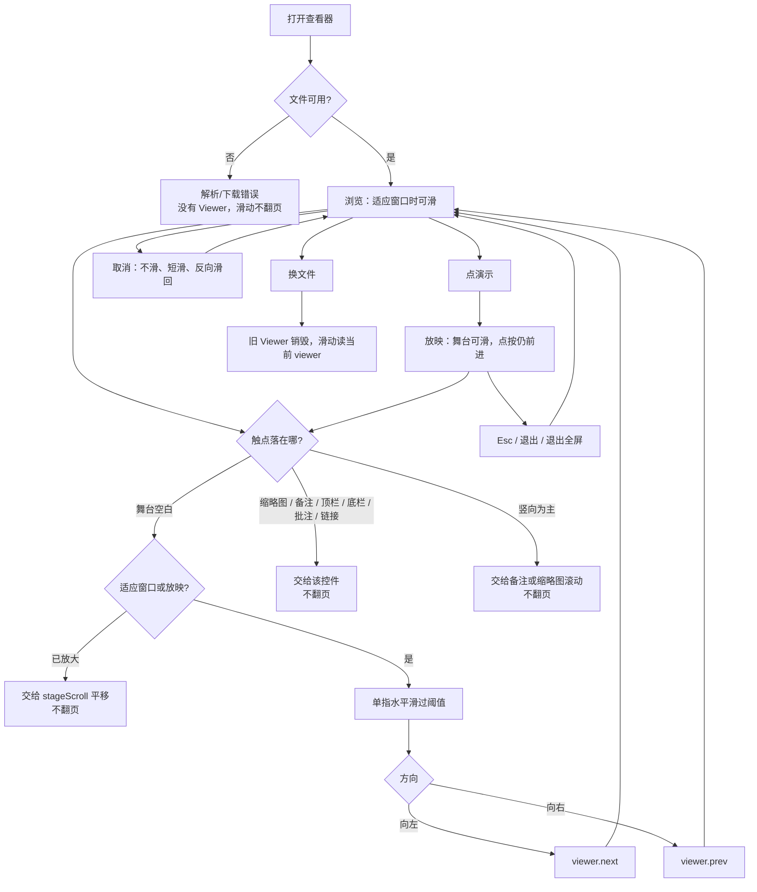
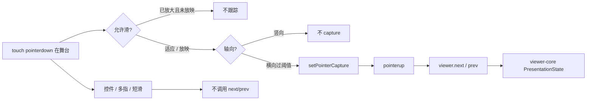

# 查看器触控滑动翻页

> 第四轮持续性迭代。只做这一件事：独立查看器（`packages/viewer`，`npm run dev`）在舞台上左右滑就能翻页，与官网第三轮同一条 `next` / `prev`。双屏演讲者视图本轮不做。

---

## 1. 目标与用户

| 项 | 内容 |
|---|---|
| 用户 | 打开独立查看器看 `.pptx` / `.ppt` 的人：本机 `npm run dev`、投屏前过一遍、手机上先翻几页。不装 Office，文件不出设备。 |
| 要解决的问题 | 官网首页 Demo 和样本浮层已经能在舞台上左右滑；查看器是另一条独立入口，只能点底栏按钮、键盘或放映里点舞台。同一引擎、两种产品手势。 |
| 成功标准 | 适应窗口的浏览态、以及放映态：单指在舞台上水平滑过阈值，向左 = `next()`，向右 = `prev()`。缩略图、备注、侧栏、控制条、链接上滑不翻页。放大查看时水平滑用来挪画布，不翻页。Esc / 退出 / 换文件出口不变。 |

不为谁做：不在这一轮做双屏 / `getScreenDetails`、B 键黑屏、激光笔、画笔、编辑器「放映」页、改 `render/` 或 core、把滑动推进八个发布包。

---

## 2. 用户场景与流程

主路径：打开查看器 → 内置示例或本地文件就绪 → 在舞台上向左滑到下一可见页 → 点「演示」（全屏失败也留下演讲者布局）→ 继续左右滑（有动画先播一批）→ Esc 离开 → 浏览态仍可滑。

| 分支 | 行为 |
|---|---|
| 空状态 | 文稿未打开或打开失败：`viewer()` 为空，滑动不翻页。 |
| 失败 | 下载/解析失败：没有可用 Viewer。全屏被拒：仍按查看器原逻辑留在演讲者布局，滑动照常。 |
| 取消 | 位移不足阈值、竖向锁死、第二指落下、`pointercancel`、已放大时的水平滑：都不调用 `next` / `prev`。横向手势会在短窗口内压掉随后的 click，避免放映里连跳。 |
| 返回 | Esc、退出按钮、浏览器退出全屏：查看器原规则不变。滑动不接管 Esc。 |
| 恢复 | 退出放映后若回到适应窗口，浏览态仍可滑。换文件后旧页码不能被滑回来。 |

---

## 3. 范围

| 必须做 | 不做 |
|---|---|
| 独立查看器浏览态（适应窗口）与放映态共用官网同一套滑动 | 双屏 / `getScreenDetails` / 第二窗口 |
| 舞台单指左右滑 = `next` / `prev`（有待播动画先播一批） | 复制一份会漂的手势实现；把滑动塞进发布包 |
| 缩略图、备注、演讲者侧栏、顶栏、底栏、批注、链接上滑不翻页 | 画笔模式下改到备注区滑（查看器没有画笔） |
| 已放大：水平滑平移画布，不翻页 | 鼠标拖动画布翻页 |
| 放映中滑成功后不让随后的 click 再 `next` 一次 | B 键、激光笔、编辑器放映 |
| 现有点舞台 / 键盘 / Esc / 全屏失败放映保持原样 | 改 `render/`、改 core |

---

## 4. 调研与缺口

读过的原始页面（不是搜索摘要）：

| 来源 | 用户实际怎么用 | 对本仓库的含义 |
|---|---|---|
| [Present slides · Android](https://support.google.com/docs/answer/1696787?hl=en&co=GENIE.Platform%3DAndroid)（Google 官方，全文） | 「View a presentation」：打开 Slides 应用 → **To change slides, swipe left or right**。投 Chromecast / Meet：同样「swipe right or left」；备注是点 Speaker notes 开关，不是用滑来换页。 | 手机官方主手势就是在幻灯片上滑。独立查看器缺的就是这一下。 |
| [Present slides · iPhone](https://support.google.com/docs/answer/1696787?hl=en&co=GENIE.Platform%3DiOS)（Google 官方，全文） | 本机放映：`Present on this device` → **swipe left or right** → 双击再 Close。Chromecast / AirPlay 同样左右滑。画笔模式：在幻灯片上画；**To change slides, swipe left or right in the speaker notes section**。 | 默认滑的是舞台。备注区滑动只在画笔抢走舞台时才改道。查看器没有画笔，备注必须继续给滚动。 |
| [Present your slide show](https://support.microsoft.com/en-us/powerpoint/present-your-slide-show)（Microsoft 官方，含 Newer Windows / Mac / Web / Windows Mobile） | Web：From Beginning，控制条会隐去，`T` 再唤出。Mac：下一步是点右箭头、**click a slide** 或按 N。Mobile：**tap the screen** 或空格前进，P 上一页，Esc 结束；**B 键黑屏**。全文没有 swipe。 | 点舞台前进查看器放映已有。Microsoft 手机官方不靠滑，缺的仍是 Google 那边的手势。B 键是下一轮候选，不是本轮门槛。 |

对照本仓库：

| 表面 | 已有 | 缺口 |
|---|---|---|
| 官网首页 / 样本 | 第三轮：浏览 + 放映都可滑；辅助层上滑不翻页 | 不缺 |
| `packages/viewer` | 放映中点舞台前进、键盘、备注面板、演讲者侧栏、缩放、缩略图虚拟化 | 舞台不能滑；官网滑了、这里不能滑 |
| `viewer-core` | `next` / `prev` / `skipHidden` / 动画批次 | 不该接手势：浏览态能不能滑、放大时能不能滑，都是产品决策 |
| 双屏 | 查看器单窗口已有当前页 / 下一页 / 备注 | `getScreenDetails` 仍是 Chrome-only，Safari / Firefox 没有 |

更高价值缺口检查：查看器缩略图已经按视口虚拟化，没有新的性能证据要求本轮改渲染。双屏没有新的浏览器覆盖面。产品不一致的是手势。

---

## 5. 是否值得做

| 判定 | 结论 |
|---|---|
| 使用者成本 | 只动两个私有应用。不进八个发布包，不增运行时依赖。只在 `touch` 指针上跟踪，鼠标桌面零开销。 |
| 可行路径 | 官网 `swipe-nav.ts` 已经把阈值、轴向、压 click 做完。查看器已有 `Viewer.next` / `prev`、放映点舞台、备注与侧栏。 |
| 换候选？ | 双屏没有新证据。B 键黑屏是 Microsoft 手机官方能力，但官网和查看器都还没有「能滑」的对称。先补对称缺口。 |
| 判定 | **做查看器舞台左右滑。** 不值得做的是本轮顺手上双屏，或为了复用把 DOM 手势塞进 `viewer-core`。 |

---

## 6. 产品方案

| 元素 | 规则 |
|---|---|
| 谁能滑 | 仅 `pointerType === 'touch'` 的主指针。鼠标继续点按/键盘。 |
| 滑哪里 | 从舞台空白处起手。缩略图、备注、顶栏、底栏、批注面板、演讲者侧栏、链接、页内 `data-slide` 上起手不跟踪。 |
| 方向 | 向左超过阈值 → `next()`；向右 → `prev()`。竖向为主则锁死，交给备注或缩略图滚动。 |
| 阈值 | 与官网同一套：水平位移 ≥ 48px，且水平明显大于竖直。首尾页不循环。 |
| 浏览 | 默认适应窗口：滑是翻页手势。用户按＋放大后，水平滑只挪 `#stageScroll`，避免看细节时被抢走。回到「适应」后再滑翻页。 |
| 放映 | 与点舞台同一条状态机。舞台节点会被搬进演讲者布局，手势绑在舞台上跟着走。滑成功后压掉这次手势冒出的 click。 |
| 备注 | 没有画笔，不搬 Google 画笔模式的「改到备注区滑」。 |
| 多指 | 跟踪中落下第二指：取消，不翻页。 |
| 离开 | 不新增出口。Esc 仍只离开放映。 |

---

## 7. 技术方案

| 决策 | 选择 | 原因 |
|---|---|---|
| 手势放哪 | 继续用官网 `swipe-nav.ts`，查看器相对导入 | 禁止复制一份阈值/轴向/压 click；这是产品壳，不能进发布包 |
| 排除表 | 注入 `isAdvanceTarget`，不再写死 `isPresentAdvanceTarget` | 查看器导入官网模块时不能把 `present-mode` / 语言入口一起打进来 |
| 绑哪个节点 | `#stage` | 放映时舞台会搬进 `#pvCurrent`；绑舞台则一份监听跟着走，不会在 `#stageWrap` 上听空 |
| 放大时为什么不翻页 | `allow: presenting \|\| fitMode` | 查看器独有缩放；官网没有这条冲突 |
| 为何不听 `touch*` | 只要 Pointer Events | 与官网、编辑器触屏同一模型；测试仍派发 PointerEvent |
| 放映 click 连跳 | 沿用捕获阶段压随后 click | 查看器放映的 `next` 挂在 `#presenter` 冒泡；舞台捕获阶段截住就不会连跳 |

落点：

| 文件 | 职责 |
|---|---|
| `packages/site/src/swipe-nav.ts` | 抽出 `isAdvanceTarget` / `allow`；算法不动 |
| `packages/site/src/main.ts` / `samples.ts` | 传入现有 `isPresentAdvanceTarget` |
| `packages/viewer/src/main.ts` | 绑舞台、适应/放映才允许滑、放映后刷新侧栏 |
| `packages/viewer/src/style.css` | 可滑时 `touch-action: pan-y`；备注/缩略图继续竖滑 |
| `tooling/lib/standalone-swipe-nav-browser-contract.mjs` | 浏览滑、竖滑、备注/缩略图、放大不翻、放映不连跳 |

不变量：`render/` 只认 `types.ts`；core 不碰 `document`；无新词条进发布包。

---

## 8. 验收

| # | 标准 | 证据 |
|---|---|---|
| A1 | 浏览态从第 1 页向左滑到第 2 页；再向右滑回第 1 页 | 新增独立查看器契约 |
| A2 | 竖滑、位移不足、在备注或缩略图上滑，页码不变 | 同上 |
| A3 | 放大后左右滑页码不变；回到适应后再滑能翻页 | 同上 |
| A4 | 放映中向左滑会前进或播动画；同一次手势不会再被点舞台逻辑加一页 | 同上 |
| A5 | 未打开或打开失败时滑动不制造假页码 | 失败路径仍无 Viewer |
| A6 | Esc / 备注 / 点舞台 / 键盘与前几轮一致 | 旧契约仍跑 |
| A7 | 四项门禁绿；browser-use 走 `npm run dev` 查看器端口真实验证 | 本轮验证 |

---

## 9. 方案自评

| 对照 | 结论 |
|---|---|
| 目标 | 解决「官网能滑、查看器不能滑」，没有偷换成改文案或上双屏 |
| 流程 | 主路径、空、失败、取消、返回、恢复都有出口 |
| 范围 | 只补独立查看器这一处；手势复用现有模块 |
| 与前三轮 | 不回退放映、备注、官网滑动；查看器备注上滑仍不翻页 |
| AGENTS.md | 不改 `render/` 与 core；不进发布包 |
| 风险 | 绑在 `#stageWrap` 会在放映时听空；放大时不让路会抢走平移 |
