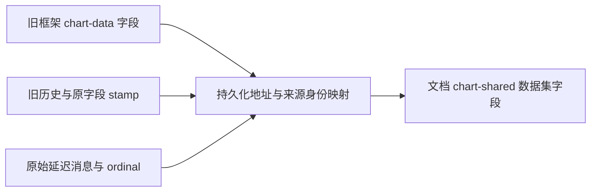

# 旧局部图表覆盖迁移

属于 [003 共享工作簿同步](tickets/003-shared-chart-workbook.md)。已实现独立缓存或独占工作簿的旧覆盖迁移，支持加载前复制页、原件删除及多所有者或新旧数据合并；可选协同入口按原 set/del 版本裁决冲突及远端消息。复制快照已继承可证明的原操作；有界旧结构矩阵和无法恢复时的明确拒绝已补齐，整票验收见[共享图表进度](shared-chart-progress.md)。

## 存储与时钟

| 协议 | 实现约束 |
|---|---|
| 地址声明 | `extensions['edit-addresses'][oldElementId]['chart-data']` 是不可变 JSON 标量；`target`、`identities`、可选 `remap` 与 `merge:equal` 沿用现有补丁协议，声明仅接受 set |
| 原子搬移 | 相等或互不相交的字段可直接合并；矛盾字段需原操作与 stamp 完整支持裁决，否则整组保留。其他目标重叠和重新指定仍拒绝 |
| 旧身份 | 原生记录统一到中立序号；精确 ID 映射来自框架原生身份及复制出处，不取当前活副本集合、不猜尾缀；新增稳定 ID 原样保留 |
| 删除与复活 | `retainedElementOrigins` 只保存退役原生框架的 ID、part、spid 与复制来源；删除补丁回放同样生成记录，复活即释放。它不参与 XML 删除计划，普通形状不入表 |
| 历史与版本 | 自动迁移不增加撤销步骤，不改变脏状态或协同版本；冲突判断及重放使用当前地址 |
| LWW 与生命周期 | 只改地址，沿用原 stamp；先解析旧地址再判断目标生命周期。原框架删除不等于数据集删除 |
| 延迟与冷恢复 | 原消息、补丁及 ordinal 不改写；新进程依靠持久化映射重新求值，未知寄存器键保持透明 |
| 首笔迟到编辑 | 扩展先加载、旧字段后到达时仍生成迁移计划；在 LWW 比较和提交前预检 |
| 日志预算 | 补丁日志和恢复日志各自声明地址，提交前计入补丁上限；失败不消耗首次声明。仅订阅恢复也受保护 |
| 构造与释放 | 构造期间迁移在首个持久化事件补入声明；构造失败清理全局监听器 |

`edit-addresses` 是模型保留命名空间。未知领域实现可以先恢复，实际保存须加载负责目标数据的扩展。旧结构快照可以恢复框架，不能用旧覆盖重置已经迁移的数据。

## 验证

复用 `sample-chart-data.pptx` 及层级、XY 过渡确定性固件；散点和层级缓存组合由 `make-chart-transition-fixture.mjs` 生成。每组契约独立启动进程；对端和 checkpoint 恢复另起进程，避免全局注册表掩盖迟加载问题。

| 契约 | 已验证的行为 |
|---|---|
| `history` | 919 随复制共享；保存重开、旧撤销/重做、删除原件后的冷恢复保持值 |
| `messages` | 保留获胜值 440 和原 stamp；原框架删除后较新旧消息更新到 550，重复幂等 |
| `checkpoint` | 保留原消息/ordinal；新进程补齐缺口后消费延迟的新值 333，透明寄存器键不变 |
| `announcements` | 未加载实现的独立对端乱序接收声明、复制及删除，加载后幸存框架读取 919 |
| `limit` / `recovery-limit` | 协同与仅恢复两条路径提交前拒绝超限；字段、历史、版本不留半更新 |
| `early-recovery` | 构造期间迁移、之后才订阅日志，首个选择事件也持久化声明并可冷恢复 |
| `addresses` | 无效容器、目标占用/重叠、重定向和坏批次原子拒绝；重复合法声明幂等 |
| `late-first` | 先加载共享入口，再接收首笔旧编辑，复制后仍可写、可保存 |
| `constructor` | 连续三次构造失败均不残留文档监听器 |
| `precopied` / `removed-original` | 先编辑再复制、最后注册共享入口；加载前或后删除原件均保留幸存副本数据 |
| `disjoint` / `existing` | 多个旧所有者或新旧数据的不同字段合并；恰好等于 ID 的普通文字不被改写 |
| `conflicting` | 缺少裁决依据的矛盾字段不发生半迁移，明确显示未恢复并拒绝保存 |
| `concurrent-copy` | 两端注册时看到的副本数量不同，之后双向修改仍收敛 |
| `custom-identity` | 合法新增类别 `custom:p0` 与原生记录同尾缀，复制与迁移仍保留全部记录 |
| `removed-source-slide` | 整张原页删除后保留 919，幸存副本继续编辑为 778；旧日志新进程恢复、撤销/重做、保存重开及失败事务无残留 |
| `removed-copy-chain` | 最初来源和中间副本均删除，末端仍可迁移；复活中间副本的旧快照不能重置共享数据 |
| `removed-slide-message` / `concurrent-removal` | 原页删除后的较新旧消息仍生效；同一副本在两端生死状态不同也生成相同地址，后续双向修改收敛 |
| `identity-collision` / `identity-copy-only` | 新增身份撞上副本来源时，原覆盖保持不变、查询返回具体失败原因，视图显示未恢复且保存拒绝；覆盖原件有/无局部编辑两条路径 |
| `bare-model` | 原页、退役来源记录及结构日志均缺失时，保留旧覆盖、空查询及失败占位；无关图表仍可读取 |
| `versioned-registers` | 可选入口保留原 set/del 与原 stamp；坏批次回滚，页面删除后原 set 仍可在新进程恢复，重绑不注入旧证据 |
| `versioned-register-remap` | 地址与 ID 引用值同时映射；公开 checkpoint 不共享内部操作对象 |
| `versioned-deferred` | 无效延迟消息单独隔离，合法前序及后续消息持续提交 |
| `versioned-opaque-register` | 无证据旧键透明保留；旧 checkpoint 不从当前模型补造原操作 |
| `versioned-binding` | 默认/可选入口共用会话，切换后延续序号，同步订阅首批消息参与记录 |
| `core-receipt` | 已裁决凭据在领域验证后原子执行；坏批次不清源，相同凭据保留后续编辑，删除赢家可冷恢复，损坏凭据不能保存 |
| `core-receipt-paths` | 父子赢家的两种顺序、目标标量父级与容器叶均原子拒绝，不静默跳过或覆盖数据 |
| `core-receipt-transport` | 默认入口拒绝远端凭据；可选入口拒绝超过运输因果水位的原时钟及协议地址别名；模型、寄存器、恢复帧与消息序号不变 |
| `core-receipt-deferred` | 新进程恢复旧检查点后，坏凭据只隔离自己的延迟组；合法前序提交、重复幂等，后续编辑继续同步 |
| `versioned-conflict` | 两份旧覆盖按真实 111/777 版本迁移为 777；历史、脏状态和身份不推进，继续编辑、保存及冷恢复一致 |
| `conflict-evidence` | 未知删除及同 stamp 矛盾原子拒绝；更晚原操作按规范地址补齐证据；添加无关地址前缀不能绕过拒绝 |
| `remote-migration` | 不同赢家先迁移再交换仍保留本地更新；延迟消费重新裁决，普通获胜字段继续更新脏状态并重排撤销历史，坏批次可原序号重试 |
| `migration-recovery-order` | 不提前安装未来路由；保留无关目标字段，字段与凭据的两种顺序及晚订阅日志都与实时结果一致 |
| `migration-resolver-disposal` | 乱序释放与相同函数多次注册不复活已释放解析器 |
| `versioned-copy` | 原字段后来变化、来源页删除、连续复制均保留复制时原版本；未来时钟、伪造值及恶意 stamp 原子拒绝 |
| `versioned-copy-transaction` | 同批较早的真实写入提供版本；复制后非法命令或局部图表再次写入完整回滚 |
| `versioned-copy-delete` | 真实类别删除的撤销产生 del 墓碑，复制空覆盖仍继承其原版本 |
| `versioned-copy-redo` | 副本和普通删页收到新值后保留非空撤销重做；其他副本的旧恢复快照在不同加载/缺序顺序下保留最新原操作；派生和提交失败均原子拒绝 |
| `versioned-copy-late` | 先加载共享、后收到复制；缺序期间再写入后重新裁决；重复幂等、无协同冷恢复与原生保存重开 |
| `versioned-copy-history` | 容器 del、父标量 set、标量后代 set/del 的实时与历史行为一致，失效的继承证据不残留 |
| `legacy-shapes` | 十四种形态、两种旧消息接收时机；并发增删类别/点/系列，复制及删除来源，旧历史撤销/重做、失败原子性，未加载扩展的冷恢复后二次复制及两种保存 |

源码命令：`fnm exec --using=24.3.0 node tooling/test-chart-shared-legacy-migration.mjs`；发布包加 `--dist`。已接入 `test:chart-shared` 与 `test:chart-shared:dist`，分别由 `npm test` 与 `npm run verify` 执行。结果为 `out/chart-shared/legacy-migration{,-dist}/result.json`，不与主共享图表断言数混算。

前轮十九组源码及发布包契约和四项门禁已通过，日志为 `out/chart-shared/cordis-open-and-merge-final-gates.log` 与 `cordis-open-and-merge-final-verify.log`。当前删除来源增量的二十二组源码及发布包契约均通过，完整四项门禁终态成功，记录为 `retained-origins-final-gates.log`。

新增的原操作证据使源码与发布包契约增至二十七组，专项日志为 `out/chart-shared/versioned-binding-green.log`。双轴复审复现并关闭了快照引用泄漏、无证据透明键兼容、访问器输入和坏延迟组阻塞四项问题；对应红灯见 `versioned-checkpoint-isolation-red.log` 与 `versioned-boundaries-red.log`。该增量只完成[原操作记录](versioned-chart-migration.md)，尚未执行冲突裁决。

该增量最终四项门禁均通过，日志为 `out/chart-shared/versioned-evidence-final-gates-v2.log`，含 531 项一致性检查及发布包迁移契约。首次整体验证因另一组保存测试同时清理共享产物目录而缺失 `theme-editing.pptx`；确认进程结束后串行重跑通过，未放宽测试或预算。

核心凭据执行增量将契约扩展到三十一组。复审补齐同批日志重排导致冷恢复分歧、父子字段静默丢失、已存凭据平方校验、协议地址绕过和坏延迟组回滚合法前序五个边界。对应红灯见 `migration-receipt-{order,paths,alias,deferred}-red.log`。首次完整门禁为补齐恢复队列故障而主动终止；最终从头运行的四项门禁均通过，记录为 `out/chart-shared/migration-receipt-final-gates-v2.log`，含 532 项一致性检查和两条入口的三十一组契约。1,502 个源码输入在完整验证前后哈希一致。此增量不启用自动图表裁决或远端凭据运输。

前轮双轴复核发现并修复副本集合不同造成地址分歧、猜测尾缀误改自定义身份，以及缺失出处后静默回退的风险。目标重叠在完整暂存模型中统一校验，失效按目标去重；当时 100/200/400 条声明解析次数为 500/1,000/2,000，100/200 框架迁移约 72/148 ms，声明总长约 74,754/149,754 字符。该局部测量不代替当前增量和整票浏览器成本验收。

本轮复核补齐了已删除中间副本的旧地址，并校验退役副本与活副本生成相同声明。普通形状在 `historyLimit:0` 下连续新增、删除 1,000 次，保留来源表、删除集及历史数量均为 0；已删除框架按来源分组只消费一次。

删除原页与中间副本后再编辑末端的独立文件为 `out/chart-shared/retained-origins-native.pptx`。Python 标准库 ZIP/XML 读取确认活动页只有一个 chart1 引用，图表缓存与工作簿 B2 均为 778，其余单元格和其他图表原文不变；记录见 `retained-origins-native.log`。

此前端到端裁决增量的三十六组源码及发布包契约通过，两份独立复核均无剩余 P1/P2。check / 全量 test / build 顺序通过，首次 verify 只发现旧体积数字；文档按实测同步后完整 verify 通过，记录为 `out/chart-shared/versioned-conflict-final-gates-v2.log` 与 `versioned-conflict-final-verify.log`。恢复顺序、未知原操作、普通字段被凭据吞掉及否决后重新规划的问题均已加入回归。

复制原版本增量已通过四十二组源码与发布包契约、两份独立复核及完整四项门禁，记录为 `out/chart-shared/versioned-copy-final-gates.log`。复核关闭恶意 stamp、局部与跨副本旧快照恢复、结构预演遗漏、缺序水位冷恢复及历史字段语义不一致等问题；原生独立读取证据见 `versioned-copy-native.json`，成本见 `versioned-copy-size.json`。本票仍按下列剩余范围推进。

## 旧结构迁移矩阵增量

| 形态 | 固件与图表序号（从 0 开始） |
|---|---|
| 纵向二级类别 | `sample-chart-hierarchy` / 0 |
| 横向二级类别 | `sample-chart-hierarchy` / 2 |
| 纵向三级类别 | `sample-chart-hierarchy` / 1 |
| 纯缓存平面类别 | `sample-chart-data` / 1 |
| 工作簿平面类别 | `sample-chart-data` / 0 |
| 纯缓存气泡图 | `sample-chart-data` / 10 |
| 纵向工作簿气泡图 | `sample-chart-shared-transition-xy` / 0 |
| 横向工作簿气泡图 | `sample-chart-shared-transition-xy-horizontal` / 0 |
| 纯缓存散点图 | `sample-chart-data` / 6 |
| 纵向工作簿散点图 | `sample-chart-shared-transition-scatter` / 0 |
| 横向工作簿散点图 | `sample-chart-shared-transition-scatter-horizontal` / 0 |
| 纯缓存纵向二级类别 | `sample-chart-shared-transition-cache` / 0 |
| 纯缓存横向二级类别 | `sample-chart-shared-transition-cache` / 2 |
| 纯缓存纵向三级类别 | `sample-chart-shared-transition-cache` / 1 |

形态声明集中于 `tooling/chart-legacy-shape-cases.json`。执行前验证实际绑定模式、图种、层级深度和方向，防止新增样本退化成既有形态却仍通过。

每种形态独立运行两次：旧字段在单框架阶段先接收再迁移，或在复制、删除来源并迁移后才接收。两条路径均使用真实公开 API 产生的消息，按逆序重复投递。普通入口仍拒绝共享关系形成后的旧地址写入，不能把这项保护误记为迁移成功。

预期结果从原始固件数据及明确的增删命令推导，独立核对完整类别、系列、点集合、未修改来源值、父组提升与 X/Y/气泡大小；不以迁移后某一端的查询结果充当唯一依据。复核通过将所有气泡大小改为 `-123` 的隔离变异验证断言确实能报错，正常气泡图和三级类别控制流程通过。

原始预期验证日志为 `out/chart-shared/legacy-shapes-oracle.log`；扩展后的源码专项为 `legacy-shapes-expanded.log`。各场景日志及 28 条矩阵记录保留在 `out/chart-shared/legacy-migration/shape-matrix-result.json` 所在目录。独立读取器 `python3 tooling/check-chart-legacy-shapes.py` 检查 56 份补丁/释放源包保存产物：两个活动框架共用同一图表、缓存与工作簿一致、新增身份保留、引用区域外单元格及无关部件不变。空 XY 系列仅允许一个空白公式锚点，缓存仍必须是零点；读取证据为 `shape-native-proof.json`，包含各文件 SHA-256。

工作表验证同时比较解码值、单元格 XML 与其余结构；无引用工作表要求整部件不变。允许保存按实际单元格更新 `dimension`，不允许改变隐藏行、行高、列宽或合并等属性。双轴复核发现的自取预期和工作表结构两个验收盲区均已修正，气泡大小、旁路隐藏行及有引用表的隐藏行/列宽变异都能被拦截；剩余 P1/P2 为 0。

前轮七种形态仅补测试与独立验证工具，四项门禁记录为 `out/chart-shared/legacy-shapes-final-gates.log`，含 533 项一致性检查和源码/发布包各 43 组迁移契约。发布包独立读取复测加目录参数 `out/chart-shared/legacy-migration-dist`。不能以这一有界矩阵代表全部旧图种及所有结构组合已经验收。

## 产品恢复首屏

真实 IndexedDB 日志复现了旧局部覆盖随复制形成共享关系后，恢复首屏显示来源数据、打开检查器才迁移的问题。`editor-open.ts` 现为旧 `chart-data` 在挂载前加载共享扩展；恢复失败或取消仍由打开流程释放会话。该入口继续由 Cordis 打开服务管理。

浏览器契约以独立页面中的公开旧 API 生成日志，在全新应用中执行恢复。层级缓存和横向散点均检查：未打开检查器前的首屏、删除来源后二次复制、中英文分别修改和跨副本同步、撤销/重做、实际保存重开。修复前后证据为 `legacy-browser-v2.log` 与 `legacy-browser-green.log`；复核要求补入的英文实改断言已随最终全量测试通过。契约由共享图表流程调用，进入默认全量浏览器测试和生产中英文测试。

新增三个物理固件后，全量 152 个文件连续生成两次逐字节一致，记录为 `legacy-expanded-fixture-hashes.json`。

本轮两份独立复核无剩余 P1/P2。check / 全量 test / build 依次通过，首次 verify 仅发现五处旧样本数字，按实测修正后完整 verify 通过，含 533 项一致性检查；记录为 `legacy-expanded-final-gates.log` 与 `legacy-expanded-final-verify.log`。源码和发布包各 43 组迁移契约通过，各 56 份矩阵文件均通过独立读取；读取器按声明的形态核对完整文件清单。

同一最终日志还记录构建后的中英文静态页面检查及 `--i18n-dist --chart-shared-only` 产品专项：旧图表恢复、共享图表、剪贴板与混合图流程均通过。此项为共享图表专项，不代表重新执行三张生产页面的全部中英文流程。

## 拒绝边界与成本

- 无证据或同 stamp 矛盾的复制字段继续保留并拒绝迁移；原协议没有批内操作序位，不能猜测其先后。
- 缺少来源记录及结构日志的旧裸模型，以及自定义新增身份与副本来源身份相撞时，不猜测身份。原覆盖保留，查询给出具体原因，画布明确显示未恢复，XML 投影和保存均拒绝；见[未恢复状态](unresolved-chart-data.md)。
- 上表已覆盖散点、气泡、平面类别及二/三级工作簿与缓存组合的结构并发；未声明的任意图种与布局不能推定已支持。
- 旧局部覆盖迁移的浏览器成本按 3/50/200 页分别记录注册迁移、查询、复制、保存与内存采样高水位，详见[口径与限制](shared-chart-browser-cost.md)。其正确性仍由上文旧结构矩阵及独立文件读取验证，不以一般共享图表计时代替。
